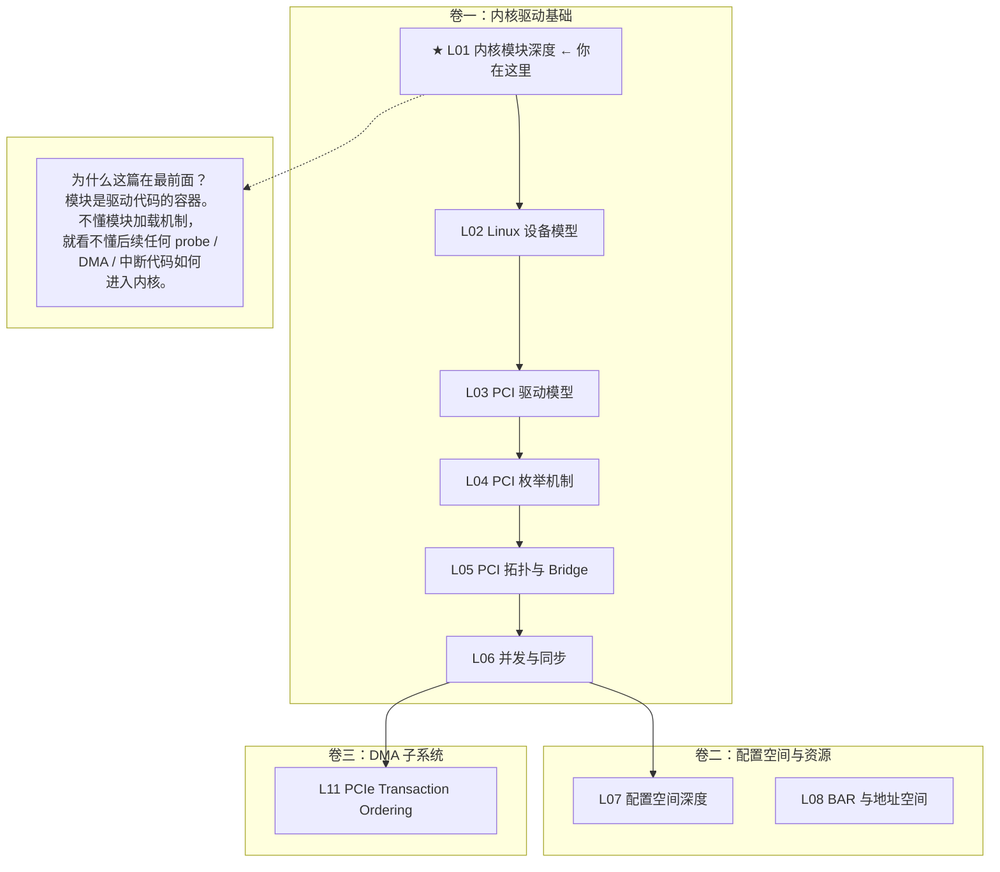

# L01：内核模块深度

---

## 0. 框架定位



---


---

## 1. 问题驱动

> 🔍 **你遇到了一个问题：**
>
> 你刚编译了一个 PCIe 驱动模块，`insmod gpu_driver.ko` 返回 0，但 `dmesg` 里什么输出都没有，`lsmod` 也看不到模块名。模块到底有没有加载？加载之后发生了什么？为什么没有执行你的`init`函数？
> **带着这个问题学完本节，你就知道答案了。**

---

## 2. 前置认知


**需要的前置知识**：无。本文是系列第一篇，不需要任何 Linux 内核背景。但默认你有：
- C 语言基础（结构体、函数指针、宏）
- ELF 文件的基本概念（知道 .text 是代码段、.data 是数据段即可）
- PCIe 协议基础（本文不涉及协议层，但后续课程将以此为基础）

**本文定位**：不是"Hello World 内核模块教程"。本文回答的问题是——当你在 shell 里敲下 `insmod`，内核到底对那个 `.ko` 文件做了什么？理解这个过程是所有后续学习的根基：PCI 驱动注册（L03）、DMA API 调用（L12）、中断注册（L16）——每个动作都发生在"模块已被内核加载并缝合进运行中的内核"这个大前提下。

---

## 3. 核心原理

### 2.1 Linux 为什么需要模块机制？

两句话回答：

**第一句（表面）**：运行时动态扩展内核功能，不需要重新编译内核或重启机器。插入一块新 PCIe 卡 → `insmod` 驱动 → 设备工作。

**第二句（内核设计层）**：Linux 是**单体内核**（monolithic kernel）。所有内核代码运行在同一个地址空间，共享内核栈和全局符号表。模块不是"插件"——它是**在运行时把自己缝合进单体内核二进制镜像的 ELF 重定位文件**。

对比两个设计流派：

```
微内核 (MINIX, QNX)              单体内核 + 模块 (Linux)
─────────────────────           ─────────────────────
驱动 = 独立进程                 驱动代码注入内核地址空间
通过 IPC 通信                   直接调用内核函数
驱动 crash → 驱动进程死         驱动 crash → 整个内核 panic
                系统继续跑
```

这意味着什么？你的 PCIe 驱动：
- 跑在 CPU 的 Ring 0（x86）或 EL1（ARM），可以执行特权指令（`WRMSR`、`MOV CR3`、`INVD`）
- DMA 地址写错一个 bit → 覆盖内核关键数据结构 → 静默数据损坏，没有 MMU 帮你挡枪
- 死循环在 spin_lock 里 → 整个 CPU 核心挂死，watchdog 超时后系统重启

> 📌 x86 关联：内核代码运行在 Ring 0，用户态在 Ring 3。模块代码和内核本体有同样的特权级。这意味着模块中的 `ioread32()` 可以直接被 CPU 翻译为对 MMIO 物理地址的 load 指令——中间没有任何权限检查。这是性能的来源，也是危险的来源。

### 2.2 模块不是可执行文件

```bash
file some_driver.ko
# some_driver.ko: ELF 64-bit LSB relocatable, x86-64, version 1 (SYSV)
```

关键词是 **relocatable（可重定位）**，不是 executable（可执行）。`ET_REL` 类型的 ELF，意味着：

- 代码段（`.text`）中的函数调用指令，目标地址在编译时是 `0x0`——占位符
- 数据段（`.data`）中的全局变量指针，初始值是 `0x0`——占位符
- 加载时由内核的模块加载器遍历**重定位表**（`.rela.text` / `.rela.data`），把实际地址填进去

**核心矛盾**：模块里的 `pci_register_driver()` 调用，编译时 GCC 根本不知道 `pci_register_driver` 这个函数在内核中位于哪个地址。编译产物是一条 `call 0x0`，带一个重定位条目："这条指令的 offset 字段请用符号 `pci_register_driver` 的实际内核地址填充"。

### 2.3 设计意图：为什么不用动态链接？

常规用户态程序的动态链接依赖 `ld.so`——把共享库映射到进程地址空间，GOT/PLT 做符号解析。内核模块不能这么干，原因有三：

1. **地址空间统一**：内核只有一个地址空间。`ld.so` 式的映射意味着每个模块有独立的虚拟地址范围——这违背单体内核的设计前提。
2. **性能**：PLT 间接跳转的额外成本在内核热路径上不可接受。重定位后 `call` 是直接跳转——一条指令到目标。
3. **安全**：如果模块通过 PLT/GOT 调用内核函数，攻击者改写 GOT 表项就能劫持内核控制流。直接重定位把地址 "烧" 死在 `.text` 中——页表可以设只读。

---

## 4. 内核源码带读

> 本节每层标注：**主流程** → **异常分支** → **⚠ 注意点**。所有源码基于 `~/work/code/linux-source/` v7.0 x86_64。

---

### 3.1 `load_module()` 的逐阶段主流程 + 异常路径

> 源码：`kernel/module/main.c:3422`

```c
static int load_module(struct load_info *info, const char __user *uargs, int flags)
{
    struct module *mod;
    long err = 0;

    // == 阶段 0：签名校验（最早执行，最小信任面）==
    err = module_sig_check(info, flags);
    if (err) goto free_copy;
    // ⚠ 如果内核加载了未签名模块且 CONFIG_MODULE_SIG_FORCE=y → -ENOKEY
    //    x86 服务器 SecureBoot 启用时强制签名校验

    // == 阶段 1：ELF 结构校验 ==
    err = elf_validity_cache_copy(info, flags);
    if (err) goto free_copy;
    // ⚠ 检查：ELF magic、架构匹配(e_machine==EM_X86_64)、section header 完整性

    err = early_mod_check(info, flags);
    if (err) goto free_copy;
    // ⚠ 检查：__versions section CRC、license 字段格式、module name 合法性

    // == 阶段 2：分配 struct module + 布局内存 ==
    mod = layout_and_allocate(info, flags);
    if (IS_ERR(mod)) { err = PTR_ERR(mod); goto free_copy; }

    // == 阶段 3：注册到模块链表（占位）==
    err = add_unformed_module(mod);
    if (err) goto free_module;
    // ⚠ 此时模块已占用名字，但尚未完全就绪。如果重名 → -EEXIST

    // == 阶段 4：percpu 分配 ==
    err = percpu_modalloc(mod, info);
    if (err) goto unlink_mod;

    // == 阶段 5：模块卸载初始化 ==
    err = module_unload_init(mod);

    // == 阶段 6：找到各 section ==
    err = find_module_sections(mod, info);
    // ⚠ 定位 __ksymtab、__ex_table、__jump_table、__static_call_sites 等

    // == 阶段 7：符号解析 ★ ==
    err = simplify_symbols(mod, info);
    if (err < 0) goto free_modinfo;
    // ⚠ 未定义符号 → -ENOENT，print 到 dmesg:
    //    "Unknown symbol pci_register_driver (err -2)"

    // == 阶段 8：重定位 ★ ==
    err = apply_relocations(mod, info);
    if (err < 0) goto free_modinfo;
    // ⚠ x86: arch/x86/kernel/module.c apply_relocate_add() 处理 R_X86_64_*

    // == 阶段 9：架构后处理（x86: alternatives/static_call/ibt）==
    err = post_relocation(mod, info);
    flush_module_icache(mod);  // ⚠ 刷新 CPU 指令 cache

    // == 阶段 10：拷贝模块参数 ==
    mod->args = strndup_user(uargs, ~0UL >> 1);

    // == 阶段 11：ftrace / 最终形成 ==
    ftrace_module_init(mod);
    err = complete_formation(mod, info);

    // == 阶段 12：准备即将到来的模块 ==
    err = prepare_coming_module(mod);
    // ⚠ 通知链 MODULE_STATE_COMING + 解析参数

    // == 阶段 13：异步 probe 标记 ==
    mod->async_probe_requested = async_probe;

    // == 阶段 14：解析参数 ★==
    after_dashes = parse_args(mod->name, mod->args, mod->kp, mod->num_kp,
                              -32768, 32767, mod, NULL);
    // ⚠ 如果参数解析失败 → 负值 → goto ddebug_cleanup
    //    但模块可能已经部分执行（某些参数已应用）
}
```

**⚠ load_module 的 14 个错误标签**：

| 标签 | 触发条件 | 清理动作 |
|------|---------|---------|
| `free_copy` | 签名/ELF校验失败 | 释放 info->hdr 拷贝 |
| `free_module` | 模块布局分配失败 | 释放 module 内存 |
| `unlink_mod` | percpu 分配失败 | 从 modules 链表移除 |
| `free_unload` | sysfs 设置失败 | 清理卸载引用 |
| `free_modinfo` | 符号解析/重定位失败 | 释放 modinfo |
| `free_arch_cleanup` | 参数拷贝失败 | x86: module_arch_cleanup |
| `ddebug_cleanup` | complete_formation 失败 | dynamic_debug 清理 |
| `bug_cleanup` | prepare_coming_module 失败 | module_bug_cleanup |

---

### 3.2 `simplify_symbols()` —— 符号解析的完整逻辑

> 源码：`kernel/module/main.c:1530`。遍历符号表，对每个未定义符号在内核核心 ksymtab + 已加载模块 ksymtab 中两级查找。

```c
static int simplify_symbols(struct module *mod, const struct load_info *info)
{
    Elf_Sym *sym = (void *)info->sechdrs[info->index.sym].sh_addr;

    for (i = 1; i < symsec->sh_size / sizeof(Elf_Sym); i++) {
        const char *name = info->strtab + sym[i].st_name;

        switch (sym[i].st_shndx) {
        case SHN_COMMON:
            // ⚠ -fno-common 编译标志下不应出现
            //    出现 → -ENOEXEC（模块拒绝加载）
            break;

        case SHN_ABS:
            // 绝对符号：不需要重定位（如 __ksymtab 内部的地址）
            break;

        case SHN_UNDEF:
            // ★ 核心：未定义符号 → 在内核符号表中查找
            ksym = resolve_symbol_wait(mod, info, name);
            // resolve_symbol_wait() → resolve_symbol() → find_symbol()

            if (ksym && !IS_ERR(ksym)) {
                sym[i].st_value = kernel_symbol_value(ksym);
                break;     // ← 成功
            }

            // == 异常路径 ==
            if (!ksym && (ELF_ST_BIND(sym[i].st_info) == STB_WEAK ||
                 ignore_undef_symbol(...)))
                break;     // ⚠ 弱符号或忽略列表 → 不致命
                           //    弱符号允许值为 0，模块自己检查

            ret = PTR_ERR(ksym) ?: -ENOENT;
            pr_warn("%s: Unknown symbol %s (err %d)\n", mod->name, name, ret);
            break;         // ← 失败：模块加载中止
        }
    }
    return ret;
}
```

**⚠ 符号解析异常路径**：
- **STB_WEAK 弱符号**：模块自己声明为 `__attribute__((weak))` 的函数 → 未找到时值为 0 → 模块运行时需自行判 NULL
- **ignore_undef_symbol**：某些架构特定符号（如 `__memcpy`）在黑名单中，允许不存在
- **符号在模块中但模块未加载**：`find_symbol()` 遍历 `modules` 全局链表 → 只查找 `state != MODULE_STATE_UNFORMED` 的模块 → 依赖关系由 `depmod` 解决

---

### 3.3 `find_symbol()` —— 两级符号搜索

> 源码：`kernel/module/main.c:391`。先在核心 ksymtab 中二分查找，再遍历已加载模块。

```c
bool find_symbol(struct find_symbol_arg *fsa)
{
    // == 第一级：内核核心符号表（__ksymtab）==
    const struct symsearch syms = {
        .start    = __start___ksymtab,   // 链接脚本定义的边界符号
        .stop     = __stop___ksymtab,
        .crcs     = __start___kcrctab,   // CRC 校验表
    };
    if (find_exported_symbol_in_section(&syms, NULL, fsa))
        return true;
    // ⚠ 二分查找：__ksymtab 数组按名字排序，O(log N)

    // == 第二级：已加载模块的导出符号 ==
    list_for_each_entry_rcu(mod, &modules, list, ...) {
        const struct symsearch syms = {
            .start = mod->syms,          // module 自己的导出符号表
            .stop  = mod->syms + mod->num_syms,
            .crcs  = mod->crcs,
        };
        if (mod->state == MODULE_STATE_UNFORMED)
            continue;   // ⚠ 跳过未完全形成的模块
        if (find_exported_symbol_in_section(&syms, mod, fsa))
            return true;
    }
    return false;  // ← 两处都没找到
}
```

**⚠ 符号冲突风险**：如果核心内核和某个模块都导出了同名符号，核心内核的优先——因为第一级先被搜索。如果两个模块导出同名符号，第一个加载的模块被先搜索（modules 链表顺序）。

---

### 3.4 `do_init_module()` —— 完整路径 + 异常恢复

> 源码：`kernel/module/main.c:3077`

```c
static noinline int do_init_module(struct module *mod)
{
    int ret = 0;
    struct mod_initfree *freeinit;

    // == ① 分配 init 段释放记录 ==
    freeinit = kmalloc_obj(*freeinit);
    if (!freeinit) { ret = -ENOMEM; goto fail; }
    // ⚠ freeinit 记录 init 段地址，稍后通过工作队列异步释放

    // == ② ★★★ 调用 module_init ===
    if (mod->init != NULL)
        ret = do_one_initcall(mod->init);
    if (ret < 0) {
        // ⚠ -EEXIST 被 init_module() 系统调用保留作为"已加载"信号
        //    如果模块自身返回 -EEXIST → 转换为 -EBUSY
        if (ret == -EEXIST) ret = -EBUSY;
        goto fail_free_freeinit;  // ★ 不走 exit，直接释放！
    }
    if (ret > 0)
        pr_warn("init suspiciously returned %d\n", ret);
        // ⚠ 正确约定返回 0/-E，返回正值是 bug

    // == ③ 标记 LIVE + 通知链 ==
    mod->state = MODULE_STATE_LIVE;
    blocking_notifier_call_chain(&module_notify_list,
                                 MODULE_STATE_LIVE, mod);
    kobject_uevent(&mod->mkobj.kobj, KOBJ_ADD);
    // ⚠ uevent 触发 udev，用于自动加载依赖模块

    // == ④ 等待异步任务完成 ==
    if (!mod->async_probe_requested)
        async_synchronize_full();

    // == ⑤ ftrace 清理 init 段跟踪 ==
    ftrace_free_mem(mod, ...);

    // == ⑥ ★ 释放 init 段（异步）==
    module_put(mod);         // 释放加载时持有引用
    trim_init_extable(mod);  // 修剪异常表

    // 切换到 core kallsyms
    rcu_assign_pointer(mod->kallsyms, &mod->core_kallsyms);

    // ★★★ 异步释放 init 段内存
    mod_tree_remove_init(mod);     // 从 mod_tree 移除
    module_arch_freeing_init(mod); // x86: 清理 alternatives
    for_class_mod_mem_type(type, init) {
        mod->mem[type].base = NULL;  // 指针清零
        mod->mem[type].size = 0;
    }
    // ★ 通过工作队列调用 execmem_free() 真正归还页面
    if (llist_add(&freeinit->node, &init_free_list))
        schedule_work(&init_free_wq);
    // ⚠ 为什么异步？kallsyms 可能正在 RCU 读端遍历 init 符号。
    //    必须先等 RCU grace period → work queue 中 synchronize_rcu() → 释放

    return 0;

fail_free_freeinit:
    kfree(freeinit);
fail:
    // == 异常恢复：init 失败时的全量清理 ==
    mod->state = MODULE_STATE_GOING;
    synchronize_rcu();
    module_put(mod);
    blocking_notifier_call_chain(&module_notify_list,
                                 MODULE_STATE_GOING, mod);
    ftrace_release_mod(mod);
    free_module(mod);      // ★ 释放整个模块的全部内存
    return ret;
}
```

**⚠ init 失败的核心规则**：
| 返回 | 行为 | exit() 调用 |
|------|------|-----------|
| 0 | init 段异步释放，模块 LIVE | 不会（还没到卸载） |
| 负值 | `free_module()` 全量释放 | **不调用** |
| 正值 | 同负值 + warn | **不调用** |


## 5. x86 关联

### 4.1 `struct module` 的内存布局——VMALLOC 区域

x86_64 上内核模块分配在 **VMALLOC 区域**——这是内核虚拟地址空间中专门给 `vmalloc`/`module_alloc` 预留的一段。物理上页面可以不连续，虚拟上连续。

```
x86_64 内核地址空间布局 (48-bit)：
┌───────────────────────┐ 0xFFFFFFFFFFFFFFFF
│ 固定映射              │
├───────────────────────┤ 0xFFFFFFFFFF600000
│ ...                   │
├───────────────────────┤
│ 模块区域              │ ← module_alloc() 从这里分配
│ (VMALLOC 的一部分)    │    物理页面可以不连续
├───────────────────────┤
│ vmalloc 区域          │
├───────────────────────┤ 0xFFFFC90000000000
│ 物理内存直接映射      │ ← 内核 .text/.data 在这里
├───────────────────────┤ 0xFFFF888000000000
│ 用户空间              │
└───────────────────────┘ 0x0000000000000000
```

这意味着：模块代码和内核核心代码位于不同的虚拟地址区域。但这不影响 `call` 指令的直接调用——x86_64 的 `call rel32` 是 **PC 相对**的，±2GB 范围对模块到核心代码的距离完全足够。

### 4.2 alternatives 在服务器上的实际影响

你的服务器运行 Intel Xeon（Sapphire Rapids 或更新）或 AMD EPYC（Genoa/Bergamo）。从内核角度看，不同代的 CPU 支持不同的指令扩展。`alternatives` 机制允许同一个内核二进制在不同代 CPU 上发挥最佳性能，而不需要编译多份内核。

具体场景：
- `X86_FEATURE_MFENCE_RDTSC`：某些 Intel CPU 需要 `mfence` 来保证 RDTSC 不被重排
- `X86_FEATURE_FSRM`：Fast Short REP MOVSB，Memcpy 的替代方案
- `X86_BUG_CPU_MELTDOWN`：触发 PTI（Page Table Isolation），影响内核/用户态切换开销

你的 PCIe 驱动模块如果用了 `memcpy()` 这样的内核函数，而该函数恰好用了 `alternative` 指令——你的模块加载时会经过 `apply_alternatives()`。

### 4.3 WRMSR 在模块中的限制

`WRMSR` 是写 Model-Specific Register 的 x86 指令。PCIe 驱动在某些场景下需要写 MSR（如配置 MTRR、PAT），但：

1. MSR 是 **per-core** 的——在 CPU 0 上写不影响 CPU 1
2. 某些 MSR 在用户态被 `MSR_LSTAR` 等拦截
3. 写不存在的 MSR → #GP fault → kernel panic

内核提供了封装：`wrmsrl(msr, val)`（`arch/x86/include/asm/msr.h`），在模块中使用是安全的——它帮你处理了跨 CPU 同步和异常。

---

## 6. GPU 关联

**NVIDIA/AMD GPU 驱动都是内核模块。**

NVIDIA 的 `nvidia.ko`、`nvidia-modeset.ko`、`nvidia-uvm.ko`（Unified Virtual Memory）和你的 PCIe EP 驱动本质上**是同一种东西**：
- 都通过 `module_init()` → `pci_register_driver()` 注册
- 都依赖 `ksymtab` 解析内核符号（`dma_alloc_coherent`、`pci_alloc_irq_vectors`、`ioremap`）
- 都受 CRC 版本校验约束——更新内核后显卡驱动可能需要重新编译

CUDA 的 GPU driver stack 尤其依赖模块机制：
- `nvidia-uvm.ko` 注册了一个字符设备，用户态 CUDA 通过 `open(/dev/nvidia-uvm)` → `ioctl()` → `mmap()` 与 GPU 通信
- 这个字符设备的 `file_operations` 在 `module_init` 中被注册，在 `module_exit` 中被注销——**你学完 L19/L20 后会发现自己能看懂 CUDA 驱动栈的骨架**

---

## 7. 思考题

1. 内核模块的 `.ko` 文件是 ELF 的哪种类型？为什么不是 `ET_EXEC`？如果用 `readelf -h` 看你的 hello.ko，`Type` 字段是什么？

2. 模块加载时，`resolve_symbol("pci_register_driver")` 在内核的哪个数据结构中查找这个符号？这个数据结构中的每个条目包含哪三个字段？

3. `EXPORT_SYMBOL_GPL` 和 `EXPORT_SYMBOL` 的差别是什么？如果你的模块写 `MODULE_LICENSE("Proprietary")`，调用了一个 `EXPORT_SYMBOL_GPL` 的符号，内核会怎样？为什么内核要区分这两种导出？

4. `__init` 标记的函数在什么时机被内核释放？为什么 probe 函数不能标记 `__init`？如果标记了，在什么场景下会导致 kernel panic？

5. 模块的 `module_init` 返回 `-ENOMEM`，`module_exit` 会被调用吗？如果 init 里先 `ioremap` 了一块内存，再调用一个可能失败的函数——失败时谁来 `iounmap`？

6. x86_64 上模块代码分配在哪个虚拟地址区域？为什么这不妨碍模块代码用 `call` 指令直接调用核心内核函数？

7. 你在服务器上更新了内核版本（小版本号变了），老的 `.ko` 文件能直接加载吗？如果不能，是什么机制阻止了加载？如何绕过（即使不推荐）？

8. NVIDIA 的驱动栈有多个 `.ko`（`nvidia.ko`、`nvidia-modeset.ko`、`nvidia-uvm.ko`）。如果 `nvidia-uvm.ko` 依赖 `nvidia.ko` 导出的符号，内核怎么知道加载顺序？`nvidia.ko` 的符号在 ksymtab 中是怎么进去的？

---

## 6b. 参考答案

**Q1**：`.ko` 文件的 ELF 类型是 `ET_REL`（可重定位文件）。不是 `ET_EXEC`（可执行文件），因为代码中的函数调用和数据引用在编译时还不知道目标地址——`pci_register_driver()` 在内核镜像中的运行时地址在编译 `.ko` 时是未知的。需要通过重定位表（`.rela.text` / `.rela.data`）在加载时填充。`readelf -h hello.ko` 的 `Type` 字段显示 `REL (Relocatable file)`。

**Q2**：在 `ksymtab`（内核符号表）中查找。ksymtab 由编译时 `EXPORT_SYMBOL()` 宏展开生成的 `struct kernel_symbol` 条目组成。每个条目包含三个字段：`value`（符号的运行时地址）、`name`（符号名字符串）、`namespace`（符号命名空间）。内核加载器在 `simplify_symbols()` 中调用 `resolve_symbol_wait()` → `find_symbol()` 在 ksymtab 中二分查找匹配的名字，将找到的 `value` 地址填入模块重定位表。

**Q3**：差别在于许可检查。加载时 `check_modinfo()` 读取模块的 license 标记。如果模块声明 `MODULE_LICENSE("Proprietary")`，它被标记为 `TAINT_PROPRIETARY_MODULE`，且不能解析任何 `EXPORT_SYMBOL_GPL` 导出的符号——`resolve_symbol()` 会检查 `license_is_gpl_compatible(mod->license)`，不匹配则返回 `-EINVAL`。内核区分两种导出的原因是 GPL 的 copyleft 合规——`EXPORT_SYMBOL_GPL` 的符号被认为触及内核深层实现细节（如某些内部锁、驱动框架核心函数），使用它们意味着你的代码是内核的"衍生作品"，按 GPL 需要开源。

**Q4**：`__init` 函数在 `do_init_module()` 返回成功（module_init 返回 0）后，通过调用 `free_module_memory(mod, INIT_FREE)` 立即释放。probe 不能标 `__init`，因为 probe 在设备热插拔时被调用——模块加载完成后 init 段已被释放。具体场景：insmod 驱动 → 模块加载 → init 段释放 → 用户热插拔 PCIe 卡 → 内核调用 `driver->probe()` → probe 指针指向已释放的虚拟地址页（page fault）→ kernel panic。

**Q5**：不会调用 `module_exit`。`do_one_initcall(mod->init)` 返回负值后，`do_init_module()` 跳转到 `fail_free_freeinit` 标签，直接释放模块的全部内存布局（`module_deallocate()`），**不走** `mod->exit()` 路径。因此 `init()` 中 `return -EXXX` 之前必须手动清理已分配资源：先 `iounmap(ptr)` 再 `return -ENOMEM`。这是内核模块编程中最常见的资源泄漏 bug。

**Q6**：x86_64 上模块代码分配在 **VMALLOC 区域**（通过 `module_alloc()` → `__vmalloc_node_range()`）。不影响直接调用内核核心函数，因为 x86_64 的 `call` 指令使用 **PC 相对寻址**（`call rel32`，±2GB 范围），而 VMALLOC 区域到内核核心 `.text`（直接映射区域）的虚拟地址差距远小于 2GB。所以一个直接 `call` 指令即可跳转，不需要通过 GOT/PLT 间接跳转。

**Q7**：不能直接加载。阻止机制是 **MODVERSIONS（CRC 校验）**：模块编译时，`genksyms` 为每个引用的导出符号生成基于函数签名的 CRC32 校验和（存储在 `.mod.c` 的 `struct modversion_info` 数组中，编译进 `.ko` 文件的 `__versions` section）。加载时 `check_version()` → `check_modstruct_version()` → `same_magic()` 对比模块的 CRC 和内核运行时的 CRC——不匹配则拒绝加载（"disagrees about version of symbol"）。绕过：`insmod --force` 或 `modprobe --force`（设置 `MODULE_INIT_IGNORE_MODVERSIONS` 标志），不推荐——函数签名变化意味着调用约定或数据结构布局已变，强制加载极大概率导致 kernel panic 或静默数据损坏。

**Q8**：加载顺序由 `depmod` 工具在模块安装时计算并写入 `modules.dep` 文件。`depmod` 解析每个 `.ko` 的 `__versions` section 和未定义符号，构建依赖图：`nvidia-uvm.ko` 引用了 `nvidia.ko` 的导出符号 → `modules.dep` 记录 `nvidia-uvm: nvidia`。运行时 `modprobe nvidia-uvm` → `modprobe` 读取 `modules.dep` → 发现依赖 → 先 `init_module(nvidia.ko)` 再加载 `nvidia-uvm.ko`。`nvidia.ko` 的符号进入 ksymtab 是通过在 `nvidia.ko` 内部使用 `EXPORT_SYMBOL()`——加载 `nvidia.ko` 时，`load_module()` 中的 `add_kallsyms()` 遍历模块自身的导出符号表（`mod->syms`），将它们注册到内核全局 ksymtab。后续加载的 `nvidia-uvm.ko` 在 `simplify_symbols()` 中就能在 ksymtab 中找到这些符号。

---

## 8. 渐进式代码构建

> 本讲代码是系列的**第 1 个增量**：一个可以编译、加载、卸载的最小内核模块。

```c
// hello.c —— 基础模块骨架
#include <linux/module.h>
#include <linux/kernel.h>
#include <linux/init.h>

MODULE_LICENSE("GPL");
MODULE_AUTHOR("kly");
MODULE_DESCRIPTION("PCIe Driver Learning Series - Step 1");

static int __init hello_init(void)
{
    pr_info("L01: Module loaded - ready to learn PCIe driver internals\n");
    return 0;
}

static void __exit hello_exit(void)
{
    pr_info("L01: Module unloaded\n");
}

module_init(hello_init);
module_exit(hello_exit);
```

```makefile
# Makefile
obj-m := hello.o

KDIR := /lib/modules/$(shell uname -r)/build
PWD  := $(shell pwd)

all:
	$(MAKE) -C $(KDIR) M=$(PWD) modules

clean:
	$(MAKE) -C $(KDIR) M=$(PWD) clean
```

**验证清单**：
- [ ] `make` 后生成了 `hello.ko`
- [ ] `modinfo hello.ko` 能看到 author/description/license
- [ ] `sudo insmod hello.ko` → `dmesg | tail -3` 看到 "Module loaded"
- [ ] `lsmod | grep hello` → 看到模块在线
- [ ] `sudo rmmod hello` → `dmesg | tail -3` 看到 "Module unloaded"

**保留这份代码**。下一篇 L02 会重用它，改成 PCI 驱动的第一步注册。
