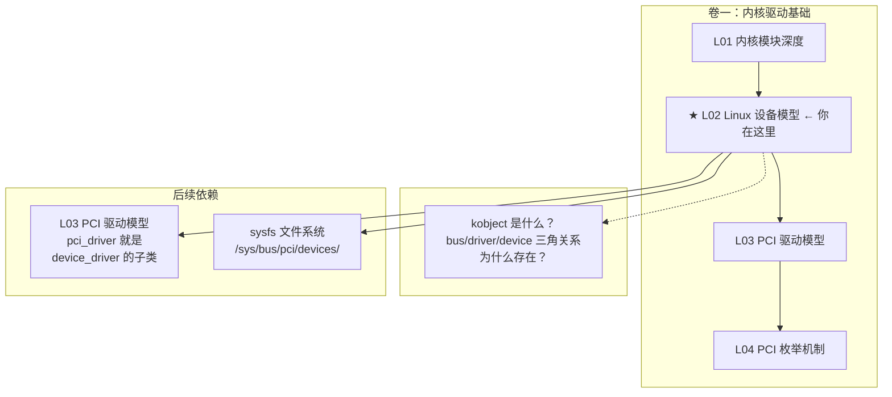
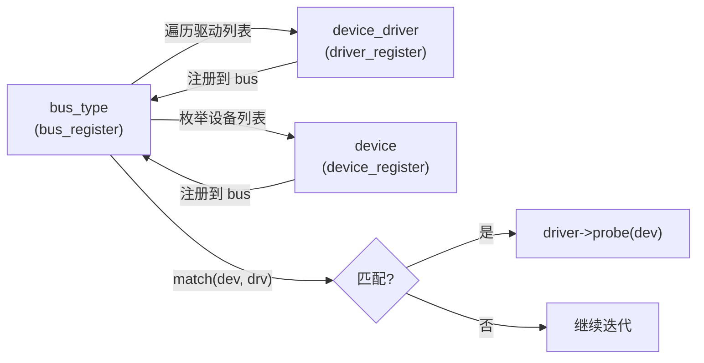

# L02：Linux 设备模型

---

## 0. 框架定位



---


---

## 1. 问题驱动

> 🔍 **你遇到了一个问题：**
>
> 你写了一个 `struct pci_driver` 并注册到内核，`probe` 函数里准备了
所有硬件初始化，但它**从来没被调过**。
设备模型是怎么把驱动和设备"撮合"在一起的？
为什么 `pci_register_driver` 返回成功但 probe 不触发？
>
> **带着这个问题学完本节，你就知道答案了。**

---

## 2. 前置认知


**前置依赖**：L01 内核模块深度。你已经理解：
- 模块如何被内核加载（`load_module → do_init_module`）
- 符号解析和重定位机制

**本文定位**：L01 讲的是"代码怎么进入内核"。本文讲的是"代码进入内核之后，怎么向内核描述自己管的是什么设备"。驱动不是孤立的——内核有一套统一的设备模型，所有驱动都必须遵守。理解这套模型之后，`pci_register_driver()` 内部做了什么就不再是黑盒。

**首次出现的概念**（阅读本文后即建立）：
- kobject / ktype / kset：内核对象的表示层
- bus_type / device / device_driver：总线-设备-驱动的三角关系
- sysfs：这些对象在用户态的文件映射
- uevent：热插拔事件通知机制

---

## 3. 核心原理

### 2.1 问题驱动：内核为什么需要一套"设备模型"？

早期的 Linux 驱动（2.4 及之前）没有统一模型。每个驱动自己管理 `/proc` 文件、自己做设备号分配、自己搞一套热插拔通知。这导致：

1. **碎片化**：网卡驱动和声卡驱动用完全不同的方式暴露信息
2. **重复开发**：每个子系统的 `insmod` 回调、`rmmod` 清理、sysfs 展示都要自己写
3. **无法自动关联**：设备插入后，内核不知道"这个设备该由哪个驱动管"——因为设备和驱动的匹配规则是各子系统各写的

Linus 在 2.5 开发周期中提出要求：**所有设备和驱动必须进入同一个对象模型**。这就是 driver core（驱动核心层）。

### 2.2 设计意图：三层抽象

Linux 设备模型的核心设计是三样东西：

```
kobject     →  对象的"最小单元"：引用计数 + 父指针 + sysfs 映射
kset        →  同类 kobject 的集合：可以发 uevent、可以迭代
bus_type    →  总线类型：匹配设备与驱动、probe 调度
```

**关键设计选择**：kobject **不是基类**。Linux 内核是 C 语言写的，没有继承。kobject 通过**嵌入**（embedding）出现在所有需要设备模型特性的结构体中：

```c
// 不是这样的（C++/Java 思维）：
// struct device extends kobject { ... }

// 实际的 Linux 做法：
struct device {
    struct kobject kobj;   // ← 嵌入，不是继承
    struct bus_type *bus;
    struct device_driver *driver;
    // ...
};
```

这种做法的优势：
- 零虚函数开销——调用 `kobject_get(&dev->kobj)` 是直接结构体成员访问
- 内存布局控制——`kobj` 可以和 `device` 的其他成员紧凑排列
- 没有 vtable——在 C 里手动实现多态非常脆弱

**劣势**：你要从 `kobject *` 反向拿到 `device *` 需要 `container_of()` 宏，这要求所有使用 `container_of` 的调用者都知道"内部的那个 kobject"在哪个结构体里偏移多少。

### 2.3 bus/driver/device 三角关系

这是设备模型的**核心交互模式**：



**任何一方注册都会触发匹配**：
- 先 `insmod` 驱动再插设备 → 设备注册时触发匹配 → probe
- 先插设备再 `insmod` 驱动 → 驱动注册时触发匹配 → probe
- 两种顺序都 work，因为 `bus_type` 维护了两张链表：设备链表 + 驱动链表

> 这就是为什么 L03 讲 `pci_register_driver()` 时你注册驱动，内核能立刻 probe 到已经枚举过的 PCI 设备。

---

## 4. 内核源码带读

> x86_64 v7.0。本节追踪 kobject→sysfs 的关键路径 + 异常分支。

### 3.1 `kobject_init_and_add()` —— kobject 生命周期入口

> 源码：`lib/kobject.c`

```c
int kobject_init_and_add(struct kobject *kobj, const struct kobj_type *ktype,
                         struct kobject *parent, const char *fmt, ...)
{
    // ① 初始化 kobject 内核对象
    kobject_init(kobj, ktype);
    // ⚠ INIT: kref = 1, entry = LIST_HEAD_INIT, state = initialized

    // ② 设置名字 + 父节点
    kobj->parent = parent;

    // ③ ★ 添加到 sysfs —— 创建目录
    ret = kobject_add_varg(kobj, fmt, args);
    // → kobject_add_internal() → create_dir() → sysfs_create_dir_ns()
    // ⚠ 如果父目录不存在 → -ENOENT
    //    如果同名已存在 → -EEXIST

    return ret;
}
// ⚠ 失败时调用者必须 kobject_put() —— refcount 已被 init 设为 1
```

### 3.2 `kobject_put()` + `ktype->release()` —— 引用计数与释放

```c
void kobject_put(struct kobject *kobj)
{
    if (kobj)
        kref_put(&kobj->kref, kobject_release);
    // kref_put: refcount_dec_and_test → 降到 0 时调用 kobject_release
}

static void kobject_release(struct kref *kref)
{
    struct kobject *kobj = container_of(kref, struct kobject, kref);
    // ① 从 sysfs 移除（删除目录）
    kobject_cleanup(kobj);  // → remove_dir()

    // ② ★ 调用 ktype->release
    kobj->ktype->release(kobj);
    // ⚠ 如果 release = NULL → kobject 内存永不释放 → kmemleak
}
```

### 3.3 `bus_add_driver()` —— 驱动注册的核心

> 源码：`drivers/base/bus.c`

```c
int bus_add_driver(struct device_driver *drv)
{
    // ① 检查 bus 的必要回调
    if (drv->bus->p->drivers_autoprobe)
        error = driver_attach(drv);
    // ⚠ drivers_autoprobe = 0 → 跳过自动 probe
    //    手动 bind 场景：echo BDF > /sys/bus/pci/drivers/<name>/bind

    // ② 如果驱动没有 suppress_bind_attrs → 创建 bind/unbind sysfs 文件
    if (!drv->suppress_bind_attrs)
        add_bind_files(drv);
    // ⚠ suppress_bind_attrs → 禁止用户手动 bind/unbind
    //    GPU 驱动常设此标志——nvidia.ko 不让用户随意 unbind GPU
}
```

### 3.4 异常路径汇总

| 场景 | 现象 | 根因 |
|------|------|------|
| `kobject_add` 失败 | sysfs 目录未创建 | 父 kobject 未 add 或名字冲突 |
| `release` = NULL | 内存泄漏 | ktype 定义不完整 |
| `drivers_autoprobe` = 0 | 设备无驱动 | 需要手动 bind |
| `suppress_bind_attrs` = 1 | bind/unbind 文件不存在 | 驱动主动禁止 |
## 5. x86 关联

### 4.1 NUMA 节点信息在 sysfs 中

x86 服务器上，sysfs 暴露了 NUMA 拓扑：

```bash
ls /sys/devices/system/node/
# node0/ node1/ node2/ node3/

cat /sys/devices/system/node/node0/cpulist
# 0-15,32-47  (这个 node 上的 CPU)

cat /sys/bus/pci/devices/0000:17:00.0/numa_node
# 1  (这个 PCIe 设备挂在 NUMA node 1)
```

你的 GPU 通常插在特定 CPU socket 的 PCIe 槽上——它在哪个 NUMA node 上，DMA buffer 就该分配在那个 node 上。L13 展开。

### 4.2 x86 的 ACPI 与 sysfs

x86 不使用设备树（那是 ARM 的概念），而是 ACPI。sysfs 中能看到 ACPI 固件表和设备路径：

```bash
ls /sys/firmware/acpi/tables/
# MCFG  DSDT  SSDT  FACS  ...

ls /sys/bus/acpi/devices/
# LNXSYSTM:00/  PNP0A08:00/  ...
```

PCI host bridge 在 x86 上通常是 ACPI 设备 `PNP0A08` 的子节点。

---

## 6. GPU 关联

**GPU 驱动也用这套设备模型。**

NVIDIA 的 `nvidia.ko` 加载后注册到 `pci_bus_type`：

```
nvidia.ko → module_init()
  → pci_register_driver(&nvidia_pci_driver)
    → driver_register(&nvidia_pci_driver.driver)
      → bus_add_driver(drv)
        → driver_attach(drv)
          → 遍历 pci_bus_type 上的设备列表
            → pci_bus_match(dev, drv)
              → 比较 vendor = 0x10DE (NVIDIA) / device = GPU 型号
                → 匹配 → really_probe()
                  → nvidia_pci_probe()  ← 你的 GPU 开始初始化
```

在 probe 中，GPU 驱动通过 `device_register()` 注册子设备——这就是为什么 `ls /sys/bus/pci/devices/0000:17:00.0/` 下面还有 `drm/`、`hwmon/`、`sound/` 等子目录。

`/sys/kernel/debug/dri/0/` 下面的 GPU 调试信息，也是通过 kobject + debugfs（L20 展开）实现的。

---

## 7. 思考题

1. kobject 内核设计为什么选择"嵌入"而不是"继承"？如果用 C++ 的虚继承实现，在 PCIe 驱动的热路径（每次 DMA 完成后 do IRQ）上会有什么性能差异？

2. 内核中有 `struct device` 和 `struct device_driver`。当一个设备 `device_register()` 时，内核遍历的是哪个数据结构来判断"有没有已注册的驱动能管这个设备"？当驱动 `driver_register()` 时，遍历的又是哪个？

3. 如果把一个 `struct kobject` 嵌入你的 `struct pci_dev`，但没有设置 `ktype->release`。用户打开 `/sys/bus/pci/devices/0000:00:1f.0/vendor` 并 keep open，然后你 `rmmod` 了驱动——会发生什么？为什么？

4. 为什么 `bus_type->match()` 返回 1 或 0，而不是返回优先级分数？如果两个驱动都声称能管同一个设备（返回 1），内核怎么处理？

5. `kobject_put()` 什么时候调用 `release`？如果 refcount 在 `put` 时降到 0，但调用栈还持有指针（即将返回后才真正释放）——这有什么风险？内核用什么约定防范？

6. x86 上 `/sys/bus/pci/devices/0000:17:00.0/numa_node` 的值是怎么来的？PCIe 设备怎么"知道"自己在哪个 NUMA node 上？

7. 当你 `cat /sys/bus/pci/devices/0000:00:1f.0/vendor` 时，从用户态 shell 到内核返回 `"0x8086\n"`——中间经过了哪些内核路径？sysfs 读文件的完整调用链是怎样的？

8. udev 收到 KOBJ_ADD 事件后，可以自动加载内核模块。它是怎么根据 uevent 中的信息决定加载哪个 `.ko` 的？这个过程和 `pci_device_id` 表有什么关系？

---

## 6b. 参考答案

**Q1**：选择"嵌入"而非"继承"，核心原因是**零开销抽象**。如果使用虚继承：每次访问对象方法都需要通过 vtable 间接跳转（`mov rax, [rdi]; call [rax+offset]`），两次内存访问；嵌入方式只需 `container_of` 做一次指针减法（纯编译期计算，零运行时开销）。PCIe 驱动的热路径上（DMA 完成中断），每次 `kobject_get/put` 都是 `lock inc/dec` 指令，嵌入方式让 `kobj` 地址 = `&dev->kobj`，直接偏移计算，不存在 vtable 寻址。在中断处理中，每次间接跳转可能触发 BTB miss，对于一个 10M IOPS 的设备，累积影响显著。

**Q2**：`device_register()` 时，内核遍历 `bus->p->klist_drivers`（该总线已注册的驱动链表），对每个 `struct device_driver` 调用 `bus->match(dev, drv)`。`driver_register()` 时，内核遍历 `bus->p->klist_devices`（该总线已枚举的设备链表），同样调用 `match()`。两条路径对称——无论谁先注册，后到的一方会触发匹配。

**Q3**：会导致内核**内存泄漏和潜在的 use-after-free**。当用户态 `cat` 打开 sysfs 文件时，kernfs 内部对该 kobject 的 `kref` 加了一次引用（确保文件 open 期间对象存活）。用户 keep open + `rmmod` → `kobject_put` 多次调用，最终 `kref` 降到 0 → 内核尝试调用 `ktype->release` → 但 release 是 NULL 或未正确实现 → 对象占据的内存不被释放。更糟的是，如果没有 release 但用户后来 close 了文件 → kernfs 最后一次 `kobject_put` → 没有 release → 内存泄漏。正确做法：`release` 中调用 `kfree(container_of(kobj, struct my_dev, kobj))`。

**Q4**：`match()` 返回 **bool**（0/1），不是优先级，因为设备模型的匹配逻辑不是"找最优驱动"，而是**先到先得**。当 `__device_attach()` 遍历 `klist_drivers` 时，一旦 `match()` 返回 1，立即调用 `really_probe()` 锁定该驱动。如果 probe 返回 0（成功），设备绑定至此驱动，不再继续遍历。如果 probe 失败（返回负值），继续遍历后续驱动。这是 `bus->probe` 回调的职责。双驱动声明管同一设备的情况：第一个驱动的 probe 返回 0 → 设备绑定 → 第二个永远不会被尝试。所以内核开发惯例是在 `match()` 中尽量精确（如 PCI 的 vendor+device 精确匹配优先于 class-based 匹配）。

**Q5**：`kref_put(&kobj->kref, ktype->release)` 中，`refcount_dec_and_test` 是原子操作——当计数降到 0 的瞬间，release 在同一调用上下文中被同步调用。风险：如果调用者本身还在使用该对象（如 `kobject_put(&dev->kobj)` 之后还访问 `dev->name`），就是典型的 use-after-free。内核的防范约定是**结构化的所有权模型**：谁持有最后一个引用，谁负责在 `kobject_put` 之后不再访问该对象。对于复杂场景（如多个线程共享引用），使用 `kobject_get` 在每次访问前递增引用，访问后 `kobject_put`。

**Q6**：PCIe 设备的 NUMA node 信息来自 **ACPI _PXM**（Proximity Domain）或 **_SRT**（System Resource Affinity Table）。BIOS/UEFI 在枚举 PCIe 拓扑时，将每个 Root Port / 设备与特定 proximity domain 关联（ACPI _PXM 对象）。内核 PCI 枚举时（`pci_scan_device()` → `pci_setup_device()` → `set_pcie_port_type()` → `pci_acpi_setup()`），读取 ACPI _PXM 值 → 设置 `dev->numa_node`。sysfs 中的 `numa_node` 文件通过 `dev_attr_numa_node` → `device_show_int()` → 直接读取 `dev->numa_node` 字段返回。

**Q7**：完整调用链：`cat /sys/bus/pci/devices/0000:00:1f.0/vendor` → 用户态 `read()` 系统调用 → VFS `vfs_read()` → `kernfs_file_read_iter()` → `kernfs_file_direct_read()` → 调用该属性对应的 `sysfs_ops->show()`。PCI 总线注册了 `pci_dev_groups`，其中 `vendor` 是 `dev_attr_vendor`。它对应的 show 函数是 `vendor_show()`：通过 `to_pci_dev(kobj_to_dev(kobj))` 用 `container_of` 从 kobject 还原 `struct pci_dev`，然后 `sysfs_emit(buf, "0x%04x\n", pdev->vendor)`。`pdev->vendor` 的值来自枚举时的 `pci_setup_device()` 读配置空间偏移 0x00 的 Vendor ID。

**Q8**：udev 收到 `KOBJ_ADD` 事件后，uevent 消息中包含 `MODALIAS=pci:v000010DEd00002684...` 字段。`modalias` 字符串是 PCI 子系统在 `pci_uevent()` 中构造的——将 `pci_dev` 的 vendor/device/subsystem/class 字段按 `pci:v<vendor>d<device>sv<subvendor>sd<subdevice>bc<class>` 格式编码。udev 调用 `modprobe $MODALIAS` → `modprobe` 查找 `modules.alias` 文件（由 `depmod` 从各驱动的 `MODULE_DEVICE_TABLE(pci, ...)` 生成），其中每行是 `alias pci:v000010DEd* ... <driver_name>`。匹配到 → 加载对应 `.ko`。所以**内核态的 `pci_device_id` 表用于 probe 匹配，用户态的 `modules.alias` 用于自动加载模块**——两套匹配规则，但数据来源一致（都从 `MODULE_DEVICE_TABLE(pci, ...)` 生成）。

---

## 8. 渐进式代码构建

> 本篇代码是系统的**第 2 个增量**——在 L01 的 hello.ko 基础上，创建一个 kobject 并将其暴露到 sysfs。这不是 PCI 驱动的一部分，但帮你理解 sysfs 是怎么来的。

```c
// kobject_demo.c
#include <linux/module.h>
#include <linux/kernel.h>
#include <linux/kobject.h>
#include <linux/sysfs.h>
#include <linux/slab.h>

MODULE_LICENSE("GPL");
MODULE_AUTHOR("kly");
MODULE_DESCRIPTION("PCIe Driver Learning Series - Step 2 (kobject/sysfs)");

static struct kobject *demo_kobj;

// sysfs 属性：读这个文件时显示 "Hello from kobject\n"
static ssize_t demo_show(struct kobject *kobj, struct kobj_attribute *attr,
                          char *buf)
{
    return sysfs_emit(buf, "Hello from kobject\n");
}

static struct kobj_attribute demo_attr = __ATTR_RO(demo);

static struct attribute *demo_attrs[] = {
    &demo_attr.attr,
    NULL,
};

static void demo_release(struct kobject *kobj)
{
    pr_info("L02: kobject released\n");
}

static struct kobj_type demo_ktype = {
    .release        = demo_release,
    .sysfs_ops      = &kobj_sysfs_ops,
    .default_groups = demo_attrs,
};

static int __init demo_init(void)
{
    int ret;

    // 在 /sys/kernel/ 下创建 demo_kobj 目录
    demo_kobj = kzalloc(sizeof(*demo_kobj), GFP_KERNEL);
    if (!demo_kobj)
        return -ENOMEM;

    ret = kobject_init_and_add(demo_kobj, &demo_ktype,
                                kernel_kobj, "pcie_demo");
    if (ret) {
        kobject_put(demo_kobj);
        return ret;
    }

    pr_info("L02: kobject created at /sys/kernel/pcie_demo/\n");
    return 0;
}

static void __exit demo_exit(void)
{
    kobject_put(demo_kobj);
    pr_info("L02: Module unloaded\n");
}

module_init(demo_init);
module_exit(demo_exit);
```

**编译**：Makefile 中把 `obj-m := hello.o` 改成 `obj-m := kobject_demo.o`（或一起编译 `obj-m := hello.o kobject_demo.o`）。

**验证**：
- [ ] `sudo insmod kobject_demo.ko`
- [ ] `ls /sys/kernel/pcie_demo/` → 看到 `demo` 文件
- [ ] `cat /sys/kernel/pcie_demo/demo` → 输出 "Hello from kobject"
- [ ] `sudo rmmod kobject_demo` → dmesg 看到 "kobject released"
