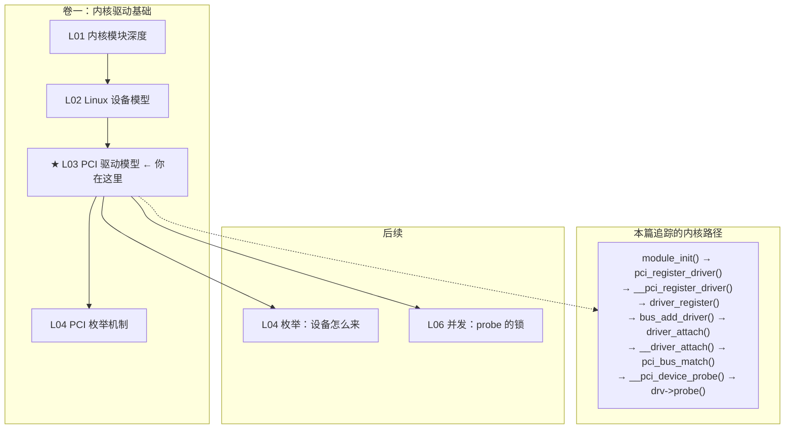
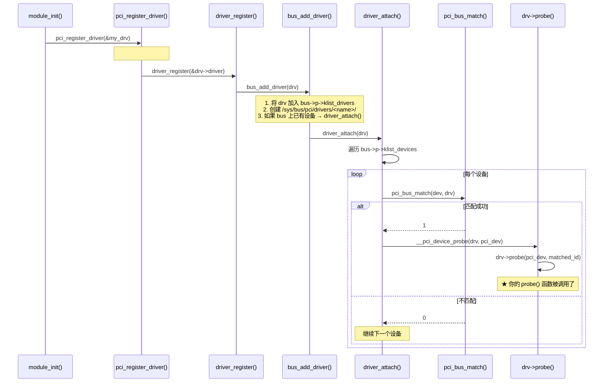

# L03：PCI 驱动模型

---

## 0. 框架定位



---


---

## 1. 问题驱动

> 🔍 **你遇到了一个问题：**
>
> 你的 GPU 在 `lspci` 里能看到：`Vendor=10de Device=2684`，
驱动也注册了对应的 `pci_device_id` 表，
但 `probe` 一进去执行到 `pci_enable_device` 就挂了。
PCI 驱动从注册到 probe 到底经过了几层？哪里出了问题？
>
> **带着这个问题学完本节，你就知道答案了。**

---

## 2. 前置认知


**前置依赖**：
- L01：理解 `module_init()` → `load_module()` → `do_init_module()` 路径
- L02：理解 `bus_type`、`device_driver`、`device` 三角关系；`bus->match()` 的作用；`driver_register()` 会触发设备列表遍历

**本文定位**：L02 讲的是通用设备模型。本文聚焦 PCI 总线如何在这个框架之上实现自己的驱动模型——`pci_driver` 是 `device_driver` 的 PCI 特化版本，`pci_bus_type` 是 `bus_type` 的 PCI 实例。读完本文，你能逐行解释 `pci_register_driver()` 从调用到你写的 `probe()` 之间内核做了什么。

---

## 3. 核心原理

### 2.1 PCI 总线类型：一个全局 bus_type 实例

内核中有一个全局变量，定义在 `drivers/pci/pci-driver.c` 第 1728 行：

```c
const struct bus_type pci_bus_type = {
    .name       = "pci",
    .match      = pci_bus_match,       // ★ 核心：决定谁管谁
    .uevent     = pci_uevent,          // 用户态 modalias 消息
    .probe      = pci_device_probe,    // 调度到具体驱动的 probe
    .remove     = pci_device_remove,   // 调度到具体驱动的 remove
    .shutdown   = pci_device_shutdown,
    .dev_groups = pci_dev_groups,      // sysfs 属性（vendor/device/irq 等）
    .bus_groups = pci_bus_groups,
    .drv_groups = pci_drv_groups,
    .pm         = PCI_PM_OPS_PTR,
    .num_vf     = pci_bus_num_vf,
    .dma_configure = pci_dma_configure,
    .dma_cleanup   = pci_dma_cleanup,
};
EXPORT_SYMBOL(pci_bus_type);
```

**所有 PCI 设备和驱动都注册到这个 bus_type 上。** 当你的驱动调用 `pci_register_driver()`，你的 `struct device_driver`（嵌入在 `struct pci_driver` 中）被添加到 `pci_bus_type->p->klist_drivers`。当内核枚举到一个新 PCI 设备，`struct pci_dev->dev` 被添加到 `pci_bus_type->p->klist_devices`。

### 2.2 `struct pci_driver`：device_driver 的 PCI 外套

```c
struct pci_driver {
    const char *name;                        // 驱动名，lspci -k 看到的
    const struct pci_device_id *id_table;    // ★ "我能管哪些设备"
    int  (*probe)(struct pci_dev *dev, const struct pci_device_id *id);
    void (*remove)(struct pci_dev *dev);

    // 电源管理
    int  (*suspend)(struct pci_dev *dev, pm_message_t state);
    int  (*resume)(struct pci_dev *dev);

    // SR-IOV（L24 展开）
    int  (*sriov_configure)(struct pci_dev *dev, int num_vfs);

    // 错误处理（L22 展开）
    const struct pci_error_handlers *err_handler;

    // sysfs 属性组
    const struct attribute_group **groups;

    // ★ 核心嵌入：通用的 device_driver
    struct device_driver driver;

    // 动态 ID 列表（允许后续添加新的 ID）
    struct pci_dynids dynids;
};
```

**关键理解**：`struct pci_driver` 不是一个独立的类型——它是 `struct device_driver` 的**外套**。`driver` 字段（`struct device_driver`）才是实际向 driver core 注册的东西。`pci_driver` 只是在外层增加了 PCI 特有的数据：`id_table`（匹配用）、`probe/remove`（PCI 设备版的回调签名）、错误处理、SR-IOV 等。

转换宏：

```c
#define to_pci_driver(drv) container_of_const(drv, struct pci_driver, driver)
```

driver core 只认 `struct device_driver`。当它需要调用 PCI 特有的操作时，通过 `to_pci_driver(drv)` 还原 `pci_driver`。

### 2.3 `pci_device_id`：匹配的钥匙

```c
struct pci_device_id {
    __u32 vendor, device;           // Vendor ID, Device ID（或 PCI_ANY_ID）
    __u32 subvendor, subdevice;     // Subsystem ID（或 PCI_ANY_ID）
    __u32 class, class_mask;        // Class code + mask
    kernel_ulong_t driver_data;     // 驱动私有数据（通常是数组索引）
    __u32 override_only;            // 只在 driver_override 时匹配
};
```

**初始化宏**：

```c
// 精确匹配 vendor + device
{ PCI_DEVICE(0x8086, 0x100E) }

// 匹配某厂家的任何设备
{ PCI_VENDOR_ID(0x10DE) }

// 匹配某类设备（如所有网卡 class=020000）
{ PCI_DEVICE_CLASS(0x020000, ~0) }

// 必须以此结尾——标志数组终止
{ 0, }
```

**MODULE_DEVICE_TABLE**：

```c
MODULE_DEVICE_TABLE(pci, my_ids);
```

这个宏被 `depmod` 在用户态解析。`depmod` 读取 `.ko` 的 `.modinfo` section，找到 `alias=pci:v...` 条目，写入 `/lib/modules/$(uname -r)/modules.alias`。当 udev 收到新设备的 uevent（包含 `MODALIAS=pci:v00008086d0000100E...`），`modprobe` 查找 `modules.alias`，匹配到 → 加载你的 `.ko`。

**两套匹配机制并存**：
- **内核**：加载后通过 `pci_bus_match()` 遍历 `id_table` 做精确比对
- **用户态**：加载前通过 `modules.alias` 的 modalias 匹配决定加载哪个模块

数据来源一致（都从 `MODULE_DEVICE_TABLE` 生成），但运行时机不同。

### 2.4 完整调用链：从 `pci_register_driver` 到你的 `probe`



**关键步骤展开**：

#### 步骤 1：`pci_register_driver()` 是一个宏

```c
// include/linux/pci.h 第 1679 行
#define pci_register_driver(driver)     \
    __pci_register_driver(driver, THIS_MODULE, KBUILD_MODNAME)
```

`THIS_MODULE` 指向当前模块的 `struct module`（L01 学的）。`KBUILD_MODNAME` 是编译时自动生成的名字。两者传到 `__pci_register_driver()`。

#### 步骤 2：`__pci_register_driver()` 初始化 `device_driver`

```c
int __pci_register_driver(struct pci_driver *drv, struct module *owner,
                          const char *mod_name)
{
    // ★ 关键：初始化嵌入的 device_driver
    drv->driver.name   = drv->name;   // PCI 驱动名 = 设备模型驱动名
    drv->driver.bus    = &pci_bus_type;  // 绑定到 PCI 总线
    drv->driver.owner  = owner;          // 模块引用计数
    drv->driver.mod_name = mod_name;

    // ... 一些校验 ...

    // ★ 正式注册到 driver core
    return driver_register(&drv->driver);
}
```

**重点**：`drv->driver.bus = &pci_bus_type`——所有 PCI 驱动的 `device_driver` 都被绑定到同一个 `pci_bus_type` 全局实例。这就是为什么 `driver_register()` 后内核知道要去 PCI 总线的设备列表里找匹配。

#### 步骤 3：`driver_register()` → `bus_add_driver()`

`driver_register()` 是 L02 讲的通用框架函数。它调用 `bus_add_driver(drv)`：

```c
int bus_add_driver(struct device_driver *drv)
{
    // 1. 创建 sysfs 目录：/sys/bus/pci/drivers/<name>/
    // 2. 将 drv 加入 bus->p->klist_drivers 链表
    klist_add_tail(&priv->knode_driver, &bus->p->klist_drivers);

    // 3. ★★★ 如果 bus 上已有设备，触发匹配
    if (drv->bus->p->drivers_autoprobe) {
        driver_attach(drv);  // 遍历设备链表，逐个尝试匹配
    }
}
```

#### 步骤 4：`driver_attach()` → `__driver_attach()` → `pci_bus_match()`

```c
int driver_attach(struct device_driver *drv)
{
    // 遍历 bus->p->klist_devices 上所有已枚举的设备
    return bus_for_each_dev(drv->bus, NULL, drv, __driver_attach);
}

static int __driver_attach(struct device *dev, void *data)
{
    struct device_driver *drv = data;
    // 调用 bus->match —— 对 PCI 来说就是 pci_bus_match()
    if (!driver_match_device(drv, dev))
        return 0;  // 不匹配，跳过

    // 匹配 → 调度 probe
    driver_probe_device(drv, dev);
}
```

#### 步骤 5：`pci_bus_match()`——**你驱动的 id_table 在这里被使用**

```c
static int pci_bus_match(struct device *dev, const struct device_driver *drv)
{
    struct pci_dev *pci_dev = to_pci_dev(dev);
    struct pci_driver *pci_drv = to_pci_driver(drv);

    // ★ 核心：将设备信息与驱动的 id_table 逐条比对
    const struct pci_device_id *found_id;

    found_id = pci_match_device(pci_drv, pci_dev);
    if (found_id)
        return 1;  // 匹配
    return 0;      // 不匹配
}
```

`pci_match_device()` 做的工作：
1. 先检查 `dev->driver_override`——如果用户显式绑定了驱动，优先
2. 遍历 `pci_drv->id_table`，对每条 `pci_device_id`：
   - 比较 `vendor`（`id->vendor == dev->vendor || id->vendor == PCI_ANY_ID`）
   - 比较 `device`
   - 比较 `subvendor` / `subdevice`
   - 比较 `class`（用 `class_mask` 选择性比较）
3. 也检查动态 ID 表（`dynids`——允许 echo 到 sysfs 添加新 ID）
4. 返回匹配到的 `pci_device_id` 条目指针

#### 步骤 6：`pci_device_probe()` → `__pci_device_probe()` → 你的 `probe()`

```c
static int pci_device_probe(struct device *dev)
{
    struct pci_dev *pci_dev = to_pci_dev(dev);
    struct pci_driver *drv = to_pci_driver(dev->driver);

    // 一些 pre-probe 检查：设备是否已启用、资源是否分配等

    return __pci_device_probe(drv, pci_dev);
}

static int __pci_device_probe(struct pci_driver *drv, struct pci_dev *pci_dev)
{
    const struct pci_device_id *id;

    // 再次确认匹配到的 id 条目
    id = pci_match_device(drv, pci_dev);
    if (!id)
        return -ENODEV;

    // ★ 设备启用
    pci_assign_irq(pci_dev);  // 分配中断号

    // ★★★ 调用你写的 probe
    return drv->probe(pci_dev, id);
}
```

**注意**：`drv->probe` 接收 `pci_dev` 和 `id`（匹配到的 `pci_device_id` 条目指针）。如果 `id` 里有 `driver_data`，probe 可以通过它区分同一驱动的不同设备变体。

### 2.5 probe 的返回值

```c
static int my_probe(struct pci_dev *dev, const struct pci_device_id *id)
{
    int ret;

    ret = pci_enable_device(dev);
    if (ret) return ret;  // -EINVAL: BIOS 未分配资源; -ENODEV: 设备无响应

    ret = pci_request_regions(dev, "my_drv");
    if (ret) { pci_disable_device(dev); return ret; }  // 区域被占用

    // ... 你的初始化逻辑 ...

    return 0;  // ★ 成功。返回负值 = 失败，设备不绑定此驱动
}
```

**返回 0 后的连锁反应**：
1. `dev->driver = drv` —— 设备和驱动正式绑定
2. `klist_add_tail` —— 设备加入驱动的设备链表
3. sysfs 创建符号链接：`/sys/bus/pci/drivers/my_drv/0000:17:00.0 → ../../../../devices/pci0000:...`
4. `lspci -k` 显示 `Kernel driver in use: my_drv`

**返回负值的后果**：
1. `really_probe()` 调用 `dev->bus->remove(dev)` 清理
2. driver core 继续遍历驱动链表，尝试下一个匹配的驱动
3. 如果没有其他驱动能管这个设备 → 设备无驱动 → `lspci -k` 不显示 kernel driver

---

## 4. 内核源码带读

> 本节追踪从 `pci_register_driver()` 到 `probe()` 的完整调用链。每层标注：**主流程** → **异常分支** → **⚠ 注意点**。

---

### 3.1 第一层：`pci_register_driver()` → `__pci_register_driver()`

> 源码：`include/linux/pci.h:1679` + `drivers/pci/pci-driver.c:1464`

```c
#define pci_register_driver(driver) \
    __pci_register_driver(driver, THIS_MODULE, KBUILD_MODNAME)
```

**⚠ 注意点**：这是个宏，不是函数。这意味着 `THIS_MODULE` 和 `KBUILD_MODNAME` 在**调用者的编译单元**中被求值——`THIS_MODULE` 是 `&__this_module`（指向当前模块的 `struct module`），`KBUILD_MODNAME` 是 Makefile 中的模块名。如果有人在非模块代码中调用，`THIS_MODULE` 是 NULL。

**进入 `__pci_register_driver()`**（`pci-driver.c:1464`）：

```c
int __pci_register_driver(struct pci_driver *drv, struct module *owner,
                          const char *mod_name)
{
    // == 主流程 ==
    drv->driver.name     = drv->name;           // ① device_driver 的名字
    drv->driver.bus      = &pci_bus_type;       // ② ★ 绑定 PCI 总线
    drv->driver.owner    = owner;               // ③ THIS_MODULE —— 引用计数
    drv->driver.mod_name = mod_name;            // ④ sysfs 中的模块名

    // == 条件分支：driver_managed_dma ==
    if (drv->driver_managed_dma) {
        drv->driver.probe_type = PROBE_PREFER_ASYNCHRONOUS;
        // ⚠ 驱动声明自己管理 DMA 域（driver-managed DMA），
        // 内核允许异步 probe——不等待其他设备 probe 完成。
        // GPU 驱动常用：nvidia.ko 设置此标志。
    }

    // == 动态 ID 初始化 ==
    spin_lock_init(&drv->dynids.lock);           // ⑤ 自旋锁
    INIT_LIST_HEAD(&drv->dynids.list);           // ⑥ 空链表——以后可添加新 ID

    // == 正式注册 ==
    return driver_register(&drv->driver);
}
```

**异常路径**：`driver_register()` 返回负值时直接透传。常见失败原因：
- `-EEXIST`：同名驱动已注册（`driver_find()` 在 `bus_add_driver()` 中检测到重名）
- `-ENOMEM`：kobject 分配失败

**⚠ 注意点**：`drv->driver.bus = &pci_bus_type` 是**全局单例指针**。整个内核只有一个 `pci_bus_type` 实例。所有 PCI 驱动的 `device_driver.bus` 都指向同一个地址——这就是为什么 `driver_register()` 后内核知道"应该去 PCI 设备列表里找匹配"。

---

### 3.2 第二层：`driver_register()` → `bus_add_driver()` → `driver_attach()`

> 源码：`drivers/base/driver.c:driver_register()` → `drivers/base/bus.c:bus_add_driver()`

**`driver_register()` 的主流程**：

```c
int driver_register(struct device_driver *drv)
{
    // ① 如果 bus 要求 driver 提供自己的 sysfs group，不提供则返回 -EINVAL
    if ((drv->bus->probe && drv->probe) ||
        (drv->bus->remove && drv->remove))
        // 驱动必须有至少 probe 或 remove 之一
        ;

    // ② 核心：添加到 bus
    ret = bus_add_driver(drv);
    if (ret) return ret;

    // ③ 注册驱动属性组到 sysfs
    ret = driver_add_groups(drv, drv->groups);
    // ④ 发送 KOBJ_ADD uevent
    kobject_uevent(&drv->p->kobj, KOBJ_ADD);
    return 0;
}
```

**`bus_add_driver()` 内部的关键路径**（`bus.c`）：

```c
int bus_add_driver(struct device_driver *drv)
{
    struct bus_type *bus = drv->bus;  // ★ = &pci_bus_type

    // == ① 创建 sysfs 目录：/sys/bus/pci/drivers/<name>/ ==
    // 通过 kobject_init_and_add() 创建

    // == ② 将 drv 插入驱动的 klist ==
    klist_add_tail(&priv->knode_driver, &bus->p->klist_drivers);
    // ⚠ 插入后，新的设备枚举就能看到这个驱动了

    // == ③ 如果允许自动 probe，立即遍历已有设备 ==
    if (drv->bus->p->drivers_autoprobe) {
        driver_attach(drv);  // ★★★ 触发设备匹配
    }
    // ⚠ drivers_autoprobe 通常为 1。如果为 0（用户写了 0 到
    //    /sys/bus/pci/drivers_autoprobe），驱动注册后不会自动匹配——
    //    设备需要手动 bind。
}
```

**异常路径**：
- `drivers_autoprobe == 0`：驱动注册但不触发匹配——设备不会自动 probe。这是调试场景：手动 `echo BDF > bind` 逐个 verify。
- `klist_add_tail` 失败：内存分配失败 → `-ENOMEM`。

---

### 3.3 第三层：`driver_attach()` → `__driver_attach()` → `really_probe()`

> 源码：`drivers/base/dd.c`

**`driver_attach()` 遍历已枚举的设备**：

```c
int driver_attach(struct device_driver *drv)
{
    return bus_for_each_dev(drv->bus, NULL, drv, __driver_attach);
    // bus_for_each_dev() 迭代 bus->p->klist_devices
    // 对每个 struct device * 调用 __driver_attach(dev, drv)
}
```

**`__driver_attach()` 的匹配-锁-调度逻辑**：

```c
static int __driver_attach(struct device *dev, void *data)
{
    struct device_driver *drv = data;

    // == ① 如果设备已经绑定驱动 → 跳过 ==
    if (dev->driver)
        return 0;

    // == ② 调用 bus->match() → 对 PCI 就是 pci_bus_match() ==
    if (!driver_match_device(drv, dev))
        return 0;      // ← 不匹配，静默跳过

    // == ③ 检查设备是否在延迟 probe 队列中 ==
    if (dev->p->dead)  // 设备已被删除
        return 0;

    // == ④ ★ 核心：锁定并调度 probe ==
    device_lock(dev);
    if (!dev->driver)
        driver_probe_device(drv, dev);
    device_unlock(dev);

    return 0;
}
```

**⚠ 注意点**：第④步的 `device_lock/dev->driver/device_unlock` 序列是**竞态防护**。在 lock 和 unlock 之间，设备可能已被另一个 CPU 上的并发操作（如热插拔移除）改变 `dev->driver`。重新检查 `!dev->driver` 确保设备没有在拿到锁之前被其他驱动 bind。

---

### 3.4 第四层：`really_probe()` —— 最复杂的一层

> 源码：`drivers/base/dd.c:655`。**这是整个驱动-设备模型的核心函数，约 130 行，包含 5 个 goto 标签，覆盖 7 种异常路径。**

```c
static int really_probe(struct device *dev, const struct device_driver *drv)
{
    // ===== ① 全局延迟 probe 检查 =====
    if (defer_all_probes) {
        // ⚠ /sys/kernel/debug/devices_deferred 控制——
        //    调试用，让所有 probe 走延迟路径
        return -EPROBE_DEFER;
    }

    // ===== ② 供应商/依赖检查（device links）=====
    link_ret = device_links_check_suppliers(dev);
    if (link_ret == -EPROBE_DEFER)
        return link_ret;
    // ⚠ 如果设备依赖的供应商设备尚未 probe，返回 -EPROBE_DEFER
    //    内核稍后重试。这是异步 probe 的关键机制。

    // ===== ③ devres 泄漏检测 =====
    if (!list_empty(&dev->devres_head)) {
        dev_crit(dev, "Resources present before probing\n");
        ret = -EBUSY;
        goto done;
    }
    // ⚠ devres 是设备资源管理链表。如果 probe 前已经有资源条目，
    //    说明上次 probe 没正确清理——拒绝继续。

re_probe:
    // ===== ④ 绑定驱动到设备 =====
    device_set_driver(dev, drv);  // 设置 dev->driver = drv
    // ⚠ 这是个单向操作：一旦设置，即使后续失败，也需要
    //    device_unbind_cleanup() 清除。这是 goto 链的根源。

    // ===== ⑤ DMA 配置 =====
    if (dev->bus->dma_configure) {
        ret = dev->bus->dma_configure(dev);
        if (ret) goto pinctrl_bind_failed;
        // ⚠ PCI 总线的 dma_configure = pci_dma_configure()
        //    设置 DMA mask、IOMMU group。如果失败（如 IOMMU 不可用
        //    且设备需要 IOMMU），probe 中止。
    }

    // ===== ⑥ sysfs 创建 =====
    ret = driver_sysfs_add(dev);
    if (ret) goto sysfs_failed;
    // ⚠ 创建 /sys/bus/pci/drivers/<name>/<BDF> 符号链接

    // ===== ⑦ ★★★ 调用驱动 probe =====
    ret = call_driver_probe(dev, drv);
    // call_driver_probe() → drv->probe(dev)（同步）或异步调度
    if (ret) {
        // ⚠ probe 失败时的特殊处理
        if (link_ret == -EAGAIN)
            ret = -EPROBE_DEFER;  // fw_devlink 模式：重试
        ret = -ret;
        goto probe_failed;
    }

    // ===== ⑧ probe 成功后：注册属性组 =====
    ret = device_add_groups(dev, drv->dev_groups);
    if (ret) goto dev_groups_failed;

    // ===== ⑨ ★ 特殊：CONFIG_DEBUG_TEST_DRIVER_REMOVE =====
    if (test_remove) {
        test_remove = false;
        device_remove(dev);         // 立即 remove
        driver_sysfs_remove(dev);
        if (dev->bus->dma_cleanup) dev->bus->dma_cleanup(dev);
        device_unbind_cleanup(dev);
        goto re_probe;              // ← 回到步骤④重新 probe！
    }
    // ⚠ 这是内核自测机制：probe 成功后立即 remove 再重新 probe。
    //    验证驱动的 remove/probe 对称性和 idempotence。
    //    驱动必须在 remove 中清理所有 probe 分配的资源。
    //    PCIe 验证时开启此选项 → 每张卡 probe 两次 → 检测泄漏。

    // ===== ⑩ ★ 最终绑定 =====
    driver_bound(dev);
    // driver_bound() 做三件事：
    // a) klist_add_tail → 设备加入驱动的设备列表
    // b) BUS_NOTIFY_BOUND_DRIVER → 通知链（bus notifier）
    // c) blocking_notifier_call_chain → MODULE notifier
    return 0;

    // =================== 异常路径 ===================
dev_groups_failed:
    device_remove(dev);       // 回滚 probe 的副作用
probe_failed:
    driver_sysfs_remove(dev); // 删除 sysfs 符号链接
sysfs_failed:
    bus_notify(dev, BUS_NOTIFY_DRIVER_NOT_BOUND);
    if (dev->bus && dev->bus->dma_cleanup)
        dev->bus->dma_cleanup(dev);  // 回滚 DMA 配置
pinctrl_bind_failed:
    device_links_no_driver(dev);      // 更新设备链接状态
    device_unbind_cleanup(dev);       // dev->driver = NULL + 引用计数恢复
done:
    return ret;
}
```

**⚠ 核心注意点汇总**：

| # | 场景 | 行为 | 对你的影响 |
|---|------|------|-----------|
| A | **probe 返回负值** | `goto probe_failed` → remove + sysfs 清理 + unbind cleanup → 驱动列表继续遍历 | 设备可能被下一个匹配的驱动 probe |
| B | **probe 中死循环/死锁** | 无超时，CPU 挂死，watchdog 超时后重启 | ★ 这是 bring-up 最高频 bug——probe 里 while(1) 等设备 ready |
| C | **probe 中 panic** | 系统崩溃，无回滚 | 资源泄漏（`ioremap`、DMA buffer）在 panic 后无关紧要了 |
| D | **-EPROBE_DEFER** | 设备放入 deferred probe 队列，稍后重试 | 依赖未就绪时返回此值的驱动必须能承受多次 probe |
| E | **CONFIG_DEBUG_TEST_DRIVER_REMOVE** | 每个设备 probe 两次 | 资源泄漏检测——remove 必须对称清理 probe 的全部分配 |

---

### 3.5 第五层：`pci_match_device()` 的匹配逻辑

> 源码：`drivers/pci/pci-driver.c:136`

```c
static const struct pci_device_id *pci_match_device(struct pci_driver *drv,
                                                     struct pci_dev *dev)
{
    // == ① driver_override 检查（最高优先级）==
    ret = device_match_driver_override(&dev->dev, &drv->driver);
    if (ret == 0)
        return NULL;  // override 设了别的驱动名 → 不匹配
    // ⚠ driver_override 是非空字符串时，只匹配名字相同的驱动。
    //    VFIO 透传的核心：echo vfio-pci > driver_override → 跳过 id_table

    // == ② 动态 ID 检查（第二优先级）==
    spin_lock(&drv->dynids.lock);
    list_for_each_entry(dynid, &drv->dynids.list, node) {
        if (pci_match_one_device(&dynid->id, dev)) {
            found_id = &dynid->id;
            break;
        }
    }
    spin_unlock(&drv->dynids.lock);
    if (found_id) return found_id;

    // == ③ 静态 id_table 检查（常规路径）==
    for (ids = drv->id_table; (found_id = pci_match_id(ids, dev));
         ids = found_id + 1) {
        // ⚠ pci_match_id() 内部调用 pci_match_one_device()
        //    逐字段比对 vend/dev/subsys/class
        if (found_id->override_only) {
            if (ret > 0) return found_id;  // 必须 driver_override 匹配
        } else {
            return found_id;  // ★ 返回第一个匹配的条目
        }
    }

    // == ④ driver_override 的通配匹配 ==
    if (ret > 0)
        return &pci_device_id_any;  // 返回"匹配任意设备"的虚拟 ID
    return NULL;
}
```

**⚠ 异常注意点**：
- **动态 ID 优先于静态 id_table**。用户通过 `echo "8086 100e" > /sys/bus/pci/drivers/<name>/new_id` 添加的 ID 会在静态表中 PEND/VEN/DEV 匹配之前被检查。
- **`override_only` 标志**（`pci_device_id` 结构中的字段）：此条目只在 `driver_override` 匹配时生效。静态 id_table 遍历时会跳过它（除非 override 激活）。
- **`pci_device_id_any`**：`driver_override` 匹配但 id_table 无匹配时返回此虚拟条目。probe 函数收到的 `id` 指针指向这个虚拟条目——`driver_data` 为 0。

---

### 3.6 终层：`pci_device_probe()` → `__pci_device_probe()`

> 源码：`pci-driver.c:466`

```c
static int pci_device_probe(struct device *dev)
{
    struct pci_dev *pci_dev = to_pci_dev(dev);
    struct pci_driver *drv = to_pci_driver(dev->driver);

    // == ① 中断分配 ==
    pci_assign_irq(pci_dev);
    // ⚠ 从配置空间读 Interrupt Line/Interrupt Pin 或 MSI capability

    // == ② 错误恢复检查 ==
    error = pci_dev_adjust_aer(pci_dev);
    // ⚠ 如果设备之前有 uncorrectable AER 错误，在此恢复

    // == ③ ★ 调用驱动 probe ==
    error = __pci_device_probe(drv, pci_dev);
    if (error) return error;

    // == ④ 注册属性组（成功后）==
    pci_create_attr_groups(pci_dev, drv->groups);
    return 0;
}

static int __pci_device_probe(struct pci_driver *drv, struct pci_dev *pci_dev)
{
    // == ① 再次 match（获取 matched_id）==
    id = pci_match_device(drv, pci_dev);
    if (!id) return -ENODEV;

    // == ② PCI 电源状态：D0 ==
    // 如果设备在 D3cold，probe 之前必须唤醒到 D0
    pci_dev->current_state = PCI_D0;

    // == ③ ★★★ 你的 probe ===
    return drv->probe(pci_dev, id);
    // ⚠ id 是匹配到的 pci_device_id 指针 → driver_data 可用
}
```

**⚠ 最终异常路径**：
- **`pci_match_device()` 返回 NULL**：理论上不应该——`pci_bus_match()` 已确认匹配。但如果 `dynids` 条目在 match 和 probe 之间被用户删除（竞态），probe 返回 `-ENODEV`。极少见但存在。
- **设备在 D3cold**：probe 前必须唤醒。如果你的硬件 reset 后默认进入 D3cold 且不支持 PME wake → probe 永远不会被调用 → `lspci -k` 空白 → 第一步排查 `cat /sys/bus/pci/devices/<BDF>/power_state`

---

## 5. x86 关联

### 4.1 driver_override：x86 服务器上的强制绑定

x86 服务器上有时需要强制某个设备使用特定驱动（即使 `id_table` 不匹配）：

```bash
# 把 17:00.0 强制绑定给 vfio-pci（用于 GPU 直通）
echo vfio-pci > /sys/bus/pci/devices/0000:17:00.0/driver_override
echo 0000:17:00.0 > /sys/bus/pci/drivers/vfio-pci/bind
```

`driver_override` 是一个字符串字段——当它非空时，`pci_bus_match()` 跳过整个 `id_table` 遍历，直接拿 `driver_override` 匹配驱动名。这是 GPU 虚拟化（VFIO）的标配操作。

### 4.2 x86 平台上的 probe 顺序与 NUMA

x86 多 socket 服务器上，`driver_attach()` 遍历设备链表的顺序是**枚举顺序**——和 BIOS 提供的 PCI 拓扑顺序一致。但 `really_probe()` 中可能触发**异步 probe**（`PROBE_PREFER_ASYNCHRONOUS`），你的 probe 可能在另一个 CPU 核心上跑。**NUMA 感知**：如果工作队列绑定在某个 node 上，probe 在该 node 上运行，DMA buffer 分配（后续 L13）会自动亲和到该 node——这是好事（减少跨 socket 访问），但要确保你的 probe 不依赖特定的运行 CPU。

---

## 6. GPU 关联

**GPU 的 `pci_driver` 实例**（以 NVIDIA 为例，简化）：

```c
static const struct pci_device_id nvidia_ids[] = {
    { PCI_DEVICE(0x10DE, 0x2684) },   // RTX 4090
    { PCI_DEVICE(0x10DE, 0x2702) },   // RTX 4090 (another SKU)
    // ... 数百条 ...
    { 0, }
};
MODULE_DEVICE_TABLE(pci, nvidia_ids);

static struct pci_driver nvidia_driver = {
    .name       = "nvidia",
    .id_table   = nvidia_ids,
    .probe      = nvidia_probe,     // ★ 这就是你做验证时关注的入口
    .remove     = nvidia_remove,
    .err_handler = &nvidia_err_handler,
};

static int __init nvidia_init(void)
{
    return pci_register_driver(&nvidia_driver);
}
module_init(nvidia_init);
```

`nvidia_probe()` 做的事（这就是 L08、L12、L16 要学的内容）：
1. 读 BAR → `ioremap` 寄存器空间
2. 分配 DMA buffer（用于 push buffer、fence 等）
3. 注册 MSI-X 中断向量（可能上百个向量——GPU 用大量 MSI-X）
4. 初始化 GPU 固件、创建 /dev/nvidia* 字符设备

**验证工程师视角**：你验证的 GPU 芯片，probe 中配置的 BAR 大小、MSI-X 向量数、DMA mask，都需要和硬件实现匹配。一个 mismatch → probe 返回 -ENODEV → `lspci -k` 空白 → ASIC bring-up 的日常。

---

## 7. 思考题

1. `pci_register_driver()` 在内核源码中是一个宏，展开后调用 `__pci_register_driver(driver, THIS_MODULE, KBUILD_MODNAME)`。为什么必须传 `THIS_MODULE` 和 `KBUILD_MODNAME`？如果 `THIS_MODULE` 是 NULL 会发生什么？

2. `pci_bus_match()` 调用 `pci_match_device()` 遍历 `id_table`。如果驱动配置了两个 id 条目都匹配同一个设备（如 `{PCI_DEVICE(0x10DE, PCI_ANY_ID)}` 和 `{PCI_DEVICE(0x10DE, 0x2684)}`），内核返回哪一条？probe 函数拿到的 `id` 参数是哪一条？

3. probe 函数返回 `-ENOMEM` 后，`really_probe()` 会做什么？设备会被绑定到下一个匹配的驱动吗？

4. 为什么 `struct pci_driver` 采用"嵌入 `struct device_driver`"的设计，而不是让 `pci_driver` 继承 `device_driver`？这种嵌入方式在 probe 回调中怎么从 `struct pci_dev *` 拿到 `struct pci_driver *`？

5. 如果 `id_table` 是 NULL 但 probe 非 NULL，内核会调用 probe 吗？内核代码中哪一行控制了这个行为？

6. `pci_assign_irq()` 在 probe 之前被调用——它把中断号写在 `pci_dev->irq` 里。x86 上这个中断号是 BIOS 分配的静态值还是内核动态分配的？如果设备支持 MSI-X，这个 `irq` 字段还有用吗？

7. 两个不同的驱动模块同时声明了对同一个 PCI 设备的支持。`insmod A.ko` → A 的 probe 成功。此时 `insmod B.ko`——B 的 probe 会被调用吗？如果此时执行 `rmmod A`，B 会自动接管设备吗？

8. `echo 0000:17:00.0 > /sys/bus/pci/drivers/nvidia/unbind` 之后再 `echo 0000:17:00.0 > /sys/bus/pci/drivers/nvidia/bind`——这个动作经历了哪些内核代码路径？和 `rmmod nvidia && insmod nvidia.ko` 有什么本质区别？

---

## 6b. 参考答案

**Q1**：`THIS_MODULE` 是用于模块引用计数的——内核需要知道"这个 PCI 驱动属于哪个模块"。当用户态打开与该驱动关联的 sysfs 文件或设备节点时，内核调用 `try_module_get(owner)` 递增该模块的引用计数，防止 `rmmod` 在设备被使用时卸载模块。如果 `THIS_MODULE` 是 NULL（内建驱动），`try_module_get` 返回 0（不是错误），引用计数机制退化。`KBUILD_MODNAME` 是"驱动名"——用于 sysfs 目录名、uevent 中的 `DRIVER=` 字段、以及 `modprobe` 的匹配。

**Q2**：`pci_match_device()` 从 `id_table` 的开头顺序遍历，**返回第一个匹配的条目**。PCI 子系统的 `id_table` 应该按精确度降序排列——最精确的在前，通配的在后。prob 函数收到的 `id` 指针指向第一个匹配的条目。如果你的 `id_table = [{10DE, PCI_ANY_ID}, {10DE, 2684}]`，设备 10DE:2684 会匹配第一条（vendor 匹配、device 通配），probe 拿到的 `id->driver_data` 来自第一条，可能不是你想要的数据。正确写法是精确的放前面。

**Q3**：`really_probe()` 中的路径：`drv->probe(dev)` 返回负值 → `dev->bus->remove(dev)`（清理）→ `dev->driver = NULL` → 唤醒等待该设备 probe 完成的线程 → 返回到 `__device_attach()`。在 `__device_attach()` 中，`really_probe()` 失败返回负值 → `__device_attach()` 继续遍历驱动链表，尝试下一个匹配的驱动。所以**probe 失败后设备会尝试下一个驱动**。这在 bring-up 中很常见：第一个驱动 probe 到一半发现资源不够，返回 -ENOMEM → 下一个驱动接手。

**Q4**：嵌入设计让 PCI 驱动模型可以直接复用 driver core 的全部基础设施（sysfs、uevent、异步 probe、设备链表等），不需要为 PCI 重新实现一遍。从 `struct pci_dev *` 到 `struct pci_driver *` 的路径：`pci_dev->dev.driver` 是 `struct device_driver *` → `to_pci_driver(pci_dev->dev.driver)` → `container_of_const(drv, struct pci_driver, driver)`。这个转换是纯编译期地址计算，零运行时开销。

**Q5**：不会。控制逻辑在 `__pci_device_probe()` 中（`drivers/pci/pci-driver.c` 第 438 行附近）：调用 `pci_match_device(drv, pci_dev)` → 如果 `id_table` 是 NULL，`pci_match_device()` 遍历 `pci_drv->id_table` 指针 → 在检查 `if (!id)` 时返回 NULL → `__pci_device_probe()` 返回 `-ENODEV`，不调用 probe。`pci_driver` 结构体的注释中也明确写了："Must be non-NULL for probe to be called"。

**Q6**：x86 上 `pci_assign_irq()` → `pci_read_config_byte(dev, PCI_INTERRUPT_LINE, &irq)` ——直接读取配置空间偏移 0x3C（Interrupt Line 寄存器）。这个值是 **BIOS/UEFI 固件在枚举时写入的**，通常是将 PCI 的 INTx# 引脚映射到 I/O APIC 的某个 pin 得出的。它是静态值，不会改变。如果设备支持 MSI-X（你的 GPU 必然支持），`pci_dev->irq` 仍然存在但不会被用于数据传输——MSI-X 使用自己分配的向量（L16 展开），`irq` 字段只在设备回退到 INTx 模式时使用。

**Q7**：B 的 probe 不会被调用。因为设备已绑定给 A（`dev->driver = &A.driver`），`__device_attach()` 在遍历驱动列表之前会先检查 `dev->driver` 是否已非空——已绑定则直接跳过。`rmmod A` 后：驱动 A 的 `remove` 被调用 → `dev->driver = NULL`。内核会在 `bus_remove_device()` 的路径上重新触发 `device_attach(dev)`，此时 B 的 probe 会被调用。所以**热拔驱动不会自动触发重匹配**，但卸载驱动会。

**Q8**：路径对比：

- **unbind + bind**：`unbind` → sysfs 写操作 → `device_driver_remove()` → `device_release_driver()` → 只调用 `drv->remove()` + 清理 sysfs 符号链接，**不卸载模块**。`bind` → `driver_sysfs_add()` → `device_driver_attach()` → `driver_attach()` → 重新遍历设备列表 → match → probe。**模块始终在线，`module_exit` 不被调用。**

- **rmmod + insmod**：`rmmod nvidia` → `sys_delete_module()` → `mod->exit()` → `pci_unregister_driver()` → 遍历所有绑定设备 → 调用 `remove()` → 清理 → `driver_unregister()` → 释放模块内存。`insmod nvidia.ko` → 全新的 `load_module()` → `do_init_module()` → `pci_register_driver()` → match → probe。**模块被完全卸载并重新加载，所有模块级别的静态变量、全局状态重置。** 区别：`unbind/bind` 速度快，但不重置驱动内部状态；`rmmod/insmod` 慢，但保证全新初始化。验证时如果怀疑驱动残留状态导致问题，应该用 `rmmod/insmod`。

---

## 8. 渐进式代码构建

> 本篇代码是系统的**第 3 个增量**：在 L01 的 hello.ko 基础上，创建真正的 PCI 驱动空白骨架。

```c
// pci_probe_demo.c
#include <linux/module.h>
#include <linux/kernel.h>
#include <linux/pci.h>
#include <linux/init.h>

MODULE_LICENSE("GPL");
MODULE_AUTHOR("kly");
MODULE_DESCRIPTION("PCIe Driver Learning Series - Step 3 (PCI probe skeleton)");

/* 在 lspci -nn 中找到你的目标设备的 vendor:device */
#define TARGET_VENDOR  0x8086   /* Intel */
#define TARGET_DEVICE  0x100E   /* 82540EM 网卡 —— 安全实验对象 */

static const struct pci_device_id pci_ids[] = {
    { PCI_DEVICE(TARGET_VENDOR, TARGET_DEVICE) },
    { 0, }
};
MODULE_DEVICE_TABLE(pci, pci_ids);

static int pci_demo_probe(struct pci_dev *dev, const struct pci_device_id *id)
{
    pr_info("L03: Device found! %s [%04x:%04x] class=%06x irq=%d\n",
            pci_name(dev), dev->vendor, dev->device, dev->class, dev->irq);
    return 0;
}

static void pci_demo_remove(struct pci_dev *dev)
{
    pr_info("L03: Device %s removed\n", pci_name(dev));
}

static struct pci_driver pci_demo_driver = {
    .name     = "pci_demo",
    .id_table = pci_ids,
    .probe    = pci_demo_probe,
    .remove   = pci_demo_remove,
};

static int __init pci_demo_init(void)
{
    pr_info("L03: Registering PCI driver...\n");
    return pci_register_driver(&pci_demo_driver);
}

static void __exit pci_demo_exit(void)
{
    pci_unregister_driver(&pci_demo_driver);
    pr_info("L03: Driver unregistered\n");
}

module_init(pci_demo_init);
module_exit(pci_demo_exit);
```

**编译**：`obj-m := pci_probe_demo.o`

**验证**：
- [ ] `lspci -nn` 找到你的目标设备的 BDF 和 vendor:device
- [ ] 修改 `TARGET_VENDOR` 和 `TARGET_DEVICE` 为你的目标设备
- [ ] `sudo insmod pci_probe_demo.ko`
- [ ] `lspci -k -s <BDF>` → 显示 `Kernel driver in use: pci_demo`
- [ ] `dmesg | tail -5` → 看到 `L03: Device found!`
- [ ] `sudo rmmod pci_probe_demo` → `dmesg` 看到 `Device removed` + `Driver unregistered`

**保留这份代码**。下一篇 L04 会基于它，在 probe 中读取更多设备信息。
