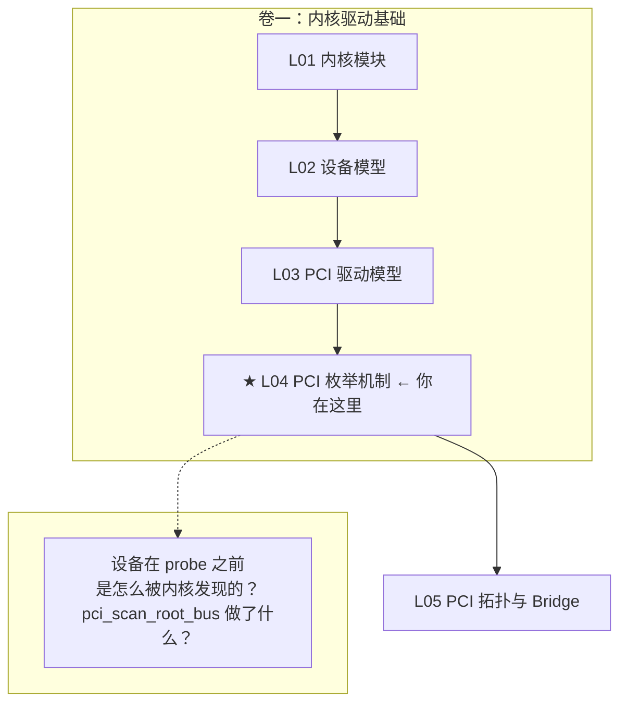

# L04：PCI 枚举机制

---

## 0. 框架定位



---


---

## 1. 问题驱动

> 🔍 **你遇到了一个问题：**
>
> 新来的 GPU 插到主板上，Linux 启动后 `lspci` 里找不到它。
BIOS/UEFI 能看到吗？内核是怎么发现 PCI 设备的？
枚举顺序是什么？如果一根 PCIe 链路没训练好，枚举会卡在哪一步？
>
> **带着这个问题学完本节，你就知道答案了。**

---

## 2. 前置认知


**前置依赖**：L01~L03。你已理解模块加载、设备模型、`pci_driver` 注册。

**枚举的意义**：L03 讲了驱动注册后内核遍历设备链表匹配。但设备链表里的 `struct pci_dev` 是怎么来的？——枚举。内核启动时扫描 PCI 总线，发现每个槽位上的设备，读取其配置空间，创建 `struct pci_dev`。

**LTSSM 极简概览**（枚举的前提）：在枚举发生之前，每个 PCIe 链路的物理层必须完成链路训练（LTSSM），状态达到 L0（Link Active）。训练流程：Detect（检测对端）→ Polling（同步位时钟）→ Configuration（确定链路宽度和速率）→ L0。如果链路停在 Detect 或 Polling 状态，`pci_scan_device()` 读 Vendor ID 返回 `0xFFFF`，设备不存在。链路训练细节见 L32。

---

## 3. 核心原理

### 2.1 谁先谁后：BIOS vs 内核

x86 服务器的 PCI 枚举是**两阶段**的：

| 阶段 | 执行者 | 做什么 |
|------|--------|--------|
| 固件枚举 | BIOS/UEFI | 分配总线号、分配 BAR 地址、写配置空间 BAR 寄存器、分配中断路由 |
| 内核枚举 | Linux PCI 子系统 | 重新发现设备、验证资源、可选重分配、创建 `struct pci_dev` |

**关键矛盾**：为什么内核要重新枚举一遍，不是 BIOS 已经做过了吗？答案：BIOS 的枚举是"够启动操作系统"级别的，质量参差不齐。服务器 BIOS 通常正确，但消费级主板可能漏设备、漏资源。内核重枚举做三件事：验证（设备还存在吗）、补齐（漏掉的 device）、可选重分配（BIOS 给的地址不合理则重新分配）。

### 2.2 枚举的起点：从 Root Complex 出发

x86 上的枚举起点不是单一的 `pci_scan_root_bus()`，而是 ACPI 告诉内核"有几个 host bridge，各自的 ECAM 基址是多少"。每个 host bridge 对应一个 PCI segment（域），segment 内从 bus 0 开始。

```
ACPI MCFG 表:
  Segment 0: ECAM base 0xE0000000, start bus 0, end bus 255
  Segment 1: ECAM base 0xE2000000, start bus 0, end bus 255  (多 socket)

内核对每个 segment:
  pci_scan_root_bus_bridge(bridge)
    └─> pci_scan_child_bus(bus)
          └─> 扫描 bus 0 上的每个 slot
                └─> 每个 slot → pci_scan_slot()
                      └─> 每个 function → pci_scan_device()
                            └─> 读 VID/DID
                            └─> pci_setup_device()
                                  └─> 读 BAR / IRQ / capabilities
```

---

## 4. 内核源码带读

> 本节追踪 PCI 枚举的完整链路：`pci_scan_child_bus_extend()` → `pci_scan_slot()` → `pci_scan_single_device()` → `pci_scan_device()` → `pci_setup_device()`。每层标注主流程、异常分支、⚠ 注意点。所有源码基于 x86_64 v7.0。

---

### 3.1 入口：`pci_scan_child_bus_extend()` —— 扫描一条总线上的所有设备

> 源码：`drivers/pci/probe.c:3087`

```c
static unsigned int pci_scan_child_bus_extend(struct pci_bus *bus,
                                              unsigned int available_buses)
{
    unsigned int max = bus->busn_res.start;  // 起始 bus 号
    struct pci_dev *dev;

    // == 第一步 ★：扫描 32 个 slot ==
    for (devnr = 0; devnr < PCI_MAX_NR_DEVS; devnr++)  // PCI_MAX_NR_DEVS = 32
        pci_scan_slot(bus, PCI_DEVFN(devnr, 0));
    // ⚠ PCI_DEVFN(devnr, 0) = (devnr << 3) | 0 = device << 3
    //    只传 function 0，pci_scan_slot() 内部会处理 Multi-Function

    // == 第二步：预留 SR-IOV bus ==
    used_buses = pci_iov_bus_range(bus);
    max += used_buses;
    // ⚠ SR-IOV 的 PF 需要额外 bus 号给 VF。内核在枚举 PF 时预留。

    // == 第三步：架构相关 fixup ==
    if (!bus->is_added) {
        pcibios_fixup_bus(bus);  // x86: 通常为空，某些 BIOS 需要 quirk
        bus->is_added = 1;
    }

    // == 第四步：两轮 bridge 扫描 ★ ==
    // 第一轮：扫描 BIOS 已配置的 bridge（不改动）
    for_each_pci_bridge(dev, bus) {
        cmax = max;
        max = pci_scan_bridge_extend(bus, dev, max, 0, 0);
        used_buses++;  // 每个 bridge 至少占一条 bus
    }

    // 第二轮：扫描需要重配置的 bridge
    for_each_pci_bridge(dev, bus) {
        if (!hotplug_bridges && normal_bridges == 1) {
            buses = available_buses;  // 唯一 bridge → 全给它
        } else if (dev->is_hotplug_bridge) {
            buses = available_buses / hotplug_bridges;  // 均分
        }
        max = pci_scan_bridge_extend(bus, dev, cmax, buses, 1);
    }
    // ⚠ 两轮扫描的原因：第一轮不改变 BIOS 分配的 bus 号（避免冲突）
    //    第二轮重新分配（热插拔 bridge 需要额外 bus 号给未来插入设备）

    return max;  // 返回当前子树最大 bus 号
}
```

**⚠ 异常注意点**：
- **bus 号用完**：PCIe 最多 256 条 bus。如果 `max > bus->busn_res.end` → bridge 被跳过 → 下游设备不可见。症状：`lspci` 看不到深层设备。排查：`dmesg | grep "No bus number available"`
- **`pcibios_fixup_bus` 在 x86 上几乎为空**——x86 用 ACPI MCFG 表管理 ECAM，不需要 arch fixup。这和你做验证的 x86 服务器直接相关

---

### 3.2 `pci_scan_slot()` —— 单槽位的 Multi-Function 处理

> 源码：`drivers/pci/probe.c:2861`

```c
int pci_scan_slot(struct pci_bus *bus, int devfn)
{
    struct pci_dev *dev;
    int fn = 0, nr = 0;

    // == ① 快速退出：非 PCIe 总线且已扫描过 ==
    if (only_one_child(bus) && (devfn > 0))
        return 0;  // 单个设备的传统 PCI 总线：第一个 slot 就是全部

    do {
        // == ② ★ 扫描当前 function ===
        dev = pci_scan_single_device(bus, devfn + fn);
        if (dev) {
            if (!pci_dev_is_added(dev))
                nr++;               // 新发现的设备计数
            if (fn > 0)
                dev->multifunction = 1;  // 标记：这是个多功能设备
        } else if (fn == 0) {
            // == ③ ★★★ 关键异常：function 0 不存在 → 跳过整个 slot ==
            if (!hypervisor_isolated_pci_functions())
                break;
            // ⚠ function 0 是 PCI 规范要求的"存在性标志"。
            //    如果 fn 0 不存在 → 整个 slot 为空 → 停止扫描。
            //    例外：hypervisor_isolated_pci_functions() 返回 true 时
            //    （如 Xen 透传单个 function），继续扫描 fn 1~7。
        }

        // == ④ 下一个 function ==
        fn = next_fn(bus, dev, fn);
        // ⚠ next_fn() 逻辑：
        //    - fn == 0 && dev->multifunction → fn = 1（扫 fn1~7）
        //    - fn == 0 && !multifunction → fn = -1（停止）
        //    - fn > 0 && fn < 7 → fn++
        //    - fn >= 7 → fn = -1（最多 8 个 function）

    } while (fn >= 0);

    // == ⑤ 初始化 ASPM 电源管理 ==
    if (bus->self && nr)
        pcie_aspm_init_link_state(bus->self);

    return nr;
}
```

**⚠ 异常路径**：
- **function 0 不存在**：`pci_scan_single_device()` 返回 NULL → `fn == 0` → `break`。如果硬件有 bug（fn0 的 VID 返回 0xFFFF 但供电正常），整个多功能设备被漏掉。修复：`DECLARE_PCI_FIXUP_HEADER` quirk
- **hdr_type bit 7 = 0 但设备实际是 multifunction**：`next_fn()` 在 fn==0 时不设置 multifunction 标志 → 只扫 fn0 → fn1~7 被跳过。这是 bring-up 常见 bug

---

### 3.3 `pci_scan_single_device()` → `pci_scan_device()` —— 创建单个设备

> 源码：`probe.c:2783` + `probe.c:2602`

```c
// pci_scan_single_device: 封装——先 scan 再 add
struct pci_dev *pci_scan_single_device(struct pci_bus *bus, int devfn)
{
    dev = pci_scan_device(bus, devfn);
    if (!dev) return NULL;
    pci_device_add(dev, bus);  // → device_add() → bus_probe_device() → match+probe
    return dev;
}

// pci_scan_device: 核心——读 VID/DID + setup
static struct pci_dev *pci_scan_device(struct pci_bus *bus, int devfn)
{
    u32 l;

    // == ① ★★★ 读 Vendor ID + 设备存在性检测 ===
    if (!pci_bus_read_dev_vendor_id(bus, devfn, &l, 60 * 1000))
        return NULL;
    // ⚠ 超时 60ms。读不到 → NULL。
    //    VID=0xFFFF 或 ECAM 读超时（设备未完成 LTSSM 训练）→ 这里返回 NULL

    // == ② 分配 struct pci_dev ==
    dev = pci_alloc_dev(bus);
    if (!dev) return NULL;  // ⚠ -ENOMEM
    dev->devfn = devfn;
    dev->vendor = l & 0xffff;
    dev->device = (l >> 16) & 0xffff;

    // == ③ ★★★ 填充设备所有信息 ===
    if (pci_setup_device(dev)) {
        pci_bus_put(dev->bus);
        kfree(dev);
        return NULL;
        // ⚠ setup 失败 → 设备被释放 → 槽位视为空
    }
    return dev;
}
```

**⚠ Bring-up 关键排查点**：
- **`pci_bus_read_dev_vendor_id` 超时**：设备 PERST# 复位未释放/未完成 → 芯片还在复位中 → VID 读返回全 1 → 60ms 超时 → 重试若干次 → 放弃。**你的 FPGA 板 bring-up 第一步就是查 PERST# 时序。**
- **`pci_setup_device` 失败**：配置空间头部损坏（corrupt）、BAR 编程异常、capability 链表损坏 → 设备分配失败。

---

### 3.4 `pci_setup_device()` —— 填充 pci_dev 的全部字段

> 源码：`probe.c:2021`。这是枚举中最长的函数之一。

```c
int pci_setup_device(struct pci_dev *dev)
{
    // == ① 读 header type + class code ==
    pci_read_config_byte(dev, PCI_HEADER_TYPE, &hdr_type);
    dev->hdr_type = hdr_type & 0x7f;       // bit 0~6 = type
    dev->multifunction = !!(hdr_type & 0x80);  // bit 7 = multifunction

    pci_read_config_dword(dev, PCI_CLASS_REVISION, &class);
    dev->class = class >> 8;           // 高 24 位 = class code
    dev->revision = class & 0xff;      // 低 8 位 = revision ID

    // == ② ★ 读 6 个 BAR + ROM BAR ==
    pci_read_bases(dev, 6, PCI_ROM_ADDRESS);
    // → __pci_read_base() × 6（每个 BAR 测试大小）
    // → ignore BAR0 之后继续读 BAR1/2/3... 不会因为一个 BAR 失败而中止

    // == ③ 读中断线 + 中断引脚 ==
    pci_read_irq(dev);
    // 从 config space 读 Interrupt Pin (0x3D) + Interrupt Line (0x3C)
    // ⚠ VF 不能使用 INTx → pci_read_irq() 直接设 dev->pin = 0

    // == ④ ★★★ 初始化所有 Capability 结构 ===
    pci_init_capabilities(dev);
    // 按顺序初始化：EA → MSI → MSI-X → PM → VPD → ARI → IOV
    //                → ATS → PRI → PASID → ACS → PTM → AER → DPC
    //                → RCEC → DOE → TPH → ReBAR → Dev3 → IDE
    // ⚠ 每个 init 函数独立：一个失败不影响后续

    // == ⑤ 报告链路降级 ==
    pcie_report_downtraining(dev);
    // ⚠ 打印：设备链路宽度/速率是否低于硬件能力
    //    例: "PCIe x8 but capable of x16" → 排查转接卡/背板

    // == ⑥ 初始化复位方法 ==
    pci_init_reset_methods(dev);
    // FLR / PM reset / Secondary Bus Reset 的可用性检测

    return 0;
}
```

**⚠ `pci_init_capabilities()` 异常处理**：每个 cap init 函数内部都有 `if (!pci_find_capability/dev/ext_cap) return`——能力不存在就静默跳过。但如果 cap 存在但结构损坏（如 AER cap 的 next pointer 指向非法地址），后续 cap 也会被跳过。**Bring-up 排查：`lspci -vv` 的 Capabilities 列表是否完整。**

---

### 3.5 枚举完成后的注册：`pci_device_add()` → 触发 probe

```c
void pci_device_add(struct pci_dev *dev, struct pci_bus *bus)
{
    device_initialize(&dev->dev);     // 初始化 struct device
    dev->dev.release = pci_release_dev;
    dev->dev.bus = &pci_bus_type;     // ★ 绑定到 PCI bus type

    pci_configure_device(dev);       // x86: 最终配置（ACPI _DSM 等）
    device_add(&dev->dev);           // ★ 触发 driver core → probe
}
```

**⚠ 关键**：`device_add()` 调用后，L03 讲的整个 probe 链被触发。枚举和 probe 之间**没有延时**——设备被发现的那一刻，驱动就有可能被调用。如果此时设备还没准备好（复位未完成、固件还在加载）→ probe 失败 → `-EPROBE_DEFER`？不——枚举是同步的，只有驱动主动返回 `-EPROBE_DEFER` 才会有延迟重启。

---

### 3.6 错误汇总：枚举失败的 5 种原因

| # | 失败点 | 症状 | 根因 | 排查 |
|---|--------|------|------|------|
| 1 | `pci_bus_read_dev_vendor_id` 超时 | 设备不在 lspci 中 | PERST# 未释放 / LTSSM 训练失败 / 时钟未稳定 | 示波器量 PERST# + 读 LTSSM 状态 |
| 2 | VID = 0xFFFF | 同上 | 链路训练完成但配置读返回全 1（设备不响应） | 检查设备 refclk + lane polarity |
| 3 | `pci_setup_device` 失败 | 同上 | 配置空间损坏、BAR 编程异常 | `setpci -s BDF` 手动读配置空间 |
| 4 | bus 号用完 | 深层设备消失 | Bridge subordinate 号不够 | `lspci -t` 看拓扑，dmesg grep bus |
| 5 | Multifunction bit 错误 | fn0 有 fn1 无 | hdr_type bit7 未设 | quirk 修复 |
## 5. x86 关联

x86 上枚举使用 ECAM（Enhanced Configuration Access Mechanism）。从 MCFG ACPI 表获取每个 segment 的 ECAM 物理基址，`ioremap` 到内核虚拟地址空间。后续每个配置空间读就是一次 `ioread32(ecam_virt + BDF_offset + reg_offset)`。

传统 CF8/CFC 端口方式（`outl(bdf, 0xCF8); inl(0xCFC)`）在 x86 上仍存在但已退化——只在 MCFG 不可用时使用。CF8/CFC 有全局锁（`pci_lock`），多 CPU 并发读取会串行化，而 ECAM 是无锁的 MMIO 访问，性能高一个数量级。

**MCFG 的坑**：某些 BIOS 的 MCFG 表不完整，end bus 设置为 0——意味着"不支持 ECAM"。内核检测到这个情况会回退到 CF8/CFC。L26 展开。

---

## 6. GPU 关联

GPU 枚举的典型路径：
```
pci_scan_root_bus_bridge()
  └─> bus 0 → Root Port
        └─> bus 0x17 → Switch Downstream Port
              └─> bus 0x17, dev 0, fn 0:
                    pci_scan_device() → VID=0x10DE, DID=0x2684
                    pci_setup_device() → 读 BAR0=256MB（framebuffer）
                                         BAR1=16MB（寄存器）
                                         BAR3=32MB（ROM）
                    Multi-Function → fn 1: HDA Audio
                    pci_device_add() → driver_attach() → nvidia_probe()
```

---

## 7. 思考题

1. `pci_scan_device()` 怎么判断一个槽位是空的？读到的值是多少？这个值在 PCIe spec 中怎么定义的？
2. Multi-Function Device 的 function 0 的 Header Type 中哪个 bit 指示它是个多功能设备？如果这个 bit 错了（硬件 bug），内核会少枚举设备吗？怎么用 quirks 修复？
3. 内核为什么注释掉 `pci_read_bases()` 中的 `pci_read_bases(dev, 2, PCI_ROM_ADDRESS1)`（即 Type 1 的 BAR 只读前 2 个）？Bridge 有几个 BAR？
4. `pci_setup_device()` 中 `pci_read_irq(dev)` 读的是配置空间的哪个偏移？x86 上这个值是谁写的？
5. 枚举时如果 BIOS 给了错误的 BAR 地址（比如两个设备分配到重叠的地址空间），内核在哪个阶段检测冲突？`pci_setup_device()` 里会检测吗？
6. `pci_scan_child_bus()` 检测到 bus 上有 Bridge（Type 1 header），接下来会做什么？递归深度如何控制？

---

## 6b. 参考答案

**Q1**：读 Vendor ID（偏移 0x00 的低 16 位）。`pci_bus_read_dev_vendor_id()` 用 `pci_bus_read_config_dword(bus, devfn, PCI_VENDOR_ID, &l)` 读 4 字节。如果读到的低 16 位 = `0xFFFF`，判定为空槽。PCIe spec 规定未实现设备的配置读必须返回全 1（1 是 idle 状态），所以 `0xFFFF` 不是"错误值"而是"不存在"的标准信号。但也可能是链路训练失败（设备在线但 Configuration Request TLP 得不到 Completion）——此时也是全 1 返回。区分方法是检查 LTSSM 状态。

**Q2**：Header Type 寄存器（偏移 0x0E）的 bit 7。读作 `(hdr_type & 0x80)`。如果 bit 7=1 但硬件有多功能、内核没扫描 fn 1~7 → 功能缺失。修复：在 `quirks.c` 中用 `DECLARE_PCI_FIXUP_HEADER` 强制设置 `dev->multifunction = 1`。

**Q3**：Type 1（Bridge）header 只有 2 个 BAR（BAR0/1），不像 Type 0（EP）有 6 个。内核根据 `hdr_type` 决定调用 `pci_read_bases()` 的次数。Bridge 的 BAR 是"窗口寄存器"——定义了下游总线的 MMIO/IO 地址范围。

**Q4**：`PCI_INTERRUPT_PIN`（偏移 0x3D）和 `PCI_INTERRUPT_LINE`（偏移 0x3C）。INTx# 引脚（1~4 = INTA#~INTD#）由硬件设计决定，Interrupt Line 由 BIOS 在枚举时写入——告诉 OS 这个 INTx# 映射到 I/O APIC 的哪个 input pin。

**Q5**：**不检测。** `pci_setup_device()` 只读取 BAR 内容（BIOS 写进去的值），不做冲突检测。冲突检测发生在后续 `pci_bus_assign_resources()`（L09）阶段。如果有冲突，`request_resource()` 失败 → 资源不被分配 → `ioremap` 失败 → probe 拿不到 MMIO → 返回 -ENOMEM。

**Q6**：`pci_scan_bridge_extend()` → 读取 bridge 的 primary/secondary/subordinate bus 寄存器 → 确定下游 bus 号 → 分配新的 bus 号（如果需要） → `pci_scan_child_bus(child)` 递归。递归深度由 bridge 层级控制——PCIe 最多 256 条 bus，但实际拓扑通常不超过 4~5 层深。

---

## 8. 渐进式代码构建

> 在 L03 的 `pci_probe_demo.ko` 基础上，probe 中打印更多枚举信息。

```c
// 在 L03 的 pci_demo_probe() 中追加
static int pci_demo_probe(struct pci_dev *dev, const struct pci_device_id *id)
{
    int i;
    pr_info("L04: Device %s [%04x:%04x] class=%06x irq=%d hdr_type=%02x\n",
            pci_name(dev), dev->vendor, dev->device,
            dev->class, dev->irq, dev->hdr_type);

    // ★ 打印 6 个 BAR 的原始信息
    for (i = 0; i < 6; i++) {
        unsigned long start = pci_resource_start(dev, i);
        unsigned long end   = pci_resource_end(dev, i);
        unsigned long flags = pci_resource_flags(dev, i);
        if (!start) continue;
        pr_info("  BAR%d: 0x%012lx-0x%012lx flags=0x%lx %s %s\n",
                i, start, end, flags,
                (flags & IORESOURCE_MEM) ? "MEM" : "IO",
                (flags & IORESOURCE_MEM_64) ? "64bit" : "32bit");
    }

    return 0;
}
```

**验证**：`insmod` 后 `dmesg` 看到每个 BAR 的物理地址范围。
