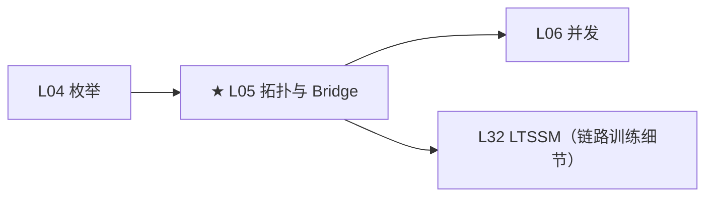

# L05：PCI 拓扑与 Bridge

---

## 0. 框架定位



---


---

## 1. 问题驱动

> 🔍 **你遇到了一个问题：**
>
> 你的 GPU 挂在 CPU 南桥后面的一颗 PCIe Switch 下面。
DMA 传输时，GPU 往地址 `0x1000_0000` 写数据，
但 CPU 在 `0x1000_0000` 读到的全是垃圾。
DMA 地址穿越 Bridge 时发生了什么？地址窗口怎么算？
>
> **带着这个问题学完本节，你就知道答案了。**

---

## 2. 前置认知


**前置**：L04 枚举——理解了 `pci_scan_device()` 发现单个设备。本文讲设备之间的层级关系。

**核心问题**：一个 x86 服务器有上百个 PCIe 设备，它们不是平铺在一条总线上的。Root Complex → Root Port → Switch → Endpoint 形成一棵树。内核如何管理这棵树？Bridge 如何传递资源？

---

## 3. 核心原理

### 2.1 总线编号规则

PCIe 拓扑中的每个 bus（链路）有唯一编号（0~255）。**Bus 0 总是在 Root Complex 内部。** Bridge 的下游总线获得新编号。

```
Root Complex (bus 0, internal)
  ├─ Root Port 1 (bus 0, dev 1) → 下游 bus 1
  │    └─ EP: NVMe (bus 1, dev 0)
  ├─ Root Port 2 (bus 0, dev 2) → 下游 bus 2
  │    └─ Switch
  │         ├─ 上游端口 (bus 2, dev 0)
  │         ├─ 下游端口 1 → bus 3
  │         │    └─ GPU (bus 3, dev 0)
  │         └─ 下游端口 2 → bus 4
  │              └─ NIC (bus 4, dev 0)
```

BDF 格式：`0000:03:00.0` = domain 0000, bus 03, device 00, function 0。

**Type 0 vs Type 1 配置头**：
- **Type 0**（Endpoint）：有 6 个 BAR，指向自己的 MMIO/IO 空间
- **Type 1**（Bridge）：只有 2 个 BAR，但有三组"窗口寄存器"：MMIO base/limit、Prefetchable MMIO base/limit、IO base/limit

这些窗口定义了"下游总线的地址空间范围"。Bridge 的 BAR 是它自己的寄存器，窗口是下游设备的"领地"。

### 2.2 Multi-Function + ARI

GPU 几乎都是 Multi-Function Device——Fn 0 是 VGA 控制器，Fn 1 是 HDA 音频。内核通过 Header Type bit 7 判断是否为多功能设备。

**ARI（Alternative Routing-ID）**：传统 BDF 中 Device Number 只有 5 bits（0~31），每个 slot 最多 8 个 function。ARI 将 Device Number 和 Function Number 合并为 8-bit Function Number（0~255），允许单个设备支持 256 个 function。SR-IOV 的 VF 大量依赖 ARI。

### 2.3 pcieport 驱动

每个 Root Port 和 Switch Port 在内核中被 `pcieport` 驱动接管（`drivers/pci/pcie/portdrv.c`）。这个驱动不操作设备本身，而是为每个端口注册子服务：AER、热插拔（pciehp）、PME、DPC 等。内核日志中的 `pcieport 0000:00:01.0: ...` 就是它。

---

## 4. 内核源码带读

> x86_64 v7.0。本节深入 Bridge 扫描 + ARI 的关键路径。

### 3.1 `pci_scan_bridge_extend()` —— Bridge 扫描 + bus 号分配

> 源码：`drivers/pci/probe.c:1400`，~200 行。两轮扫描的核心。

```c
static int pci_scan_bridge_extend(struct pci_bus *bus, struct pci_dev *dev, ...)
{
    // == ① 读 Bridge 的三个 bus 寄存器 ==
    pci_read_config_byte(dev, PCI_PRIMARY_BUS, &primary);
    pci_read_config_byte(dev, PCI_SECONDARY_BUS, &secondary);
    pci_read_config_byte(dev, PCI_SUBORDINATE_BUS, &subordinate);

    // == ② 如果 BIOS 没分配 → 内核分配 ==
    if (!secondary) {
        secondary = max + 1;  // 分配下一个可用 bus 号
    }

    // == ③ 如果 BIOS 分配的 bus 号冲突 → 重分配 ==
    if (pass == 1 || secondary > subordinate) {
        // pass=1: 第二轮的强制重分配
        // subordinate < secondary: BIOS 配置错误 → 纠正
        child = pci_scan_child_bus_extend(child, ...);
    }

    // == ④ 写回 bridge 的 bus 号寄存器 ==
    pci_write_config_byte(dev, PCI_SUBORDINATE_BUS, max);

    // == ⑤ 清除 Secondary Status 寄存器中的错误标志 ==
    pci_write_config_word(dev, PCI_SEC_STATUS, 0xffff);
    // ⚠ RWC（Read-Write-Clear）：写 1 清除。清除 Detected Parity Error、
    //    Received System Error、Signaled Target Abort 等标志
}
```

### 3.2 `next_fn()` —— Multi-Function 判断

```c
static int next_fn(struct pci_bus *bus, struct pci_dev *dev, int fn)
{
    if (dev && fn == 0 && dev->multifunction) {
        return 1;  // fn0 + multifunc → 扫 fn1~7
    }
    if (fn == 0) {
        return -1; // fn0 不是 multifunc → 停止
    }
    if (fn < 7)
        return fn + 1;  // 继续扫下一个 function
    return -1;
}
```

**⚠ ARI 场景**：ARI 激活时 `pci_ari_enabled(bus)` → `next_fn` 逻辑变化——遍历 256 个 function（0~255）。SR-IOV 的 VF 编号可以达到 200+，依赖 ARI。

### 3.3 x86 专属：`pcibios_fixup_bus()`

```c
// arch/x86/pci/common.c —— x86 上几乎为空
void pcibios_fixup_bus(struct pci_bus *bus) {
    // 大多数 x86 平台：什么都不做
    // 部分 BIOS 需要读 ACPI _BBN 方法确认 bus 号
}
```
**⚠** x86 用 ACPI MCFG 表管理 ECAM 地址，bus 发现机制由硬件 MMIO 保证，不需要 arch fixup 干预。这和 ARM（需要设备树解析 `ranges`）完全不同。
## 5. x86 关联

x86 服务器上的 PCIe 拓扑通常很深：双 socket → 每个 socket 一个 Root Complex → 多个 Root Port → 转接卡上还有 Switch → GPU。`lspci -t` 可以看到树形拓扑。NUMA 亲和性在 bridge 层级传播：Root Port 在 node X → 其下游所有设备默认也在 node X。

---

## 6. GPU 关联

GPU Multi-Func 示例：
```
03:00.0 VGA controller: NVIDIA AD102 [RTX 4090]
03:00.1 Audio device: NVIDIA AD102 HDA Controller
```
Fn 0 的 BAR0 是 framebuffer，BAR1 是寄存器。Fn 1 只有一个 BAR 用于 HDA。**验证时注意：拆分为 Multi-Func 是硬件设计决策，内核不自动合并两个 function 的资源。**

---

## 7. 思考题

1. Bridge 的 Primary/Secondary/Subordinate bus 三个寄存器各有什么含义？为什么需要 Subordinate？
2. Type 1 header 只有 2 个 BAR，但 bridge 怎么给下游设备提供 MMIO 空间？
3. ARI 解决了什么问题？为什么 SR-IOV 必须依赖 ARI？
4. `lspci -t` 看到的是什么数据结构？内核怎么维护 PCI 拓扑树？
5. 如果 BIOS 给 bridge 分配的 subordinate bus 编号太小（覆盖不完整），会发生什么？

---

## 6b. 参考答案

**Q1**：Primary = bridge 上游的 bus 号；Secondary = bridge 下游第一条 bus 的编号；Subordinate = 下游子树上**最大的** bus 号。需要 Subordinate 是因为路由 Configuration TLP 时，RC 看到目标 bus 在 [secondary, subordinate] 范围内 → 转发到该 bridge 下游。如果 Subordinate 太小，CFG TLP 被 bridge 丢弃 → 设备不可见。

**Q2**：通过窗口寄存器（MMIO base/limit、Prefetchable base/limit、IO base/limit）。这些不是 bridge 自己的 BAR，而是定义了"下游总线上所有设备的地址空间之和"的范围。内核在枚举时把窗口范围内的地址按需分配给下游设备的 BAR。

**Q3**：传统 BDF 中 Device Number 只有 5 bits（0~31），每个 slot 最多 8 个 function → 最多 256 个 function/slot。SR-IOV 单个 PF 可能需要数百个 VF，远超 8 个 function 的限制。ARI 把 Device+Function 合并为 8-bit Function Number → 每个 slot 可支持 256 个 function。

**Q4**：`lspci -t` 读取 sysfs 中的层级关系重建树。内核查 `struct pci_bus` 的 `parent` 指针 + `struct pci_dev` 的 `bus->self`（bridge 设备指针）。遍历从 bus 0 的 `pci_bus` 开始，对每个 bus 列出设备，对 bridge 设备递归其 `bus->self->subordinate`。

**Q5**：Subordinate 太小 → 下游部分 bus 号超出范围 → Bridge 不转发这些总线的 CFG TLP → 设备"消失"——不是不存在，是拓扑上不可达。症状：`lspci` 看不到深层设备。内核在 `pci_scan_bridge_extend()` 中会检测并尝试修复（重新编号）。

---

## 8. 渐进式代码构建

在 L04 的基础上，probe 中检测设备是否为 Bridge（Type 1）并读其 Secondary bus：

```c
// 追加到 L04 的 probe 函数中
if (dev->hdr_type == PCI_HEADER_TYPE_BRIDGE) {
    u8 sec, sub;
    pci_read_config_byte(dev, PCI_SECONDARY_BUS, &sec);
    pci_read_config_byte(dev, PCI_SUBORDINATE_BUS, &sub);
    pr_info("L05: Bridge → secondary=%02x subordinate=%02x\n", sec, sub);
}
```
