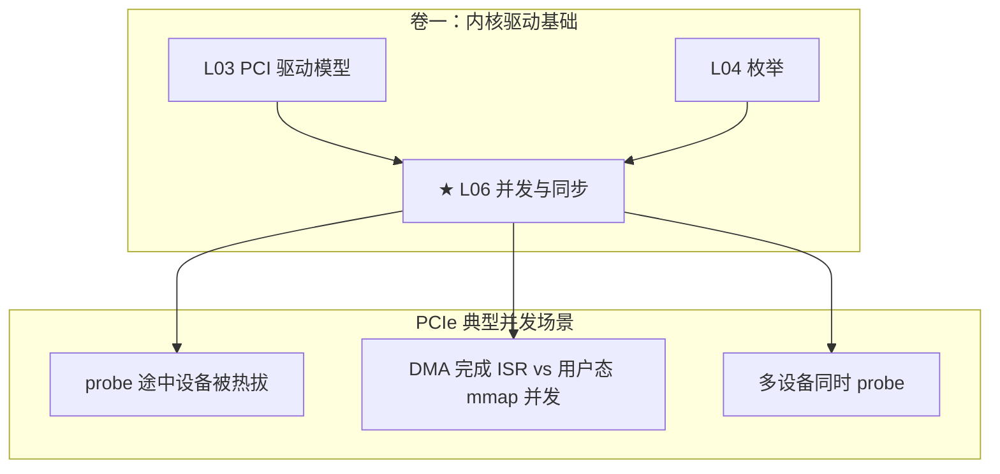

# L06：并发与同步

---

## 0. 框架定位



---


---

## 1. 问题驱动

> 🔍 **你遇到了一个问题：**
>
> 两个 CPU 线程同时写 GPU 的同一个 MMIO 寄存器：
线程 A 写 `0x01`，线程 B 写 `0x02`，
读回来却是 `0x03`——两个值"合"在一起了。
内核里怎么保护这种共享资源的并发访问？
>
> **带着这个问题学完本节，你就知道答案了。**

---

## 2. 前置认知


**前置**：L03 probe 生命周期、L04 枚举机制。

**核心问题**：PCIe 驱动不是在真空里跑的。中断可以在任意时刻到达，用户态可以同时 ioctl，设备可以热拔——所有这些和你 probe 代码**并发执行**。不懂并发控制 → 驱动 crash 到你怀疑人生。

---

## 3. 核心原理

### 2.1 spin_lock_irqsave：PCIe 驱动的标配

```c
spinlock_t my_lock;
unsigned long flags;

spin_lock_irqsave(&my_lock, flags);  // 关本地 CPU 中断 + 拿锁
// ... 临界区 ...
spin_unlock_irqrestore(&my_lock, flags);  // 放锁 + 恢复中断
```

**为什么必须用 `_irqsave` 而非裸 `spin_lock`？** 因为 PCIe 驱动的临界区可能被 ISR（中断服务例程）抢占。如果你的代码持有 `my_lock`，ISR 来了也拿同一把锁 → 死锁（同一 CPU 上 spin_lock 两次 → 永远等不到释放）。`_irqsave` 在拿锁前关掉本地中断，防止 ISR 抢占。

**x86 指令级**：`spin_lock` 的核心是 `lock cmpxchg`（原子 CAS），`spin_unlock` 是 `mov`（释放锁不需要原子操作）。`spin_lock_irqsave` 多一个 `pushfq; cli`（保存并清 EFLAGS.IF）。

### 2.2 RCU：只读热路径的最优解

PCI 子系统中大量使用 RCU：`pci_get_device()`、遍历设备链表。RCU 的核心保证：**reader 永不阻塞，writer 在 grace period 后释放旧数据。**

```c
// 读（无锁！）
rcu_read_lock();
dev = bus->p->klist_devices;  // 遍历链表
rcu_read_unlock();

// 写
spin_lock(&bus->p->mutex);
// 修改链表...
spin_unlock(&bus->p->mutex);
synchronize_rcu();  // 等所有 reader 退出 → 释放旧节点
```

### 2.3 memory barrier：DMA 的沉默杀手

```c
// 写 DMA 描述符 → 必须确保 CPU 写入先于设备读取
desc->addr = dma_addr;
desc->length = len;
wmb();             // ★ 写屏障：保证上面两行先于下一行
desc->ctrl = CTRL_GO;  // 设备看到这行 = 开始 DMA
```

**省略 `wmb()` 的后果**：CPU 可能乱序执行，`desc->ctrl = CTRL_GO` 比 `desc->addr = dma_addr` 先到达内存 → 设备看到 `CTRL_GO` 就启动 DMA，但 `dma_addr` 还是旧值 → DMA 写到错误地址。

**x86 指令**：`wmb()` → `sfence`（Store Fence），`rmb()` → `lfence`（Load Fence），`mb()` → `mfence`。

### 2.4 ★ PCIe 并发场景案例

**场景 1：probe 途中热拔**

```c
// CPU 0: probe 中                    // CPU 1: 用户拔出设备
spin_lock(&dev->lock);                 pciehp_isr() → remove()
// 读取设备寄存器                       spin_lock(&dev->lock); // 等 CPU 0
dev->state = INITIALIZED;              // ... 拿到锁 → set REMOVED
spin_unlock(&dev->lock);               spin_unlock(&dev->lock);
```

没有 `dev->lock` → CPU 0 读寄存器时设备已被 CPU 1 移除 → MMIO 读返回全 1（0xFFFFFFFF）→ 内核认为"设备已经准备好了"但实际上设备已不在 → 后续 DMA 写到空洞。

**场景 2：ISR vs 用户态 mmap**

```
ISR: DMA 完成，更新环形缓冲区                   用户态: mmap 读了环形缓冲区
  buf->tail = new_tail;                           idx = buf->tail;
  // 没有内存屏障                                  data = ring[idx];
                                                  // data 可能不是最新的！
```

必须使用 `smp_wmb()`（写屏障）+ `smp_rmb()`（读屏障）配对，保证 ISR 先写 tail、用户态后读 tail 的顺序。

**场景 3：同型号多设备同时 probe**

某型号 GPU 服务器有 8 张同款 GPU。`insmod` 驱动 → 8 个 probe 可能在不同 CPU 上并发执行。如果 probe 中用了全局变量（`static int instance_count`），必须用原子操作：`atomic_inc_return(&instance_count)`。

---

## 4. 内核源码带读

> x86_64 v7.0。锁机制 + x86 内存屏障的源码级解析。

### 3.1 `spin_lock_irqsave` 的 x86 指令级实现

```c
// include/linux/spinlock.h → arch/x86/include/asm/spinlock.h
static __always_inline void spin_lock_irqsave(spinlock_t *lock,
                                               unsigned long flags)
{
    // 等价于：
    //   local_irq_save(flags);     // pushfq + cli（关本地中断）
    //   raw_spin_lock(lock);       // lock cmpxchg（原子拿锁）
}
// ⚠ 顺序不能反：先关中断再拿锁
//    如果先拿锁 → ISR 来了也在等锁 → 死锁（L06 §2.1）
```

### 3.2 x86 内存屏障

| 屏障 | 指令 | 语义 | PCIe DMA 场景 |
|------|------|------|-------------|
| `wmb()` | `sfence` | 保证所有 store 先于屏障完成 | 写 DMA 描述符后、写 trigger 前 |
| `rmb()` | `lfence` | 保证所有 load 先于屏障完成 | 读 DMA 完成标志后、读数据前 |
| `mb()` | `mfence` | 全屏障——store + load | WC 区写后读 UC 寄存器确认 |
| `dma_wmb()` | `sfence` (x86) | DMA 写屏障 | 设备可见的 store 顺序 |
| `smp_wmb()` | `sfence` (x86 SMP) | SMP 屏障 | ISR ↔ 用户态 mmap 同步 |

**⚠ x86 TSO 的陷阱**：x86 是强序架构（TSO），但 Store-Load 可以被重排。所以：
- `wmb()` 保证 Store-Store 顺序 → 即使 x86 上通常不需要，PCIe DMA 描述符写入必须用
- WC 内存上连 Store-Store 也不保证 → `mfence()` 是唯一保证

### 3.3 RCU 在 PCI 子系统中的实例

```c
// drivers/pci/search.c: pci_get_subsys()
struct pci_dev *pci_get_subsys(unsigned int vendor, ...)
{
    rcu_read_lock();
    dev = pci_get_dev_by_id(&id, NULL);
    // → 遍历 pci_devices 全局链表（RCU 保护）
    if (dev)
        pci_dev_get(dev);  // kref 增加 → 安全使用
    rcu_read_unlock();
}
// ⚠ 为什么用 RCU 而非 rwlock？
//    lspci 等工具高频读设备链表——RCU reader 零开销
//    热插拔的写入操作用 synchronize_rcu() → grace period 后释放旧节点
```
## 5. x86 关联

x86 是强序架构（TSO），但即使如此：Store-Load 可以被重排。`mov [addr1], eax` 之后 `mov ebx, [addr2]`——第二行的读可能比第一行的写先完成（因为 store buffer 未 flush）。这就是为什么 DMA 描述符更新需要 `wmb()`：要求刷新 store buffer。

PAT/MTRR 也影响内存序——WC（Write-Combining）类型内存是完全弱序的，对 WC 区域的写入可以被 CPU 任意合并和重排。GPU 的 MMIO 寄存器通常映射为 UC（Uncacheable，强序），而 framebuffer 可能用 WC（弱序但高带宽）。**对 WC 区域写入后读寄存器，必须 `mfence()`。**

---

## 6. GPU 关联

GPU 驱动的并发场景是所有设备中最复杂的：
- **probe 中**：分配 DMA buffer、初始化 GPU 固件时，可能被 SMI（System Management Interrupt）打断
- **ISR 中**：GPU 每完成一帧渲染就发 MSI-X，ISR 更新 fence → 用户态 CUDA 应用可能在另一个 CPU 上 spin 等 fence
- **mmap**：CUDA `cudaMalloc` → `mmap` GPU BAR → CPU 和 GPU 同时访问同一页 → 需要显式的同步原语（semaphore/fence）
- **P2P DMA**（L40）：GPU 直接读 NVMe 的 BAR → 两个设备的驱动数据结构的并发保护

---

## 7. 思考题

1. `spin_lock_irqsave` 和裸 `spin_lock` 在什么场景下没区别？什么场景下一定会死锁？
2. PCIe probe 函数中，`pci_enable_device()` 内部有锁保护吗？如果两个不同驱动同时 probe 同一设备会发生什么？
3. x86 上写 WC（Write-Combining）内存后，需要什么指令保证后续读看到最新值？为什么？

---

## 6b. 参考答案

**Q1**：没区别：调用者已经关中断（如在 ISR 内）。死锁：你的线程持有锁 → 同一 CPU 上 ISR 触发 → ISR 尝试拿同一把锁 → `raw_spin_lock` 自旋等待自己释放 → 死锁（因为 ISR 不返回，锁永远不会被释放）。`_irqsave` 在拿锁前关中断防止此场景。

**Q2**：有。`pci_enable_device()` → `pci_enable_device_flags()` → 内部有 `dev->enable_cnt` 和 pci_bus 级锁。两个驱动 probe 同一设备在模型层不成立——`really_probe()` 先检查 `dev->driver` 是否已非空。但如果都在 `__driver_attach()` 里，第一个匹配的驱动先 probe，probe 成功 → `dev->driver` 被设 → 第二个的 match 虽然过了但 `really_probe` 会检查并跳过。

**Q3**：`mfence()` 或 `sfence` 不够——`sfence` 只刷 store buffer 但不阻止后续 load 越过之前的 store。正确序列是：`writel(val, wc_addr); mfence(); val = readl(uc_addr);`。mfence 保证所有之前的 store 全局可见后才执行后续的 load。GPU 驱动中 framebuffer（WC）写完后再读 GPU 寄存器（UC）确认状态的场景大量使用这种模式。

---

## 8. 渐进式代码构建

L03 的 probe 中添加自旋锁保护：

```c
// 驱动文件中新增
static DEFINE_SPINLOCK(dev_lock);

static int pci_demo_probe(struct pci_dev *dev, ...) {
    unsigned long flags;
    spin_lock_irqsave(&dev_lock, flags);
    // 临界区：操作全局链表或共享数据
    pr_info("L06: probe under spinlock on CPU%d\n", smp_processor_id());
    spin_unlock_irqrestore(&dev_lock, flags);
    return 0;
}
```
