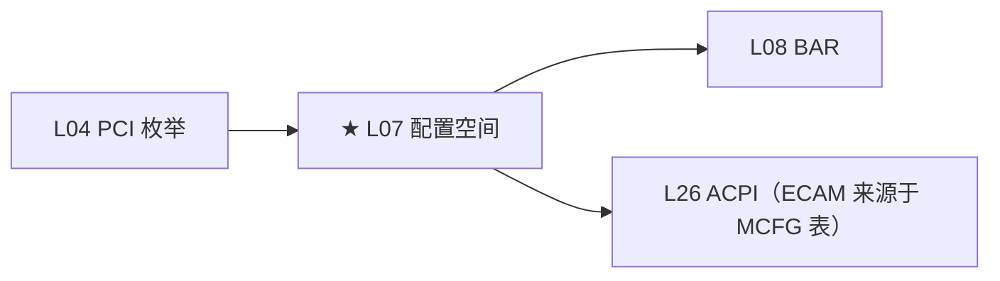
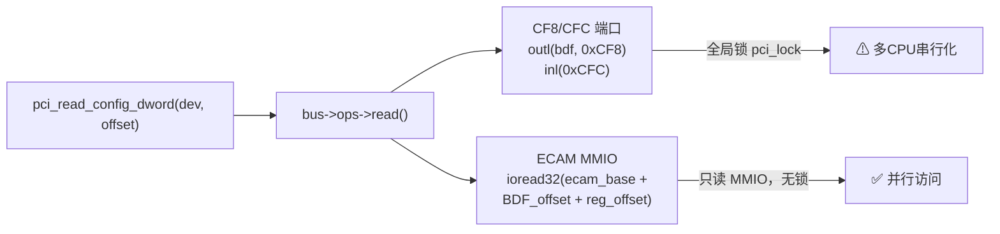

# L07：配置空间深度

---

## 0. 框架定位



---


---

## 1. 问题驱动

> 🔍 **你遇到了一个问题：**
>
> 你用 `setpci -s 01:00.0 CAP_ID=0x10` 读 GPU 的 Power Management Capability，
返回 `0xFF`。但 Vendor ID 和 Device ID 都读得出来。
配置空间的访问机制是怎么工作的？为什么有的寄存器能读有的不能？
>
> **带着这个问题学完本节，你就知道答案了。**

---

## 2. 前置认知


**前置**：L04 枚举——配置空间在枚举中被首次读取。本文把配置空间的每个字节讲清楚。

**核心问题**：`pci_read_config_dword()` 在内核中怎么实现的？ECAM 和传统 CF8/CFC 两条路径有什么差异？Extended Capability 空间里有哪些东西？

---

## 3. 核心原理

### 2.1 配置空间的两种访问方式



- **CF8/CFC**：PCI 时代的遗产。内核写 BDF+offset 到 0xCF8 端口，从 0xCFC 端口读数据。因为只有一个 0xCFC 端口，所有 CPU 必须用 `spin_lock(&pci_lock)` 串行访问。
- **ECAM（Enhanced Configuration Access Mechanism）**：PCIe 引入。BIOS 将每个 segment 的配置空间映射到一段 MMIO 物理地址（MCFG ACPI 表记录基址）。内核 `ioremap` 后，每个配置读就是一次 MMIO 读——无锁、并行。

### 2.2 Type 0 vs Type 1 Header

| 偏移 | Type 0（Endpoint） | Type 1（Bridge） |
|------|-------------------|-----------------|
| 0x00 | Vendor ID + Device ID | 同 |
| 0x08 | Class Code + Revision ID | 同 |
| 0x0C | Cache Line / Latency / Header Type / BIST | 同 |
| 0x10~0x24 | **BAR0~BAR5（6个，每个4或8字节）** | **BAR0~BAR1（2个）** |
| 0x30 | Expansion ROM Base | 同 |
| 0x34 | Capability Pointer | 同 |
| 0x3C | Interrupt Line / Interrupt Pin | 同 |
| 0x18~0x27 | — | **Primary/Secondary/Subordinate Bus + IO/MMIO Limit** |

Header Type 寄存器（0x0E offset）：bit 0~6 = 类型（0=EP, 1=Bridge），bit 7 = Multi-Function 标志。

### 2.3 Capability 链表

从 Header 的 Capability Pointer（0x34）开始，指向 cap 链表的第一个条目。每个条目格式：

```
Byte 0: Capability ID
Byte 1: Next Capability Pointer（指向下一个条目，0x00=结束）
Byte 2~N: Capability-specific data
```

遍历算法：读 pointer → 读 cap ID → 处理 → 读 next pointer → 循环，直到 pointer=0。

**PCI vs PCIe 能力区分**：
- 当 Capability ID = 0x10（PCI_EXT_CAP_ID_PCIE），进入 **Extended Capability** 空间
- 常规 cap 在 offset 0x40~0xFF（Type 0）范围，extended cap 从 offset 0x100 开始

### 2.4 Extended Capability 完整分类

> ⚠ **10 年专家必须能根据 ID 号反查 Cap 名称和用途。**

| ID | 名称 | 用途 |
|----|------|------|
| 0x0001 | AER | Advanced Error Reporting（L22） |
| 0x0002 | VC | Virtual Channel |
| 0x0003 | Device Serial Number | 唯一设备序列号 |
| 0x0004 | Power Budgeting | 功耗预算报告 |
| 0x0005 | RCLink Declaration | Root Complex Link 声明 |
| 0x0010 | SR-IOV | Single Root I/O Virtualization（L24） |
| 0x0011 | MR-IOV | Multi-Root IOV |
| 0x0015 | Resizable BAR | 可变大小 BAR（L08） |
| 0x0019 | TPH Requester | TLP Processing Hints（L13） |
| 0x001E | DOE | Data Object Exchange（安全认证） |
| 0x0025 | IDE | Integrity & Data Encryption（L30） |
| 0x0027 | PASID | Process Address Space ID（L25） |

---

## 4. 内核源码带读

> x86_64 v7.0。ECAM 地址计算 + capability 链表遍历。

### 3.1 `pci_ecam_map_bus()` —— x86 ECAM 地址计算

> 源码：`drivers/pci/ecam.c:167`

```c
void __iomem *pci_ecam_map_bus(struct pci_bus *bus, unsigned int devfn, int where)
{
    struct pci_config_window *cfg = bus->sysdata;
    unsigned int busn = bus->number;

    // ★ ECAM 地址公式：
    // addr = ECAM_BASE + (bus << 20) | (device << 15) | (function << 12) | reg_offset
    return cfg->winp + ((resource_size_t)busn << 20)
                      + ((resource_size_t)devfn << cfg->ops->bus_shift)
                      + where;
    // ⚠ bus_shift 通常是 12（意味着每个 device 有 4096 B = 4KB 配置空间）
    //    bus<<20 = 1MB per bus, devfn<<12 = 4KB per device
    //    x86 用 MCFG ACPI 表获取 cfg->winp
}
// EXPORT_SYMBOL_GPL
```

**⚠ 为什么用 EXPORT_SYMBOL_GPL？** ECAM 是 PCIe 的核心基础设施，任何使用它的代码都被视为内核的衍生作品——必须 GPL 兼容。

### 3.2 CF8/CFC 回退路径 + 全局锁

```c
// drivers/pci/access.c
int pci_bus_read_config_dword(struct pci_bus *bus, unsigned int devfn,
                               int where, u32 *val)
{
    if (bus->ops->read)
        return bus->ops->read(bus, devfn, where, 4, val);
    // ⚠ bus->ops = pci_ecam_ops → pci_ecam_read()
    //             或 pci_conf1_ops → 传统 CF8/CFC

    // CF8/CFC 路径（pci-legacy.c）：
    raw_spin_lock_irqsave(&pci_lock, flags);
    outl(PCI_CONF1_ADDRESS(bus->number, devfn, where), 0xCF8);
    *val = inl(0xCFC);
    raw_spin_unlock_irqrestore(&pci_lock, flags);
    // ⚠ 全局锁：所有 CPU 串行访问配置空间
    //    ECAM 无此限制——每个 function 独立 MMIO 地址
}
```

### 3.3 遍历扩展 Capability 链表

```c
// 内核实际用 pci_find_ext_capability()
int pci_find_ext_capability(struct pci_dev *dev, int cap)
{
    int pos = PCI_CFG_SPACE_SIZE;  // 从 0x100 开始
    u32 header;
    int ttl = 480;  // ★ 最大遍历 480 次——防止死循环

    while (ttl-- > 0 && pos >= PCI_CFG_SPACE_SIZE) {
        pci_read_config_dword(dev, pos, &header);
        if (PCI_EXT_CAP_ID(header) == cap)
            return pos;  // 找到
        pos = PCI_EXT_CAP_NEXT(header);  // 读 next pointer
    }
    return 0;
}
// ⚠ ttl = 480 = (4KB - 256B) / 4B → 最大 offset 0xFFC
//    防止损坏的链表导致死循环
```
## 5. x86 关联

CF8/CFC 在 x86 上通过 IO 端口 `0xCF8`（地址寄存器）和 `0xCFC`（数据寄存器）实现。`outl(bdf_addr, 0xCF8)` → `inl(0xCFC)`。全局锁 `raw_spin_lock_irqsave(&pci_lock)` 保护，因为只有一个 0xCFC 端口、多 CPU 不可重入。

ECAM 基址来自 ACPI MCFG 表（L26 展开），内核在 `pci_acpi_scan_root()` 中解析 MCFG → 获取 `ecam_base` 物理地址 → 在 arch init 时 `ioremap`。MCFG 表的坑：某些 BIOS 的 MCFG 分割成多段（如 [bus 0-128] 和 [bus 129-255] 有不同基址），内核需要支持分段 ECAM。

---

## 6. GPU 关联

GPU 的 extended cap 空间包含对验证至关重要的条目：
- **Resizable BAR**（ID 0x15）：GPU 可以用它向 OS 请求扩大 BAR 大小。AMD Smart Access Memory 的硬件基础。
- **ATS**（ID 0x0F）：GPU 通过 ATS 向 IOMMU 请求地址翻译（L25），实现 GPU 直接访问 CPU 页表。
- **PASID**（ID 0x27）：多进程 GPU 虚拟化——每个 CUDA context 有独立 PASID，IOMMU 据此隔离 DMA。
- **DOE**（ID 0x1E）：数据中心 GPU 的安全认证（SPDM over DOE）。

---

## 7. 思考题

1. `pci_read_config_dword(dev, 0x34)` 返回的 Capability Pointer 指向的地址范围是多少？为什么 Cap 链表只在 0x40~0xFF 之间？
2. Extended Capability 空间为什么从 0x100 开始？PCIe spec 规定的前 256 字节和 PCI 3.0 完全兼容——这意味着什么？
3. ECAM 地址公式中 `(bus << 20) | (device << 15) | (function << 12)` 意味着每个 function 获得多大配置空间？
4. 如果 MCFG 表缺失或损坏，内核怎么回退？回退后最大能访问多少条总线？

---

## 6b. 参考答案

**Q1**：Cap Pointer 是 1-byte 值，指向 0x40~0xFF（Type 0 header 中 reserved 区域之后的 cap 空间）。链表只在 0x40~0xFF 是因为前 64 字节是标准 PCI header，Cap Pointer 在 0x34，最低合法 cap 位置是 0x40（4-byte 对齐）。

**Q2**：前 256 字节与 PCI 3.0 完全兼容意味着老旧的 CF8/CFC 方式只能访问 256 字节。PCIe 用 ECAM 把每 function 扩展到 4KB，0x100 以上放 extended cap。兼容设计保证老 OS 也能读基本配置。

**Q3**：bus<<20 = 1MiB/bus，device<<15 = 32KiB/device，function<<12 = 4KiB/function。每个 function 获得 4KB 配置空间（前 256b 兼容区 + 后 3840b 扩展区）。

**Q4**：回退到 CF8/CFC 端口方式。CF8/CFC 使用 IO 端口——CF8 地址寄存器写入格式：bit 31=enable，bit 23:16=bus，bit 15:11=device，bit 10:8=function，bit 7:0=offset。Bus 字段只有 8-bit → 最多 256 条总线。CF8/CFC 只支持单 segment（domain 0）。

---

## 8. 渐进式代码构建

```c
// 在 probe 中遍历 capability 链表
u8 cap_ptr;
pci_read_config_byte(dev, PCI_CAPABILITY_LIST, &cap_ptr);
pr_info("L07: Capability list starting at 0x%02x\n", cap_ptr);

while (cap_ptr) {
    u8 cap_id;
    pci_read_config_byte(dev, cap_ptr, &cap_id);
    pr_info("  Cap ID=0x%02x at offset 0x%02x\n", cap_id, cap_ptr);
    pci_read_config_byte(dev, cap_ptr + 1, &cap_ptr);
}
```
