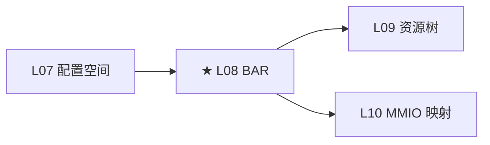

# L08：BAR 与地址空间

---

## 0. 框架定位



---


---

## 1. 问题驱动

> 🔍 **你遇到了一个问题：**
>
> GPU BAR0 在 `lspci -v` 里显示大小为 16MB，
但你 `mmap` 后只能访问前 4MB，超过就 Segmentation Fault。
BAR 的地址和大小是怎么确定的？内核怎么管理这些地址区间？
>
> **带着这个问题学完本节，你就知道答案了。**

---

## 2. 前置认知


**前置**：L04 枚举——`pci_setup_device()` 调用 `pci_read_bases()` 读取 BAR。本文深入 BAR 的位级解析。

**核心问题**：一个 32-bit 寄存器怎么编码 64-bit 地址？内核怎么区分 MEM 和 IO？`__pci_read_base()` 怎么探测 BAR 大小？

---

## 3. 核心原理

### 2.1 BAR 编码格式

BAR 是一个 32-bit 寄存器（BAR0~5 在 offset 0x10~0x27）。低 4 位是控制字段，高 28 位是地址/大小：

```
BAR 寄存器（32-bit）：
bit 0:   0 = Memory Space Indicator
         1 = IO Space Indicator

Memory BAR:
 bit 1~2: Type
   00 = 32-bit Memory (4GB 以内)
   10 = 64-bit Memory (两个连续 BAR 合并，占用 BAR[n] + BAR[n+1])
 bit 3:   Prefetchable (1 = yes)
 bit 4~31: Base Address（上 28 位，4KB 对齐）

IO BAR:
 bit 1:   Reserved
 bit 2~31: Base Address
```

**大小探测**：内核向 BAR 写全 1（`0xFFFFFFFF`），读回来。硬件把可写入的位返回 0（那些位对应 BAR 的实际大小）。例如写 `0xFFFFFFFF` → 读回 `0xFFF00000` → 低位 1 的个数表示大小 = `~0xFFF00000 + 1` = `0x00100000` = 1MB。

### 2.2 64-bit BAR

地址空间 > 4GB 的设备用两个连续 BAR 拼成 64-bit 地址。BAR[n] 存低 32 位，BAR[n+1] 存高 32 位。BAR[n+1] 被标记为"占位"（不参与常规的大小探测），内核通过 `IORESOURCE_MEM_64` 标志识别。

**GPU 场景**：RTX 4090 的 BAR1（framebuffer）通常为 256MB，用 64-bit BAR。BAR3（寄存器）16MB，用 32-bit BAR。

### 2.3 Prefetchable vs Non-Prefetchable

| 类型 | 读是否有副作用 | CPU 预取 | 典型用途 |
|------|-------------|---------|----------|
| Prefetchable MEM | 无副作用 | ✅ | Framebuffer、DMA buffer |
| Non-Prefetchable MEM | 有副作用（读寄存器改变状态） | ❌ | 设备控制寄存器 |
| IO Space | 有副作用 | ❌ | 传统 IO 端口（已淘汰） |

**写验证**：CPU 读 prefetchable 区域时，硬件可以预先读取额外的数据到 cache 中（提高吞吐）。但如果是寄存器映射——每次读都清一个状态位——预取会读到错误的状态。所以寄存器用 non-prefetchable。

### 2.4 Resizable BAR

标准 BAR 的大小在硬件设计时固定。Resizable BAR（ext cap ID 0x15）允许 OS 重新协商 BAR 大小——典型场景是 GPU 的 framebuffer 可以动态从 256MB 扩展到整个 VRAM（如 24GB）。

内核支持：`CONFIG_PCI_REALLOC_ENABLE_AUTO` + `pci_rebar_get_possible_sizes()` → 读取 REBAR capability 的 sizes 位图 → 选择新大小 → 写入 REBAR control 寄存器 → 触发硬件重新分配地址解码器。

---

## 4. 内核源码带读

> 本节逐行追踪 `__pci_read_base()` 的完整逻辑——主流程、异常分支、⚠ 注意点。x86_64 v7.0。

---

### 3.1 `pci_read_bases()` → `__pci_read_base()` 调用框架

> 源码：`drivers/pci/probe.c:325` + `probe.c:201`

```c
// pci_read_bases: 外壳——遍历 6 个 BAR + ROM BAR，调用 __pci_read_base
static __always_inline void pci_read_bases(struct pci_dev *dev,
                                           unsigned int howmany, int rom)
{
    for (i = 0; i < howmany; i++)
        pos += __pci_read_base(dev, pci_bar_unknown,
                               &dev->resource[i], pos, &sizes[i]);
    // ⚠ pos 随每次调用递增——32-bit BAR → +4, 64-bit BAR → +8
    //    BAR 序号（resource 数组索引）不跳：即使 BAR1 被 BAR0 占用，
    //    内核仍给 resource[1] 分配位置，但其中 flags=0
}
```

---

### 3.2 `__pci_read_base()` —— 完整逐行解读

> 源码：`probe.c:201`。这是 BAR 探测的核心，约 120 行。

```c
int __pci_read_base(struct pci_dev *dev, enum pci_bar_type type,
                    struct resource *res, unsigned int pos, u32 *sizes)
{
    u32 l = 0, sz;
    u64 l64, sz64, mask64;
    const char *res_name = pci_resource_name(dev, res - dev->resource);

    // == 步骤 1：读 BAR 原始值 + 探测值 ==
    res->name = pci_name(dev);
    pci_read_config_dword(dev, pos, &l);     // 读 BIOS 分配的原始地址
    sz = sizes[0];                            // 从 pci_read_bases 传入的探测值
    // ⚠ sizes[] 是 pci_read_bases() 在上一个循环中写入全 1 再读回得到的
    //    pci_read_bases 的调用链：
    //    pci_read_bases() → __pci_size_bars() 向 BAR 写全 1 读回 → 得到 sizes[]

    // == 步骤 2：异常值检测 ==
    if (PCI_POSSIBLE_ERROR(sz))
        sz = 0;
    // ⚠ PCI_POSSIBLE_ERROR(0xFFFFFFFF) = true
    //    全 1 → BAR 不存在或不工作

    if (PCI_POSSIBLE_ERROR(l))
        l = 0;
    // ⚠ 原始值全 1 → 可能是设备的 BAR 寄存器损坏

    // == 步骤 3：根据 BAR 类型解码 ==
    if (type == pci_bar_unknown) {
        res->flags = decode_bar(dev, l);
        // decode_bar() 用 PCI base address register 的位格式解码：
        //   bit 0: 0=MEM, 1=IO
        //   bit 1~2 (MEM): 00=32-bit, 10=64-bit
        //   bit 3 (MEM): Prefetchable
        res->flags |= IORESOURCE_SIZEALIGN;
        // ⚠ SIZEALIGN: BAR 大小必须对齐到自身大小（1MB BAR 必须对齐到 1MB 边界）

        if (res->flags & IORESOURCE_IO) {
            l64 = l & PCI_BASE_ADDRESS_IO_MASK;        // 低 2 位清零
            sz64 = sz & PCI_BASE_ADDRESS_IO_MASK;
            mask64 = PCI_BASE_ADDRESS_IO_MASK & (u32)IO_SPACE_LIMIT;
            // ⚠ x86 IO 空间限制为 64KB (IO_SPACE_LIMIT = 0xFFFF)
        } else {
            l64 = l & PCI_BASE_ADDRESS_MEM_MASK;       // 低 4 位清零
            sz64 = sz & PCI_BASE_ADDRESS_MEM_MASK;
            mask64 = (u32)PCI_BASE_ADDRESS_MEM_MASK;
        }
    }
    // ROM BAR 分支（略）

    // == 步骤 4：64-bit BAR 处理 ★ ==
    if (res->flags & IORESOURCE_MEM_64) {
        pci_read_config_dword(dev, pos + 4, &l);      // 读高 32 位
        sz = sizes[1];                                  // 高 32 位探测值

        l64 |= ((u64)l << 32);      // 拼 64 位地址
        sz64 |= ((u64)sz << 32);    // 拼 64 位大小
        mask64 |= ((u64)~0 << 32);  // 高 32 位全 1
        // ⚠ pos + 4 读取 BAR[n+1]——这个 BAR 被 64-bit BAR 占用
        //    下次循环会跳过它（pos += 8 而不是 4）
    }

    // == 步骤 5：计算 BAR 大小 ★ ==
    if (!sz64)
        goto fail;  // ⚠ BAR 大小为 0 → 未实现

    sz64 = pci_size(l64, sz64, mask64);
    // pci_size() = ~(maxbase & mask) + 1
    // 例：sz64 = 0xFFF00000 & 0xFFFFFFF0 = 0xFFF00000
    //      ~0xFFF00000 + 1 = 0x00100000 = 1MB

    if (!sz64) {
        pci_info(dev, FW_BUG "%s: invalid; can't size\n", res_name);
        goto fail;
        // ⚠ BAR 探测值异常——FF 读回后大小计算为 0
        //    标记为 FW_BUG——BIOS 可能没正确初始化
    }

    // == 步骤 6：64-bit BAR 的地址空间检查 ==
    if (res->flags & IORESOURCE_MEM_64) {
        // 检查 1：BAR 大于 4GB 但平台不支持
        if ((sizeof(pci_bus_addr_t) < 8 || sizeof(resource_size_t) < 8)
            && sz64 > 0x100000000ULL) {
            res->flags |= IORESOURCE_UNSET | IORESOURCE_DISABLED;
            resource_set_range(res, 0, 0);
            pci_err(dev, "can't handle BAR larger than 4GB (size %#010llx)\n", sz64);
            goto out;
            // ⚠ 32-bit 平台上 > 4GB 的 BAR → 禁用
            //    x86_64 不会触发——pci_bus_addr_t 和 resource_size_t 都是 64 位
        }

        // 检查 2：BAR 地址在 4GB 以上但平台不支持
        if ((sizeof(pci_bus_addr_t) < 8) && l) {
            res->flags |= IORESOURCE_UNSET;
            resource_set_range(res, 0, sz64);
            pci_info(dev, "can't handle BAR above 4GB (bus address %#010llx)\n", l64);
            goto out;
            // ⚠ 同上，x86_64 不触发
        }
    }

    // == 步骤 7：设置 resource 范围 ==
    region.start = l64;
    region.end = l64 + sz64 - 1;

    pcibios_bus_to_resource(dev->bus, res, &region);
    // ⚠ x86: 通常不做转换——bus address = CPU physical address
    //    ARM/PPC 等平台可能需要偏移转换

    // == 步骤 8：写入 sysfs 显示名 ==
    pci_write_display_name_for_resource(res, dev, res_name);

out:
    return (res->flags & IORESOURCE_MEM_64) ? pos + 8 : pos + 4;
    // ★ 返回下一个 BAR 的偏移

fail:
    res->flags = 0;  // ⚠ 标记资源无效
    goto out;
}
```

---

### 3.3 `pci_size()` —— BAR 大小计算的数学本质

> 源码：`probe.c:95`

```c
static u64 pci_size(u64 base, u64 maxbase, u64 mask)
{
    u64 size = mask & maxbase;  // 找出有效位
    if (!size) return 0;

    // ★ 核心：取 size 的二进制补码 = ~size + 1
    size = (size & ~(size - 1)) - 1;  // 等价于 ~size + 1
    return size + 1;
}
```

**实例**：64-bit BAR，写全 1 后读回 `0xFFFFFFFF_F0000000`
- `size = mask & maxbase` = `0xFFFFFFFF_FFFFFFF0 & 0xFFFFFFFF_F0000000` = `0xFFFFFFFF_F0000000`
- `size = (size & ~(size-1)) - 1` = `(0xFFF00000 & ~0xFFEFFFFF) - 1` = `0x00100000 - 1` = `0x000FFFFF`
- 返回 `0x000FFFFF + 1` = `0x00100000` = 1MB

**⚠ 为什么不能直接取 `~mask + 1`？** 因为 BAR 可能占不满 32/64 位。kernel 用 `mask & maxbase` 消除高位噪声，然后取反加一。

---

### 3.4 异常路径完整汇总

| 位置 | 检测条件 | 结果 | 对 probe 的影响 |
|------|---------|------|--------------|
| steps 1-2 | `PCI_POSSIBLE_ERROR(sz)` = true | sz=0 → 标记为 "未实现" | `pci_resource_len() == 0` → probe 跳过此 BAR |
| step 5 | `sz64 == 0` | `goto fail` → `res->flags = 0` | 同上 |
| step 5 | `pci_size()` 返回 0 | 打印 `FW_BUG` + `goto fail` | 同上 |
| step 6 | 64-bit BAR > 4GB 且平台 32-bit | `IORESOURCE_DISABLED` | `pci_resource_start() == 0` |
| step 6 | BAR 地址 > 4GB 且 `pci_bus_addr_t` 32-bit | `IORESOURCE_UNSET` | 标记为重分配——内核稍后尝试重新分配低地址 |

**⚠ x86_64 专属注意**：
- x86_64 上 `pci_bus_addr_t` = `u64`，步骤 6 的两次检查**永远不触发**
- x86_64 上 `pcibios_bus_to_resource()` 是空函数——bus address = physical address
- 这些路径只在编译 32-bit 内核或在 ARM 平台上激活
## 5. x86 关联

x86 上 IO BAR 已基本弃用——现代 PCIe 设备不使用 IO 空间（IO 空间只有 64KB，极其有限）。但如果遇到旧设备，IO BAR 映射到 x86 的 IO 端口空间（通过 `inl`/`outl` 指令访问）。`/proc/ioports` 可以看 IO 空间使用情况。

64-bit BAR 在 x86_64 上天然支持——地址空间 48-bit 物理地址，BAR 的 64-bit 值直接对应物理地址。但要注意 `dma_mask`：设备 DMA 引擎可能只支持 32-bit 或 40-bit 地址，即使 BAR 是 64-bit。

---

## 6. GPU 关联

GPU 的 BAR 布局（以 RTX 4090 为例）：

| BAR | 类型 | 大小 | 用途 |
|-----|------|------|------|
| BAR0 | 64-bit MEM, Prefetchable | 256MB~24GB（ReBAR） | Framebuffer + 显存映射 |
| BAR1 | 32-bit MEM, Non-Prefetchable | 16MB | MMIO 寄存器空间 |
| BAR3 | 32-bit MEM, Non-Prefetchable | 32MB | Video BIOS / ROM |

验证时关键检查：BAR0 的 prefetchable 标志是否正确设置（硬件实现的地址解码器支持预取吗）；64-bit BAR 的 two-step probing 两个 32-bit 读的值是否连续合理；ReBAR 的 `sizes` 位图是否与硬件能力匹配。

---

## 7. 思考题

1. `__pci_read_base()` 向 BAR 写全 1 然后读回来——这个操作本身安全吗？会不会触发设备误动作？
2. 64-bit BAR 占用两个连续的 32-bit BAR 寄存器。如果 BAR0 是 64-bit，BAR1 是什么状态？内核怎么处理？
3. Prefetchable BAR 允许 CPU 预取，但 DMA 写和 CPU 读可以并发。这会有什么 cache coherency 问题？
4. Resizable BAR 的 `pci_rebar_get_possible_sizes()` 返回什么格式的数据？

---

## 6b. 参考答案

**Q1**：安全。PCI spec 规定写 BAR 寄存器只影响地址解码器，不影响设备功能。BAR 测试期间设备不响应任何 MMIO 操作（BAR 被设为全 1 → 不在任何合法地址范围内 → 不会被路由）。但测试完成后必须恢复原值，否则设备在探测定完成后无法使用。

**Q2**：BAR1 被标记为"已被前一个 BAR 占用"。内核 `__pci_read_base()` 返回 `pos + 8`（64-bit BAR 占用 8 字节），跳到 BAR2。`pci_dev->resource[1]` 的 flags 为 0（未使用）。如果设备设计错误——BAR0 声明 64-bit 但 BAR1 也被单独实现了——内核不会正确处理。

**Q3**：CPU 预取可能导致 DMA 写之前的旧数据留在 CPU cache 中。CPU 读 prefetchable BAR → 硬件预取数据进 cache → DMA 写修改了实际内存 → CPU cache 中是旧值。解决方案：prefetchable BAR 的内存类型必须正确设置为 WC 或 WB，配合 DMA API 的 cache sync 操作。

**Q4**：位图格式——`sizes` 字段的每个 set bit 表示一个支持的 BAR 大小。例如 `sizes=0x14` → bit 2 and bit 4 set = 2^2=4MB and 2^4=16MB 支持。内核遍历 bit 找到最合适的。

---

## 8. 渐进式代码构建

```c
// 在 probe 中解析 BAR 大小（用 BAR 测试法）
for (i = 0; i < 6; i++) {
    unsigned long start = pci_resource_start(dev, i);
    unsigned long size = pci_resource_len(dev, i);
    unsigned long flags = pci_resource_flags(dev, i);
    if (!size) continue;
    pr_info("L08: BAR%d start=0x%012lx size=0x%lx %s %s %s\n", i,
        start, size,
        (flags & IORESOURCE_MEM) ? "MEM" : "IO",
        (flags & IORESOURCE_MEM_64) ? "64bit" : "",
        (flags & IORESOURCE_PREFETCH) ? "Prefetchable" : "");
}
```
