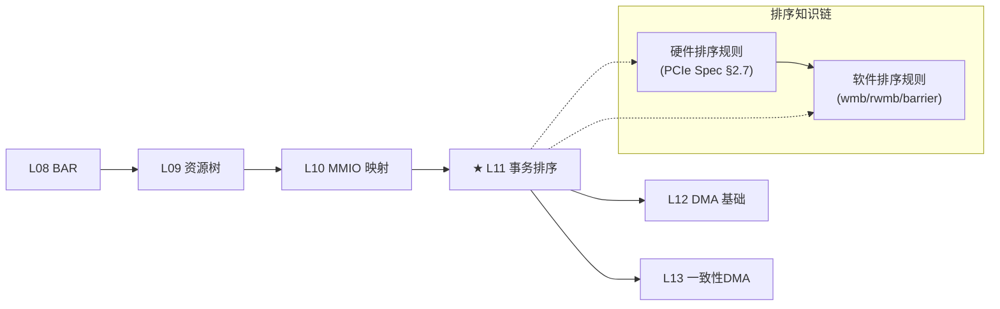

# L11：PCIe Transaction Ordering（事务排序规则）

## 0. 框架定位



**本篇定位**：在 MMIO 映射（L10）之后，深入 PCIe 事务排序规则——Posted 与 Non-Posted 事务的硬件排序约束、Relaxed Ordering 和 ID-Based Ordering 在 Linux 内核中的实现，以及 x86_64 上内存屏障如何配合 PCIe 排序规则工作。

> 📌 协议对照：本篇所有排序规则直接对应 PCIe Base Spec 6.0 §2.7（Transaction Ordering & 表 2-14~2-18）。

---


---

## 1. 问题驱动

> 🔍 **你遇到了一个问题：**
>
> 你写了 GPU 的 Doorbell 寄存器通知它开始处理任务：
`writel(1, doorbell);` 再 `writel(cmd_addr, cmd_q);`
GPU 收到了 doorbell，但读到的命令地址是**旧的**——两条写操作顺序反了。
PCIe 的事务排序规则到底是什么？为什么要有 Posted / Non-Posted 的区别？
>
> **带着这个问题学完本节，你就知道答案了。**

---

## 2. 前置认知


| 前置篇 | 关键知识 | 在本篇的用途 |
|--------|----------|-------------|
| L09 | PCIe 配置空间访问（ECAM） | 读取 Device Control 寄存器中的 Relaxed Ordering Enable 位 |
| L10 | MMIO 映射、ioremap 内存类型 | WC 弱序行为与 ioremap_wc 的排序语义 |
| L25（规划） | PCIe TLP 基础 | Posted/NP 事务的 TLP 格式差异 |

**首次引入概念**：
- **Posted Transaction**：无需 Completion 的 TLP（Memory Write、Message）。发送方发出后即认为完成，不再等待返回。
- **Non-Posted Transaction**：需要 Completion 的 TLP（Memory Read、Configuration Read/Write、I/O Read/Write）。发送方必须等待 Completion 返回。
- **Completion**：Non-Posted 事务的响应 TLP（CPL / CPLD），携带读数据或完成状态。

---

## 3. 核心原理

### 2.1 为什么需要排序规则？

PCIe 是一个**多对多拓扑**的互连网络（Switch 连接多个 EP）。当多个事务同时流经同一 Fabric 时，**如果没有排序规则约束，不同 EP 和设备看到的全局顺序可能不一致**，导致三类典型问题：

1. **内存一致性**：CPU 写 A → 写 B（顺序写），设备读到的 A 在 B 之后到达
2. **Completion 死锁**：Posted 事务阻塞了 Non-Posted 事务的通路
3. **Producer-Consumer 模型破坏**：设备写 status flag 在写 data 之前到达 CPU

PCIe Spec §2.7 定义了**严格的排序规则表**，规定各类事务之间的 Through / Pass / Don't-Pass 关系。

### 2.2 Posted vs Non-Posted: 根本分类

```
PCIe TLP
 │
 ├─ Posted Transaction ── Memory Write (MWr)
 │   └─ Message (Msg)
 │
 └─ Non-Posted Transaction ── Memory Read (MRd)
     ├─ Configuration Read (CfgRd)
     ├─ Configuration Write (CfgWr)
     ├─ I/O Read (IORd)
     ├─ I/O Write (IOWr)
     └─ AtomicOps (Atomic)
          └─ → 收到 Completion (Cpl/CplD)
```

**设计意图分析**：
- Memory Write 选 Posted 是因为**写是单向的**，不需要返回值。如果每次 MWr 都等 Completion，吞吐会掉一半以上。
- Memory Read 选 Non-Posted 是因为**读必须带返回数据**，必须等 Completion。
- **性能与安全的平衡**：Posted 让写操作绕过等待，但代价是**写不能保证在被读之前完成**——所以需要排序表约束。

### 2.3 PCIe 事务排序表（Transaction Ordering Table）

PCIe Spec 表 2-14（简化版）规定了**行事务能否越过列事务**：

| 行 ↓ 能否越过 列 → | Posted (PW) | Non-Posted (NPW→R) | Completion (Cpl) |
|:---|:---:|:---:|:---:|
| **Posted Write** | Y/N⁽¹⁾ | Y | Y |
| **Non-Posted Request** | N | N | N |
| **Completion** | Y | Y | Y/N⁽²⁾ |

> ⁽¹⁾ Posted Write 可以越过 Posted Write，除非两个 MWr 发往同一地址且 Relaxed Ordering 未启用。
> ⁽²⁾ Completion 可以越过 Completion，除非来自同一 Request 且 IDO 未启用。

**"越过"的含义**：后面的 TLP 在 Fabric 层面超越前面的 TLP，先到达目标。

**关键规则解读**：
1. **Posted Write 可以越过 Completion（PW → Cpl）**：写不会等读完成，这是性能关键设计
2. **Non-Posted Request 不能越过任何事（NPW → Any = N）**：读请求必须按序发送
3. **Completion 可以越过 Posted Write（Cpl → PW = Y）**：读返回可以比后续写先到家
4. **同一方向的 NP 读请求之间必须保序（NPW → NPW = N）**：软件看到读完成顺序与发出顺序一致

### 2.4 Relaxed Ordering（RO）

**定义**：Device Control 寄存器 bit 4（`PCI_EXP_DEVCTL_RELAX_EN`）启用后，设备在 TLP Header 中设置 **RO Attribute bit**（Attr[0] = 1），允许该 TLP 在 Fabric 中超越其他 TLP。

**设计意图**：
- 默认（RO=0）：**强排序**——写必须按序到达，读必须按序返回
- RO=1：允许 Fabric **优化路径**——后续的写可以超过前面的写，减少延迟
- **代价**：软件必须自己处理排序依赖（用 wmb/sfence 指导 CPU，或用读完成来 sync）

**RO 的影响范围**：

| 事务类型 | RO=0（默认） | RO=1 |
|---------|------------|------|
| MWr → MWr（不同地址） | 保序 | 可重排 |
| MWr → MWr（同一地址） | **始终保序**（不依赖 RO） | **始终保序** |
| Cpl → MWr | Cpl 可超 MWr | Cpl 可超 MWr |
| MWr（RO=1）→ MWr（RO=0） | N/A | RO=1 的写不可超 RO=0 的写 |

> ⚠ **重要**：同一地址的 MWr 始终保序——即使 RO 启用。这是 PCIe 规范强制的写原子性保证。

### 2.5 ID-Based Ordering（IDO）

**定义**：Device Control 2 寄存器（`PCI_EXP_DEVCTL2`）中的两个 bit：
- `PCI_EXP_DEVCTL2_IDO_REQ_EN` (bit 8)：允许来自不同 Requester ID 的 Request 之间重排
- `PCI_EXP_DEVCTL2_IDO_CMP_EN` (bit 9)：允许发往不同 Completer ID 的 Completion 之间重排

**设计意图**：
- 默认排序要求：**即使来自不同 Function 的 Request 也必须保序**
- IDO 启用后：来自不同 Requester ID 的 Request 可以互相越过——因为软件已经知道它们不相关
- **常见场景**：多队列网卡（每个 Queue 一个 Requester ID），IDO 允许不同队列的 DMA 写互相超越

> **对比 RO vs IDO**：
> - RO：位在 Device Control，影响单个 TLP 的 Attr 字段
> - IDO：位在 Device Control 2，影响基于 Requester ID 的分类

### 2.6 事务排序与 Completion 的 Attribute 要求

PCIe Spec r3.0 §2.2.9 强制要求：**Completion Header 的 Attribute 字段必须与对应 Request Header 的 Attribute 一致**——除非 IDO 启用。

违背此规则的不良设备可能导致：
- Completer 端：Malformed TLP 检测
- Requester 端：Unexpected Completion → 超时

---

## 4. 内核源码带读

> x86_64 v7.0。内核如何管理 Relaxed Ordering——配置、查询、禁用。

### 3.1 `pcie_relaxed_ordering_enabled()` — 查询 RO 状态

**文件**：`drivers/pci/probe.c:2337-2350`

```c
/**
 * pcie_relaxed_ordering_enabled - Probe for PCIe relaxed ordering enable
 * @dev: PCI device to query
 *
 * Returns true if the device has enabled relaxed ordering attribute.
 */
bool pcie_relaxed_ordering_enabled(struct pci_dev *dev)
{
    u16 v;

    pcie_capability_read_word(dev, PCI_EXP_DEVCTL, &v);   // ← 读 Device Control 寄存器

    return !!(v & PCI_EXP_DEVCTL_RELAX_EN);                // ← bit 4 检测
}
EXPORT_SYMBOL(pcie_relaxed_ordering_enabled);
```

**逐行分析**：

| 行号 | 代码 | 说明 |
|------|------|------|
| 2346 | `pcie_capability_read_word` | 通过 ECAM 或 CF8/CFC 读取 PCIe Capability 结构中的 Device Control 寄存器（offset 0x08，相对 PCIe Cap 基地址） |
| 2348 | `!!(v & 0x0010)` | bit 4 = `PCI_EXP_DEVCTL_RELAX_EN`（`include/uapi/linux/pci_regs.h:517`）。返回 true 表示设备已启用 Relaxed Ordering |

**⚠ 注意点**：
- 此函数供**驱动开发者**在发送 DMA 带 RO Attribute 之前调用——如果设备不支持 RO，驱动必须清除 TLP 的 RO Attr bit（`drivers/net/ethernet/mellanox/mlx5/core/en_common.c:45`、`drivers/infiniband/hw/bnxt_re/ib_verbs.c:164`）
- VF 的 `PCI_EXP_DEVCTL_RELAX_EN` 是 RsvdP（Reserved and Preserved），读取始终返回 0——所以 VF 驱动不应使用 RO

### 3.2 `pci_configure_relaxed_ordering()` — 自动配置 RO

**文件**：`drivers/pci/probe.c:2352-2376`

```c
static void pci_configure_relaxed_ordering(struct pci_dev *dev)
{
    struct pci_dev *root;

    /* PCI_EXP_DEVCTL_RELAX_EN is RsvdP in VFs */
    if (dev->is_virtfn)
        return;

    if (!pcie_relaxed_ordering_enabled(dev))
        return;

    /*
     * For now, we only deal with Relaxed Ordering issues with Root
     * Ports. Peer-to-Peer DMA is another can of worms.
     */
    root = pcie_find_root_port(dev);
    if (!root)
        return;

    if (root->dev_flags & PCI_DEV_FLAGS_NO_RELAXED_ORDERING) {
        pcie_capability_clear_word(dev, PCI_EXP_DEVCTL,
                          PCI_EXP_DEVCTL_RELAX_EN);
        pci_info(dev, "Relaxed Ordering disabled because "
                 "the Root Port didn't support it\n");
    }
}
```

**逐行分析**：

| 行号 | 代码 | 说明 |
|------|------|------|
| 2357-2358 | `is_virtfn` 检查 | VF 的 RELAX_EN 位是 RsvdP——SR-IOV VF 物理上无法控制 RO |
| 2360-2361 | 先查询当前状态 | 如果设备未启用 RO，无需处理 |
| **2367** | `pcie_find_root_port(dev)` | 遍历 `dev->parent` 链直到找到 `PCI_EXP_TYPE_ROOT_PORT`（`include/linux/pci.h:2657-2667`） |
| **2371** | 检查 Root Port 的 `dev_flags` | `PCI_DEV_FLAGS_NO_RELAXED_ORDERING`（`include/linux/pci.h:254`）= bit 11 |
| 2372-2373 | 清除设备的 RO Enable | 如果 Root Port 不支持 RO（因为 erratum），主动帮设备关掉 |
| 2374 | 日志打印 | dmesg 可见 "Relaxed Ordering disabled because the Root Port didn't support it" |

**== 异常路径 ==**

| 条件 | 行为 | 影响 |
|------|------|------|
| `dev->is_virtfn` | 直接返回 | VF 永远无法关 RO（因为没有 RO 位可操作） |
| 设备未启用 RO | 直接返回 | 无操作，设备已在"关"状态 |
| `pcie_find_root_port` 返回 NULL | 直接返回 | 非 PCIe 设备（如 PCI-X 桥）忽略 |
| Root Port 的 `dev_flags` 无 NO_RELAXED_ORDERING | 直接返回 | 设备保持 RO 启用状态 |

**调用位置**：`drivers/pci/probe.c:2461`，`pci_configure_device()` 在设备探测阶段依次调用：
```c
static void pci_configure_device(struct pci_dev *dev)
{
    pci_configure_mps(dev);          // Max Payload Size
    pci_configure_extended_tags(dev, NULL);
    pci_configure_relaxed_ordering(dev);  // ← 这里
    pci_configure_ltr(dev);
    pci_configure_aspm_l1ss(dev);
    pci_configure_eetlp_prefix(dev);
    pci_configure_serr(dev);
    pci_configure_rcb(dev);
    // ...
}
```

### 3.3 `PCI_DEV_FLAGS_NO_RELAXED_ORDERING` — Quirk 机制

**文件**：`drivers/pci/quirks.c:4538-4542`

当某批次硬件有 Relaxed Ordering erratum 时，内核通过 **PCI fixup 机制** 在探测阶段早期设置此标志：

```c
static void quirk_relaxedordering_disable(struct pci_dev *dev)
{
    dev->dev_flags |= PCI_DEV_FLAGS_NO_RELAXED_ORDERING;
    pci_info(dev, "Disable Relaxed Ordering Attributes "
             "to avoid PCIe Completion erratum\n");
}
```

然后通过 `DECLARE_PCI_FIXUP_CLASS_EARLY` 绑定到具体设备 ID：

```c
// Intel Xeon Broadwell/Haswell Root Ports — FC credit issue
DECLARE_PCI_FIXUP_CLASS_EARLY(PCI_VENDOR_ID_INTEL, 0x6f01,
    PCI_CLASS_NOT_DEFINED, 8, quirk_relaxedordering_disable);
// ... 共 30+ 个 Intel Root Port 设备 ID
```

**设计意图**：为什么不直接修改硬件配置，而是用 dev_flags + runtime 清除？
- `DECLARE_PCI_FIXUP_CLASS_EARLY` 在配置空间读取之后、设备驱动 probe 之前执行
- 此时设备的排序配置可能已在 BIOS 层面设好
- `pci_configure_relaxed_ordering()` 在 `pci_init_capabilities()` 链中执行，确保在驱动 probe 前将 RO 清除

### 3.4 `quirk_disable_root_port_attributes()` — Completion Attribute 兼容

**文件**：`drivers/pci/quirks.c:4645-4658`

某些非规范设备生成的 Completion 不复制 Request 的 Attribute 字段，而是填 0。解决方式是禁用上游 Root Port 的 RO 和 NoSnoop：

```c
static void quirk_disable_root_port_attributes(struct pci_dev *pdev)
{
    struct pci_dev *root_port = pcie_find_root_port(pdev);

    if (!root_port) {
        pci_warn(pdev, "PCIe Completion erratum may cause device errors\n");
        return;
    }

    pcie_capability_clear_word(root_port, PCI_EXP_DEVCTL,
                   PCI_EXP_DEVCTL_RELAX_EN |      // 关 RO
                   PCI_EXP_DEVCTL_NOSNOOP_EN);    // 关 No Snoop
}
```

**== 异常路径 ==**
| 条件 | dmesg 特征 | 排查法 |
|------|-----------|--------|
| 设备有 Completion Attribute erratum | "Disabling No Snoop/Relaxed Ordering Attributes" | `lspci -vvv` 查看 `DevCtl: Relaxed Ordering: Disabled` |
| 无法找到 Root Port | "PCIe Completion erratum may cause device errors" | 检查拓扑中是否存在非 PCIe 桥 |

### 3.5 与排序相关的 pci_dev 字段

**文件**：`include/linux/pci.h:254`、`include/linux/pci.h:511-512`

```c
// pci_dev_flags 枚举中的排序相关标志
PCI_DEV_FLAGS_NO_RELAXED_ORDERING = (__force pci_dev_flags_t) (1 << 11),
    // 不要向该设备发送带 Relaxed Ordering 的 TLP

// pci_dev 结构体中的 flag 字段
pci_dev_flags_t dev_flags;   // line 512
    // 位 11 = NO_RELAXED_ORDERING（上述）
```

> 📌 协议对照：`PCI_EXP_DEVCTL_RELAX_EN` → TLP Header Attr[0] bit（PCIe Base Spec §2.2.5.2）

---

## 5. x86 关联

### 4.1 x86 内存屏障指令与 PCIe 排序

在 x86_64 上，PCIe 排序规则要和 CPU 的**内存屏障指令**协同工作，才能保证软件层面的正确性。

```c
// arch/x86/include/asm/barrier.h:22-24
#define __wmb()    asm volatile("sfence" ::: "memory")
#define __rmb()    asm volatile("lfence" ::: "memory")
#define __mb()     asm volatile("mfence" ::: "memory")

// arch/x86/include/asm/barrier.h:50-51
#define __dma_wmb()    barrier()         // DMA 写屏障 = 编译屏障
#define __dma_rmb()    barrier()         // DMA 读屏障 = 编译屏障
```

**x86 特有行为分析**：

| 屏障 | 指令 | PCIe 排序意义 |
|------|------|-------------|
| `wmb()` | `sfence` | 强制所有 **Write Combined** 或 **Write-Back** 内存写入在 sfence 之后对其他观察者可见。在 PCIe 层面等价于：之前的 Memory Write TLP 必须在后续 Memory Write TLP 之前发出。 |
| `rmb()` | `lfence` | 强制所有读完成后才继续后续读。在 PCIe 层面等价于：读返回 Completion 必须按序处理。 |
| `dma_wmb()` | `barrier()` (编译器) | x86 的 DMA 写是**强烈序的**（Strongly-Ordered UC 内存），CPU 不会重排 UC 写入（`/sys/bus/pci/devices/.../resource` 默认 UC）。所以只需要编译屏障阻止编译器重排。 |
| `smp_wmb()` | `barrier()` 编译器 | SMP 场景 x86 的 Write-Back 内存默认是 **Write-Back + MESI 协议**，cache coherence 保证数据可见性，只需要编译屏障。 |

**⚠ x86_64 独有陷阱**：
- **`readl()` vs `readl_relaxed()`**：`readl()` 内部含 `__iormb()`（`dma_rmb()` 即 barrier），而 `readl_relaxed()` 不含任何屏障。在 PCIe 验证场景中，如果使用 `readl_relaxed()` 读 MMIO 寄存器，后续读可能在 CPU 层面被重排。
- **`writel()` vs `writel_relaxed()`**：`writel()` 在写之前加 `__iowmb()`（sfence 或 barrier），确保所有之前的 DMA 写入先完成。`writel_relaxed()` 无屏障——如果用 `writel_relaxed()` 触发 doorbell，前面的 DMA buffer 可能还没写完。

### 4.2 MMIO 写入的 x86 排序保证

x86 架构保证：**UC（Uncacheable）内存类型的写入不会被 CPU 重排**。因为：
- UC 访问不走 cache，直接发到总线
- CPU store buffer 中对 UC 地址的写必须以 FIFO 顺序提交

所以对 `ioremap()` 返回的 MMIO 地址（UC）进行 `writel()`：
```c
// UC 地址的写不重排 — x86 架构保证
writel(data, dev->mmio + DATA_REG);     // 写数据
writel(cmd, dev->mmio + CMD_REG);       // 写命令 → 按序到达
```

但对 `ioremap_wc()` 返回的 WC 地址：
```c
// WC 地址的写可能被 CPU 合并/重排 — 需要 sfence
writel(data, wc_mmio);                  // 可能在 store buffer 中
wmb();                                  // sfence: 刷 store buffer
writel(cmd, wc_mmio + TRIGGER);        // 按序到达
```

> 📌 协议对照：CPU 的 UC 写入 → PCIe Memory Write TLP，Posted Transaction。PCIe Switch 必须保持来自同一 Requester ID 且同一地址的 MWr 的原始顺序（PCIe Spec §2.7.1）。

### 4.3 `mmiowb()` 在旧内核中的角色

在 v7.0 之前（尤其是 4.x 时代），`mmiowb()` 用于某些非 x86 架构上有锁保护的 MMIO 写。**x86_64 上 `mmiowb()` 是空操作**（`include/asm-generic/io.h` 中的默认实现）。因为 x86 对 UC 区域的写入是强序的。

---

## 6. GPU 关联

### 5.1 GPU Doorbell 场景中的排序要求

GPU 驱动的典型 Doorbell 模式：

```
CPU 写 GPU →                    GPU DMA 读 →
┌─────────────────┐            ┌──────────────┐
│ 1. 写 Command   │  MWr(P,RO) │ GPU 处理命令  │
│    Buffer Data  │ ──────────→│ (DMA 从 HOST  │
│ 2. 写 Doorbell  │  MWr(P)    │  拉数据)     │
│    Register     │ ──────────→│              │
└─────────────────┘            └──────────────┘
```

**问题**：如果步骤 1 和 2 都是 PCIe Posted Write，且步骤 1 启用了 Relaxed Ordering，步骤 2 未启用（Doorbell 通常是 UC MMIO），根据排序表：**RO=1 的 MWr 不能越过 RO=0 的 MWr**——所以步骤 1 必须比步骤 2 先到达。这是安全的。

**但如果步骤 2 也是 WC 内存（`ioremap_wc()`）**：
```c
// GPU BAR0 — 256MB framebuffer, WC mapped
void __iomem *fb = ioremap_wc(bar0_phys, 256 * SZ_1M);
// GPU BAR2 — 16MB doorbell range, WC also
void __iomem *doorbell = ioremap_wc(bar2_phys, 16 * SZ_1M);

// 错误写法: wmb() 缺失
writel_relaxed(cmd_data, fb + 0x1000);      // WC 写 → store buffer
writel_relaxed(doorbell_val, doorbell);     // WC 写 → store buffer
// CPU 可能将 doorbell 写入在 cmd_data 之前提交到总线
```

**修复**：
```c
writel_relaxed(cmd_data, fb + 0x1000);
wmb();  // sfence — 刷 store buffer，保证顺序
writel_relaxed(doorbell_val, doorbell);
```

### 5.2 GPU Completion 与 RO erratum

GPU（如某些 AMD/NVIDIA GPU）作为 Completer，如果其完成 TLP 的 Attr 字段与 Request 不一致（PCIe spec §2.2.9 违例），会导致 Unexpected Completion。

内核通过 `quirk_disable_root_port_attributes()` 禁用 Root Port 的 RO 解决此问题（`drivers/pci/quirks.c:4645-4658`）。

### 5.3 验证场景：MMIO Write Ordering 测试

在 GPU bring-up 中，验证 MMIO write ordering 的典型代码：

```c
// 对同一地址连续写 + 读确认
writel(0xDEADBEEF, dev->mmio + TEST_REG);
readl(dev->mmio + TEST_REG);  // 利用 readl 的隐式屏障
writel(0xCAFEBABE, dev->mmio + TEST_REG);
```

如果设备返回 0xDEADBEEF 而非 0xCAFEBABE，说明：
1. 第一个 writel 在 PCIe 层面已被确认到达（Posted）
2. 但第二个 writel 尚未到达或尚未写穿

**排查方法**：在 `readl` 前后插入 `wmb()`，对比 `lspci -vvv` 中 `DevSta: UR'` 故障计数。

---

## 7. 思考题

1. **设计意图题**：PCIe 为什么把 Memory Write 设计为 Posted Transaction，而 Memory Read 设计为 Non-Posted？如果反过来（MWr 做 Non-Posted、MRd 做 Posted），会有什么后果？

2. **排查题**：你的 GPU 驱动出现 intermittent hang：执行 `writel(data, gpu_mmio + DATA); writel(cmd, gpu_mmio + DOORBELL)` 后，GPU 有时读到空命令。`ioremap()` 映射的 MMIO 区域是 UC 类型，理论上 x86 保证 UC 写不重排。可能的根因有哪些？怎么排查？

3. **代码实操题**：打开 `/home/kly/work/code/linux-source/drivers/pci/quirks.c` 找到 `quirk_disable_root_port_attributes()` 函数。如果有一个新设备（vendor=0x1234, device=0x5678）存在相同的 Completion Attribute erratum，需要为该设备增加 fixup。写出 `DECLARE_PCI_FIXUP_CLASS_EARLY` 声明并解释在 fixup 执行时，设备的哪些能力已经初始化。

---

## 6b. 参考答案

**Q1 答案**：

如果 MWr 是 Non-Posted（即每次写都等 Completion）：
- 性能灾难：每次 DMA 写都要经历 Request → Completion 往返延迟（RC 延迟 ~100ns），带宽减半
- PCIe 协议设计根本原则：**写是一锤子买卖，读需要返回**

如果 MRd 是 Posted（即读请求发出后不等返回）：
- 读数据不知道找谁送回——Completion 必须带 Requester ID，没有 Request 就没有匹配的 Completion
- 即使强行做，也无法处理超时/错误（No Completion 怎么办？）

所以 PCIe 选择：**MWr = Posted（高性能）、MRd = Non-Posted（必须有返回）**。这是 TLP 分类的基础，也是排序表的起点。

**Q2 答案**：

可能的根因（按可能性排序）：

1. **WC 内存**：GPU 的 DATA 区域可能是 WC 映射（`ioremap_wc`）或 framebuffer 类型。即使 DOORBELL 是 UC，DATA 的 WC 写入可能在 CPU store buffer 中等待合并，而 DOORBELL 写入（UC）可能走不同的 store 管道。x86 保证 UC→UC 的顺序，但不保证 WC→UC 的顺序。

2. **Write-Combining 合并**：`writel` 到 WC 区域可能在 store buffer 中与相邻地址合并，导致 writel 的地址/数据组合不同。

3. **NUMA 拓扑**：如果 GPU 在远端 NUMA 节点，写入经过 QPI/UPI 链路时可能发生重排。

排查步骤：
```
1. cat /proc/mtrr — 检查 GPU BAR 上的 MTRR 类型
2. cat /sys/kernel/debug/x86/pat_memtype_list — 检查 PAT 设置
3. 在两个 writel 之间插入 wmb() 看 hang 是否消失
4. 用 lspci -vvv 检查 DevCtl: Relaxed Ordering 状态
5. 改为 writel (非 relaxed) 或 readl 做冲刷
```

**Q3 答案**：

```c
DECLARE_PCI_FIXUP_CLASS_EARLY(0x1234, 0x5678,
    PCI_CLASS_NOT_DEFINED, 8, quirk_disable_root_port_attributes);
```

**解释**：
- `PCI_FIXUP_CLASS_EARLY` 在 PCI 配置空间读取完成后、设备驱动 probe 之前执行
- `PCI_CLASS_NOT_DEFINED` 且 `class_shift = 8` 是为了匹配任意设备类——因为 Completion erratum 不是特定设备类的问题
- Fixup 执行时已初始化的能力：
  - ✅ 设备的 Vendor ID / Device ID（已从配置空间读取）
  - ✅ PCIe Capability 指针（`pdev->pcie_cap` 已设置）
  - ✅ `pcie_find_root_port()` 可用（父级设备链已建立）
  - ❌ 驱动未 probe（RO 配置尚未使用）
  - ❌ MSI/MSI-X 未设置
  - ❌ DMA 未启用

实际项目中 Intel Xeon Broadwell/Haswell 的 30+ 个 root port 设备 ID 都绑定了类似 fixup（`drivers/pci/quirks.c:4549-4620`）。

---

## 8. 渐进式代码构建

在 L10 代码基础上扩展：在 probe 中检查和打印 Relaxed Ordering 配置。

```c
// ============================================================
// L11 — 在 probe 中读取和报告 Relaxed Ordering 状态
// 基于 L10 代码扩展
// ============================================================
#include <linux/module.h>
#include <linux/pci.h>
#include <linux/io.h>

#define DRIVER_NAME "pcie_order_demo"

static struct pci_device_id demo_ids[] = {
    { PCI_DEVICE(PCI_VENDOR_ID_REDHAT, 0x0008) }, /* Red Hat PCI device */
    { 0, }
};
MODULE_DEVICE_TABLE(pci, demo_ids);

static int demo_probe(struct pci_dev *dev, const struct pci_device_id *id)
{
    struct resource *res;
    void __iomem *bar0;
    int ret;
    u16 devctl;
    bool ro_enabled;
    bool ido_req, ido_cmp;

    /* --- L10 code: ioremap BAR0 --- */
    ret = pci_enable_device(dev);
    if (ret)
        return ret;

    res = &dev->resource[0];
    if (!(res->flags & IORESOURCE_MEM)) {
        pci_err(dev, "BAR0 is not MMIO\n");
        goto err_disable;
    }

    ret = pci_request_region(dev, 0, DRIVER_NAME);
    if (ret) {
        pci_err(dev, "BAR0 request failed\n");
        goto err_disable;
    }

    bar0 = pci_ioremap_bar(dev, 0);
    if (!bar0) {
        pci_err(dev, "BAR0 ioremap failed\n");
        goto err_release;
    }

    /* --- L11 new code: 读取排序配置 --- */
    // 1. 读取 Device Control — Relaxed Ordering 位
    pcie_capability_read_word(dev, PCI_EXP_DEVCTL, &devctl);
    ro_enabled = !!(devctl & PCI_EXP_DEVCTL_RELAX_EN);

    // 2. 读取 Device Control 2 — IDO 位
    pcie_capability_read_word(dev, PCI_EXP_DEVCTL2, &devctl);
    ido_req = !!(devctl & PCI_EXP_DEVCTL2_IDO_REQ_EN);
    ido_cmp = !!(devctl & PCI_EXP_DEVCTL2_IDO_CMP_EN);

    // 3. 检查 Root Port 是否支持 RO
    if (pcie_find_root_port(dev) &&
        (pcie_find_root_port(dev)->dev_flags &
         PCI_DEV_FLAGS_NO_RELAXED_ORDERING)) {
        pci_info(dev, "Root Port does NOT support RO\n");
    }

    // 4. 打印排序配置摘要
    pci_info(dev, "=== PCIe Transaction Ordering Config ===\n");
    pci_info(dev, "  Relaxed Ordering: %s (bit4=0x%04x)\n",
         ro_enabled ? "ENABLED" : "disabled",
         devctl & PCI_EXP_DEVCTL_RELAX_EN);
    pci_info(dev, "  IDO Request:      %s\n",
         ido_req ? "ENABLED" : "disabled");
    pci_info(dev, "  IDO Completion:   %s\n",
         ido_cmp ? "ENABLED" : "disabled");
    pci_info(dev, "  MMIO BAR0: %pR mapped to %p\n", res, bar0);
    pci_info(dev, "  MMIO region type: %s\n",
         (pgprot_val(PAGE_KERNEL) & _PAGE_PCD) ? "UC" : "other");

    /* 验证：向 BAR0 写 + wmb + 读确认排序行为 */
    {
        u32 test_val = 0xAABBCCDD;
        writel(0x12345678, bar0);     // UC 写
        wmb();                         // sfence — 刷 store buffer
        writel(test_val, bar0);        // 再次写同一地址
        wmb();
        test_val = readl(bar0);        // 读回
        pci_info(dev, "  Read ordering test: returned 0x%08x\n", test_val);
    }

    /* 保持设备资源供后续 lecture 使用 */
    pci_set_drvdata(dev, bar0);
    return 0;

err_release:
    pci_release_region(dev, 0);
err_disable:
    pci_disable_device(dev);
    return -ENODEV;
}

static void demo_remove(struct pci_dev *dev)
{
    void __iomem *bar0 = pci_get_drvdata(dev);
    if (bar0) {
        iounmap(bar0);
        pci_release_region(dev, 0);
        pci_disable_device(dev);
    }
}

static struct pci_driver demo_driver = {
    .name     = DRIVER_NAME,
    .id_table = demo_ids,
    .probe    = demo_probe,
    .remove   = demo_remove,
};
module_pci_driver(demo_driver);

MODULE_LICENSE("GPL v2");
MODULE_AUTHOR("PCIe Deep Dive Series");
MODULE_DESCRIPTION("L11: PCIe Transaction Ordering — RO/IDO reporting");
```

**新增内容说明**（L10 → L11 增量）：

| 行范围 | 新增内容 | 涉及的排序概念 |
|--------|---------|-------------|
| `pcie_capability_read_word` ×2 | 读取 DEVCTL / DEVCTL2 | RO/IDO 寄存器读取 |
| `PCI_EXP_DEVCTL_RELAX_EN` | bit 4 检测 | Relaxed Ordering 位 |
| `PCI_EXP_DEVCTL2_IDO_REQ_EN` | bit 8 检测 | IDO for Requests |
| `PCI_EXP_DEVCTL2_IDO_CMP_EN` | bit 9 检测 | IDO for Completions |
| `pcie_find_root_port()` + `dev_flags` | 检查 Root Port 的 NO_RELAXED_ORDERING | Quirk 机制 |
| `wmb()` between writel | sfence 保证 UC 写顺序 | x86 内存屏障 |
| `readl()` confirmation | 读确认 writel 生效 | Posted Write 的确认方法 |

**编译测试**：
```bash
cd /home/kly/work/code/linux-source
make M=drivers/pci/demo_modules modules
# 或内联到内核树外模块编译
```

---

> **关键路径速查表**
>
> | 概念 | 源码位置 | 行号 |
> |------|---------|------|
> | `pcie_relaxed_ordering_enabled()` | `drivers/pci/probe.c` | 2342-2350 |
> | `pci_configure_relaxed_ordering()` | `drivers/pci/probe.c` | 2352-2376 |
> | `pci_configure_device()` 调用 RO 配置 | `drivers/pci/probe.c` | 2457-2469 |
> | `PCI_EXP_DEVCTL_RELAX_EN` 定义 | `include/uapi/linux/pci_regs.h` | 517 |
> | `PCI_EXP_DEVCTL2_IDO_REQ/CMP_EN` | `include/uapi/linux/pci_regs.h` | 685-686 |
> | `PCI_DEV_FLAGS_NO_RELAXED_ORDERING` | `include/linux/pci.h` | 254 |
> | `quirk_relaxedordering_disable()` | `drivers/pci/quirks.c` | 4538-4542 |
> | `quirk_disable_root_port_attributes()` | `drivers/pci/quirks.c` | 4645-4658 |
> | `pcie_find_root_port()` | `include/linux/pci.h` | 2657-2667 |
> | x86_64 `wmb()` 实现 | `arch/x86/include/asm/barrier.h` | 22-24 |
> | x86_64 DMA barrier | `arch/x86/include/asm/barrier.h` | 50-51 |
> | MSI ordering 文档 | `Documentation/PCI/msi-howto.rst` | 52 |
