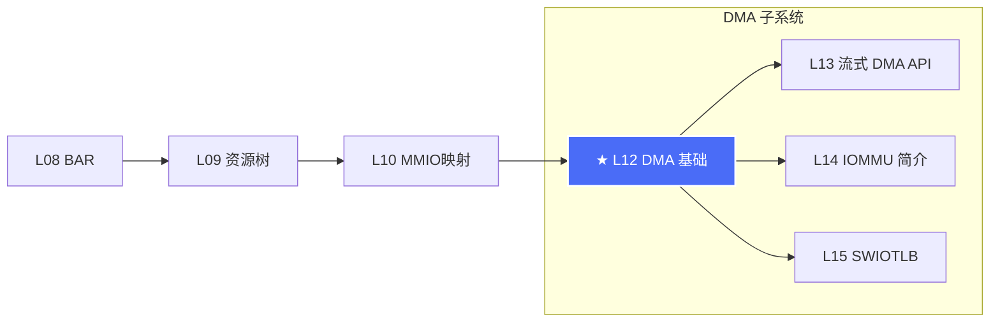
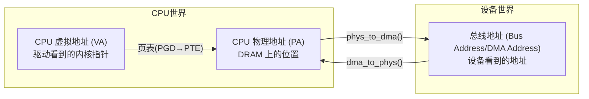
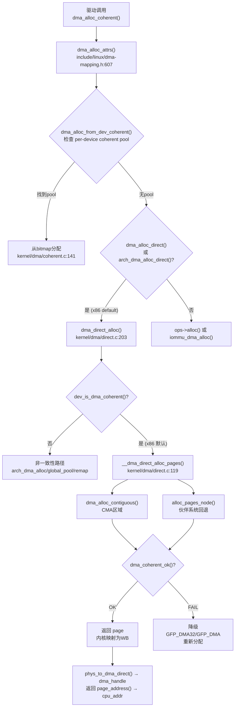
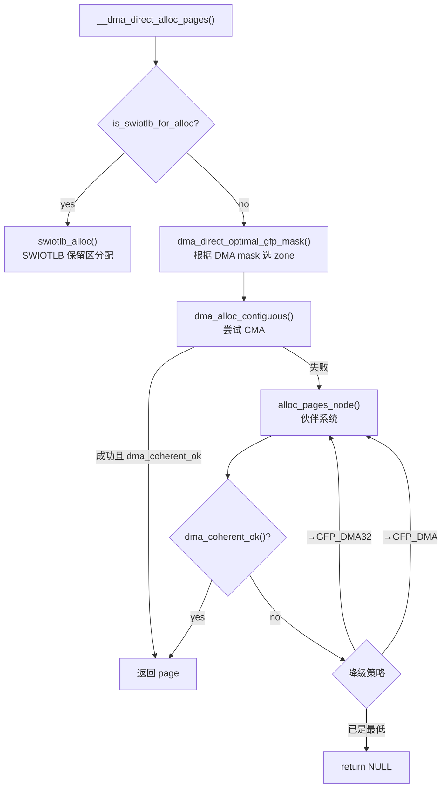
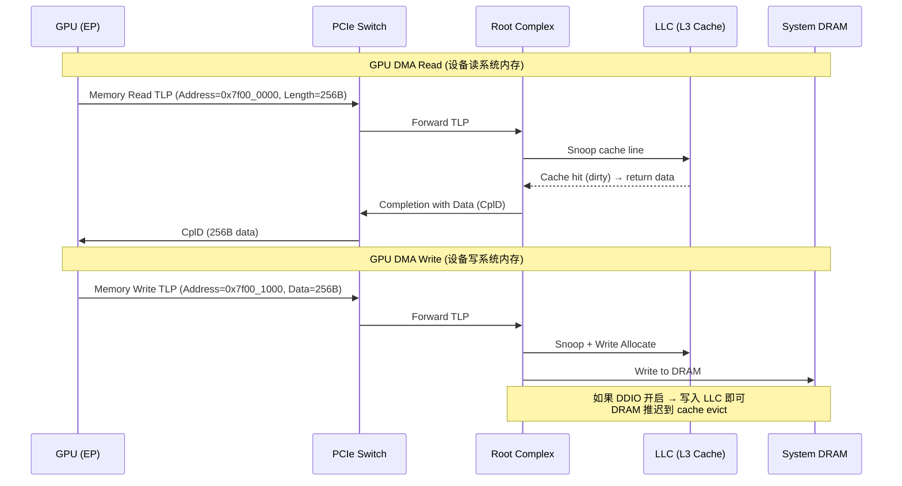

# L12：DMA 基础

## 0. 框架定位



**位置**：卷二第六章。L12 是 DMA 子系统四篇（L12–L15）的开门篇。L10 解决了 CPU 怎么**读/写**设备的寄存器（MMIO 映射），L12 解决设备怎么**读/写**CPU 的内存（DMA）。两者合起来构成完整的数据通路。


---

## 1. 问题驱动

> 🔍 **你遇到了一个问题：**
>
> 你分配了一个 DMA buffer，GPU 把计算结果写进去，
完成后 CPU 去读——全是 0。
GPU 明明说传输完成了（DMA 完成中断已经触发），
为什么 CPU 看不到数据？cache 一致性在这里扮演了什么角色？
>
> **带着这个问题学完本节，你就知道答案了。**

---

## 2. 前置认知


| 前置篇 | 核心依赖 | 为什么需要 |
|--------|---------|-----------|
| L08 BAR | 地址空间、BAR 类型 | DMA 地址本质上是 PCIe bus address，和 BAR 中的地址在同一地址空间 |
| L10 MMIO | ioremap、UC/WC/WB | 理解 cache 一致性对 DMA 的决定性影响 |
| L05 Bridge | PCI Bridge 地址转发 | DMA 请求穿越 RC→Bridge→EP 的地址翻译路径 |

**首次引入概念**：
- **Bus Master**：PCI 功能寄存器中控制 DMA 能力的使能位（L12 首次出现）
- **DMA 地址**：设备视角的地址（与 CPU 物理地址可能不同 — L12 首次系统讨论）

## 3. 核心原理

### 2.1 什么是 DMA？为什么需要？

PCIe 设备有三种方式和 CPU 交换数据：

1. **PIO（Programmed I/O）**：CPU 通过 MMIO 读/写设备寄存器 — CPU 是搬运工，一条指令搬 4/8 字节
2. **DMA（Direct Memory Access）**：设备自己做总线 Master，直接读写系统内存 — 设备是搬运工
3. **Peer-to-Peer**：两个设备之间直接 DMA，不经过 CPU — L37 覆盖

**为什么 DMA 是必须的**？算一笔账：
- 一个 100GbE NIC 的线速率 = 12.5 GB/s
- 每个 packet 最小 64 字节 → 每秒 1.95 亿次 packet
- 如果每次 packet 都用 PIO，CPU 需要每秒处理 1.95 亿次 MMIO 读 → 即使是 5GHz CPU 也扛不住（每次 MMIO 读 ~100ns → 195M × 100ns = 19.5s CPU 时间/秒）
- **DMA 让设备直接把 packet 写入内存，CPU 只在批量完成后处理一次中断**

### 2.2 Bus Mastering — DMA 的硬件基础

PCIe 设备做 DMA 的先决条件：

```
PCI Command Register (偏移 0x04)
┌──────┬─────┬───┬───┬─────┬────┬──────┐
│ Bit2 │ Bit1│Bit0│      其他位            │
│ Bus  │ Mem │IO  │                        │
│Master│Space│Space│                       │
├──────┼─────┼───┼─────────────────────────┤
│  1   │  1  │ 0  │                        │
└──────┴─────┴───┴─────────────────────────┘
```

- **Bus Master Enable（BME, Command Register bit 2）**：使能设备发起 Memory Read/Write TLP（即 DMA 操作）
- 只有 BME=1 时，设备的 DMA 引擎才能发出 TLP；BME=0 时，设备只能响应 Configuration 请求

内核中使能 BME 的典型路径（`drivers/pci/pci.c`）：
```c
int pci_set_master(struct pci_dev *dev)
{
    u16 cmd;
    pci_read_config_word(dev, PCI_COMMAND, &cmd);
    cmd |= PCI_COMMAND_MASTER;   // 写入 Command Register bit2
    pci_write_config_word(dev, PCI_COMMAND, cmd);
    return 0;
}
```

> **⚠ 验证影响**：Bring-up 时第一个必须检查的寄存器。`lspci -vvv` 输出中如果显示 `BusMaster` 后跟 `disabled` → 驱动没有调用 `pci_set_master()`。

### 2.3 DMA 操作的生命周期 — TLP 视角

设备发起一次 DMA 读（设备→内存）的 TLP 序列：

```
Device (EP)                    Root Complex (RC)            System Memory
    │                               │                           │
    │──── Memory Read TLP ─────────▶│                           │
    │   (Requester ID + Address)    │                           │
    │                               │─── Read from DRAM ──────▶│
    │                               │◀── Read Data ────────────│
    │◀── Completion with Data (CplD)│                           │
    │                               │                           │
    │──── Memory Write TLP ────────▶│                           │
    │   (Requester ID + Data + Addr)│                           │
    │                               │─── Write to DRAM ───────▶│
    │                               │                           │
```

> 📌 **协议对照**：DMA 读 = Memory Read TLP（PCIe Base Spec §2.2.5）；DMA 写 = Memory Write TLP（§2.2.6）。读操作有 Completion（分离事务），写操作是 posted transaction（不需要 Completion）。

### 2.4 地址空间的三个世界

理解 DMA 的核心是**区分三个地址**：



| 地址类型 | 谁在用 | 位宽 | 说明 |
|---------|-------|------|------|
| CPU 虚拟地址 (VA) | CPU（load/store 指令） | 48-bit (x86_64) | `ioremap`/`kmap` 返回的指针 |
| CPU 物理地址 (PA) | CPU（cache line fill/evict） | 最大物理内存位宽 | DRAM 控制器看到的位置 |
| DMA/总线地址 (BA) | PCIe 设备（TLP Address 字段） | 32-bit 或 64-bit | 设备发起的 TLP 中使用的地址 |

**关键理解**：在没有 IOMMU 的 x86 上：

```c
// 内核判断是否走 direct 映射
dma_addr_t phys_to_dma(struct device *dev, phys_addr_t phys)
{
    // x86: 如果 dev->dma_range_map == NULL
    // 直接返回 phys 作为 DMA 地址
    // 否则加上偏移: phys - map->cpu_start + map->dma_start
}
```

所以大部分 x86_64 桌面上，**物理地址 = DMA 地址**（PCI 地址 1:1 映射）。但在有 IOMMU 或 dma-ranges 的平台上这个关系不成立。

### 2.5 一致性 DMA vs 流式 DMA

内核 DMA API 分两大类别：

| 特性 | 一致性 DMA（Coherent） | 流式 DMA（Streaming） |
|------|----------------------|---------------------|
| 典型 API | `dma_alloc_coherent()` | `dma_map_single()`/`dma_unmap_single()` |
| 缓存一致性 | 硬件保证（或逐页缓存行刷新） | 调用者负责 sync |
| 持有时长 | 驱动生命周期 | 一次 I/O 的时长 |
| 内存来源 | 专用 CMA 区域或 `alloc_pages()` | 驱动传入的任意缓冲区 |
| CPU 访问 | 随时可读/写 | 必须在 unmap/sync 后才安全 |
| x86 实现 | 物理页直接映射（WB） | 物理页直接映射，sync = 缓存行刷写或 no-op |

> **核心理念**：一致性 DMA = 驱动和设备共享一个 buffer，双方随时可以读写。流式 DMA = 一次性的 I/O transfer，ownership 在 CPU 和设备之间传递。

x86 上的特殊之处：x86 的 PCIe 设备通常能**硬件 snoop CPU cache**（因为 PCIe 是 cache coherent 的）。所以在 x86 上 `dma_alloc_coherent` 返回的内存默认就是 WB + hardware-coherent，不需要做 `pgprot_noncached`。**这和 ARM 完全相反**。

### 2.6 Cache 一致性机制

PCIe 的 cache 一致性依靠 **硬件 snoop**：

```
CPU Core 0              CPU Core 1
   L1$                     L1$
    |                       |
    +-------- L2$ ----------+
              |
   +----------+-----------+
   |       LLC           |  ← snoop filter
   +----------+-----------+
              |
   +----------+-----------+
   |    Memory Controller  |
   +----------+-----------+
              |
   +----------+-----------+
   |    Root Complex       |
   +----------+-----------+
              |
         PCIe Bus
              |
        Device (EP)
```

- 设备发起 Memory Write TLP → RC 接收 → **snoop LLC**：如果该地址在 LLC 中有 dirty cache line → writeback 到 DRAM 再写入
- 设备发起 Memory Read TLP → RC 接收 → **snoop LLC**：如果该地址在 LLC 中有 clean/dirty line → 从 cache 返回最新数据
- 这叫做 **hardware cache coherency via snoop**

> **⚠ x86 和 ARM 的核心差异**：x86 的 PCIe 是 cache coherent 的（PCIe spec 的 coherency 要求），所以 dma_alloc_coherent 不需要做特别的内存类型设置。ARM 的 PCIe 通常不做 hardware snoop，所以需要 `pgprot_noncached` 或 `arch_sync_dma_for_device` 显式刷缓存。

## 4. 内核源码带读

### 3.1 总览：`dma_alloc_coherent()` 调用链



### 3.2 入口：`dma_alloc_attrs()`

**源码**：`kernel/dma/mapping.c:622` — 所有 coherent 分配的最终路由点。

```c
// == 步骤 1：检查 per-device coherent pool ==
void *dma_alloc_attrs(struct device *dev, size_t size, dma_addr_t *dma_handle,
                      gfp_t flag, unsigned long attrs)        // direct.c:622
{
    const struct dma_map_ops *ops = get_dma_ops(dev);
    void *cpu_addr;

    WARN_ON_ONCE(!dev->coherent_dma_mask);                    // direct.c:628
    // ⚠ coherent_dma_mask 为 0 → 驱动忘了设 DMA mask → 内核报 warning

    if (WARN_ON_ONCE(flag & __GFP_COMP))                      // direct.c:635
        return NULL;         
    // ⚠ DMA 分配不能要 compound page — 多个 page 但内核无法追踪释放

    // == 步骤 2：尝试 per-device coherent pool ==
    if (dma_alloc_from_dev_coherent(dev, size, dma_handle, &cpu_addr)) {
        trace_dma_alloc(dev, cpu_addr, *dma_handle, size,
                        DMA_BIDIRECTIONAL, flag, attrs);
        return cpu_addr;                                      // direct.c:641
    }
    // 正常 x86 路径不走这里 — 没有 per-device coherent pool
    // 仅当 dma_declare_coherent_memory() 或 device tree"shared-dma-pool"时生效

    // == 步骤 3：清除 zone hint — 让后端自己决定 ==
    flag &= ~(__GFP_DMA | __GFP_DMA32 | __GFP_HIGHMEM);      // direct.c:645

    // == 步骤 4：路由到 dma_direct 或 ops ==
    if (dma_alloc_direct(dev, ops) || arch_dma_alloc_direct(dev))
        cpu_addr = dma_direct_alloc(dev, size, dma_handle, flag, attrs);
                                                            // direct.c:648
    else if (use_dma_iommu(dev))
        cpu_addr = iommu_dma_alloc(dev, size, dma_handle, flag, attrs);
                                                            // direct.c:650
    else if (ops->alloc)
        cpu_addr = ops->alloc(dev, size, dma_handle, flag, attrs);
                                                            // direct.c:652
    // ...
    trace_dma_alloc(dev, cpu_addr, *dma_handle, size, 
                    DMA_BIDIRECTIONAL, flag, attrs);
    debug_dma_alloc_coherent(dev, size, *dma_handle, cpu_addr, attrs);
    return cpu_addr;                                         // direct.c:662
}
```

**路由决策**：
- `dma_alloc_direct()`（`mapping.c:143`）：检查 `dma_go_direct()` → `ops == NULL` 且无 IOMMU → 返回 true
- x86 上 `get_dma_ops()` 返回全局 `dma_ops`（通常为 NULL，除非使用 Xen SWIOTLB 或 Intel IOMMU）
- 所以 **x86 默认走 dma_direct_alloc**

> ⚠ **异常路径**：如果 `coherent_dma_mask` 为 0（驱动忘了设），内核只打印 warning 但不阻止分配。但返回的 DMA 地址设备可能无法访问。症状：DMA 完成后设备不响应中断或数据损坏。

### 3.3 核心实现：`dma_direct_alloc()`

**源码**：`kernel/dma/direct.c:203` — 一致性 DMA 分配的主干。

```c
void *dma_direct_alloc(struct device *dev, size_t size,
                       dma_addr_t *dma_handle, gfp_t gfp, unsigned long attrs)
{
    bool remap = false, set_uncached = false;
    struct page *page;
    void *ret;

    size = PAGE_ALIGN(size);                                  // direct.c:210
    if (attrs & DMA_ATTR_NO_WARN)
        gfp |= __GFP_NOWARN;                                  // direct.c:212

    // == 异常分支 1：NO_KERNEL_MAPPING（透明 hint，不分配页表）==
    if ((attrs & DMA_ATTR_NO_KERNEL_MAPPING) &&
        !force_dma_unencrypted(dev) && !is_swiotlb_for_alloc(dev))
        return dma_direct_alloc_no_mapping(dev, size, dma_handle, gfp);
                                                            // direct.c:216

    // == 异常分支 2：非一致性设备路径 ==
    if (!dev_is_dma_coherent(dev)) {                          // direct.c:218
        // x86 设备默认 is_dma_coherent=true
        // 仅当设备明确标记为非一致性时走此路径
        // 子分支 A：arch_dma_alloc（x86 没有 — CONFIG_ARCH_HAS_DMA_ALLOC=n）
        // 子分支 B：global pool（设备树专用，x86 没有）
        // 子分支 C：set_uncached 或 remap
        set_uncached = IS_ENABLED(CONFIG_ARCH_HAS_DMA_SET_UNCACHED);
        remap = IS_ENABLED(CONFIG_DMA_DIRECT_REMAP);
        if (!set_uncached && !remap) {                       // direct.c:239
            pr_warn_once("coherent DMA allocations not supported "
                         "on this platform.\n");
            return NULL;
        }
    }

    // == 原子池路径（GFP_ATOMIC 且需要 remap）==
    if ((remap || force_dma_unencrypted(dev)) &&
        dma_direct_use_pool(dev, gfp))
        return dma_direct_alloc_from_pool(dev, size, dma_handle, gfp);
                                                            // direct.c:251

    // == 主路径：分配物理页 ==
    page = __dma_direct_alloc_pages(dev, size, gfp & ~__GFP_ZERO, true);
                                                            // direct.c:254
    if (!page)
        return NULL;                                         // direct.c:256

    // == HighMem 页重映射 ==
    if (PageHighMem(page)) {                                  // direct.c:263
        remap = true;                                         // direct.c:264
        set_uncached = false;                                 // direct.c:265
    }

    // == 内核映射方式 ==
    if (remap) {                                              // direct.c:268
        pgprot_t prot = dma_pgprot(dev, PAGE_KERNEL, attrs);  // direct.c:269
        if (force_dma_unencrypted(dev))
            prot = pgprot_decrypted(prot);
        arch_dma_prep_coherent(page, size);                   // direct.c:275
        ret = dma_common_contiguous_remap(page, size, prot,
                __builtin_return_address(0));                 // direct.c:278
        if (!ret)
            goto out_free_pages;
    } else {
        // ★ x86 主路径 — 直接 page_address（WB 映射，hardware coherent）
        ret = page_address(page);                            // direct.c:283
        if (dma_set_decrypted(dev, ret, size))
            goto out_leak_pages;
    }

    memset(ret, 0, size);                                     // direct.c:288
    // ⚠ gfp & ~__GFP_ZERO 后手动 memset。为什么？因为 __GFP_ZERO 加的太早，
    // 如果 remap 失败或者解密失败，已经 zeroed 的页就白费了。

    // == 非一致性设备的 uncached 设置 ==
    if (set_uncached) {                                       // direct.c:290
        arch_dma_prep_coherent(page, size);
        ret = arch_dma_set_uncached(ret, size);
        if (IS_ERR(ret))
            goto out_encrypt_pages;
    }

    // == 计算 DMA 地址 ==
    *dma_handle = phys_to_dma_direct(dev, page_to_phys(page)); // direct.c:297
    return ret;

    // == 错误路径汇总 ==
out_encrypt_pages:
    if (dma_set_encrypted(dev, page_address(page), size))
        return NULL;                                          // direct.c:302
out_free_pages:
    __dma_direct_free_pages(dev, page, size);                 // direct.c:304
    return NULL;
out_leak_pages:
    return NULL;                                              // direct.c:307
}
```

**x86 主路径总结**（`dev_is_dma_coherent()=true`）：
1. `__dma_direct_alloc_pages()` 分配物理页
2. `page_address()` 获取内核虚拟地址（直接映射区 — 默认 WB）
3. `phys_to_dma_direct()` 计算 DMA 地址（x86: 通常 phys → 不变）
4. **不需要 remap、不需要 set_uncached、不需要 cache 维护** — 因为 PCIe hardware snoop 保证了 coherency

### 3.4 物理页分配：`__dma_direct_alloc_pages()`

**源码**：`kernel/dma/direct.c:119`

```c
static struct page *__dma_direct_alloc_pages(struct device *dev, size_t size,
                                             gfp_t gfp, bool allow_highmem)
{
    int node = dev_to_node(dev);
    struct page *page;
    u64 phys_limit;

    WARN_ON_ONCE(!PAGE_ALIGNED(size));                        // direct.c:126

    // == SWIOTLB 分配路径（如果强制使用）==
    if (is_swiotlb_for_alloc(dev))
        return dma_direct_alloc_swiotlb(dev, size);           // direct.c:129

    // == 优化 GFP zone：根据 DMA mask 选 zone ==
    gfp |= dma_direct_optimal_gfp_mask(dev, &phys_limit);    // direct.c:131
    // 如果 dma_limit ≤ 16MB → +GFP_DMA
    // 如果 16MB < dma_limit ≤ 4GB → +GFP_DMA32
    // 否则 → 无额外 flag（可分配任何 zone）

    // == 尝试 CMA ==
    page = dma_alloc_contiguous(dev, size, gfp);              // direct.c:132
    if (page) {
        if (dma_coherent_ok(dev, page_to_phys(page), size) &&  // direct.c:134
            (allow_highmem || !PageHighMem(page)))
            return page;                                      // direct.c:136
        dma_free_contiguous(dev, page, size);                  // direct.c:138
    }

    // == 伙伴系统回退 + DMA zone 降级 ==
    while ((page = alloc_pages_node(node, gfp, get_order(size)))
           && !dma_coherent_ok(dev, page_to_phys(page), size)) {
                                                            // direct.c:141
        __free_pages(page, get_order(size));                  // direct.c:143

        // ★ 渐进降级策略 ★
        if (IS_ENABLED(CONFIG_ZONE_DMA32) &&
            phys_limit < DMA_BIT_MASK(64) &&
            !(gfp & (GFP_DMA32 | GFP_DMA)))
            gfp |= GFP_DMA32;                                 // direct.c:148
        else if (IS_ENABLED(CONFIG_ZONE_DMA) && !(gfp & GFP_DMA))
            gfp = (gfp & ~GFP_DMA32) | GFP_DMA;               // direct.c:150
        else
            return NULL;                                      // direct.c:152
        // 降级至 GFP_DMA32 → 分配 4GB 以下页
        // 仍不行 → 降级至 GFP_DMA → 分配 16MB 以下页
        // 仍不行 → 返回 NULL（真不行了）
    }

    return page;
}
```

**分配策略流程图**：



### 3.5 `pci_alloc_consistent()` — PCI 驱动的便捷包装

虽然 L12 之前的讲义尚未覆盖，但需要说明 `pci_alloc_consistent()` 的历史地位。在 v7.0 内核中它已经是 inline wrapper：

```c
// include/linux/pci.h
static inline void *pci_alloc_consistent(struct pci_dev *hwdev,
                                         size_t size,
                                         dma_addr_t *dma_handle)
{
    return dma_alloc_coherent(&hwdev->dev, size, dma_handle, GFP_KERNEL);
}
```

所以 PCI 驱动直接用 `dma_alloc_coherent()` 即可，`pci_alloc_consistent()` 只是历史兼容。

### 3.6 异常场景汇总

| 场景 | 症状 | 根因 | 排查方法 |
|------|------|------|---------|
| `coherent_dma_mask=0` | dmesg warning:"coherent DMA mask not set" | 驱动忘了设 DMA mask | `dmesg\|grep coherent` + 检查 probe 中是否调了 `dma_set_mask()` |
| CMA 耗尽 + 伙伴系统碎片 | `dma_alloc_coherent` 返回 NULL | 连续物理页不足 | `cat /proc/buddyinfo` + `echo 3 > /proc/sys/vm/drop_caches` |
| GFP_DMA 分配失败 | 大块分配（>16MB）返回 NULL | x86 ZONE_DMA 只有 16MB，无法分配大块 | `cat /proc/zoneinfo\|grep -A 10 DMA` |
| SWIOTLB 强制 bounce | DMA 地址超过设备 mask | 设备 DMA mask < 实际物理内存地址 | `dmesg\|grep swiotlb` + `/sys/kernel/debug/swiotlb/` |
| DMA 完成后数据没更新 | CPU 读 buffer 看到旧数据 | x86 硬件 snoop 正常时几乎不可能，除非是 non-coherent 设备 | `dmesg\|grep -i "coherent"` + 检查 `dev->dma_coherent` |
| 解密失败（AMD SEV） | dmesg "leaking DMA memory" | `dma_set_decrypted` 失败 | `dmesg\|grep -i sev\|iommu\|mem_encrypt` + 检查 `force_dma_unencrypted()` |

## 5. x86 关联

### 4.1 x86 上 DMA 不走「non-cached」—— 核心差异

ARM 开发者转到 x86 的时候第一个踩的坑：**x86 上 `dma_alloc_coherent` 返回的内存是 WB（Write-Back）的，不需要 `pgprot_noncached`**。

原因：
- x86 PCIe RC 实现了 **hardware snoop**：设备读写内存时，RC 会 snoop CPU cache（通过 QPI/UPI 总线）
- 所以 CPU 和设备看到的是**一致的数据**
- 不需要像 ARM 那样把 DMA buffer 设为 non-cached 或做显式 cache 维护

验证方法：
```bash
# 查看 DMA 缓冲区的 PAT 类型
cat /sys/kernel/debug/x86/pat_memtype_list | head -20
# 典型输出：WB (write-back) 类型，不是 UC-
```

### 4.2 x86 ZONE_DMA（16MB 限制）

x86 历史上保留 **ZONE_DMA = 前 16MB** 物理内存，给古老 ISA 设备做 DMA 用：

```c
// kernel/dma/direct.c:24
u64 zone_dma_limit __ro_after_init = DMA_BIT_MASK(24);
// 2^24 = 16MB — 兼容 ISA DMA 的 24-bit 地址
```

现在 16MB 限制仍然是实际限制：
- `dma_alloc_coherent` 如果设备设了 24-bit DMA mask → 强制从 ZONE_DMA 分配
- 一块 4MB 的 coherent buffer 就可能耗尽 ZONE_DMA
- 现代 PCIe 设备应该至少设 32-bit mask：`dma_set_mask_and_coherent(dev, DMA_BIT_MASK(32))`

```bash
# 检查 ZONE_DMA 剩余
cat /proc/zoneinfo | grep -A 20 "DMA" | head -30
# 看 "pages free" — 如果接近 0，大块 DMA 分配可能失败
```

### 4.3 x86 `phys_to_dma()` / `dma_to_phys()` 实现

```c
// arch/x86/include/asm/dma-direct.h
static inline dma_addr_t phys_to_dma(struct device *dev, phys_addr_t paddr)
{
    // 如果没有 dma_range_map，直接返回物理地址
    // 如果有，做偏移转换
    const struct bus_dma_region *m = dev->dma_range_map;
    if (m)
        return paddr - m->cpu_start + m->dma_start;
    return paddr;
}
```

所以 x86 上默认：**DMA 地址 = 物理地址**。`dma_alloc_coherent` 返回的 `dma_handle` 就是物理地址（至少在 logical mapping 下）。

### 4.4 x86 SWIOTLB 的开启条件

只有在以下情况 SWIOTLB 才参与 coherent 分配：

```c
// arch/x86/kernel/pci-dma.c:44
static void __init pci_swiotlb_detect(void)
{
    if (!no_iommu && max_possible_pfn > MAX_DMA32_PFN)  // >4GB 且没有 IOMMU
        x86_swiotlb_enable = true;

    if (cc_platform_has(CC_ATTR_HOST_MEM_ENCRYPT))      // AMD SME
        x86_swiotlb_enable = true;

    if (cc_platform_has(CC_ATTR_GUEST_MEM_ENCRYPT))    // TDX/SEV-SNP
        x86_swiotlb_enable = true;
}
```

普通 x86_64 桌面/服务器（<4GB 或 有 IOMMU）→ SWIOTLB 不开启 → `is_swiotlb_for_alloc()=false`。

## 6. GPU 关联

### 5.1 GPU 驱动中的 DMA 分配

GPU 驱动是 Linux 中最大的一致性 DMA 消费者。以 NVIDIA 开源驱动 `nouveau` 和 AMD `amdgpu` 为例：

```c
// drivers/gpu/drm/amd/amdgpu/amdgpu_ttm.c （概念示例）
struct amdgpu_bo *bo;
bo = kzalloc(sizeof(*bo), GFP_KERNEL);

// 分配 GPU 可访问的 DMA 缓冲区
r = amdgpu_bo_create_kernel(adev, size, align,
                            AMDGPU_GEM_DOMAIN_VRAM | AMDGPU_GEM_DOMAIN_GTT,
                            &bo->tbo, NULL, &bo->dma_addr);
```

内部调用链：`amdgpu_bo_create_kernel` → `ttm_bo_init_reserved` → `ttm_sg_tt_init` → `dma_alloc_coherent()` 或 `dma_alloc_attrs()`（取决于后端是 GTT 还是 VRAM）。

**GPU 的三种内存类型和 DMA**：

| GPU 内存类型 | 后端存储 | DMA 方式 | TLP 类型 |
|-------------|---------|---------|---------|
| VRAM | GPU 本地显存（BAR0） | P2P DMA（设备间） | Memory Read/Write with PCIe address |
| GTT | 系统内存（dma_alloc_coherent） | CPU→GPU DMA 共享 | 同上，但地址在系统内存 |
| PRT/BigPages | 系统内存（page fault） | 通过 IOMMU 按需映射 | ATS/Page Request Interface |

### 5.2 GPU framebuffer 的 DMA 特点

GPU framebuffer（显存）的 DMA 行为有几个关键特征：

1. **WC 映射至关重要**：GPU 写入 framebuffer 用 WC 映射（L10），而 GPU **读** framebuffer 用 DMA（设备发起的 Memory Read TLP）
2. **GPU 做 DMA 写回系统内存**：例如 CUDA kernel 写 `cudaMemcpyDeviceToHost` 的结果 → GPU 发出 Memory Write TLP → RC snoop + 写入系统内存
3. **x86 上 GPU DMA 绕过 LLC？**：这是 x86 上的重要优化——PCIe 设备 DMA 通常经过 **Direct Data I/O (DDIO)**（Intel Xeon）直接把数据写入 LLC，跳过 DRAM，减少延迟

### 5.3 验证视角：DMA 在 PCIe 链路上的实际行为



> **⚠ 验证影响**：使用 PCIe 协议分析仪（如 Teledyne LeCroy / Keysight）可以捕获 DMA 的 Memory Read/Write TLP。关键观察点：TLP 的 Request ID（Bus:Dev:Fn 编码的设备标识）、Address 字段是否落在 DMA buffer 的物理地址范围、数据 payload 完整性。

### 5.4 GPU DMA 大小和性能

GPU 的 DMA 引擎通常支持**最高 512B payload**（PCIe Gen3 x16 的理论最大值），实际使用中：
- 小 transfer（≤256B）：latency sensitive，用单个 TLP
- 大 transfer（64KB+）：burst 多个 TLP，流水线填充

**验证时的性能陷阱**：PCIe gen4 x16 的理论带宽是 31.5 GB/s，但如果 DMA 的 TLP 用默认的 128B payload（`max_payload_size` 限制在 PCIe Device Control register 里）→ 有效带宽只有约 60% → 检查 `lspci -vvv | grep DevCtl` 的 MaxPayload 字段。

## 7. 思考题

### Q1（设计意图）
为什么 `dma_alloc_coherent()` 在 x86 上返回的虚拟地址是 WB 缓存类型，而 ARM 上通常是 non-cached？各自依赖什么硬件机制保证一致性？

### Q2（源码分析 — 代码实操）
`dma_direct_alloc()`（`kernel/dma/direct.c:203`）中有一段注释说 `"we always manually zero the memory once we are done"`。为什么传入 `gfp & ~__GFP_ZERO` 而非直接用 `gfp | __GFP_ZERO`？如果你去掉 `& ~__GFP_ZERO` 改用 `gfp`，代码行为会变吗？在哪里变的？

### Q3（异常排查）
你的 PCIe 设备驱动分配了 8MB 的 DMA 缓冲区，`dma_alloc_coherent()` 突然返回 NULL。系统是 x86_64，16GB RAM，没有 IOMMU。列出至少三个可能的根因，并给出每个根因的排查命令/proc 文件。

### Q4（设计意图）
为什么 `dma_direct_alloc()` 中传递 `DMA_ATTR_NO_KERNEL_MAPPING` 时可以直接返回 `struct page *` 作为 cookie？这和正常路径有什么区别？

### Q5（源码分析）
`__dma_direct_alloc_pages()`（`direct.c:119`）中的 while 循环做 DMA zone 降级。解释为什么降级顺序是"先 GFP_DMA32 → 再 GFP_DMA"而不是反过来？如果反过来（先 GFP_DMA 再 GFP_DMA32）会有什么问题？

### Q6（x86 具体场景）
在 x86_64 服务器上，你的设备 `dma_set_mask_and_coherent()` 设了 30-bit mask（1GB）。`dma_alloc_coherent()` 会从哪个 zone 分配内存？为什么？如果设了 `DMA_BIT_MASK(64)` 呢？

## 6b. 参考答案

**Q1**：
x86 依赖 **PCIe hardware snoop**：RC 在设备发起 DMA 时 snoop CPU cache，保证 cache line 和 DRAM 的一致性。所以 DMA buffer 可以是 WB 类型的普通内存——CPU 和设备读到一致的数据。

ARM 大多数平台（包括 ARM64 server）**不做 hardware snoop**（因为功耗/复杂度考虑），所以 DMA buffer 要么设为 non-cached（直接绕过 cache），要么在每次 DMA 前/后做显式 cache flush/invalidate。ARM 上 x86 的 "dma_alloc_coherent return WB memory" 行为是反直觉的。

**Q2**：
原因在 `dma_direct_alloc()` 的 `remap` 路径。如果分配后需要 remap（`dma_common_contiguous_remap`）或解密操作（`dma_set_decrypted`），这些操作可能失败。如果提前用 `__GFP_ZERO` 做了 zeroing 但后续 remap 失败，zeroed 的页就浪费了。所以先分配不 zero，等确认所有操作成功后再 `memset(ret, 0, size)`（`direct.c:288`）。

如果去掉 `& ~__GFP_ZERO`，行为不会改变（因为 `direct.c:288` 仍然执行 memset，相当于做了两次 zeroing——一次伙伴系统层面，一次软件层面）。只是浪费了第一次 zeroing 的 CPU 时间，在 4KB / 8KB 分配上几乎可以忽略，在 4MB+ 分配上可测量。

**Q3**：
1. **ZONE_DMA 耗尽**：如果设备 mask 限制了 24-bit（16MB），coherent 分配只能从 ZONE_DMA 出。8MB 可能超过剩余量
   → 排查：`cat /proc/zoneinfo | grep -A 5 "DMA"` 看 free 页数
2. **CMA 耗尽**：如果系统用了 `cma=` 参数且 CMA 区域被其他驱动耗尽
   → 排查：`cat /proc/meminfo | grep Cma` 看 CmaFree
3. **伙伴系统碎片**：8MB 需要 2048 个连续物理页（order=11），如果内存碎片严重可能无法满足
   → 排查：`cat /proc/buddyinfo` 看各 order 的空闲块数，检查 order 11 列（`2^11 = 2048 pages = 8MB`）

**Q4**：
`DMA_ATTR_NO_KERNEL_MAPPING` 适用于驱动不需要 CPU 访问 DMA buffer 的场景（比如这个 buffer 只给设备 DMA 用，CPU 永远不读/写它）。此时内核可以省去 `page_address()` 映射和 remap 的开销——返回的 `struct page *` 本身就是 opaque cookie。驱动后续通过 `dma_map_sg()` 等流式 API 传递给设备。

正常路径需要 CPU 和 DMA 双重访问 → 需要内核虚拟地址 → 需要页表映射。

**Q5**：
因为 **GFP_DMA 是资源最稀缺的**（x86 上只有 16MB）。如果先尝试 GFP_DMA，分配器会立即掏空有限的前 16MB 空间。降级策略应该是"先尝试足够好（但不太稀缺）的 zone，再降级到最稀缺的"：

1. 默认：任何 zone（最充裕，但可能超过 DMA mask）
2. GFP_DMA32：限制在 ≤4GB（充裕，x86 有 4GB 空间）
3. GFP_DMA：限制在 ≤16MB（极度稀缺）

如果反过来（先 GFP_DMA 再 GFP_DMA32），一个只需要 ≤4GB 地址的 64KB buffer 就会吃掉宝贵的 ZONE_DMA 空间，导致真正需要 DMA 的老设备无法分配。

**Q6**：
- **30-bit mask（1GB）**：`dma_direct_optimal_gfp_mask()` 中，`phys_limit = dma_to_phys(dev, DMA_BIT_MASK(30)) = 0x4000_0000 = 1GB`。1GB > 16MB（`zone_dma_limit`）→ 不选 GFP_DMA。1GB < 4GB（`DMA_BIT_MASK(32)`）→ **不**选 GFP_DMA32（注意 `dma_to_phys` 后比较的是物理地址）。所以 `phys_limit <= DMA_BIT_MASK(32)` 检查结果为 true → 返回 GFP_DMA32。从 ZONE_DMA32 分配（1GB 以下）。
- **64-bit mask**：`phys_limit` 远超 4GB，不在 DMA32 范围内 → 返回 0（无额外 flag）。从 ZONE_NORMAL 或 ZONE_MOVABLE 分配。

## 8. 渐进式代码构建

在 L10 的骨架基础上，添加 DMA 一致性分配和 Bus Master 使能。在 `probe` 中：

```c
// L12: 在 L10 MMIO + L03 probe 基础上添加 DMA 支持
#include <linux/dma-mapping.h>

static int my_pci_probe(struct pci_dev *dev, const struct pci_device_id *id)
{
    struct resource *res;
    void __iomem *bar0;
    void *dma_buf;
    dma_addr_t dma_handle;
    int ret;

    // [L03] Enable device
    ret = pci_enable_device(dev);
    if (ret)
        return ret;

    // ★ L12: Enable Bus Mastering — 设备才能发起 DMA TLP
    pci_set_master(dev);

    // ★ L12: Set DMA mask — 告诉内核设备能访问的地址范围
    ret = dma_set_mask_and_coherent(&dev->dev, DMA_BIT_MASK(64));
    if (ret) {
        // 64-bit 不行 → 尝试 32-bit
        ret = dma_set_mask_and_coherent(&dev->dev, DMA_BIT_MASK(32));
        if (ret) {
            dev_err(&dev->dev, "No suitable DMA mask\n");
            goto err_disable;
        }
    }

    // [L10] Request BAR0 and ioremap
    res = &dev->resource[0];
    ret = pci_request_region(dev, 0, "my_pci");
    if (ret)
        goto err_disable;

    bar0 = pci_ioremap_bar(dev, 0);
    if (!bar0) {
        ret = -ENOMEM;
        goto err_release;
    }

    // ★ L12: Allocate coherent DMA buffer (64KB)
    dma_buf = dma_alloc_coherent(&dev->dev, SZ_64K, &dma_handle, GFP_KERNEL);
    if (!dma_buf) {
        dev_err(&dev->dev, "Failed to allocate DMA coherent buffer\n");
        ret = -ENOMEM;
        goto err_iounmap;
    }

    // ★ L12: Tell device where the DMA buffer is
    // 假设设备有个 DMA_ADDR_REG 和 DMA_CTRL_REG
    // iowrite32(lower_32_bits(dma_handle), bar0 + DMA_ADDR_REG_LO);
    // iowrite32(upper_32_bits(dma_handle), bar0 + DMA_ADDR_REG_HI);
    // iowrite32(SZ_64K, bar0 + DMA_SIZE_REG);
    // iowrite32(1, bar0 + DMA_START_REG);

    dev_info(&dev->dev, "DMA buffer: cpu=%p dma=%pad size=64KB\n",
             dma_buf, &dma_handle);

    // 保存指针以备 remove 使用
    pci_set_drvdata(dev, dma_buf);

    return 0;

    // 错误处理路径
err_iounmap:
    iounmap(bar0);
err_release:
    pci_release_region(dev, 0);
err_disable:
    pci_disable_device(dev);
    return ret;
}

static void my_pci_remove(struct pci_dev *dev)
{
    void *dma_buf = pci_get_drvdata(dev);
    dma_addr_t dma_handle;  // 实际驱动要保存 dma_handle

    // TODO: 停 DMA 引擎
    // iowrite32(0, bar0 + DMA_START_REG);

    // dma_free_coherent — 归还 buffer
    // dma_free_coherent(&dev->dev, SZ_64K, dma_buf, dma_handle);

    // iounmap(bar0);
    // pci_release_region(dev, 0);
    // pci_disable_device(dev);
}
```

**关键点**：
1. **`pci_set_master()` 必须在 DMA 之前** — 没有 BME，设备发不出 Memory TLP
2. **DMA mask 决定分配来源** — 设 64-bit mask 避免 ZONE_DMA 耗尽
3. **`dma_handle` 是设备看到的地址** — 写入设备寄存器时用这个地址（不是 CPU 指针）
4. 错误路径必须**逆序释放** — `dma_free_coherent` → `iounmap` → `pci_release_region` → `pci_disable_device`

在 Makefile 中（不变）：
```makefile
obj-m += my_pci.o
all:
    make -C /lib/modules/$(shell uname -r)/build M=$(PWD) modules
clean:
    make -C /lib/modules/$(shell uname -r)/build M=$(PWD) clean
```

测试方法：
```bash
# 编译
make

# 加载 - 观察 dmesg 输出确认 DMA buffer 分配成功
sudo insmod my_pci.ko
dmesg | tail -5
# 预期输出: DMA buffer: cpu=00000000XXXXXX dma=00000000XXXXXX size=64KB

# 查看 DMA mask
sudo cat /sys/bus/pci/devices/<BDF>/dma_mask

# 卸载
sudo rmmod my_pci
```
