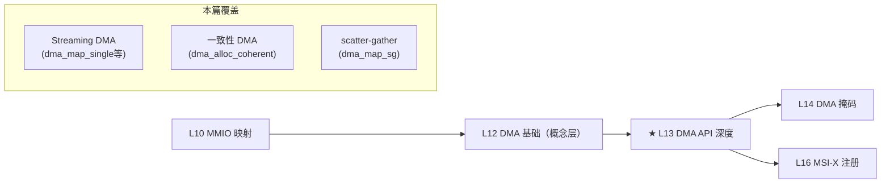

# L13：DMA API 深度

## 0. 框架定位



**本篇是 DMA 三篇（L12 概念、L13 API 深度、L14 掩码）的核心实现篇**。L12 讲 DMA 是什么和为什么，本篇讲内核怎么实现——从 `dma_map_page_attrs` 到 `dma_direct_map_phys` 再到 `swiotlb_map` 的完整调用链，以及一致性 DMA 与 streaming DMA 的设计意图对比。


---

## 1. 问题驱动

> 🔍 **你遇到了一个问题：**
>
> 你调用 `dma_alloc_coherent(dev, 4096, &dma_handle, GFP_KERNEL)`，
返回 `NULL`。但 `kmalloc(4096)` 能成功——内存明明还很多。
DMA API 到底怎么工作的？coherent 和 streaming 两种模式有什么区别？
为什么分配策略跟普通内存分配不一样？
>
> **带着这个问题学完本节，你就知道答案了。**

---

## 2. 前置认知


**前置**：L10 MMIO 映射（ioremap/PAT/MTRR）→ L12 DMA 基础（cache coherence、DMA 方向、streaming vs coherent）。L12 已建立"streaming DMA = 临时映射，coherent DMA = 持久分配"的概念框架。本篇在此基础上深挖内核实现。

**关键前提**：x86_64 上默认 DMA 是**非 coherent 的**——x86 的 PCIe 设备默认不参与 CPU cache coherency 协议（无 hardware snoop）。cache 刷新的重担落在软件（DMA API）身上。

## 3. 核心原理

### 2.1 Streaming DMA：为什么需要 bounce buffer

streaming DMA 的核心语义：**把一段 CPU 内存临时"出借"给设备做 DMA**。在内核眼中，这是一个**所有权转移**的过程：

```
CPU 拥有 → dma_map_*() → 设备拥有 → DMA 传输 → dma_unmap_*() → CPU 重新拥有
```

在 x86_64 上，所有权转移意味着：
- **CPU→设备**：`arch_sync_dma_for_device()` = 刷 cache line（`clflush` / `clwb`），确保 CPU 写的最新数据落到物理内存
- **设备→CPU**：`arch_sync_dma_for_cpu()` = 使 cache line 失效（`clflush` + `INVEPT`），防止 CPU 读到 stale cache

**bounce buffer（swiotlb）** 在以下两个场景自动介入：

1. **DMA 地址范围受限**：设备 32-bit DMA mask 但物理内存在 4GB 以上——设备无法直接寻址。swiotlb 在低 4GB 预留一块 bounce buffer，作为中转站。
2. **强制 bounce**：`swiotlb=force` 内核参数或 IOMMU 禁用时，所有 streaming DMA 经过 swiotlb。

### 2.2 一致性 DMA 的设计意图

`dma_alloc_coherent()` 返回的是一段**CPU 和设备都能同时访问**的内存——不需要 sync 操作。实现手段：

- **x86 non-coherent**（古老硬件/i440FX）：alloc 时分配普通物理页 → remap 成 **UC-**（uncacheable）→ CPU 读写直接穿透 cache → 设备 DMA 直接写物理内存 → 两者总是看到相同数据
- **x86 modern（coherent）**：大多数现代 x86 平台 `dev_is_dma_coherent()` 返回 true → 直接分配普通 WB 内存，不做任何 remap → 硬件保证 snoop

**为什么 streaming DMA 更常用**？一致性 DMA 必须分配一整段物理连续的内存，而且 UC 映射严重降低 CPU 访问性能。streaming DMA 可以操作 slab/slub 分配的散落内存，仅传输期间短暂失去 cache 性能。

### 2.3 Streaming vs Coherent 设计哲学对比

| 维度 | Streaming DMA | Coherent DMA |
|------|---------------|--------------|
| 分配来源 | 调用者已有的内存（kmalloc/slab/page） | 自己分配（`alloc_pages` 或 CMA） |
| CPU 访问性能 | WB（正常 cache） | UC（non-coherent 时）或 WB（coherent 时） |
| sync 开销 | 每次 map/unmap 刷 cache | 无 |
| 适合场景 | 网络包、块设备 IO、高速传输 | 描述符环、DMA 控制结构、小数据 |
| 物理连续要求 | 不要求 | 强要求（除非 IOMMU） |
| 生命周期 | 临时（每次 IO 映射/解映射） | 持久（设备生命周期内） |

## 4. 内核源码带读

> 主线：`dma_map_page_attrs()`（用户态）→ `dma_map_phys()`（调度层）→ `dma_direct_map_phys()`（direct 路径）→ `swiotlb_map()`（bounce fallback）。

### 3.1 `dma_map_page_attrs()` —— 入口

**源文件**：`kernel/dma/mapping.c:187`

```c
dma_addr_t dma_map_page_attrs(struct device *dev, struct page *page,
        size_t offset, size_t size, enum dma_data_direction dir,
        unsigned long attrs)
{
    phys_addr_t phys = page_to_phys(page) + offset;

    if (unlikely(attrs & DMA_ATTR_MMIO))
        return DMA_MAPPING_ERROR;   // == 异常路径：MMIO buffer 不允许进 streaming

    if (IS_ENABLED(CONFIG_DMA_API_DEBUG) &&
        WARN_ON_ONCE(is_zone_device_page(page)))
        return DMA_MAPPING_ERROR;   // == 异常路径：ZONE_DEVICE 页不允许 streaming

    return dma_map_phys(dev, phys, size, dir, attrs);
}
```

**关键行为**：
1. `page_to_phys(page) + offset`：从 `struct page *` 计算物理地址——这是 streaming DMA 的通用模型，操作的是**已经存在的物理页**，而非新分配
2. `DMA_ATTR_MMIO` 检查：MMIO 空间不能走 streaming DMA 路径
3. 直接委派给 `dma_map_phys`

**⚠ 注意点**：`dma_map_page` 是 `dma_map_single` 的底层基础——`dma_map_single(dev, cpu_addr, size, dir)` 内部调用 `dma_map_page(dev, virt_to_page(cpu_addr), offset_in_page(cpu_addr), size, dir)`。所以理解 `dma_map_page` 就理解了 streaming DMA 的全部。

### 3.2 `dma_map_phys()` —— 调度中心

**源文件**：`kernel/dma/mapping.c:155`

```c
dma_addr_t dma_map_phys(struct device *dev, phys_addr_t phys, size_t size,
        enum dma_data_direction dir, unsigned long attrs)
{
    const struct dma_map_ops *ops = get_dma_ops(dev);
    bool is_mmio = attrs & DMA_ATTR_MMIO;
    dma_addr_t addr = DMA_MAPPING_ERROR;

    BUG_ON(!valid_dma_direction(dir));

    if (WARN_ON_ONCE(!dev->dma_mask))
        return DMA_MAPPING_ERROR;       // == 异常路径：设备未设 dma_mask

    if (!dev_is_dma_coherent(dev) && (attrs & DMA_ATTR_REQUIRE_COHERENT))
        return DMA_MAPPING_ERROR;       // == 异常路径：设备非 coherent 且要求 coherent

    if (dma_map_direct(dev, ops) ||
        (!is_mmio && arch_dma_map_phys_direct(dev, phys + size)))
        addr = dma_direct_map_phys(dev, phys, size, dir, attrs);
    else if (use_dma_iommu(dev))
        addr = iommu_dma_map_phys(dev, phys, size, dir, attrs);
    else if (ops->map_phys)
        addr = ops->map_phys(dev, phys, size, dir, attrs);

    trace_dma_map_phys(dev, phys, addr, size, dir, attrs);
    debug_dma_map_phys(dev, phys, size, dir, addr, attrs);

    return addr;
}
```

**三条路径决策树**：

```
dma_map_phys()
├─ dma_map_direct() || arch_dma_map_phys_direct() → dma_direct_map_phys()
│   └─ 这是 x86_64 默认路径：没有 IOMMU、没有自定义 dma_map_ops
├─ use_dma_iommu() → iommu_dma_map_phys()
│   └─ 硬件 IOMMU（VT-d/AMD-Vi）介入时
└─ ops->map_phys() → 自定义驱动或 arch 的 map_phys
    └─ 极少用，只有特定 DMA ops 实现
```

**⚠ 注意点**：`dma_map_direct()` 检查 `dev->dma_ops_bypass` 标志——如果设备用 IOMMU 但 DMA mask 足够覆盖所有物理内存，可以 bypass IOMMU。这是性能优化：免去 IOMMU 页表查找的开销。

### 3.3 `dma_direct_map_phys()` —— direct 映射（含 swiotlb fallback）

**源文件**：`kernel/dma/direct.h:80`

```c
static inline dma_addr_t dma_direct_map_phys(struct device *dev,
        phys_addr_t phys, size_t size, enum dma_data_direction dir,
        unsigned long attrs)
{
    dma_addr_t dma_addr;

    // == 分支 A：force bounce
    if (is_swiotlb_force_bounce(dev)) {
        if (attrs & (DMA_ATTR_MMIO | DMA_ATTR_REQUIRE_COHERENT))
            return DMA_MAPPING_ERROR;           // == 异常路径
        return swiotlb_map(dev, phys, size, dir, attrs);
    }

    // == 分支 B：MMIO 地址映射
    if (attrs & DMA_ATTR_MMIO) {
        dma_addr = phys;                        // MMIO: dma_addr = phys_addr
        if (unlikely(!dma_capable(dev, dma_addr, size, false)))
            goto err_overflow;
    } else {
        // == 分支 C：常规内存映射
        dma_addr = phys_to_dma(dev, phys);      // 物理→总线地址转换
        if (unlikely(!dma_capable(dev, dma_addr, size, true)) ||
            dma_kmalloc_needs_bounce(dev, size, dir)) {
            // == swiotlb active fallback：
            //    设备 DMA mask 不够大或 kmalloc 需 bounce
            if (is_swiotlb_active(dev) &&
                !(attrs & DMA_ATTR_REQUIRE_COHERENT))
                return swiotlb_map(dev, phys, size, dir, attrs);
            goto err_overflow;
        }
    }

    // == 非 coherent 设备需要刷 cache
    if (!dev_is_dma_coherent(dev) &&
        !(attrs & (DMA_ATTR_SKIP_CPU_SYNC | DMA_ATTR_MMIO)))
        arch_sync_dma_for_device(phys, size, dir);   // ★ x86: clflush/clwb

    return dma_addr;

err_overflow:
    dev_WARN_ONCE(dev, 1,
        "DMA addr %pad+%zu overflow (mask %llx, bus limit %llx).\n",
        &dma_addr, size, *dev->dma_mask, dev->bus_dma_limit);
    return DMA_MAPPING_ERROR;
}
```

**核心脉络**：

```
phys → phys_to_dma(dev, phys) → dma_capable() 检查
  ├─ 通过 → arch_sync_dma_for_device() → 返回 dma_addr
  └─ 不通过 → is_swiotlb_active()?
      ├─ 是 → swiotlb_map() → 分配 bounce buffer → 拷贝数据 → 返回 dma_addr
      └─ 否 → 返回 DMA_MAPPING_ERROR
```

**⚠ 注意点**：`phys_to_dma()` 在 x86_64 上的实现涉及 **DMA direct memory offset**——PCI 设备看到的总线地址和 CPU 物理地址可能不同。Xeon 平台上 `phys_to_dma(dev, phys) = phys - dev->dma_pfn_offset`。NUMA 系统上不同 PCI segment 可能有不同的 dma_pfn_offset。

### 3.4 `swiotlb_map()` —— bounce buffer 实现

**源文件**：`kernel/dma/swiotlb.c:1591`

```c
dma_addr_t swiotlb_map(struct device *dev, phys_addr_t paddr, size_t size,
        enum dma_data_direction dir, unsigned long attrs)
{
    phys_addr_t swiotlb_addr;
    dma_addr_t dma_addr;

    trace_swiotlb_bounced(dev, phys_to_dma(dev, paddr), size);

    // == 步骤 1：在 swiotlb 预留区分配一块连续的物理空间
    swiotlb_addr = swiotlb_tbl_map_single(dev, paddr, size, 0, dir, attrs);
    if (swiotlb_addr == (phys_addr_t)DMA_MAPPING_ERROR)
        return DMA_MAPPING_ERROR;

    // == 步骤 2：检查 bounce buffer 本身也满足 DMA mask
    dma_addr = phys_to_dma_unencrypted(dev, swiotlb_addr);
    if (unlikely(!dma_capable(dev, dma_addr, size, true))) {
        __swiotlb_tbl_unmap_single(dev, swiotlb_addr, size, dir,
                attrs | DMA_ATTR_SKIP_CPU_SYNC,
                swiotlb_find_pool(dev, swiotlb_addr));
        dev_WARN_ONCE(dev, 1,
            "swiotlb addr %pad+%zu overflow (mask %llx, bus limit %llx).\n",
            &dma_addr, size, *dev->dma_mask, dev->bus_dma_limit);
        return DMA_MAPPING_ERROR;
    }

    // == 步骤 3：非 coherent 设备需要刷 bounce buffer 的 cache
    if (!dev_is_dma_coherent(dev) && !(attrs & DMA_ATTR_SKIP_CPU_SYNC))
        arch_sync_dma_for_device(swiotlb_addr, size, dir);

    return dma_addr;
}
```

**bounce buffer 完整流程**（以 DMA_FROM_DEVICE 为例）：

```
CPU 数据页 (paddr, 4GB+)
    ↓ 设备 DMA mask 只有 32-bit
swiotlb_tbl_map_single()
    ├─ 在低 4GB 的 swiotlb 预留区找空闲 slot
    ├─ 从 orig_addr 拷贝数据到 bounce buffer（DMA_TO_DEVICE 才需要）
    └─ 返回 bounce buffer 的物理地址
    ↓
dma_addr = phys_to_dma_unencrypted(dev, swiotlb_addr)  // 低地址→总线地址
    ↓
设备 DMA 读 bounce buffer（低地址，设备可寻址）
    ↓
设备完成 → dma_unmap_*()
    ├─ 从 bounce buffer 拷贝数据回原始 paddr
    └─ 释放 bounce slot
```

**⚠ 注意点**：swiotlb 默认大小 64MB（`IO_TLB_MIN_SLABS` = 1024 个 slab，每个 slab 2KB，共 2048 个 slot）。`swiotlb=force` 强制所有 DMA 走 bounce → 性能急剧下降（bounce = 额外 memcpy）。排查标记：`dmesg | grep "swiotlb:"` 查看 swiotlb 初始化。

### 3.5 `dma_unmap_page_attrs()` —— 解映射

**源文件**：`kernel/dma/mapping.c:223`

```c
void dma_unmap_page_attrs(struct device *dev, dma_addr_t addr, size_t size,
         enum dma_data_direction dir, unsigned long attrs)
{
    if (unlikely(attrs & DMA_ATTR_MMIO))
        return;

    dma_unmap_phys(dev, addr, size, dir, attrs);
}
```

`dma_unmap_phys()` 反调度，调用 `dma_direct_unmap_phys()`（`direct.h:122`）：

```c
static inline void dma_direct_unmap_phys(struct device *dev, dma_addr_t addr,
        size_t size, enum dma_data_direction dir, unsigned long attrs)
{
    phys_addr_t phys;

    if (attrs & (DMA_ATTR_MMIO | DMA_ATTR_REQUIRE_COHERENT))
        return;  // MMIO/coherent 无需任何操作

    phys = dma_to_phys(dev, addr);
    if (!(attrs & DMA_ATTR_SKIP_CPU_SYNC))
        dma_direct_sync_single_for_cpu(dev, addr, size, dir);

    swiotlb_tbl_unmap_single(dev, phys, size, dir,
                     attrs | DMA_ATTR_SKIP_CPU_SYNC);
}
```

**解映射关键动作**：
1. `dma_direct_sync_single_for_cpu()` — 刷 bounce buffer 数据回原始位置 + 非 coherent 设备使 cache 失效
2. `swiotlb_tbl_unmap_single()` — 释放 swiotlb slot

### 3.6 `dma_alloc_coherent()` — 一致性分配

**源文件**：`kernel/dma/mapping.c:622` + `include/linux/dma-mapping.h:604`

`dma_alloc_coherent()` 宏展开为 `dma_alloc_attrs(dev, size, dma_handle, gfp, (gfp & __GFP_NOWARN) ? DMA_ATTR_NO_WARN : 0)`。

**完整路径**：

```
dma_alloc_coherent()
  └→ dma_alloc_attrs()
       ├─ 检查 dev->coherent_dma_mask（警告 mask=0）
       ├─ 检查 __GFP_COMP（限制：不支持复合页）
       ├─ dma_alloc_from_dev_coherent() → 有 per-device coherent pool?
       │   └─ 是：从 pool 分配 bitmap-based，返回（优先路径）
       ├─ dma_alloc_direct()? → dma_direct_alloc()
       ├─ use_dma_iommu()? → iommu_dma_alloc()
       └─ ops->alloc? → ops->alloc()
```

**`dma_direct_alloc()` 关键路径**（`kernel/dma/direct.c:203`）：

```
dma_direct_alloc()
  ├─ 非 coherent 设备:
  │   ├─ arch_dma_alloc() 优先（x86 上定义与否看配置）
  │   └─ 否则：alloc_pages → 分配物理页
  │       ├─ set_uncached → remap 为 UC-（PAT 编码）
  │       └─ 返回 remapped 虚拟地址
  └─ coherent 设备（x86 modern）:
      └─ dma_alloc_contiguous() → 直接从 CMA 或 buddy 分配
          → 返回 page_address() → 普通 WB 映射 → 直接使用
```

### 3.7 异常场景汇总

| 症状 | 根因 | dmesg 特征 | 排查 |
|------|------|-----------|------|
| `dma_map_single` 返回 `DMA_MAPPING_ERROR` | dev->dma_mask 未设置 | `WARN_ON_ONCE(!dev->dma_mask)` | 检查 probe 中 `dma_set_mask()` |
| DMA 数据全是 0 或旧数据 | cache coherency 未维护 | 无 | 检查 `DMA_ATTR_SKIP_CPU_SYNC` 是否正确 |
| swiotlb 溢出 | 大量 32-bit DMA 请求 | `swiotlb buffer is full` | 增大 `swiotlb=` 参数或升级 DMA mask |
| 设备 DMA 到错误的物理地址 | `dma_pfn_offset` 配置错误 | 无明显 dmesg | 检查 NUMA node 的 `dma_pfn_offset` |
| coherent alloc 返回 NULL | CMA 或低区耗尽 | `coherent DMA allocations not supported` | `cat /proc/meminfo | grep CmaFree` |
| DMA 完成后 CPU 读不到数据 | WC 映射缺少 wmb() | 无 | streaming DMA 不需要 WC map，检查 MMIO 是否正确 |

> 📌 协议对照：
> - `dma_map_*` → 不产生 PCIe TLP（纯软件映射）
> - **设备 DMA 读** → Memory Read TLP（PCIe Base Spec §2.2.5）
> - **设备 DMA 写** → Memory Write TLP（PCIe Base Spec §2.2.4）
> - **swiotlb bounce** → 设备看到的不是原始数据地址，是 bounce buffer 地址

## 5. x86 关联

### 4.1 `arch_sync_dma_for_device` 的 x86 实现

x86 上 `arch_sync_dma_for_device()` 最终编译为 `clflush` 或 `clwb` 指令（取决于 CPU 特性）：

- **clflush**（所有 x86_64）：使指定 cache line 失效并写回内存。全局顺序保证但开销大（约 40 cycles/cache line）
- **clwb**（Broadwell+）：写回 cache line 但**保留在 cache 中**（不做使失效）。比 clflush 快，因为保持 cache 热度
- **clflushopt**（Haswell+）：clflush 的顺序保证较弱版本，可被硬件重排，配合 `sfence` 使用

内核选择逻辑（通过 `static_cpu_has()` 运行时切换）：

```c
// arch/x86/mm/pat/set_memory.c
if (static_cpu_has(X86_FEATURE_CLWB))
    clwb(addr);         // 最优：写回+保留cache
else if (static_cpu_has(X86_FEATURE_CLFLUSHOPT))
    clflushopt(addr);   // 次优：写回+失效，弱序
else
    clflush(addr);      // 兜底：写回+失效，强序
```

### 4.2 `phys_to_dma()` / `dma_to_phys()` 的 NUMA 偏移

x86_64 上 `phys_to_dma(dev, phys)` 的核心逻辑：

```c
// include/linux/dma-direct.h
static inline dma_addr_t phys_to_dma(struct device *dev, phys_addr_t paddr)
{
    return paddr + dev->dma_pfn_offset * PFN_SIZE;
}
```

多 socket 服务器上，每个 NUMA node 的 `dma_pfn_offset` 不同：

| Node | 物理地址范围 | dma_pfn_offset | 设备看到的 DMA 地址 |
|------|-------------|---------------|-------------------|
| 0 | 0x0 - 0x7FFFFFFFFFFF | 0 | 0x0 - 0x7FFFFFFFFFFF |
| 1 | 0x800000000000 - 0xFFFFFFFFFFFF | -0x80000000 (2TB) | 0x0 - 0x7FFFFFFFFFFF |

**设计意图**：PCIe 设备通常只有一个 DMA 地址空间。内核通过 `dma_pfn_offset` 将多 socket 的物理地址空间"折叠"到设备能理解的连续 DMA 空间。这对于 legacy 32-bit 设备特别重要——它们的 DMA mask 只有 4GB。

### 4.3 x86 上 `dma_alloc_coherent` 的 UC- 映射

在非 coherent 的 x86 平台上，`dma_direct_alloc()` 调用 `arch_dma_set_uncached()`（`arch/x86/kernel/pci-dma.c`）：

```c
// 简化逻辑
void *arch_dma_set_uncached(void *cpu_addr, size_t size)
{
    // 调用 set_memory_uc() 将这段虚拟地址的页表属性设置为 UC-
    // 内部操作：修改 PTE 的 PAT bit → CPU 读时不走 cache
    set_memory_uc((unsigned long)cpu_addr, PFN_UP(size));
    return cpu_addr;
}
```

## 6. GPU 关联

### 5.1 GPU 驱动中的 DMA 映射模式

NVIDIA/AMD GPU 驱动的典型 DMA 使用模式：

**Streaming DMA 模式**（driver allocated buffers，如 CUDA 的 page-locked memory）：

```c
// CUDA driver 中 pin 住用户态内存后的 DMA 映射
struct page **pages;  // 用户态虚拟地址的物理页数组
for (i = 0; i < nr_pages; i++) {
    dma_addr_t dma_handle;
    dma_handle = dma_map_page(gpu_dev, pages[i], 0, PAGE_SIZE,
                              DMA_BIDIRECTIONAL);
    // 存入 GPU 页表
    gpu_page_table[i] = dma_handle;
}
```

**Coherent DMA 模式**（ring buffer / doorbell / push buffer）：

```c
// GPU 命令提交环——用 coherent DMA 保证 GPU 读命令时一定看到 CPU 最新写入
struct gpu_ring *ring;
ring->cpu = dma_alloc_coherent(gpu_dev, RING_SIZE,
                               &ring->dma, GFP_KERNEL);
// CPU 写命令到 ring->cpu → GPU 直接 DMA 读 ring->dma
// 不需要任何 sync 操作——coherent 保证双方看到一致数据
```

### 5.2 DMA 地址翻译与 GPU BAR

GPU 设备内部有 **DMA 引擎（DMA engine / CE — Copy Engine）**。GPU 发出的 DMA 请求经过其内部地址翻译单元：

```
GPU DMA Engine → 内部 iTLB（GPU 页表）→ GART（Graphics Address Remapping Table）→ PCIe TLP
```

- **GPU 侧虚拟地址** → **GPU 页表** → **GART（GPU 的 IOMMU-like 映射）** → **PCIe DMA 地址** → **PCIe RC** → **CPU 物理内存**
- GPU 内部的 BAR 窗口（通常为 BAR0/BAR2/BAR3）用于 MMIO 和 framebuffer 访问

**TLB coherency 问题**：GPU 内部的 iTLB 不参与 CPU 侧的 cache coherency 协议。GPU 修改了 GPU 页表后，需要**显式 invalidate GPU TLB**。NVIDIA GPUs 使用 `MEM_OP` 或 `P2P` 写 bar 来触发 TLB invalidate。

### 5.3 PCIe P2P DMA 与 dma_map_sg

当 GPU 直接 DMA 到对端 NVMe SSD（不需要经过 CPU 内存）时，使用 `dma_map_sg` 与 `pci_p2pdma` 支持：

```c
// kernel/dma/direct.c:454 — dma_direct_map_sg
for_each_sg(sgl, sg, nents, i) {
    switch (pci_p2pdma_state(&p2pdma_state, dev, sg_page(sg))) {
    case PCI_P2PDMA_MAP_BUS_ADDR:
        // P2P 设备间直连 → 使用总线地址，不经过 CPU
        sg->dma_address = pci_p2pdma_bus_addr_map(
            p2pdma_state.mem, sg_phys(sg));
        continue;
    case PCI_P2PDMA_MAP_THRU_HOST_BRIDGE:
        // 经过 RC 的 P2P → 需要物理地址映射
        break;
    default:
        // 非 P2P → 正常 dma_direct_map_phys
        sg->dma_address = dma_direct_map_phys(...);
    }
}
```

## 7. 思考题

### 题 1：排查题

你在 x86_64 服务器上调试一个 FPGA PCIe 驱动。设备 DMA mask 设为 32-bit。你用 `dma_map_single()` 映射了一个来自 `kmalloc()` 的 buffer（物理地址在 16GB 区域）。`dma_map_single()` 成功了，但 DMA 完成后读取的数据全部是乱码。请问最可能的原因是什么？如何通过 dmesg 确认？如何修复？

### 题 2：设计意图题

`dma_alloc_coherent()` 在 x86 coherent 平台上返回的是 **WB** 映射的普通内存，不需要 sync 操作。从硬件协议的角度解释——为什么 coherent 平台不需要 sync？x86 的哪些硬件机制保证 CPU 和 PCIe 设备看到一致数据？

### 题 3：代码实操题

阅读 `kernel/dma/direct.h` 中的 `dma_direct_map_phys()`。如果一个设备的 `dma_mask=0xFFFFFFFF`（32-bit）、`dev_is_dma_coherent()` 返回 true、`is_swiotlb_active()` 返回 false，调用 `dma_map_single(dev, kmalloc(4096, GFP_KERNEL), 4096, DMA_FROM_DEVICE)`，其物理地址在 2GB 区域。

问：`dma_direct_map_phys()` 是否会进入 swiotlb 分支？`arch_sync_dma_for_device()` 会执行吗？最终的 dma_addr 是多少（假设 `dma_pfn_offset=0`）？

---

## 6b. 参考答案

**Q1**：

最可能的原因是 **swiotlb bounce 未启用，DMA 地址溢出**。32-bit mask 的设备只能寻址 0~4GB 的 DMA 地址。`kmalloc()` 返回的 buffer 在 16GB 区域 → `phys_to_dma(dev, phys)=phys`（假设 `dma_pfn_offset=0`）→ `dma_capable()` 检查 `dma_addr+size-1 <= dma_mask` → `0x400000000+4095 > 0xFFFFFFFF` → 不通过。`is_swiotlb_active()` 返回 false（未启用 swiotlb 或 swiotlb 未初始化）→ 进入 `err_overflow` → 返回 `DMA_MAPPING_ERROR`。

所以问题其实是：`dma_map_single()` 返回的是 `DMA_MAPPING_ERROR`，而不是有效地址。驱动没有检查返回值，直接用 `DMA_MAPPING_ERROR`（0xFFFF...FFF）作为 DMA 地址传给 FPGA——FPGA DMA 到这个非法地址 → 读回乱码。

**dmesg 确认**：`DMA addr ... overflow (mask ffffffff, bus limit 0).` 日志，以及 `swiotlb:` 相关初始化信息（或不存在的信息）。

**修复**：三个方法优先级从高到低——（1）将设备 DMA mask 设为 64-bit（如果能支持）；或者（2）打开 swiotlb（内核编译 `CONFIG_SWIOTLB=y` 且在 BIOS 层使能，或使用 `swiotlb=force` 内核参数）；或者（3）用 `dma_alloc_coherent()` 而非 `kmalloc()`（coherent alloc 自动从低区分配物理页）。

**Q2**：

x86 coherent 平台上，PCIe 设备和 CPU 之间的 cache coherency 由 **硬件 snoop 协议** 保证。具体机制涉及三个层面：

1. **PCIe RC 的 snoop 能力**：CPU 侧的 Home Agent（HA）监听 PCIe 的 Memory Write TLP。当 PCIe 设备写内存时，RC 将 TLP 转换为 snoop 请求 → 检查 CPU cache → 如果命中 dirty line → 先写回内存再完成写入（或者直接更新 cache）。PCIe TLP 头中的 **No Snoop 属性位**（PCIe Base Spec §2.2.6.2）控制 snoop 行为——coherent 平台上内核确保设备不使用 No Snoop。
2. **CPU 写转发的 self-snoop**：CPU 写一段内存后，如果 PCIe 设备读这段内存：
   - 如果数据还在 store buffer → CPU 硬件保证设备通过 snoop 能看到 store buffer 中的最新值（x86 的 self-snoop 特性）
   - 如果数据在 cache 中 clean/dirty → snoop 协议将数据转发给设备
3. **MESI/F 协议**：CPU cache 行状态跟踪——设备 DMA 写相当于外部 agent 直接写内存，HA 会 invalidate 或 update 对应的 cache line

所以 coherency 由硬件保证，软件不需要 sync——这是 `dev_is_dma_coherent()` 返回 true 的全部含义。

**x86 非 coherent 平台**（如古老 Intel 440FX 芯片组）：RC 没有 snoop 能力，PCIe TLP 直接命中内存控制器，不通知 CPU cache。所以必须用软件 sync。

**Q3**：

逐步骤分析：

1. `dma_map_direct()` 检查 `ops` 是否为空（x86_64 默认路径，无 IOMMU）→ ops 为 NULL → `dma_go_direct()` 返回 true → 进入 direct 路径
2. `dma_direct_map_phys()` 入口：
   - `is_swiotlb_force_bounce(dev)` → 没有 `swiotlb=force` → false → 不进入分支 A
   - `attrs & DMA_ATTR_MMIO` → false（普通 streaming）→ 进入分支 C
   - `dma_addr = phys_to_dma(dev, phys)` → phys = 0x800000000（2GB 区域）→ `dma_pfn_offset=0` → dma_addr = 0x800000000
   - `dma_capable(dev, 0x800000000, 4096, true)` → 检查 `0x800000000 + 4095 <= 0xFFFFFFFF` → `0x80000FFF <= 0xFFFFFFFF` → **true**（2GB 对 32-bit 掩码 OK）
   - `dma_kmalloc_needs_bounce(dev, 4096, DMA_FROM_DEVICE)` → 检查 kmalloc 分配的 slab 是否需要 bounce（取决于 `CONFIG_DEBUG_SG` 等）→ 通常 false
   - 通过 → 不进入 swiotlb fallback

3. `dev_is_dma_coherent(dev)` 返回 **true** → 不执行 `arch_sync_dma_for_device()`——不需要刷 cache。

**最终答案**：
- **不进入 swiotlb 分支**（物理地址在 32-bit mask 范围内，且 swiotlb 未激活）
- **`arch_sync_dma_for_device()` 不会执行**（coherent 设备不需要）
- **最终 dma_addr = phys**（`phys_to_dma(dev, phys) = phys`，`dma_pfn_offset=0`）

> 这个例子说明一个重要边界：`dma_mask=32-bit` 不代表物理地址必须在 4GB 以下——`dma_capable()` 检查的是 **DMA 地址**（`phys_to_dma` 转换后的值）而非物理地址。

## 8. 渐进式代码构建

在 L10（probe + ioremap BAR0）基础上增加 coherent DMA 分配（+20 行）：

```c
// L13: 在 probe 中加入 coherent DMA allocation
#include <linux/dma-mapping.h>

struct pci_demo_dev {
    void __iomem *bar0;
    void *dma_buf;          // CPU 侧虚拟地址（coherent alloc）
    dma_addr_t dma_handle;  // 设备侧 DMA 地址
    size_t dma_size;
};

static int pci_demo_probe(struct pci_dev *dev, const struct pci_device_id *id)
{
    struct pci_demo_dev *pdd;
    int ret;

    // == 步骤 1：分配设备私有结构
    pdd = devm_kzalloc(&dev->dev, sizeof(*pdd), GFP_KERNEL);
    if (!pdd)
        return -ENOMEM;
    pci_set_drvdata(dev, pdd);

    // == 步骤 2：设置 DMA mask（L14 深入）
    ret = dma_set_mask_and_coherent(&dev->dev, DMA_BIT_MASK(64));
    if (ret) {
        ret = dma_set_mask_and_coherent(&dev->dev, DMA_BIT_MASK(32));
        if (ret) {
            dev_err(&dev->dev, "DMA mask setup failed\n");
            return ret;
        }
        dev_info(&dev->dev, "Using 32-bit DMA mask\n");
    }

    // == 步骤 3：ioremap BAR0（来自 L10）
    ret = pci_request_region(dev, 0, "pci_demo");
    if (ret)
        return ret;
    pdd->bar0 = pci_ioremap_bar(dev, 0);
    if (!pdd->bar0) {
        pci_release_region(dev, 0);
        return -ENOMEM;
    }
    dev_info(&dev->dev, "L10: BAR0 mapped at %p\n", pdd->bar0);

    // == ★ 步骤 4：分配 coherent DMA buffer（本篇新增）
    pdd->dma_size = SZ_64K;   // 64KB 描述符环
    pdd->dma_buf = dma_alloc_coherent(&dev->dev, pdd->dma_size,
                                      &pdd->dma_handle, GFP_KERNEL);
    if (!pdd->dma_buf) {
        dev_err(&dev->dev, "L13: dma_alloc_coherent failed\n");
        iounmap(pdd->bar0);
        pci_release_region(dev, 0);
        return -ENOMEM;
    }
    dev_info(&dev->dev, "L13: coherent DMA buf cpu=%p dma=%pad size=%zu\n",
             pdd->dma_buf, &pdd->dma_handle, pdd->dma_size);

    // == 步骤 5：在描述符环中写入测试模式
    memset(pdd->dma_buf, 0xAA, 128);   // 写入 CPU 可见 → 设备 DMA 读取
    wmb();  // 如果是 non-coherent 平台，确保 DMA 可见（coherent 平台无实际作用）

    return 0;
}

static void pci_demo_remove(struct pci_dev *dev)
{
    struct pci_demo_dev *pdd = pci_get_drvdata(dev);
    if (!pdd)
        return;

    // == coheren DMA 释放
    if (pdd->dma_buf)
        dma_free_coherent(&dev->dev, pdd->dma_size,
                          pdd->dma_buf, pdd->dma_handle);

    if (pdd->bar0) {
        iounmap(pdd->bar0);
        pci_release_region(dev, 0);
    }
}
```

**验证方法**：

```bash
# 编译
cd /path/to/driver
make -C /lib/modules/$(uname -r)/build M=$PWD modules

# 加载后查看 dmesg
sudo modprobe pci_demo
dmesg | tail -5
# 预期输出：
# [  +0.xxx] pci_demo: L10: BAR0 mapped at 00000000xxxxxxxx
# [  +0.xxx] pci_demo: L13: coherent DMA buf cpu=00000000xxxxxxxx dma=00000000xxxxxxxx size=65536

# 检查 DMA 映射（coherent DMA 在 x86 上通常 dma == phys）
sudo cat /proc/iomem | grep -i pci

# 卸载
sudo modprobe -r pci_demo
dmesg | tail -3
# 确认无 memory leak / iounmap 警告
```
