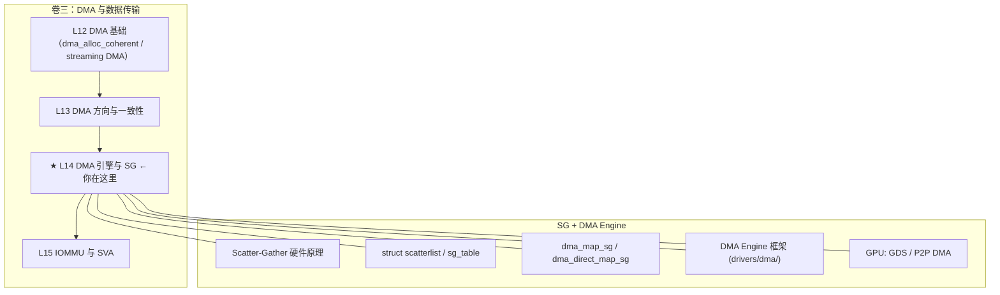

# L14：DMA 引擎与 SG

---

## 0. 框架定位



---


---

## 1. 问题驱动

> 🔍 **你遇到了一个问题：**
>
> 你要从 GPU 读取 8MB 的推理结果到 CPU 内存，
但你的 DMA 控制器一次只能处理 1MB。
`dma_map_sg` 是怎么把分散的内存块拼成一次 DMA 传输的？
Scatter-Gather 的硬件描述符链表怎么构建？
>
> **带着这个问题学完本节，你就知道答案了。**

---

## 2. 前置认知


**前置依赖**：
- L10：`ioremap`、MMIO 映射、内存类型（UC/WC/WB）
- L12：DMA 基础——`dma_alloc_coherent`、`dma_map_single`、流式 DMA vs 一致性 DMA
- L13：DMA 方向（`DMA_TO_DEVICE` / `DMA_FROM_DEVICE`）、cache 一致性

**核心问题**：大多数设备处理的数据不是物理连续的——文件系统 buffer、网络 SKB、用户态内存都是分散在不同物理页面的。如果 DMA 只能传一块物理连续内存，每次都要 bounce buffer 或 copy，性能灾难。SG（Scatter-Gather）解决了这个问题：设备硬件直接读取/写入一组不连续的物理块，每块独立描述。本文讲 SG 的硬件原理、内核数据结构、DMA 映射实现，以及 DMA Engine 框架如何抽象 SG 传输。

---

## 3. 核心原理

### 2.1 Scatter-Gather DMA：硬件角度的本质

**问题**：CPU 看内存是线性虚拟地址空间，但物理内存是碎片化的（buddy allocator 分配 4MB 以上的连续物理页可能失败）。传统 DMA 要求源/目的物理地址连续——如果数据分布在多个物理页，要么：

1. **bounce buffer**：先 copy 到一块连续缓冲区再 DMA（额外 copy，带宽减半）
2. **多次 DMA**：每次只传一块，多次发起（中断/上下文切换开销大）

**SG DMA 的方案**：硬件维护一个**描述符表**（Descriptor Table），每个条目描述一段物理内存的地址和长度。设备 DMA 引擎自动遍历这个表，把分散的块拼成连续的流传输——CPU 只提交一次描述符链表，硬件完成所有传输。

```
传统 DMA：
  CPU mem: [连续 buffer: addr=0x1000, len=0x4000] → DMA → Device

SG DMA：
  CPU mem: [page0@0x1000][page1@0xa000][page2@0x5000][page3@0xc000]
              ↓            ↓            ↓            ↓
  描述符表: [addr=0x1000,len=0x1000] → [addr=0xa000,len=0x1000]
            → [addr=0x5000,len=0x1000] → [addr=0xc000,len=0x1000]
              ↓
  Device DMA engine 自动遍历描述符链，连续传输 16KB
```

**硬件差异**（PCIe 设备设计时的选择）：

| 实现方式 | 描述符位置 | 硬件复杂度 | 典型场景 |
|---------|-----------|-----------|---------|
| **Ring-based** | 主机内存中一个环形队列，设备通过 DMA 读取 | 中 | 网卡（NAPI）、NVMe |
| **Linked-list** | 描述符通过 next 指针链成链表，硬件跟随指针 | 高（硬件要解析链表） | 高端网卡、GPU、Intel I/OAT |
| **Register-based** | 每次写寄存器设置当前块的 addr+len | 低（小传输） | 简单 SPI/I2C DMA |

> 📌 **协议对照**：PCIe 事务层不感知 SG——SG 是设备 DMA 控制器的内部逻辑。PCIe 层看到的只是连续的 Memory Read/Write TLP（PCIe Base Spec §2.2）。

### 2.2 为什么内核需要 SG list？——硬件描述符到内核抽象

硬件描述符的格式因设备而异（位宽、字段排列、字节序不同）。内核需要一种**设备无关的 SG 抽象**，让驱动开发者不关心硬件描述符的细微差异：

- 驱动用内核 SG API 构造 scatterlist → `dma_map_sg`（填充 DMA 地址）→ 提交给设备
- 设备自己把内核 SG 转成硬件描述符格式（通常硬件会有自己的 DMA 描述符结构，driver 填充后写入设备 MMIO 或主机内存描述符队列）

---

### 2.3 SG list 在内核中的数据结构

#### `struct scatterlist`：最基本的 SG 元素

```c
// include/linux/scatterlist.h:11
struct scatterlist {
    unsigned long   page_link;   // 物理页指针（低2位编码 SG_CHAIN/SG_END）
    unsigned int    offset;      // 页内偏移
    unsigned int    length;      // 本段长度（字节）
    dma_addr_t      dma_address; // DMA 映射后的总线地址（★ dma_map_sg 填充）
#ifdef CONFIG_NEED_SG_DMA_LENGTH
    unsigned int    dma_length;  // 映射后的长度（可被 IOMMU 合并缩短）
#endif
#ifdef CONFIG_NEED_SG_DMA_FLAGS
    unsigned int    dma_flags;   // 标志位：SG_DMA_BUS_ADDRESS / SG_DMA_SWIOTLB
#endif
};
```

**关键设计**：`page_link` 字段同时承担三个职责：
- `bit 0`（`SG_CHAIN`）：此 entry 不是数据页，而是指向下一个 SG 表的指针（chained SG）
- `bit 1`（`SG_END`）：此 entry 是链表的最后一个
- `bit 2+`：实际的 `struct page *` 指针

为什么这样设计？**节省 8 字节**。如果不借用低位，每个 scatterlist 需要两个指针（page + next）。通过把 page 指针和 metadata 编码在同一个 `unsigned long` 中，每个 SG entry 减少了一个指针开销——在高端网卡（几千个 SG entry）上，这个节省显著。

```c
// include/linux/scatterlist.h:67-68
#define SG_CHAIN    0x01UL
#define SG_END      0x02UL
#define SG_PAGE_LINK_MASK (SG_CHAIN | SG_END)

// 提取真实的 page 指针
static inline struct page *sg_page(struct scatterlist *sg)
{
    return (struct page *)((sg)->page_link & ~SG_PAGE_LINK_MASK);
}
```

#### `struct sg_table`：SG 表的容器

```c
// include/linux/scatterlist.h:39
struct sg_table {
    struct scatterlist *sgl;        // scatterlist 数组
    unsigned int nents;             // ★ dma_map_sg 后实际映射的 entry 数
    unsigned int orig_nents;        // dma_map_sg 之前的原始 entry 数
};
```

**为什么需要 `nents` 和 `orig_nents` 两个字段？**

- `orig_nents`：驱动构造的原始 SG entry 数——用于 `for_each_sg()` 遍历
- `nents`：`dma_map_sg` 返回的实际映射数——IOMMU 可能会合并多个物理不连续但 IOMMU 页表中连续的 entry，导致映射后的 entry 数减少。用于 `for_each_sgtable_dma_sg()`（只遍历映射后的有效 entry）

⚠ **常见错误**：unmap 时传的是 `orig_nents` 而不是 `nents`——驱动开发新手经常搞反。

#### Chained SG：超过固定大小的 SG 表

当 SG entry 数量超过预分配数组大小时，可以把多个 SG 数组链起来：

```c
// include/linux/scatterlist.h:252
static inline void sg_chain(struct scatterlist *prv, unsigned int prv_nents,
                            struct scatterlist *sgl)
{
    __sg_chain(&prv[prv_nents - 1], sgl);
}
```

```
scatterlist array 1:  [sg0][sg1][sg2][sg_CHAIN → 指向 array 2]
scatterlist array 2:  [sg3][sg4][sg5][sg_END]
```

遍历时 `sg_next()` 遇到 `SG_CHAIN` 标志自动跳转到下一个数组：

```c
static inline struct scatterlist *sg_next(struct scatterlist *sg)
{
    if (sg_is_last(sg))
        return NULL;
    sg++;
    if (unlikely(sg_is_chain(sg)))             // ↑ 位置3的标志位
        sg = sg_chain_ptr(sg);                 // 跳到 array 2 开头
    return sg;
}
```

#### SG 构造辅助函数

```c
// sg_set_page: 最常用的 SG 构造函数
// include/linux/scatterlist.h:158
static inline void sg_set_page(struct scatterlist *sg, struct page *page,
                              unsigned int len, unsigned int offset)
{
    VM_WARN_ON_ONCE(!page_range_contiguous(page, ...));
    sg_assign_page(sg, page);   // page_link = page pointer | flags
    sg->offset = offset;
    sg->length = len;
}

// sg_set_buf: 从虚拟地址构造 SG
// include/linux/scatterlist.h:206
static inline void sg_set_buf(struct scatterlist *sg, const void *buf,
                              unsigned int buflen)
{
    // ★ 内核提供了从虚拟地址构造的快捷方式
    // 内部用 virt_to_page(buf) 找到物理页
    sg_set_page(sg, virt_to_page(buf), buflen, offset_in_page(buf));
}
```

---

## 4. 内核源码带读

> x86_64 v7.0。本节追踪：`dma_map_sg` → `__dma_map_sg_attrs` → `dma_direct_map_sg` 的完整链路，以及 SG 核心函数实现。

### 3.1 入口：`dma_map_sg_attrs()`

```c
// kernel/dma/mapping.c:285
unsigned int dma_map_sg_attrs(struct device *dev, struct scatterlist *sg,
                              int nents, enum dma_data_direction dir,
                              unsigned long attrs)
{
    int ret;
    ret = __dma_map_sg_attrs(dev, sg, nents, dir, attrs);
    if (ret < 0)
        return 0;              // ← 错误路径：返回 0（保留，向后兼容）
    return ret;
}
EXPORT_SYMBOL(dma_map_sg_attrs);
```

**⚠ 注意点**：返回 0 表示失败——需要检查返回值。这是 Linux DMA API 特殊的设计（其他 dma_map 函数返回 `DMA_MAPPING_ERROR`），向下兼容旧驱动。

### 3.2 调度层：`__dma_map_sg_attrs()`

```c
// kernel/dma/mapping.c:233
static int __dma_map_sg_attrs(struct device *dev, struct scatterlist *sg,
                              int nents, enum dma_data_direction dir,
                              unsigned long attrs)
{
    const struct dma_map_ops *ops = get_dma_ops(dev);
    int ents;

    // == 步骤 1：方向校验 ==
    BUG_ON(!valid_dma_direction(dir));

    // == 步骤 2：一致性要求检查 ==
    if (!dev_is_dma_coherent(dev) && (attrs & DMA_ATTR_REQUIRE_COHERENT))
        return -EOPNOTSUPP;

    // == 步骤 3：dma_mask 检查 ==
    if (WARN_ON_ONCE(!dev->dma_mask))
        return 0;               // ← 异常：device 没有设置 dma_mask → 无法 DMA

    // == 步骤 4：分派到具体实现 ==
    if (dma_map_direct(dev, ops) || arch_dma_map_sg_direct(dev, sg, nents))
        ents = dma_direct_map_sg(dev, sg, nents, dir, attrs);  // ★ no-IOMMU 路径
    else if (use_dma_iommu(dev))
        ents = iommu_dma_map_sg(dev, sg, nents, dir, attrs);   // ★ IOMMU 路径
    else
        ents = ops->map_sg(dev, sg, nents, dir, attrs);        // 自定义 ops

    // == 步骤 5：成功后 trace + debug 记录 ==
    if (ents > 0) {
        kmsan_handle_dma_sg(sg, nents, dir);
        trace_dma_map_sg(dev, sg, nents, ents, dir, attrs);
        debug_dma_map_sg(dev, sg, nents, ents, dir, attrs);
    } else if (WARN_ON_ONCE(ents != -EINVAL && ents != -ENOMEM &&
                            ents != -EIO && ents != -EREMOTEIO)) {
        return -EIO;
    }

    return ents;
}
```

**异常路径汇总**：

| 错误码 | 条件 | 排查方法 |
|-------|------|---------|
| `-EOPNOTSUPP` | 非 coherent 设备 + `DMA_ATTR_REQUIRE_COHERENT` | 检查设备是否设置 coherent_dma_mask，或去掉 REQUIRE_COHERENT flag |
| `0`（当作失败） | `dev->dma_mask == NULL` | 确认 probe 中调用了 `dma_set_mask_and_coherent()` |
| `-EINVAL` | 无效方向参数 | 检查 `dir` 枚举值 |
| `-ENOMEM` | IOMMU 映射表空间不足 | 检查 CMA pool / IOMMU 页表内存 |
| `-EIO` | `dma_direct_map_phys` 返回 `DMA_MAPPING_ERROR` | 检查物理地址是否超出设备 DMA 范围 |
| `-EREMOTEIO` | P2PDMA 映射失败 | 检查 P2PDMA 支持是否启用 |

### 3.3 核心：`dma_direct_map_sg()`

**无 IOMMU 路径**——最常见的 x86 场景（IOMMU 通常只对虚拟化开启）。

```c
// kernel/dma/direct.c:454
int dma_direct_map_sg(struct device *dev, struct scatterlist *sgl, int nents,
                      enum dma_data_direction dir, unsigned long attrs)
{
    struct pci_p2pdma_map_state p2pdma_state = {};
    struct scatterlist *sg;
    int i, ret;

    // == 主流程：遍历每个 SG entry ==
    for_each_sg(sgl, sg, nents, i) {        // ← 逐段映射
        // ★ P2PDMA 状态机的三路分派
        switch (pci_p2pdma_state(&p2pdma_state, dev, sg_page(sg))) {
        case PCI_P2PDMA_MAP_THRU_HOST_BRIDGE:
            // ① 经 host bridge 的 P2P → 走 CPU 物理地址映射
            // fall through to normal break
            break;

        case PCI_P2PDMA_MAP_NONE:
            // ② 普通 DMA（非 P2P）→ 调用 dma_direct_map_phys
            sg->dma_address = dma_direct_map_phys(dev, sg_phys(sg),
                                   sg->length, dir, attrs);
            if (sg->dma_address == DMA_MAPPING_ERROR) {
                ret = -EIO;
                goto out_unmap;             // ← 异常：某个段映射失败
            }
            break;

        case PCI_P2PDMA_MAP_BUS_ADDR:
            // ③ 直接 P2P 总线地址 → 不需要 CPU 物理地址映射
            sg->dma_address = pci_p2pdma_bus_addr_map(
                p2pdma_state.mem, sg_phys(sg));
            sg_dma_len(sg) = sg->length;
            sg_dma_mark_bus_address(sg);    // ← 标记为总线地址
            continue;                       // （跳过 sg_dma_len 赋值，已在上面设了）

        default:
            ret = -EREMOTEIO;
            goto out_unmap;
        }
        sg_dma_len(sg) = sg->length;
    }

    return nents;    // == 成功返回：返回原始 entry 数（无 IOMMU 时 = 映射后数）==

out_unmap:
    // == 异常恢复：回滚已映射的段 ==
    dma_direct_unmap_sg(dev, sgl, i, dir, attrs | DMA_ATTR_SKIP_CPU_SYNC);
    return ret;
}
```

**⚠ 关键设计意图**：

1. **为什么 `dma_direct_map_sg` 返回 `nents` 而不是映射后的 entry 数？**  
   无 IOMMU 时物理地址 = 总线地址（除 P2PDMA 外），每个 SG entry 映射后保持独立，不会合并——所以 `nents` 就是映射后的 entry 数。IOMMU 路径（`iommu_dma_map_sg`）才会返回可能少于 `nents` 的值。

2. **`pci_p2pdma_state()` 为什么需要状态机？**  
   连续多个 SG entry 可能属于同一个 P2PDMA 映射——状态机缓存上一个映射的 P2PDMA 信息，避免对每一页都重新查询 P2PDMA 映射关系（查询涉及 PCI topology 遍历，很慢）。

3. **`sg_dma_mark_bus_address()` 的作用**  
   标记此段是总线地址（而不是 CPU 物理地址转换来的）。`dma_unmap_sg` 时，标记过的段不需要调用 `dma_direct_unmap_phys`（因为总线地址不是从 CPU 映射来的，不需要回滚）。

### 3.4 `dma_direct_map_phys()`：单段物理地址 → DMA 地址

```c
// kernel/dma/direct.h:81
static inline dma_addr_t dma_direct_map_phys(struct device *dev,
                phys_addr_t phys, size_t size, enum dma_data_direction dir,
                unsigned long attrs)
{
    dma_addr_t dma_addr;

    // == 步骤 1：SWIOTLB 强制 bounce 路径 ==
    if (is_swiotlb_force_bounce(dev)) {
        if (attrs & (DMA_ATTR_MMIO | DMA_ATTR_REQUIRE_COHERENT))
            return DMA_MAPPING_ERROR;
        return swiotlb_map(dev, phys, size, dir, attrs);
    }

    // == 步骤 2：MMIO 映射（DMA_ATTR_MMIO）==
    if (attrs & DMA_ATTR_MMIO) {
        dma_addr = phys;              // MMIO 物理地址直接作为总线地址
        if (unlikely(!dma_capable(dev, dma_addr, size, false)))
            goto err_overflow;
    } else {
        // == 步骤 3：普通内存 DMA 映射 ==
        dma_addr = phys_to_dma(dev, phys);  // ★ 物理→总线地址转换
        if (unlikely(!dma_capable(dev, dma_addr, size, true)) ||
            dma_kmalloc_needs_bounce(dev, size, dir)) {
            // 地址超出设备能力 → 尝试 SWIOTLB
            if (is_swiotlb_active(dev) && !(attrs & DMA_ATTR_REQUIRE_COHERENT))
                return swiotlb_map(dev, phys, size, dir, attrs);
            goto err_overflow;
        }
    }

    // == 步骤 4：非 coherent 设备 → cache 同步 ==
    if (!dev_is_dma_coherent(dev) && !(attrs & (DMA_ATTR_SKIP_CPU_SYNC | DMA_ATTR_MMIO)))
        arch_sync_dma_for_device(phys, size, dir);

    return dma_addr;

err_overflow:
    dev_WARN_ONCE(dev, 1,
        "DMA addr %pad+%zu overflow (mask %llx, bus limit %llx).\n",
        &dma_addr, size, *dev->dma_mask, dev->bus_dma_limit);
    return DMA_MAPPING_ERROR;
}
```

**⚠ x86 专属细节**：

- `phys_to_dma()` 在 x86 上：如果启用了 `CONFIG_ZONE_DMA`，低于 16MB 的物理页不需要偏移；高于 16MB 的物理地址需要做 `phys - offset` 转换（某些设备 DMA 地址空间和 CPU 物理地址空间不对齐）
- `dma_capable()` 检查：`dma_addr + size - 1 <= dev->dma_mask`——如果设备 `dma_mask` 是 32-bit（`0xFFFFFFFF`），而 `dma_addr` 在 4GB 以上 → 需要 SWIOTLB bounce
- `arch_sync_dma_for_device()` 在 x86 上：对于 non-coherent 设备（罕见，通常是 ARM），执行 `clflush`/`wbnoinvd` 刷 cache 行

### 3.5 `sg_next()` 和 `sg_set_buf()`：SG 遍历与构造

**`sg_next()`：链式 SG 的遍历**

```c
// include/linux/scatterlist.h:107
static inline struct scatterlist *sg_next(struct scatterlist *sg)
{
    if (sg_is_last(sg))            // SG_END 位置 → 结束
        return NULL;

    sg++;                          // 默认：下一个 entry = 地址 + sizeof(scatterlist)

    if (unlikely(sg_is_chain(sg))) // SG_CHAIN 位置 → 跳转到另一个 SG 表
        sg = sg_chain_ptr(sg);     // 取出 page_link 中真实的指针

    return sg;
}
```

**遍历宏**：
```c
// 用 for_each_sg 遍历驱动构造的 SG
#define for_each_sg(sglist, sg, nr, __i) \
    for (__i = 0, sg = (sglist); __i < (nr); __i++, sg = sg_next(sg))

// 用 for_each_sgtable_dma_sg 遍历映射后的 SG
#define for_each_sgtable_dma_sg(sgt, sg, i) \
    for_each_sg((sgt)->sgl, sg, (sgt)->nents, i)
```

**`sg_set_buf()`：从虚拟地址构造一个 SG entry**

```c
// include/linux/scatterlist.h:206
static inline void sg_set_buf(struct scatterlist *sg, const void *buf,
                              unsigned int buflen)
{
#ifdef CONFIG_DEBUG_SG
    BUG_ON(!virt_addr_valid(buf));   // ★ 必须是内核线性映射区的地址
#endif
    sg_set_page(sg, virt_to_page(buf), buflen, offset_in_page(buf));
}
```

**⚠ 限制**：`virt_addr_valid()` 检查 —— `buf` 必须来自内核线性映射区（low memory 或 `__va()` 可转换的区域）。vmalloc 地址、kmap 地址都不行。对这类地址需要手动计算 `struct page *`。

### 3.6 `sg_alloc_table()`：一次性分配完整 SG 表

```c
// include/linux/scatterlist.h:464
int sg_alloc_table(struct sg_table *sgt, unsigned int nents, gfp_t gfp);

// 用法示例：
struct sg_table sgt;
struct scatterlist *sg;
int i;

sg_alloc_table(&sgt, nents, GFP_KERNEL);    // 分配 nents 个 scatterlist

for_each_sg(sgt.sgl, sg, sgt.orig_nents, i) {
    sg_set_page(sg, pages[i], PAGE_SIZE, 0); // 填充每一段
}

dma_map_sgtable(dev, &sgt, DMA_TO_DEVICE, 0); // 映射

// ... 提交 DMA ...

dma_unmap_sgtable(dev, &sgt, DMA_TO_DEVICE, 0);
sg_free_table(&sgt);                         // 释放
```

---

## 5. DMA Engine（drivers/dma/）与 PCIe DMA 的关系

### 4.1 DMA Engine 是什么？

Linux **DMA Engine 框架**（`drivers/dma/`）是一套**对 DMA 控制器硬件**的抽象层——和 PCI 驱动模型类似，但是面向 DMA 控制器设备。

**关键区分**：

| | 普通 PCIe 驱动中的 DMA | DMA Engine 框架 |
|--|----------------------|----------------|
| **谁发起传输** | CPU（写描述符→触发） | 另一个硬件或内核子系统 |
| **典型调用** | `dma_map_single` → 写设备寄存器 | `dmaengine_prep_slave_sg` → `tx_submit` |
| **用例** | 网卡、NVMe、GPU 等设备自己的 DMA | memcpy offload、音频 cyclic DMA、FPGA DMA |
| **抽象级别** | 通用 DMA API（`dma_map_*`） | `struct dma_device` + `struct dma_chan` |

**PCIe 关联**：许多 DMA Engine 设备本身就是 PCIe 设备（如 Intel I/OAT、Intel DSA/IDXD）。它们通过 PCI 总线挂接，`drivers/dma/` 下的驱动先注册为 PCI 驱动，再向 DMA Engine 核心注册 `struct dma_device`。

### 4.2 DMA Engine 的核心数据结构

```c
// include/linux/dmaengine.h:868
struct dma_device {
    struct kref ref;
    unsigned int chancnt;            // DMA 通道数
    struct list_head channels;       // 通道链表（struct dma_chan）
    dma_cap_mask_t cap_mask;         // 能力位掩码（memcpy / xor / slave-sg 等）
    struct device *dev;              // 关联的 struct device

    // ★ SG 支持：device_prep_slave_sg
    struct dma_async_tx_descriptor *(*device_prep_slave_sg)(
        struct dma_chan *chan, struct scatterlist *sgl,
        unsigned int sg_len, enum dma_transfer_direction direction,
        unsigned long flags, void *context);

    // ... 其他操作回调 ...
    void (*device_issue_pending)(struct dma_chan *chan);
    enum dma_status (*device_tx_status)(struct dma_chan *chan,
                   dma_cookie_t cookie, struct dma_tx_state *txstate);
};

// include/linux/dmaengine.h:614
struct dma_async_tx_descriptor {
    dma_cookie_t cookie;              // 提交后的唯一标识
    struct dma_chan *chan;
    dma_cookie_t (*tx_submit)(struct dma_async_tx_descriptor *tx);
    int (*desc_free)(struct dma_async_tx_descriptor *tx);
    dma_async_tx_callback callback;   // 完成回调
    void *callback_param;
    struct dmaengine_unmap_data *unmap; // 内部自动管理 unmap
};
```

### 4.3 DMA Engine 的典型使用流程

```
                驱动代码                                   硬件
       ┌──────────────────┐                        ┌──────────────┐
       │ dma_request_chan │                        │ DMA 控制器   │
       │       ↓          │                        │ (PCIe设备)   │
       │ prep_slave_sg    │ ──── 构造 SG 描述符 ──→│ 获取 SG list  │
       │ (SG list in)     │                        │ 并解析        │
       │       ↓          │                        │              │
       │ tx_submit        │ ──── 提交到硬件队列 ──→│ 加入硬件 ring │
       │       ↓          │                        │              │
       │ issue_pending    │ ──── kick 硬件 ──────→│ DMA 引擎启动  │
       │       ↓          │                        │     ↓         │
       │ callback         │ ←── 中断 ─────────────│ 完成中断      │
       └──────────────────┘                        └──────────────┘
```

**驱动代码示例**（简化）：
```c
struct dma_chan *chan = dma_request_chan(dev, "rx");
struct scatterlist *sg = sgt.sgl;

// 1. 准备 SG 传输描述符
struct dma_async_tx_descriptor *tx = dmaengine_prep_slave_sg(
    chan, sg, sgt.nents, DMA_DEV_TO_MEM,
    DMA_PREP_INTERRUPT, NULL);
if (!tx)
    return -ENOMEM;

// 2. 设置完成回调
tx->callback = my_dma_done;
tx->callback_param = my_data;

// 3. 提交（加入硬件待处理队列）
dma_cookie_t cookie = dmaengine_submit(tx);

// 4. 触发硬件执行
dma_async_issue_pending(chan);

// 5. 等待完成
// ... 在 my_dma_done 中收到通知 ...
```

### 4.4 典型 PCIe DMA 控制器设备

| 驱动 | PCI 设备 | 功能 | 路径 |
|------|---------|------|------|
| `ioat` | Intel I/OAT（Integrated I/O Acceleration Technology） | 内存复制 offload、CRC、RAID | `drivers/dma/ioat/` |
| `idxd` | Intel DSA（Data Streaming Accelerator） | 内存搬运、转换、DIF 校验 | `drivers/dma/idxd/` |
| `qcom` | 高通 SoC 内嵌 DMA | SPI/UART 等外设 DMA | `drivers/dma/qcom/` |

Intel I/OAT 是最经典的 PCIe DMA Engine 设备——作为 PCIe 端点存在，CPU 写描述符到主机内存，IOAT 设备通过 DMA 读取描述符，执行 memcpy，完成后写 MSI-X 中断。

> 📌 **协议对照**：设备从主机内存读描述符是 **Memory Read TLP**（PCIe Base Spec §2.2.4）；传完数据后写中断是 **Memory Write TLP**（PCIe Base Spec §2.2.5）。

### 4.5 DMA Engine 与直接 DMA（驱动自己做）的取舍

| 场景 | 用 DMA Engine | 驱动自己写 DMA 描述符 |
|------|-------------|-------------------|
| 标准 offload（memcpy/xor/CRC） | ✓ 统一 API | ✗ 重复造轮子 |
| 网卡/NVMe/GPU 专有 DMA | ✗ 不合用 | ✓ 必须自己控制 |
| 音频 cyclic DMA | ✓ 框架原生支持 | ✗ 需要自己管理环形缓冲 |
| 极低延迟场景 | ✗ 额外框架开销 | ✓ 直接写硬件寄存器 |

> **决定因素**：如果设备的主要功能就是 DMA 控制器（如 I/OAT、DSA），用 DMA Engine。如果 DMA 只是设备功能的一部分（如网卡、NVMe、GPU），驱动自己管理 DMA 描述符。

---

## 6. GPU 场景：GDS 和 P2P DMA 的 SG 应用

### 5.1 GPUDirect Storage（GDS）

**问题**：传统 GPU 训练的数据流是 `NVMe → CPU RAM → GPU RAM`——多一次 CPU 内存中转，瓶颈在 PCIe 往返和 CPU 内存带宽。

**GDS 方案**：NVMe SSD → GPU 内存**直通**，CPU 只在控制路径：
```
传统：NVMe → DMA → CPU RAM → cudaMemcpy → GPU RAM
                (PCIe read)     (PCIe write)  两次 PCIe 穿越

GDS：  NVMe → DMA → GPU RAM
                (PCIe read, GPU BAR 为目标)  一次 PCIe 穿越
```

**GDS 中的 SG 角色**：
1. NVMe 驱动的 PRP（Physical Region Page）list 本质就是 SG list——每个 PRP entry 描述一个物理页
2. GDS 需要把 GPU 内存的物理地址（BAR 中的 GPU 显存偏移）映射为 NVMe 控制器可访问的地址
3. `dma_map_sg` 在 GDS 场景被调用时，`sg_page()` 返回的是 GPU 显存的页（通过 `dma_map_sg` 的 P2PDMA 路径）

### 5.2 P2P DMA 的 SG 处理

GPU 与 NVMe 之间的 P2P DMA 映射在 `dma_direct_map_sg` 中走 `PCI_P2PDMA_MAP_BUS_ADDR` 分支：

```c
// dma_direct_map_sg 中的 P2P 路径
case PCI_P2PDMA_MAP_BUS_ADDR:
    // sg_phys(sg) 返回 GPU 页的物理地址（mmio remap 区域）
    // pci_p2pdma_bus_addr_map 转换成 NVMe 控制器视角的总线地址
    sg->dma_address = pci_p2pdma_bus_addr_map(p2pdma_state.mem, sg_phys(sg));
    sg_dma_len(sg) = sg->length;
    sg_dma_mark_bus_address(sg);   // ← 标记为总线地址
    continue;
```

**内核 P2PDMA 的 SG 限制**（`drivers/pci/p2pdma.c`）：

- P2PDMA 只能在同一 PCI 拓扑树内的设备之间进行（通过 PCI switch 相连，不经过 host bridge）
- 跨 host bridge 的 P2P 回退到 CPU 物理地址映射（`PCI_P2PDMA_MAP_THRU_HOST_BRIDGE` 分支）——这时性能没有提升，因为要走 CPU 中转
- SG list 中不能混合普通内存页和 P2PDMA 页——`dma_map_sg` 拒绝映射混合类型的 SG

### 5.3 GPU DMA 描述符（CUDA 内核侧）

NVIDIA GPU 驱动的 DMA 描述符（`nvidia.ko` 内部实现）也是 SG 风格的：

```
GPU DMA 描述符结构（NVIDIA 私有，此处为示意）：
┌─────────────────────────────────────┐
│ segment_count = 3                   │
├─────────────────────────────────────┤
│ seg[0]: pcie_addr=0x1000_0000, len=4096  ← GPU BAR 中偏移 0x1000_0000
│ seg[1]: pcie_addr=0x2000_0000, len=4096  ← GPU BAR 中偏移 0x2000_0000
│ seg[2]: pcie_addr=0x3000_0000, len=4096  ← GPU BAR 中偏移 0x3000_0000
│ ... （GPU 硬件直接从 BAR 地址空间读/写数据）...
└─────────────────────────────────────┘
```

当 CUDA 调用 `cudaMemcpyAsync` 时：
1. CPU 侧的 `nvidia.ko` 驱动用 `dma_map_sg` 映射源或目的 buffer 的物理页
2. GPU 的 DMA 引擎读取驱动写入的描述符（在 GPU 的 MMIO 空间或主机内存的 ring buffer 中）
3. GPU DMA 引擎遍历 SG entry——逐段发出 PCIe Memory Read/Write TLP

---

## 7. 思考题

**第一题（设计意图题）**：`struct scatterlist` 为什么把 page 指针和 `SG_CHAIN`/`SG_END` 标志编码在同一个 `unsigned long` 字段里？为什么不直接用 `struct page *page` + `struct scatterlist *next` 两个指针？

**第二题（代码实操题）**：一个驱动用 `dma_map_sgtable()` 映射了一个有 256 个 entry 的 SG 表。返回后 `sgt.nents == 128`。请解释可能的原因，以及 `dma_unmap_sgtable()` 应该传哪个值——`sgt.nents` 还是 `sgt.orig_nents`？为什么？

**第三题（排查题）**：你在 probe 中做了 `dma_set_mask_and_coherent(dev, DMA_BIT_MASK(64))`，但 `dma_map_sg()` 每次返回 0。你在 `dmesg` 中看到 `"DMA addr 0x... overflow (mask ffffffff, bus limit 0)"`。请分析根因并给出修复方案。

---

## 6b. 参考答案

**Q1**：

设计意图是**内存效率**。`struct scatterlist` 是内核中高频使用的结构——网卡每收到一个 SKB 可能就涉及一个 SG entry。在 64 位系统上，`unsigned long` 是 8 字节。如果 page 指针和 next 指针分别占 8 字节，每个 SG entry 多 8 字节开销。一个 4096-entry 的 SG 表（高端网卡常见 size）就多出 32KB。

利用 page 指针的低 2 位（页对齐至少 4KB，低 12 位总是 0）存储 `SG_CHAIN` 和 `SG_END` 标志，是经典的"低位借用"（bit stealing）技巧。代价是每次取 page 时需要 `& ~SG_PAGE_LINK_MASK` 掩码——一次 AND 操作换 8 字节/entry。

**替代方案对比**：
- 用独立 next 指针：简单但浪费内存
- 用 offset+length 中的保留位：位移受限
- 当前方案：最低 2 bit 做链标志，剩余 62 bit 做指针——64K entry 以内最多浪费 2 bit，但节省了独立 next 指针的完整 8 字节

**Q2**：

原因：IOMMU（intel-iommu 或 amd-iommu）被启用。当 IOMMU 在线时，`__dma_map_sg_attrs` 分派到 `iommu_dma_map_sg()`。IOMMU 可以为物理上分散但 IOMMU 页表中连续的区域分配一个连续的 IOVA（I/O Virtual Address），从而合并多个物理 SG entry 为单个 IOVA 范围。`sgt.nents = 128` 表示 IOMMU 把 256 段物理不连续的内存映射成了 128 段 IOVA 连续的映射。

**解映射用哪个值**：必须用 `sgt.orig_nents`！`dma_unmap_sgtable` 内部实现会遍历原始 SG 表，用 `orig_nents` 数量恢复每个 entry 的原始状态。如果传入 `nents`（128），只有前 128 个 entry 被释放，后 128 个 entry 的 IOMMU 映射残留——导致 IOMMU 页表泄漏（设备后续访问可能读到错误数据，或 IOMMU 空间耗尽）。

**Q3**：

根因分析：
- `dma_addr 0x... overflow (mask ffffffff, bus limit 0)` 明确指出：DMA 地址超过了 `dma_mask`（`0xffffffff` = 32-bit）
- `mask ffffffff` 表明设备实际使用的 `dma_mask` 是 32-bit，而不是我们设置的 64-bit
- 可能的根因：`dma_set_mask_and_coherent(dev, DMA_BIT_MASK(64))` **失败**了，但驱动没有检查返回值

`dma_set_mask_and_coherent` 的返回值语义：
```c
// 正确用法：
if (dma_set_mask_and_coherent(dev, DMA_BIT_MASK(64))) {
    ret = dma_set_mask_and_coherent(dev, DMA_BIT_MASK(32));
    if (ret) {
        dev_err(dev, "no suitable DMA mask\n");
        return ret;
    }
}
```

如果设备不支持 64-bit 寻址（某些旧的 PCIe 端点只支持 32-bit DMA），`DMA_BIT_MASK(64)` 调用会失败，`dev->dma_mask` 仍保持默认值（通常是 32-bit mask）。然后 `dma_map_sg` 映射的物理地址如果高于 4GB → overflow。

**修复方案**：
1. 在 probe 中检查 `dma_set_mask_and_coherent` 返回值
2. 如果 64-bit 失败，fallback 到 32-bit
3. 确保物理分配在 4GB 以下（`GFP_DMA32`）——但如果设备本身就是 64-bit 能力，是别的问题
4. 检查 `lspci -vvv` 的输出，确认设备是否支持 `DAC`（Dual Address Cycle）——即 64-bit 寻址

---

## 8. 渐进式代码构建

在前 10 讲基础上（L03：空 probe → L08：+ BAR 读取 → L10：+ ioremap），本节在 probe 中加 SG DMA 映射和 DMA Engine 的使用。

```c
// 在 probe 中增加 SG DMA 映射
// 假设：BAR0 是 MMIO 寄存器空间（ioremap），BAR2 是门铃 MMIO
// 构建一个 SG 表→映射→提交给 DMA Engine

#include <linux/scatterlist.h>
#include <linux/dma-mapping.h>
#include <linux/dmaengine.h>
#include <linux/pci.h>

struct my_pci_dev {
    void __iomem *bar0;          // L10 已经做了 ioremap
    void __iomem *doorbell;      // BAR2
    struct pci_dev *pdev;
    struct dma_chan *dma_chan;   // DMA Engine 通道
};

static int my_dma_sg_transfer(struct pci_dev *pdev,
                              struct page **pages, int nr_pages)
{
    struct scatterlist sg[SG_CHUNK_SIZE];
    struct sg_table sgt;
    struct dma_async_tx_descriptor *tx;
    int i, ret;

    // == 第一步：构建 SG 表 ==
    sg_alloc_table(&sgt, nr_pages, GFP_KERNEL);
    for_each_sg(sgt.sgl, sg, sgt.orig_nents, i) {
        sg_set_page(sg, pages[i], PAGE_SIZE, 0);
    }

    // == 第二步：DMA 映射（获取设备可见的 DMA 地址）==
    ret = dma_map_sgtable(&pdev->dev, &sgt, DMA_BIDIRECTIONAL, 0);
    if (ret)
        goto err_free_sg;

    // == 第三步（可选）：通过 DMA Engine 提交 ==
    // 需要先 dma_request_channel（见前面示例）
    if (my_dev->dma_chan) {
        tx = dmaengine_prep_slave_sg(my_dev->dma_chan,
                                     sgt.sgl, sgt.nents,
                                     DMA_MEM_TO_DEV,
                                     DMA_PREP_INTERRUPT, NULL);
        if (!tx) {
            ret = -ENOMEM;
            goto err_unmap;
        }
        dmaengine_submit(tx);
        dma_async_issue_pending(my_dev->dma_chan);
        // 传输异步进行...
    }

    // == 第四步：手动触发（如果没有 DMA Engine）==
    // 对于简单的 PCIe 设备，驱动自己写门铃寄存器触发 DMA：
    iowrite32(sgt.sgl->dma_address, my_dev->doorbell + DOORBELL_SRC);
    iowrite32(sgt.nents, my_dev->doorbell + DOORBELL_LEN);
    iowrite32(1, my_dev->doorbell + DOORBELL_GO);  // kick hardware

    return 0;

err_unmap:
    dma_unmap_sgtable(&pdev->dev, &sgt, DMA_BIDIRECTIONAL, 0);
err_free_sg:
    sg_free_table(&sgt);
    return ret;
}

static int my_probe(struct pci_dev *pdev, const struct pci_device_id *id)
{
    struct my_pci_dev *my_dev;
    int ret;

    my_dev = devm_kzalloc(&pdev->dev, sizeof(*my_dev), GFP_KERNEL);
    if (!my_dev)
        return -ENOMEM;

    pci_set_drvdata(pdev, my_dev);
    my_dev->pdev = pdev;

    // L03: pci_enable_device + pci_set_master
    ret = pci_enable_device(pdev);
    if (ret)
        return ret;
    pci_set_master(pdev);

    // L08: BAR 读取
    // L10: ioremap
    my_dev->bar0 = pcim_iomap(pdev, 0, 0);
    my_dev->doorbell = pcim_iomap(pdev, 2, 0);
    if (!my_dev->bar0 || !my_dev->doorbell)
        return -ENOMEM;

    // ★ L14: DMA mask 设置（必须检查返回值！）
    ret = dma_set_mask_and_coherent(&pdev->dev, DMA_BIT_MASK(64));
    if (ret) {
        ret = dma_set_mask_and_coherent(&pdev->dev, DMA_BIT_MASK(32));
        if (ret) {
            dev_err(&pdev->dev, "No usable DMA mask\n");
            return ret;
        }
    }

    // ★ L14: 可选：申请 DMA Engine 通道
    my_dev->dma_chan = dma_request_chan(&pdev->dev, "dma0");
    if (IS_ERR(my_dev->dma_chan)) {
        dev_info(&pdev->dev, "DMA Engine not available, using direct\n");
        my_dev->dma_chan = NULL;  // fallback: 直接写门铃
    }

    dev_info(&pdev->dev,
             "L14: probe done, DMA mask=%llx, dma_chan=%s\n",
             *pdev->dev.dma_mask,
             my_dev->dma_chan ? "yes" : "no (direct)");
    return 0;
}

static void my_remove(struct pci_dev *pdev)
{
    struct my_pci_dev *my_dev = pci_get_drvdata(pdev);

    if (my_dev->dma_chan)
        dma_release_channel(my_dev->dma_chan);

    pcim_iounmap(pdev, my_dev->bar0);
    pcim_iounmap(pdev, my_dev->doorbell);

    pci_disable_device(pdev);
}
```

**L14 增量**（相对于 L10）：
1. `dma_set_mask_and_coherent` 设置 + **返回值检查**（常见 bug 源头）
2. `sg_alloc_table` + `sg_set_page` 构建 SG 表
3. `dma_map_sgtable` 映射 SG 获取 DMA 地址
4. `dma_request_chan` 申请 DMA Engine 通道（可选）
5. 手动设备控制（写门铃寄存器 kick DMA）和 DMA Engine 两条路径

---
