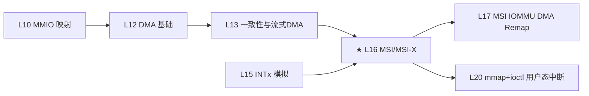

# L16：MSI / MSI-X

## 0. 框架定位



L16 是中断体系的转折点——从 INTx 的边带电平/边沿信号切换到 MSI 的 **内存写 TLP** 中断。MSI-X 又是 MSI 的进化版：每向量独立地址/数据，支持多队列亲和性。L17 将展开 IOMMU 对 MSI 地址的重映射（Interrupt Remapping）。


---

## 1. 问题驱动

> 🔍 **你遇到了一个问题：**
>
> 你给 GPU 注册了 MSI-X 中断：`pci_alloc_irq_vectors` + `request_irq`。
GPU 触发了中断，但你的 handler **从来没被调过**。
MSI/MSI-X 的中断消息是怎么从 GPU 走到 CPU 的？
为什么 INTx 能用但 MSI-X 不行？
>
> **带着这个问题学完本节，你就知道答案了。**

---

## 2. 前置认知


| 前置篇号 | 内容 | 与本篇关系 |
|----------|------|-----------|
| L10 | MMIO 映射（ioremap / PAT / WC） | MSI-X Table 通过 MMIO 映射访问，内存类型必须为 UC |
| L12 | DMA 基础（地址空间 / TLP 路由） | MSI 本质是 DMA 写 TLP，地址是 MSI 地址，数据是 MSI Data |
| L13 | 一致性与流式 DMA | MSI 消息写入同样遵循 PCIe 排序规则（Posted vs Non-Posted） |
| L15 | INTx 模拟（电平中断 / IRQ 共享） | MSI 替代 INTx 后，pci_intx() 必须被 pci_intx_for_msi() 关闭 |

**首次出现概念**：
- **MSI 地址**：x86 上通常为 `0xFEEX_XXXX`（Local APIC 基地址），MSI 写 TLP 的目标地址。
- **MSI Data**：写入该地址的数据，编码向量号 + 触发模式 + 投递模式。
- **MSI-X Table**：设备 BAR 空间中一张表，每向量独占 16 字节（Address Lo / Address Hi / Data / Vector Control）。
- **PBA（Pending Bit Array）**：设备 BAR 空间中存放待处理中断位图的区域。
- **BIR（BAR Indicator Register）**：MSI-X Table / PBA 位于哪个 BAR 的编码。

## 3. 核心原理

### 2.1 为什么设计 MSI？

INTx 的两大痛点：

1. **边带信号走线成本**：INTx 需要额外的物理引脚（INTA#/INTB#/INTC#/INTD#），在 x86 南桥 PIRQ 路由时还要经过复杂的 8259A → APIC 转换（参见 L15）。
2. **共享中断风暴**：INTx 是电平触发的——多个设备共享一根 INTx 线，一个设备不释放就导致整条 IRQ 线被永久屏蔽。

**MSI 的解决思路**：中断信号不在边带传输，而是**通过标准内存写 TLP（Posted Write）发送给 CPU**。设备写一个特定的内存地址（`0xFEEX_XXXX`——x86 Local APIC 地址），中断控制器的接收逻辑识别这个 TLP，解码出向量号，直接注入 CPU。

```
        INTx 路径                                MSI 路径
  ┌────────┐  INTA# ═══╗  ┌──────┐         ┌────────┐  MemWr TLP   ┌──────┐
  │ Device ├═══════════╝  │ 8259 ├─IRQ→CPU  │ Device ├────────────→│ APIC │
  └────────┘              │ PIC  │           └────────┘  0xFEE...  └──────┘
                          └──────┘
```

> 📌 **协议对照**：MSI TLP = Memory Write (Posted) + Address = `0xFEEX_XXXX` + Data = vector + delivery mode。PCIe Base Spec §6.1。

### 2.2 MSI Capability 结构

MSI Capability（`PCI_CAP_ID_MSI = 0x05`）位于 Configuration Space：

```
MSI Capability (Offset dev->msi_cap)
┌─────────────┬──────────┬──────────────────────────────┐
│ Cap ID (1B) │ Next (1B)│ Message Control (2B)         │ ← PCI_MSI_FLAGS (0x02)
│             │          │  Bit 0: MSIE (Enable)        │
│             │          │  Bit 1-3: MMC (Multi Msg Cap)│
│             │          │  Bit 4-6: MME (Multi Msg En) │
│             │          │  Bit 7: 64-bit addressing     │
│             │          │  Bit 8: Per-vector masking    │
├─────────────┴──────────┴──────────────────────────────┤
│ Message Address (4B)  — PCI_MSI_ADDRESS_LO (0x04)     │
├───────────────────────────────────────────────────────┤
│ Message Upper Address (4B) — PCI_MSI_ADDRESS_HI (0x08)│ ← 仅 64-bit 模式存在
├───────────────────────────────────────────────────────┤
│ Message Data (2B) — PCI_MSI_DATA_64/32                │
├───────────────────────────────────────────────────────┤
│ Mask Bits (4B) — PCI_MSI_MASK_64/32                   │ ← 可选，Per-vector Mask
├───────────────────────────────────────────────────────┤
│ Pending Bits (4B) — PCI_MSI_PENDING_64/32             │
└───────────────────────────────────────────────────────┘
```

MSI 的核心限制：
- **最多 32 个向量**（MMC 5 bit，2^5=32），且必须是 2 的幂。
- **多向量共享同一地址/数据**：所有 MSI 向量使用相同的 Message Address 和 Message Data，区别仅在于 Data 字段的低位被 Mask Bits 编码 — 当 MME=3（8 vectors）时，设备向 Message Address 写 Data | vector_index。
- **没有 MMIO 表**：配置全在 Config Space，Probe 期间不需要 ioremap。

### 2.3 MSI-X Capability 结构

MSI-X Capability（`PCI_CAP_ID_MSIX = 0x11`）同样在 Config Space，但核心配置通过 **BAR 空间中的 MSI-X Table** 实现。

```
MSI-X Capability (Offset dev->msix_cap)
┌─────────────┬──────────┬──────────────────────────────┐
│ Cap ID (1B) │ Next (1B)│ Message Control (2B)         │ ← PCI_MSIX_FLAGS (0x02)
│             │          │  Bit 0-10: Table Size (N)   │   N+1 = 向量数
│             │          │  Bit 14: Function Mask       │
│             │          │  Bit 15: MSI-X Enable        │
├─────────────┴──────────┴──────────────────────────────┤
│ Table Offset / BIR (4B) — PCI_MSIX_TABLE (0x04)       │
│  Bit 0-2: BIR (BAR Index)                            │
│  Bit 3-31: Offset into BAR (aligned to 4K)           │
├───────────────────────────────────────────────────────┤
│ PBA Offset / BIR (4B) — PCI_MSIX_PBA (0x08)          │
│  Bit 0-2: BIR                                        │
│  Bit 3-31: Offset                                     │
└───────────────────────────────────────────────────────┘

MSI-X Table Entry (16 bytes each, in BAR MMIO space)
┌──────────────┬──────────────┬──────────┬────────────────┐
│ Addr Lo (4B) │ Addr Hi (4B) │ Data (4B)│ Vector Ctrl(4B)│
│              │              │          │ Bit 0: Mask    │
│ PCI_MSIX_    │ PCI_MSIX_    │ PCI_MSIX_│ PCI_MSIX_ENTRY_│
│ ENTRY_LOWER  │ ENTRY_UPPER  │ ENTRY_   │ VECTOR_CTRL    │
│ _ADDR (0x00) │ _ADDR (0x04) │ DATA     │ (0x0C)         │
│              │              │ (0x08)   │                │
└──────────────┴──────────────┴──────────┴────────────────┘
```

MSI-X 的核心优势：

| 特性 | MSI | MSI-X |
|------|-----|-------|
| 最大向量数 | 32（2 的幂） | 2048（任意值） |
| 每向量地址/数据 | 共享 | **独立** |
| 每向量 Mask | Per-vector Mask 位图 | **独立 Mask 位**（Vector Control） |
| 配置存放 | Config Space | **BAR MMIO 空间** |
| 动态分配 | 不支持 | **支持**（v7.0 `pci_msix_alloc_irq_at`） |

**为什么每向量独立地址/数据重要**？因为 IRQ 亲和性（affinity）需要在向量级别将中断路由到不同 CPU。MSI 所有向量共享同一地址，只能路由到同一个 CPU cluster。MSI-X 每向量独立地址，IOMMU Interrupt Remapping 可以为每个向量设置不同的 `IRTE`（Interrupt Remap Table Entry），把向量 A 送到 CPU0、向量 B 送到 CPU1。

### 2.4 PBA（Pending Bit Array）

MSI-X 的 PBA 也是一个 BAR 映射区域，每个向量占据 1 bit。当设备向已 Mask 的 MSI-X 向量触发中断，TLP 不会被丢弃——设备将对应的 PBA bit 置 1。当 Vector Control 的 Mask bit 被清除时，设备检查 PBA：如果对应 bit 为 1，立即发送相应 MSI-X TLP 并清除该 bit。

**设计意图**：PBA 确保 **mask 期间的中断不丢失**——INTx 的电平不会丢失，MSI 的写 TLP 一旦 mask 就吞掉了，MSI-X 用 PBA 解决了这个问题。

### 2.5 x86 MSI 地址编码

x86 上 MSI Address 固定为 `0xFEEX_XXXX`，解码规则：

```
Address[31:20] = 0xFEE (固定)
Address[19:12] = Destination ID (CPU 的 APIC ID)
Address[11:4]  = Reserved
Address[3]     = RH (Redirection Hint)
Address[2]     = DM (Destination Mode: 0=physical, 1=logical)
```

Data 字段编码：
```
Data[7:0]   = Vector (中断向量号，通常 0x20-0xFF)
Data[10:8]  = Delivery Mode (010b=Fixed, 000b= Lowest Priority)
Data[15]    = Trigger Mode (0=Edge, MSI 固定为 Edge)
```

> 📌 **协议对照**：MSI Message Address/Data 格式 → Intel SDM Vol.3 §10.11 "Message Signalled Interrupts"。

## 4. 内核源码带读

> x86_64 v7.0。以下分析 `drivers/pci/msi/` 目录下 MSI/MSI-X 的核心实现。

### 3.1 入口：`pci_alloc_irq_vectors()` —— 驱动最上层 API

**源码**：`drivers/pci/msi/api.c:232`

```c
// drivers/pci/msi/api.c:232
int pci_alloc_irq_vectors(struct pci_dev *dev, unsigned int min_vecs,
                          unsigned int max_vecs, unsigned int flags)
{
    return pci_alloc_irq_vectors_affinity(dev, min_vecs, max_vecs, flags, NULL);
}
```

直接转发到 `pci_alloc_irq_vectors_affinity`（`api.c:252`），核心逻辑：

```c
// drivers/pci/msi/api.c:252
int pci_alloc_irq_vectors_affinity(struct pci_dev *dev, unsigned int min_vecs,
                                   unsigned int max_vecs, unsigned int flags,
                                   struct irq_affinity *affd)
{
    struct irq_affinity msi_default_affd = {0};
    int nvecs = -ENOSPC;

    if (flags & PCI_IRQ_AFFINITY) {
        if (!affd)
            affd = &msi_default_affd;      // ★ 自动创建默认亲和性描述
    }

    if (flags & PCI_IRQ_MSIX) {
        nvecs = __pci_enable_msix_range(dev, NULL, min_vecs, max_vecs, affd, flags);
        if (nvecs > 0)
            return nvecs;                   // ★ MSI-X 优先尝试
    }

    if (flags & PCI_IRQ_MSI) {
        nvecs = __pci_enable_msi_range(dev, min_vecs, max_vecs, affd);
        if (nvecs > 0)
            return nvecs;                   // ★ MSI 次选
    }

    if (flags & PCI_IRQ_INTX) {
        if (min_vecs == 1 && dev->irq) {
            if (affd)
                irq_create_affinity_masks(1, affd);
            pci_intx(dev, 1);              // ★ INTx 兜底（仅单向量）
            return 1;
        }
    }
    return nvecs;
}
```

**选型优先级**：`MSI-X > MSI > INTx`。

**⚠ 注意点**：
- `flags & PCI_IRQ_AFFINITY`：不加此 flag，affd 参数被忽略，即使传入了非 NULL 的 affd 也会 WARN 且清零（L263-265）。
- `dev->irq`：INTx 兜底依赖 `dev->irq` 非零，即设备必须已注册了 INTx IRQ（由 `pci_register_device` 在 probe 阶段通过 `pci_read_irq()` 读取 Interrupt Line 完成）。

### 3.2 MSI-X 初始化：`msix_capability_init()`

**源码**：`drivers/pci/msi/msi.c:724`

```c
// drivers/pci/msi/msi.c:724
static int msix_capability_init(struct pci_dev *dev, struct msix_entry *entries,
                                int nvec, struct irq_affinity *affd)
{
    int ret, tsize;
    u16 control;

    // == 步骤 1：启用 MSI-X + 全局 Mask（防止配置中产生虚假中断）==
    pci_msix_clear_and_set_ctrl(dev, 0,
            PCI_MSIX_FLAGS_MASKALL | PCI_MSIX_FLAGS_ENABLE);  // msi.c:735-736

    dev->msix_enabled = 1;                                      // msi.c:739

    // == 步骤 2：读取 Table Size，map MSI-X Table BAR 区域 ==
    pci_read_config_word(dev, dev->msix_cap + PCI_MSIX_FLAGS, &control); // msi.c:741
    tsize = msix_table_size(control);                            // msi.c:743
    dev->msix_base = msix_map_region(dev, tsize);                // msi.c:744
    if (!dev->msix_base) {                                       // msi.c:745
        ret = -ENOMEM;
        goto out_disable;                                        // == 异常路径 ==
    }

    // == 步骤 3：创建 MSI descriptors + 分配 IRQ ==
    ret = msix_setup_interrupts(dev, entries, nvec, affd);       // msi.c:750
    if (ret)
        goto out_unmap;                                          // == 异常路径 ==

    // == 步骤 4：关闭 INTx ==
    pci_intx_for_msi(dev, 0);                                    // msi.c:755

    // == 步骤 5：全表 Mask（防 kexec/kdump 干扰）==
    if (!pci_msi_domain_supports(dev, MSI_FLAG_NO_MASK, DENY_LEGACY))
        msix_mask_all(dev->msix_base, tsize);                    // msi.c:766

    pci_msix_clear_and_set_ctrl(dev, PCI_MSIX_FLAGS_MASKALL, 0); // msi.c:768
    pcibios_free_irq(dev);
    return 0;

out_unmap:
    iounmap(dev->msix_base);
out_disable:
    dev->msix_enabled = 0;
    pci_msix_clear_and_set_ctrl(dev,
            PCI_MSIX_FLAGS_MASKALL | PCI_MSIX_FLAGS_ENABLE, 0);
    return ret;
}
```

**`msix_map_region()`**（`msi.c:574`）解析 `PCI_MSIX_TABLE` 寄存器的 BIR 和 Offset，从对应 BAR 的物理地址 + offset 做 `ioremap()`。**内存类型为 UC**——MSI-X Table 中的 Data/Control 寄存器读写必须保证严格排序。

**`msix_setup_interrupts()`**（`msi.c:703`）→ `__msix_setup_interrupts()`（`msi.c:680`）→ `msix_setup_msi_descs()`（`msi.c:634`）→ `msix_prepare_msi_desc()`（`msi.c:613`）：

```c
// drivers/pci/msi/msi.c:613
void msix_prepare_msi_desc(struct pci_dev *dev, struct msi_desc *desc)
{
    desc->nvec_used                 = 1;
    desc->pci.msi_attrib.is_msix    = 1;
    desc->pci.msi_attrib.is_64      = 1;               // MSI-X 强制 64-bit 地址
    desc->pci.msi_attrib.default_irq= dev->irq;
    desc->pci.mask_base             = dev->msix_base;   // ★ 指向 Table MMIO 基址

    if (!pci_msi_domain_supports(dev, MSI_FLAG_NO_MASK, DENY_LEGACY) &&
        !desc->pci.msi_attrib.is_virtual) {
        desc->pci.msi_attrib.can_mask = 1;
        desc->pci.msix_ctrl = readl(addr + PCI_MSIX_ENTRY_VECTOR_CTRL); // 缓存当前状态
    }
}
```

**⚠ 注意点**：
- MSI-X 强制 64-bit 地址（`is_64 = 1`），`mask_base` 指向 `dev->msix_base + index * 16`，即第 N 个向量在 MMIO 表中的基址。
- `is_virtual` 标志处理硬件 Table Size 小于请求向量数的场景（`PCI_IRQ_VIRTUAL` 回退），这类虚拟向量**不支持 Mask**。
- 异常的 Marvell NVMe 桥片问题（`msi.c:762-765` 注释）：某些设备在 MSI-X **禁用**状态下仍读取 Mask 位——导致 MSI 也被阻塞。所以内核在 MSI-X enable 后才 mask，而非 enable 前。

### 3.3 MSI 初始化：`msi_capability_init()`

**源码**：`drivers/pci/msi/msi.c:403`

```c
// drivers/pci/msi/msi.c:403
static int msi_capability_init(struct pci_dev *dev, int nvec,
                               struct irq_affinity *affd)
{
    // == 步骤 1：拒绝不支持 Multi-MSI 的域请求多向量 ==
    if (nvec > 1 && !pci_msi_domain_supports(dev, MSI_FLAG_MULTI_PCI_MSI, ALLOW_LEGACY))
        return 1;        // ★ 返回正数：表示"我能支持的向量数 = 1"

    pci_msi_set_enable(dev, 0);           // 配置前关闭 MSI

    struct irq_affinity_desc *masks = affd ? irq_create_affinity_masks(nvec, affd) : NULL;

    guard(msi_descs_lock)(&dev->dev);
    return __msi_capability_init(dev, nvec, masks);
}
```

`__msi_capability_init()`（`msi.c:350`）的核心流程：

```c
// drivers/pci/msi/msi.c:350
static int __msi_capability_init(struct pci_dev *dev, int nvec,
                                 struct irq_affinity_desc *masks)
{
    // == 步骤 1：创建 MSI descriptor ==
    ret = msi_setup_msi_desc(dev, nvec, masks);
    //    ↑ 内部读取 PCI_MSI_FLAGS，解析 is_64/can_mask/multi_cap 等

    // == 步骤 2：全部 Mask（防止配置过程中误触发）==
    entry = msi_first_desc(&dev->dev, MSI_DESC_ALL);
    pci_msi_mask(entry, msi_multi_mask(entry));

    // == 步骤 3：通过 irqdomain 分配 IRQ，写入 Message Address/Data ==
    ret = pci_msi_setup_msi_irqs(dev, nvec, PCI_CAP_ID_MSI);
    //    ↑ 内部最终调用 pci_msi_domain_write_msg() → __pci_write_msi_msg()
    //    → pci_write_msg_msi() 写入 PCI_MSI_ADDRESS_LO/HI 和 PCI_MSI_DATA

    // == 步骤 4：验证地址合法性 ==
    ret = msi_verify_entries(dev);

    // == 步骤 5：启用 MSI，关闭 INTx ==
    dev->msi_enabled = 1;
    pci_intx_for_msi(dev, 0);
    pci_msi_set_enable(dev, 1);

    pcibios_free_irq(dev);
    dev->irq = entry->irq;
    return 0;

err:
    pci_msi_unmask(&desc, msi_multi_mask(&desc));
    pci_free_msi_irqs(dev);
    return ret;
}
```

**`msi_setup_msi_desc()`**（`msi.c:295`）最关键的是解析 MMC 和 MMIO：

```c
// drivers/pci/msi/msi.c:295
desc.nvec_used       = nvec;
desc.pci.msi_attrib.is_64   = !!(control & PCI_MSI_FLAGS_64BIT);
desc.pci.msi_attrib.can_mask= !!(control & PCI_MSI_FLAGS_MASKBIT);
desc.pci.msi_attrib.multi_cap = FIELD_GET(PCI_MSI_FLAGS_QMASK, control);
desc.pci.msi_attrib.multiple  = ilog2(__roundup_pow_of_two(nvec));
//    ↑ multiple = log2(nvec_used)，写回 PCI_MSI_FLAGS_QSIZE

if (control & PCI_MSI_FLAGS_64BIT)
    desc.pci.mask_pos = dev->msi_cap + PCI_MSI_MASK_64;
else
    desc.pci.mask_pos = dev->msi_cap + PCI_MSI_MASK_32;
```

**⚠ 注意点**：
- `multi_cap` 是设备**最多支持**的向量数量（编码为 log2），`multiple` 是驱动**实际请求**的向量数的 log2。
- Mask 寄存器位置随着 32/64-bit 地址变化：32-bit 设备没有 Upper Address，Mask 在 `0x0C`；64-bit 设备 Upper Address 占用了 0x08-0x0B，Mask 在 `0x10`。
- `msi_capability_init` 返回 **正数** 表示 "我能支持的、但小于你请求的向量数"（降级协商），和 MSI-X 的 retry 机制一致——`__pci_enable_msi_range` 在 `msi.c:464-481` 中会循环降级。

### 3.4 IRQ 亲和性接口：`pci_irq_get_affinity()`

**源码**：`drivers/pci/msi/api.c:340`

```c
// drivers/pci/msi/api.c:340
const struct cpumask *pci_irq_get_affinity(struct pci_dev *dev, int nr)
{
    int idx, irq = pci_irq_vector(dev, nr);
    struct msi_desc *desc;

    desc = irq_get_msi_desc(irq);
    if (!desc)
        return cpu_possible_mask;              // INTx 模式：返回所有 CPU

    if (!desc->affinity)
        return NULL;                            // MSI 请求时未指定亲和性

    idx = dev->msi_enabled ? nr : 0;           // MSI: 取第 nr 个 mask
    return &desc->affinity[idx].mask;           // MSI-X: 始终 idx=0
}
```

**设计意图**：
- MSI 的 `desc->affinity` 是一个**数组**，`nvec_used` 个元素——因为多个 MSI 向量共享一个 descriptor（`nvec_used` > 1），每个子向量有独立的亲和性 mask。
- MSI-X 每向量一个 descriptor（`nvec_used = 1`），所以 `idx` 始终为 0。
- INTx 无 MSI descriptor，返回 `cpu_possible_mask`——INTx 的亲和性由 PIC/APIC 的 IRQ routing table 决定，内核不做假设。

### 3.5 写 MSI Message：`__pci_write_msi_msg()`

**源码**：`drivers/pci/msi/msi.c:249`

MSI 和 MSI-X 的 Message 写入路径分叉：

```c
// drivers/pci/msi/msi.c:249
void __pci_write_msi_msg(struct msi_desc *entry, struct msi_msg *msg)
{
    if (dev->current_state != PCI_D0 || pci_dev_is_disconnected(dev)) {
        /* 仅在 D0 且设备在线时真正写入硬件 */
    } else if (entry->pci.msi_attrib.is_msix) {
        pci_write_msg_msix(entry, msg);     // MMIO 写 MSI-X Table
    } else {
        pci_write_msg_msi(dev, entry, msg); // Config 写 MSI Capability
    }
    entry->msg = *msg;  // 缓存，供 restore 使用
}
```

**`pci_write_msg_msix()`**（`msi.c:219`）——MMIO 写入，必须遵守 Spec 的 "Modify-while-unmasked = undefined"：

```c
// drivers/pci/msi/msi.c:219
static inline void pci_write_msg_msix(struct msi_desc *desc, struct msi_msg *msg)
{
    bool unmasked = !(ctrl & PCI_MSIX_ENTRY_CTRL_MASKBIT);

    if (unmasked)
        pci_msix_write_vector_ctrl(desc, ctrl | PCI_MSIX_ENTRY_CTRL_MASKBIT);
        // ★ 先 Mask，防止在写过程中触发中断（数据不一致产生 undefined 行为）

    writel(msg->address_lo, base + PCI_MSIX_ENTRY_LOWER_ADDR);
    writel(msg->address_hi, base + PCI_MSIX_ENTRY_UPPER_ADDR);
    writel(msg->data, base + PCI_MSIX_ENTRY_DATA);

    if (unmasked)
        pci_msix_write_vector_ctrl(desc, ctrl);          // 恢复 Mask 状态

    readl(base + PCI_MSIX_ENTRY_DATA);  // ★ MMIO 读刷新 PCIe 写缓冲
}
```

**`pci_write_msg_msi()`**（`msi.c:197`）——Config Space 写入：

```c
// drivers/pci/msi/msi.c:197
static inline void pci_write_msg_msi(struct pci_dev *dev, struct msi_desc *desc,
                                     struct msi_msg *msg)
{
    // 更新 Multiple Message Enable
    msgctl &= ~PCI_MSI_FLAGS_QSIZE;
    msgctl |= FIELD_PREP(PCI_MSI_FLAGS_QSIZE, desc->pci.msi_attrib.multiple);
    pci_write_config_word(dev, pos + PCI_MSI_FLAGS, msgctl);

    pci_write_config_dword(dev, pos + PCI_MSI_ADDRESS_LO, msg->address_lo);
    if (desc->pci.msi_attrib.is_64) {
        pci_write_config_dword(dev, pos + PCI_MSI_ADDRESS_HI, msg->address_hi);
        pci_write_config_word(dev, pos + PCI_MSI_DATA_64, msg->data);
    } else {
        pci_write_config_word(dev, pos + PCI_MSI_DATA_32, msg->data);
    }
    pci_read_config_word(dev, pos + PCI_MSI_FLAGS, &msgctl);  // ★ 刷配置写
}
```

**⚠ 排查要点**：
- 如果 MSI-X 中断不来，首先检查 `cat /sys/kernel/debug/irq/irqs/<N>` 中是否看到 device name 和正确的 CPU affinity。
- Config Space 写入 MSI Message 时，最后的 `pci_read_config_word()` 是典型的 **PCI flush**——确保前面的 Posted Writes 已经到达设备 Config Space 后才返回。MMIO 写入的对应方式是 `readl()`。

## 5. x86 关联

### 4.1 MSI 地址：0xFEEX_XXXX 的硬件路由

x86 上 MSI 写 TLP 的目标地址 `0xFEEX_XXXX` 并非普通内存地址——它被 **System Address Decoder**（在 CPU 的 **uncore** 或 **IO Hub** 中）解码。硬件逻辑识别地址范围的 `0xFEE` 前缀后，不触发 DRAM 或 MMIO 事务，而是转发给 Local APIC 或 I/O APIC。

关键路由步骤（x86）：

```
设备写 TLP (Address=0xFEE03040, Data=0x0042)
   │
   ├─→ RC (Root Complex) 检查地址范围
   │    └─→ 识别 0xFEE prefix → 标记为 Interrupt Message
   │
   ├─→ System Address Decoder (IIO/Uncore)
   │    └─→ Destination ID=0x03 (CPU3), 目标 Socket
   │
   └─→ CPU3 的 Local APIC 接收
        └─→ Vector=0x42 (IRQ 66)
        └─→ Trigger Mode=Edge
        └─→ Delivery Mode=Fixed
```

**问题场景**：在多 Socket 系统中，PCIe 设备连接在 Socket 0 的 Root Port 上，MSI 目标地址指向 Socket 1 的 CPU。如果 Interrupt Message 在 Socket 间穿越的链路出现拥塞或 ACPI DMAR 中的 Interrupt Remapping Table 配置错误，中断可能**延迟或丢失**。排查：`cat /proc/interrupts` 看目标 CPU 是否收到中断计数。

### 4.2 MSI 禁止机制：`pci=nomsi`

内核命令行 `pci=nomsi` 设置 `pci_msi_enable = false`（`msi.c:18` → `pci_no_msi()` in `msi.c:990`），同时 ACPI FADT（Fixed ACPI Description Table）中的 `MSI Not Supported` bit 也可以通过 `pci_msi_enabled()` 检查阻断。

链式阻断路径：
```
pci=nomsi → pci_no_msi() → pci_msi_enable=false
  │
  └─→ pci_msi_supported() returns 0  (msi.c:29-67)
       └─→ pci_enable_msi_range() → -EINVAL
       └─→ pci_enable_msix_range() → -EINVAL
```

**⚠ Bring-up 坑**：如果设备 Probes 成功但 `pci_alloc_irq_vectors()` 返回 -EINVAL，第一排查就是 `dmesg | grep -i msi` 看是否 "pci = nomsi" 被内核 cmdline 启用。

### 4.3 MSI-X Table 的 ioremap

x86 上 `msix_map_region()` 内部调用 `ioremap(phys_addr, size)`（`msi.c:592`）。由于 MSI-X Table 必须保证 MMIO 写顺序（写入 Data 后读 Vendor 寄存器才能确保设备看到新 Data），ioremap 默认分配 UC 内存类型。

如果 BIOS 在对应 BAR 的 MTRR 区域设错了类型（比如 WB），**MSI-X Table 写入可能被 CPU Cache 吸收**，设备永远看不到更新的 Message Data/Address → 中断行为异常。确认方法：

```bash
cat /proc/mtrr | grep "$(lspci -s 02:00.0 -xxx | grep -i bar | head -1 | awk '{print $1}')"
cat /sys/kernel/debug/x86/pat_memtype_list | grep MSI-X
```

## 6. GPU 关联

### 5.1 NVIDIA GPU MSI-X 多队列

NVIDIA GPU 驱动（nvidia.ko）使用 MSI-X，典型配置：

| GPU 型号 | MSI-X 向量数 | 典型队列用途 |
|----------|-------------|------------|
| H100 / A100 | 64~128 | 每个 copy engine × 8 + 每个 compute engine × 4 + admin channel + 错误处理 |
| RTX 4090 | 32 | 显示（vsync）+ video encode/decode + 错误 + 热插拔 |
| V100 | 32 | 每个 copy engine（2）× 4 + compute（2）× 4 + 其他 |

NVIDIA 驱动调用：
```c
// nvidia 驱动伪代码
nr_vecs = pci_alloc_irq_vectors_affinity(pdev, min_vecs, max_vecs,
                                          PCI_IRQ_MSIX | PCI_IRQ_AFFINITY, &affd);
for (i = 0; i < nr_vecs; i++) {
    irq = pci_irq_vector(pdev, i);
    request_threaded_irq(irq, nv_isr_handler, nv_isr_thread_fn,
                         IRQF_SHARED, "nvidia", nv_dev);
    // 设置每个 IRQ 的 CPU affinity：向量 0→CPU0, 向量 1→CPU1...
}
```

**关键验证方法**：
```bash
# 查看 GPU 的 MSI-X 向量
cat /proc/interrupts | grep nvidia | head -10

# 查看每个向量的 affinity
cat /proc/irq/<irq_number>/smp_affinity
```

### 5.2 GPU MSI-X Table 的 BAR 位置

对于 NVIDIA GPU，MSI-X Table 通常位于 **BAR0** 中，因为 BAR0 一般是 Function 0 的 MMIO 寄存器空间（256MB-512MB）。

```bash
# 查询 GPU 的 MSI-X Table BIR 和 Offset
lspci -s 01:00.0 -vvv | grep -i msix | grep -i "table"
# 输出示例: Capabilities: [xxx] MSI-X: Enable+ Count=128 Masked-
#           Vector table: BAR=0 offset=0x00800000 size=2048
#           PBA: BAR=0 offset=0x00a00000 size=512
```

GPU 的 MSI-X Table 在 BAR0 中的 offset 通常是 `0x800000`（8MB）——一般位于寄存器空间的高端，避免被主要的寄存器区域覆盖。

**排查陷阱**：如果你对 BAR0 做了 `ioremap_wc()`（GPU framebuffer 需求），MSI-X Table 所在区域必须保持 UC。`ioremap_wc()` 对整个 BAR 映射会影响 MSI-X 写入排序。正确做法：对包含 MSI-X Table 的子区域单独 `ioremap(UC)`——但内核的 `msix_map_region()` 已经做了这一点，它只映射 `nr_entries * 16` 字节大小，而不是整段 BAR。

### 5.3 GPU 中断分摊策略

在高吞吐 GPU 场景（ML training, HPC），需要确保：

1. **MSI-X 向量均匀分摊到不同 CPU 核**：通过 `irq_create_affinity_masks()` 自动实现，参数 `affd` 指定"每个新向量应该放到哪个 NUMA 节点"。
2. **避免中断扎堆**：多向量 affinity 分配策略通常为 **round-robin per socket**：向量 0→CPU0, 向量 1→CPU1, 向量 2→CPU2... 或按 NUMA node 分组。
3. **中断线程化**：GPU 中断处理可能绑定到 GPU 的计算流（CUDA stream），需要把 `request_threaded_irq` 的 handler 的 kthread 设置到向量对应的 CPU 上。

## 7. 思考题

1. **[排查题]** 某 NVMe SSD 驱动调用了 `pci_alloc_irq_vectors(dev, 1, 8, PCI_IRQ_MSIX | PCI_IRQ_MSI)`，但只返回了 1 个向量。`lspci -vvv` 显示该设备 MSI-X Table Size=32，MSI MMC=4。可能的原因是什么？如果它只支持 MSI（MSI-X 被 BIOS 禁用了），最多能分配多少向量？

2. **[设计意图题]** MSI-X 的 PBA（Pending Bit Array）为什么设计在 BAR 空间中，而不是像 MSI 的 Pending Register 在 Config Space 中？如果缺少 PBA，对中断行为有什么影响？

3. **[代码实操题]** 阅读 `drivers/pci/msi/msi.c:350` 的 `__msi_capability_init()`。当 `msi_verify_entries()` 返回 -EIO 时，`err:` 标签做了什么？为什么要 `pci_msi_unmask` 后再 `pci_free_msi_irqs()`？如果只调 `pci_free_msi_irqs()` 不 unmask 会怎样？

## 6b. 参考答案

**Q1**：`pci_alloc_irq_vectors()` 返回 `nvecs` 即实际分配的向量数。如果 `PCI_IRQ_MSIX` 尝试失败（`__pci_enable_msix_range` 返回负数），回退到 `PCI_IRQ_MSI` 尝试。MSI 最多只能分配 `2^MMC = 2^4 = 16` 个向量，但这里 `max_vecs=8`，所以 MSI 最多 8。但如果返回 1 而非 8，说明设备或总线不支持多向量 MSI（`MSI_FLAG_MULTI_PCI_MSI` 未设置），`msi_capability_init` 中返回 1 表示降级到单向量。排查：查看 `dmesg | grep msi` 是否有 "can't enable MSI (MSI-X already enabled)" 或 IRQ domain 不支持 multi-MSI 的警告。如果只支持 MSI 且 BIOS 禁用 MSI-X，该设备最大向量数为 `min(2^MMC, max_vecs) = min(16, 8) = 8`（前提是 IRQ domain 支持 Multi-MSI）。

**Q2**：PBA 放在 BAR 空间而非 Config Space 的原因：
- MSI-X 最多支持 2048 个 vectors，PBA 需要 2048 bits = 256 bytes，Config Space 每个功能只有 256 字节（包括 Capability 头），无法容纳这么大区域。
- PBA 是 MMIO 映射的，可以通过 Memory Read TLP 直接访问，不需要 Config Cycles 的序列化开销。
- 如果缺少 PBA：当向量被 mask 且设备产生中断时，中断被丢弃（MSI 写 TLP 是 Posted Write，不需要 Completion），而不是"挂起"等 unmask 后重新投递。对于高吞吐设备（如 GPU/NVMe），mask → 中断丢失 → unmask → 没新中断来 → 设备可能永远等待处理完成，造成超时。

**Q3**：`err:` 标签代码：
```c
err:
    pci_msi_unmask(&desc, msi_multi_mask(&desc));  // 恢复 Mask 位
    pci_free_msi_irqs(dev);                         // 释放 IRQ
    return ret;
```
`pci_msi_unmask` 先恢复 Mask 位到初始状态（全部 unmasked），再 `pci_free_msi_irqs()` 释放 IRQ 资源。如果不 unmask 就直接释放 IRQ：设备 MSI Message 可能仍指向已释放的 IRQ。虽然设备此时未 enable MSI，但如果后续另一个驱动做 `pci_alloc_irq_vectors` 复用了同一个 IRQ 号 + 相同 MSI Data，之前写入设备 Mask 寄存器的值仍然有效。更关键的是，`pci_free_msi_irqs()` 会调用 `pci_msi_teardown_msi_irqs()` → `msi_domain_free_irqs_all_locked()` → 最终清除 IRQ 描述符。如果在释放后再发生设备意外中断（比如 PCIe 链路状态变更），mask 未恢复可能导致 IRQ 处理器收到已注销的向量号 → 内核 panic。

## 8. 渐进式代码构建

> 在 L13 的 coherent DMA 分配代码基础上，增加 MSI-X 注册（+15 行）。

```c
// demo_pcie.c
// 在 probe 末尾添加 MSI-X 注册

#include <linux/pci.h>
#include <linux/interrupt.h>

/* 中断处理函数 */
static irqreturn_t demo_isr(int irq, void *dev_id)
{
    struct pci_dev *pdev = dev_id;
    
    pr_info("L16: IRQ %d fired on %s\n", irq, dev_name(&pdev->dev));
    
    // 实际驱动中在这里读设备状态寄存器确认中断源
    // 对 MSI/MSI-X 是 Edge 触发的，不需要像 INTx 那样写清除
    
    return IRQ_HANDLED;
}

/* demo_probe 的 MSI-X 注册部分 */
static int demo_setup_msix(struct pci_dev *pdev)
{
    int nr_vecs, i, ret;
    int irq;

    /* 请求最多 4 个 MSI-X 向量，自动分配 affinity */
    nr_vecs = pci_alloc_irq_vectors(pdev, 1, 4,
                                    PCI_IRQ_MSIX | PCI_IRQ_MSI | PCI_IRQ_AFFINITY);
    if (nr_vecs < 0) {
        pci_err(pdev, "L16: failed to allocate MSI-X vectors: %d\n", nr_vecs);
        return nr_vecs;
    }

    pci_info(pdev, "L16: allocated %d MSI-X vectors\n", nr_vecs);

    /* 注册每个向量的 handler */
    for (i = 0; i < nr_vecs; i++) {
        irq = pci_irq_vector(pdev, i);
        if (irq < 0) {
            pci_err(pdev, "L16: invalid IRQ for vector %d\n", i);
            goto err_free;
        }

        ret = request_irq(irq, demo_isr, 0, "pci_demo", pdev);
        if (ret) {
            pci_err(pdev, "L16: request_irq(%d) failed: %d\n", irq, ret);
            goto err_free;
        }

        /* 打印亲和性 */
        const struct cpumask *mask = pci_irq_get_affinity(pdev, i);
        if (mask)
            pci_info(pdev, "L16: vector %d -> IRQ %d, affinity=%*pbl\n",
                     i, irq, cpumask_pr_args(mask));
    }

    return nr_vecs;

err_free:
    while (--i >= 0)
        free_irq(pci_irq_vector(pdev, i), pdev);
    pci_free_irq_vectors(pdev);
    return ret;
}

/* demo_remove: 清理 MSI-X */
static void demo_teardown_irq(struct pci_dev *pdev, int nr_vecs)
{
    int i;

    for (i = 0; i < nr_vecs; i++)
        free_irq(pci_irq_vector(pdev, i), pdev);
    pci_free_irq_vectors(pdev);
    
    pci_info(pdev, "L16: IRQ vectors freed\n");
}

/*
 * 编译：
 *   make -C /lib/modules/$(uname -r)/build M=$(pwd) modules
 *
 * dmesg 中预期看到：
 *   [    +0.000000] pci_demo 0000:02:00.0: L16: allocated 4 MSI-X vectors
 *   [    +0.000000] pci_demo 0000:02:00.0: L16: vector 0 -> IRQ 42, affinity=0-3
 *   [    +0.000000] pci_demo 0000:02:00.0: L16: vector 1 -> IRQ 43, affinity=4-7
 *
 * /proc/interrupts 确认：
 *   CPU0 CPU1 CPU2 CPU3 ...  Device
 *   42:  123   45   67   89  PCI-MSIX-0000:02:00.0   pci_demo
 *   43:  456   78   90   12  PCI-MSIX-0000:02:00.0   pci_demo
 */
```

**说明**：该代码演示了标准的 MSI-X 多向量分配模式。`pci_alloc_irq_vectors` + `PCI_IRQ_AFFINITY` 自动做 CPU 亲和性分摊。`pci_irq_get_affinity()` 验证每个向量的实际路由目标。`free_irq` 必须在 `pci_free_irq_vectors` 之前——因为后者会释放 MSI-X Table 映射，导致 `pci_irq_vector()` 返回 -EINVAL。
