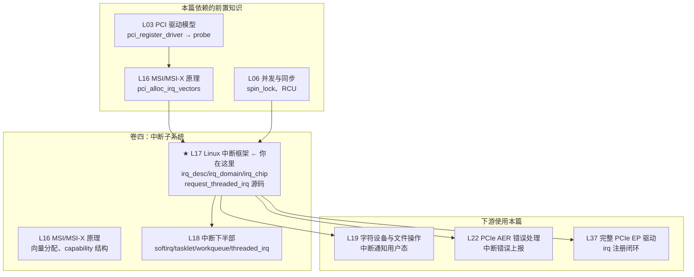
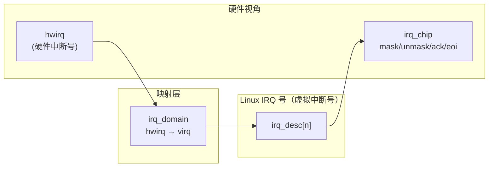

# L17：Linux 中断框架

---

## 0. 框架定位



**本篇在卷四中的位置**：L16 解决了"怎么分配 MSI/MSI-X 向量"，本篇解决"向量分配之后——内核怎么管理这个中断、驱动怎么注册 handler、中断到达时内核做了什么"。L18 讲处理完后的下半部机制。

**核心问题**：从一个 PCIe 设备发出 MSI 存储器写事务，到你写的 `handler()` 函数被执行，中间经过了多少层？

---


---

## 1. 问题驱动

> 🔍 **你遇到了一个问题：**
>
> `request_irq(irq_num, handler, flags, name, dev)` 返回 `-EINVAL`。
你确认 `irq_num` 是通过 `pci_irq_vector()` 拿到的合法值。
Linux 中断框架是怎么把硬件中断号映射到内核 IRQ 号的？
`irq_domain` 在这里起了什么作用？
>
> **带着这个问题学完本节，你就知道答案了。**

---

## 2. 前置认知


**前置依赖**：
- L03：`pci_register_driver()` → `probe()` 链路；`pci_assign_irq()` 为设备分配 IRQ 号的基础
- L16：MSI/MSI-X capability 结构、`pci_alloc_irq_vectors()` 分配向量、`pci_irq_vector()` 获取 Linux IRQ 号
- L06：spin_lock、`local_irq_save`/`restore`、原子操作、中断上下文的概念

**本文定位**：L16 讲完了 MSI/MSI-X 怎么分配，但分配出的 irq 号怎么变成一个可用的中断处理通道，是本文的内容。读完本文，你能逐行解释 `request_threaded_irq()` 的内核实现，理解 irq_desc → irq_domain → irq_chip 三层架构，以及在 x86_64 上一条 PCI MSI 中断从设备发出到 CPU 执行 handler 的完整硬件路径。

---

## 3. 核心原理

### 2.1 为什么要三层架构？

x86_64 服务器的中断硬件层级是固定的：

```
PCIe Device → MSI Memory Write → IOAPIC(可选) → Local APIC → CPU Core
```

内核需要一套统一框架来抽象这个层次。设计目标是：
1. **irq_desc**（描述符层）：每个 Linux IRQ 号对应一个描述符，管理 handler 链表、状态、统计信息
2. **irq_domain**（映射层）：将硬件中断号（hwirq）映射到 Linux IRQ 号（virq），支持级联
3. **irq_chip**（芯片层）：封装中断控制器的硬件操作（mask/unmask/ack/eoi）

**为什么要分层而不是直接一个结构体？**

两个原因：
- **硬件级联**：PCI MSI 先到 IOAPIC（如果使用），IOAPIC 再路由到 Local APIC，Local APIC 再发到 CPU。每级有自己的"硬件中断号"空间——IOAPIC 管它的 pin，Local APIC 管它的 vector。irq_domain 通过 parent 指针形成层级树，va（virtual irq）在各层之间传递映射。
- **驱动无关性**：irq_chip ops 屏蔽了下层硬件差异。`mask_irq()` 在 x86 上可能是写 IOAPIC RTE 寄存器（`io_apic.c`），在 IOMMU 启用时可能是操作 Interrupt Remapping table entry。调用者不关心。

### 2.2 三个核心数据结构的关系

```c
/* ① irq_desc：中断描述符 — 每个 virq 一个 */
struct irq_desc {
    struct irq_common_data  irq_common_data;  // 公共数据（node、affinity）
    struct irq_data         irq_data;          // 芯片层数据（domain、chip、hwirq）
    irq_flow_handler_t      handle_irq;       // ★ 流控 handler（入口）
    struct irqaction        *action;          // ★ 驱动注册的 handler 链表
    unsigned int            depth;            // disable_irq 嵌套深度
    unsigned int            irqs_unhandled;   // 未处理计数（spurious 检测）
    raw_spinlock_t          lock;             // ★ 保护 desc 的自旋锁
    atomic_t                threads_active;   // ONESHOT 活跃线程数
    wait_queue_head_t       wait_for_threads;
};

/* ② irq_data：芯片层私有数据（嵌入在 irq_desc 中） */
struct irq_data {
    unsigned int            irq;         // Linux IRQ 号
    irq_hw_number_t         hwirq;       // ★ 硬件中断号（如 IOAPIC pin 或 vector）
    struct irq_domain       *domain;     // ★ 所属 irq_domain
    struct irq_chip         *chip;       // ★ 中断控制器操作集
    struct irq_data         *parent_data; // ★ 父级（层级级联）
    void                    *chip_data;  // 芯片私有数据（如 x86 的 apic_chip_data）
};

/* ③ irq_domain：将 hwirq 映射到 virq 并管理层次 */
struct irq_domain {
    const char              *name;
    const struct irq_domain_ops *ops;    // map/unmap/alloc/free
    struct irq_domain       *parent;     // ★ 父域（层级关键）
    struct fwnode_handle    *fwnode;     // 固件节点（ACPI/DT）
    struct radix_tree_root  revmap_tree; // hwirq → virq 反向映射
    unsigned int            revmap_size; // linear 映射表大小
    struct irq_data __rcu   **revmap;    // linear 映射表指针数组
    /* ... */
};
```

**三者关系**：



- pci_alloc_irq_vectors(L16) → irq_domain 分配 virq → 创建 irq_desc
- request_threaded_irq → 向 irq_desc.action 链表添加 irqaction
- 中断到达 → CPU 通过 vector 找到 irq_desc → 调用 handle_irq → 遍历 action→handler

### 2.3 irq_domain 三种映射模式

```c
/* include/linux/irqdomain.h */
enum irq_domain_bus_token {
    DOMAIN_BUS_ANY        = 0,
    DOMAIN_BUS_WIRED      = 1,  // Legacy wired IRQs
    DOMAIN_BUS_MSI        = 2,  // MSI domain
    /* ... */
};
```

irq_domain 有三种方式维护 hwirq → virq 的映射：

| 模式 | 标志 | 适用场景 | 实现 |
|------|------|----------|------|
| Linear | revmap_size > 0, 无 NO_MAP | hwirq 空间小且连续（IOAPIC: 0~23 pin） | `revmap[hwirq] = irq_data` 数组直接索引 |
| Radix Tree | revmap_size=0, 无 NO_MAP | hwirq 空间大且稀疏（x86 vector: 0x20~0xFE） | `radix_tree_lookup(&revmap_tree, hwirq)` |
| Nomap | IRQ_DOMAIN_FLAG_NO_MAP | hwirq = virq（Legacy ISA IRQ 0~15） | 无映射表，virq 直接当作 hwirq |

**★ x86_64 上的默认模式**：x86_vector_domain 使用 `revmap_size = 0`（Radix Tree），因为 x86 APIC vector 空间（0x20~0xFE）虽然看似连续但有空洞——部分 vector 被固定占用（0x80 syscall、0xF0~0xFF exception/trap），用 linear 数组会浪费内存。

### 2.4 irq_chip 操作集

```c
/* include/linux/irq.h */
struct irq_chip {
    const char  *name;       // 芯片名 → /proc/interrupts 显示

    void (*irq_mask)(struct irq_data *data);       // 屏蔽中断源
    void (*irq_unmask)(struct irq_data *data);     // 取消屏蔽
    void (*irq_ack)(struct irq_data *data);        // 应答中断（边沿触发）
    void (*irq_eoi)(struct irq_data *data);        // 中断结束（电平触发/MSI）
    int  (*irq_set_affinity)(struct irq_data *data,
                              const struct cpumask *dest, bool force); // ★ CPU 亲和性
    void (*irq_write_msi_msg)(struct irq_data *data,
                               struct msi_msg *msg);  // MSI 地址/数据写入
    int  (*irq_startup)(struct irq_data *data);       // 启动中断
    void (*irq_shutdown)(struct irq_data *data);      // 关闭中断
    /* ... */
};
```

**x86_64 上的芯片层次**：

```
PCI MSI → x86_msi_chip (irq_write_msi_msg)
              ↓ parent_data
            lapic_controller_chip (irq_mask/irq_unmask/irq_ack/irq_eoi)
```

对于传统的 IOAPIC 线路中断（非 MSI）：
```
PCI INTx → ioapic_chip (mask/unmask/ack via IOAPIC RTE)
              ↓ parent_data
            lapic_controller_chip (eoi 等 Local APIC 操作)
```

### 2.5 ★ x86_64 关键路径：PCI MSI → IOAPIC(可选) → Local APIC

```
PCIe Device (EP)
    ↓
MSI Memory Write TLPs (地址=APIC 基址+vector, 数据=vector#)
    ↓ 通过 PCIe RC（Root Complex）
IOAPIC (如果使能了 Interrupt Remapping)
    ↓ / 或不经过
Local APIC (每个 CPU Core 内置)
    ↓
IDT (Interrupt Descriptor Table) → vector → common_interrupt()
    ↓
irq_find_mapping(domain=x86_vector_domain, hwirq=vector)
    ↓
irq_desc[n]→handle_irq (handle_edge_irq / handle_fasteoi_irq)
    ↓
__handle_irq_event_percpu() → 遍历 action->handler
```

**MSI 写入的地址/数据含义**（`arch/x86/kernel/apic/msi.c` 的 `__irq_msi_compose_msg()`）：

```c
static void __irq_msi_compose_msg(struct irq_cfg *cfg, struct msi_msg *msg,
                                   bool dmar)
{
    msg->address_hi = MSI_ADDR_BASE_HI;  // 0xFEExxx — >4GB 地址高32位

    if (dmar)
        msg->address_lo = DMAR_MSI_ADDR;  // 中断重映射格式
    else
        msg->address_lo = MSI_ADDR_BASE_LO | /* 0xFEE00000 — Local APIC 基址 */
                          MSI_ADDR_DEST_MODE_PHYSICAL |
                          MSI_ADDR_REDIRECTION_CPU |
                          MSI_ADDR_DEST_ID(cfg->dest_apicid);

    msg->data = cfg->vector;  // ★ 硬件中断向量号
}
```

> 📌 **协议对照**：MSI Memory Write 是 DW 长度的存储器写 TLP（PCIe Base Spec §6.1、MSI/X Capability §6.18）。地址字段的 bit 0~19 和 bit 4 组合指示中断类型（Fixed/Arbitrated/Redirectable 等）。

---

## 4. 内核源码带读

> 本节跟踪 `request_threaded_irq()` 的完整内核路径。所有行号基于 `~/work/code/linux-source/` v7.0.0。

### 3.1 第一层：request_threaded_irq()

> 源码：`kernel/irq/manage.c:2115`

```c
int request_threaded_irq(unsigned int irq, irq_handler_t handler,
                         irq_handler_t thread_fn, unsigned long irqflags,
                         const char *devname, void *dev_id)
{
    struct irqaction *action;
    struct irq_desc *desc;
    int retval;

    // == ① 检查 IRQ_NOTCONNECTED（设备电源未打开或未枚举）==
    if (irq == IRQ_NOTCONNECTED)       // kernel/irq/manage.c:2123
        return -ENOTCONN;

    // == ② 校验 flags 合法性 ==
    // IRQF_SHARED 必须有 dev_id
    // IRQF_SHARED 不能与 IRQF_NO_AUTOEN 共存
    // IRQF_COND_SUSPEND 只能与 IRQF_SHARED 共存
    if (((irqflags & IRQF_SHARED) && !dev_id) ||
        ((irqflags & IRQF_SHARED) && (irqflags & IRQF_NO_AUTOEN)) ||
        (!(irqflags & IRQF_SHARED) && (irqflags & IRQF_COND_SUSPEND)) ||
        ((irqflags & IRQF_NO_SUSPEND) && (irqflags & IRQF_COND_SUSPEND)))
        return -EINVAL;                 // kernel/irq/manage.c:2143

    // == ③ 通过 virq 找到 irq_desc ==
    desc = irq_to_desc(irq);           // kernel/irq/manage.c:2145
    if (!desc)
        return -EINVAL;

    // == ④ 检查 desc 是否允许 request ==
    if (!irq_settings_can_request(desc) ||
        WARN_ON(irq_settings_is_per_cpu_devid(desc)))
        return -EINVAL;                // kernel/irq/manage.c:2149~2151

    // == ⑤ 如果 handler 为 NULL 但 thread_fn 不为 NULL ==
    // 使用 irq_default_primary_handler（只返回 IRQ_WAKE_THREAD）
    if (!handler) {
        if (!thread_fn)
            return -EINVAL;
        handler = irq_default_primary_handler;  // kernel/irq/manage.c:2156
    }

    // == ⑥ 分配 irqaction 结构体 ==
    action = kzalloc_obj(struct irqaction);      // kernel/irq/manage.c:2159
    if (!action)
        return -ENOMEM;

    // == ⑦ 填充 action ==
    action->handler = handler;          // ★ 硬中断上下文 handler
    action->thread_fn = thread_fn;      // ★ 线程化 handler（或 NULL）
    action->flags = irqflags;
    action->name = devname;
    action->dev_id = dev_id;

    // == ⑧ PM：中断控制器运行时电源管理提频 ==
    retval = irq_chip_pm_get(&desc->irq_data);  // kernel/irq/manage.c:2169
    if (retval < 0) {
        kfree(action);
        return retval;
    }

    // == ★ ⑨ 核心：进入 __setup_irq ==
    retval = __setup_irq(irq, desc, action);    // kernel/irq/manage.c:2175

    // == 异常路径：失败时释放资源 ==
    if (retval) {
        irq_chip_pm_put(&desc->irq_data);
        kfree(action->secondary);               // 如果 force_threading 创建了 secondary
        kfree(action);
    }

#ifdef CONFIG_DEBUG_SHIRQ_FIXME
    // == DEBUG：如果是共享中断，模拟一次中断来测试 ==
    if (!retval && (irqflags & IRQF_SHARED)) {
        unsigned long flags;
        disable_irq(irq);
        local_irq_save(flags);
        handler(irq, dev_id);                   // 直接调用——测试 handler 是否健壮
        local_irq_restore(flags);
        enable_irq(irq);
    }
#endif

    return retval;
}
EXPORT_SYMBOL(request_threaded_irq);           // kernel/irq/manage.c:2204
```

**异常路径汇总**：

| 返回值 | 条件 | 症状 / 排查 |
|--------|------|------------|
| `-ENOTCONN` | irq == IRQ_NOTCONNECTED | 设备电源未启或 pci_enable_device 未调用 |
| `-EINVAL` | flags 冲突 | dmesg 无特殊输出，检查 request_irq flags 组合 |
| `-EINVAL` | irq_to_desc 返回 NULL | 该 irq 号未分配——检查 pci_alloc_irq_vectors 是否成功 |
| `-EINVAL` | 没有 handler 也没有 thread_fn | 两个不能同时为 NULL |
| `-ENOMEM` | action 分配失败 | 内存不足 |
| `-ENOSYS` | chip == &no_irq_chip | irq 未正确设置 chip（__setup_irq 返回） |

**★ x86_64 特有**：`irq_to_desc(irq)` 在内核中是 `radix_tree_lookup(&sparse_irqs, irq)`（SPARSE_IRQ 模式）。x86_64 默认启用 `CONFIG_SPARSE_IRQ`，irq 描述符不是连续数组而是 radix tree——节省内存（服务器可能有数千个 irq，但大部分未使用）。

---

### 3.2 第二层：__setup_irq()

> 源码：`kernel/irq/manage.c:1471` — 这就是 `request_threaded_irq` 的核心实现

```c
__setup_irq(unsigned int irq, struct irq_desc *desc, struct irqaction *new)
{
    struct irqaction *old, **old_ptr;
    unsigned long flags, thread_mask = 0;
    int ret, nested, shared = 0;

    // == ① 基本校验 ==
    if (!desc)
        return -EINVAL;
    if (desc->irq_data.chip == &no_irq_chip)
        return -ENOSYS;          // ⚠ irq 未关联芯片，一般是 irq 分配后配置不完整
    if (!try_module_get(desc->owner))
        return -ENODEV;          // ⚠ 持有 irq 的模块已被卸载

    new->irq = irq;

    // == ② 触发方式继承 ==
    // 如果调用者没指定触发方式，使用 irq 默认触发方式（BIOS/固件配置）
    if (!(new->flags & IRQF_TRIGGER_MASK))
        new->flags |= irqd_get_trigger_type(&desc->irq_data);

    // == ③ IRQF_ONESHOT 校验 ==
    // ONESHOT = 中断在线程处理完成前一直被 mask，必须有 thread_fn
    if (WARN_ON_ONCE(new->flags & IRQF_ONESHOT && !new->thread_fn))
        /* 但不会拒绝——只是警告 */;

    // == ④ Nested Thread 检测 ==
    nested = irq_settings_is_nested_thread(desc);
    if (nested) {
        // ⚠ 嵌套线程化处理：二级中断控制器场景
        // 替换 handler 为 irq_nested_primary_handler（警告调用者）
        if (!new->thread_fn) {
            ret = -EINVAL;
            goto out_mput;
        }
        new->handler = irq_nested_primary_handler;
    } else {
        // == ⑤ 强制线程化 ==
        // 如果配置了 threadirqs 内核参数，所有 handler 在线程上下文执行
        if (irq_settings_can_thread(desc)) {
            ret = irq_setup_forced_threading(new);
            if (ret)
                goto out_mput;
        }
    }

    // == ★ ⑥ 创建中断线程 ==
    // 如果提供了 thread_fn 且不是嵌套中断
    // → 创建名为 "irq/%d-%s" 的内核线程
    if (new->thread_fn && !nested) {
        ret = setup_irq_thread(new, irq, false);  // manage.c:1534
        if (ret)
            goto out_mput;
        // 如果 force_irqthreads 创建了 secondary 线程
        if (new->secondary) {
            ret = setup_irq_thread(new->secondary, irq, true);
            if (ret)
                goto out_thread;
        }
    }

    // == ⑦ IRQCHIP_ONESHOT_SAFE 优化 ==
    // MSI 中断是一发即逝的（one-shot safe），不需要 ONESHOT 的 mask 开销
    if (desc->irq_data.chip->flags & IRQCHIP_ONESHOT_SAFE)
        new->flags &= ~IRQF_ONESHOT;

    // ========== 以下是持有 desc->lock 的原子操作区 ==========

    mutex_lock(&desc->request_mutex);            // 防止并发 __free_irq
    chip_bus_lock(desc);                         // 慢速总线（I2C/SPI）的 lock

    // == ★ ⑧ 首个 action 注册时：请求芯片资源 ==
    if (!desc->action) {
        ret = irq_request_resources(desc);       // manage.c:1574
        if (ret) {
            pr_err("Failed to request resources for %s (irq %d) on irqchip %s\n",
                   new->name, irq, desc->irq_data.chip->name);
            goto out_bus_unlock;
        }
    }

    // ========== ★ 进入原子区：raw_spin_lock_irqsave ==========
    raw_spin_lock_irqsave(&desc->lock, flags);   // manage.c:1588

    old_ptr = &desc->action;
    old = *old_ptr;

    // == ★ ⑨ 共享中断检测 ==
    if (old) {
        unsigned int oldtype;
        // 检查共享兼容性：双方必须都 IRQF_SHARED、触发方式必须一致
        if (((old->flags & new->flags) & IRQF_SHARED) == 0)
            goto mismatch;
        if (irqd_trigger_type_was_set(&desc->irq_data)) {
            oldtype = irqd_get_trigger_type(&desc->irq_data);
        } else {
            oldtype = new->flags & IRQF_TRIGGER_MASK;
            irqd_set_trigger_type(&desc->irq_data, oldtype);
        }
        if (oldtype != (new->flags & IRQF_TRIGGER_MASK))
            goto mismatch;

        // ★ 遍历到链表末尾，将新 action 追加
        do {
            thread_mask |= old->thread_mask;     // 收集所有已用 thread_mask bit
            old_ptr = &old->next;
            old = *old_ptr;
        } while (old);
        shared = 1;
    }

    // == ★ ⑩ ONESHOT thread_mask 分配 ==
    // 每个 ONESHOT action 分配一个独立 bit（最多 32/64 个共享者）
    if (new->flags & IRQF_ONESHOT) {
        if (thread_mask == ~0UL) {
            ret = -EBUSY;
            goto out_unlock;
        }
        new->thread_mask = 1UL << ffz(thread_mask);  // 找第一个 0 bit
    }
    else if (new->handler == irq_default_primary_handler &&
             !(desc->irq_data.chip->flags & IRQCHIP_ONESHOT_SAFE)) {
        // handler=NULL 且 !ONESHOT → 必死场景（电平中断死循环）
        pr_err("Threaded irq requested with handler=NULL and !ONESHOT for %s (irq %d)\n",
               new->name, irq);
        ret = -EINVAL;
        goto out_unlock;
    }

    // == ★⑪ 首次注册时：设置触发方式 + 激活中断 ==
    if (!shared) {
        // 设置触发方式（沿/电平）
        if (new->flags & IRQF_TRIGGER_MASK) {
            ret = __irq_set_trigger(desc, new->flags & IRQF_TRIGGER_MASK);
            if (ret)
                goto out_unlock;
        }

        // ★ 激活中断：如果没设置 IRQF_NO_AUTOEN，立即启动
        ret = irq_activate(desc);
        if (ret)
            goto out_unlock;

        desc->istate &= ~(IRQS_AUTODETECT | IRQS_SPURIOUS_DISABLED |
                          IRQS_ONESHOT | IRQS_WAITING);
        irqd_clear(&desc->irq_data, IRQD_IRQ_INPROGRESS);

        // ★★★ 启动中断硬件（使能 IOAPIC RTE 或 MSI 地址写入）
        if (!(new->flags & IRQF_NO_AUTOEN) &&
            irq_settings_can_autoenable(desc)) {
            irq_startup(desc, IRQ_RESEND, IRQ_START_COND);
        }
    }

    // == ⑫ 将 action 加入链表 ==
    *old_ptr = new;

    // == ⑬ 重置 spurious 检测计数 ==
    desc->irq_count = 0;
    desc->irqs_unhandled = 0;

    // == ⑭ 如果之前因 spurious 被禁用，重新使能 ==
    if (shared && (desc->istate & IRQS_SPURIOUS_DISABLED)) {
        desc->istate &= ~IRQS_SPURIOUS_DISABLED;
        __enable_irq(desc);
    }

    raw_spin_unlock_irqrestore(&desc->lock, flags);
    chip_bus_sync_unlock(desc);
    mutex_unlock(&desc->request_mutex);

    // == ★⑮ 唤醒中断线程等待其就绪 ==
    wake_up_and_wait_for_irq_thread_ready(desc, new);
    wake_up_and_wait_for_irq_thread_ready(desc, new->secondary);

    // == ⑯ 创建 /proc/irq/N/ 和 /proc/irq/N/name 条目 ==
    register_irq_proc(irq, desc);
    register_handler_proc(irq, new);
    return 0;

    // ========== 异常路径（goto 标签） ==========
mismatch:
    if (!(new->flags & IRQF_PROBE_SHARED))
        pr_err("Flags mismatch irq %d. %08x (%s) vs. %08x (%s)\n",
               irq, new->flags, new->name, old->flags, old->name);
    ret = -EBUSY;

out_unlock:
    raw_spin_unlock_irqrestore(&desc->lock, flags);
    if (!desc->action)
        irq_release_resources(desc);
out_bus_unlock:
    chip_bus_sync_unlock(desc);
    mutex_unlock(&desc->request_mutex);
out_thread:
    if (new->thread) {
        struct task_struct *t = new->thread;
        new->thread = NULL;
        kthread_stop_put(t);
    }
    if (new->secondary && new->secondary->thread) {
        struct task_struct *t = new->secondary->thread;
        new->secondary->thread = NULL;
        kthread_stop_put(t);
    }
out_mput:
    module_put(desc->owner);
    return ret;
}
```

**⚠ 设计意图分析 — 为什么 __setup_irq 如此复杂？**

__setup_irq 有 5 个 goto 出口，处理 7 种失败场景。设计的核心矛盾是：**irq_desc 的自旋锁保护了整个原子操作区，但自旋锁不能持有长时间（如等待线程创建完成、做慢速总线 I/O）**。所以代码被拆成三段：
1. 锁外：线程创建、强制线程化、资源分配（可能睡眠）
2. 锁内原子区：链表操作、状态标志设置（必须在关中断下原子完成）
3. 锁后：proc 条目创建、线程就绪等待

这种"锁外→锁内→锁后"的三段式结构是内核中处理复杂资源注册的标准模式。

---

### 3.3 第三层：中断到达的 dispatch 路径

> 虽然不属于 request 流程，但为了完整性——中断到达 CPU 后发生了什么：

```c
// ① 硬件层：CPU 收到中断 → 查找 IDT → 跳转 common_interrupt()
//    arch/x86/kernel/idt.c 中：
//    vector 0x20~0xFF 全部映射到 common_interrupt()

// ② common_interrupt() → do_IRQ()       (arch/x86/kernel/irq.c)
//    → vector = this_cpu_read(vector_irq[regs->orig_ax])

// ③ → handle_irq(desc, regs)            (kernel/irq/irqdesc.c:generic_handle_irq_desc)

// ④ → desc->handle_irq(desc)            // ★ 流控 handler
//    例如 handle_edge_irq / handle_fasteoi_irq

// ⑤ handle_irq_event(desc)
//    → desc->istate &= ~IRQS_PENDING
//    → irqd_set(IRQD_IRQ_INPROGRESS)
//    → handle_irq_event_percpu(desc)

// ⑥ __handle_irq_event_percpu(desc)     (kernel/irq/handle.c:185)
//    → for_each_action_of_desc(desc, action) {
//          res = action->handler(irq, action->dev_id);    // ★ 你的 handler 被调用
//          switch (res) {
//          case IRQ_WAKE_THREAD:
//              __irq_wake_thread(desc, action);           // 唤醒中断线程
//          }
//      }
```

**关键观察**：`__handle_irq_event_percpu`（`kernel/irq/handle.c:185`）是 handler 的实际调用点。它遍历 `desc->action` 链表——这就是为什么共享中断的每个 handler 必须检查中断是否确实来自自己的设备：**你不检查的话，可能是在为别人的设备服务**。

---

### 3.4 ★ 第三层-b：关键路径（Cascade: PCI MSI→IOAPIC→Local APIC on x86_64）

> 以下描述 x86_64 服务器上一条 PCI MSI 中断从设备发出到 CPU 执行 handler 的完整硬件路径。

```
┌─────────────────────────────────────────────────────────────────┐
│ ① PCIe EP 设备写 MSI Memory Write TLP                           │
│    地址: 0xFEEXXXXX  (Local APIC 的 MMIO 空间)                   │
│    数据: vector#      (如 0x2B = 43)                             │
└──────────────────────────┬──────────────────────────────────────┘
                           ↓
┌─────────────────────────────────────────────────────────────────┐
│ ② PCIe RC (Root Complex)                                       │
│    - 识别地址落在 0xFEE00000~0xFEEFFFFF (Local APIC 区域)       │
│    - 如果在 Interrupt Remapping 模式下 → DMAR 查询 IOTLB         │
│    - 否则直接转发到 Local APIC                                   │
└──────────────────────────┬──────────────────────────────────────┘
                           ↓
┌─────────────────────────────────────────────────────────────────┐
│ ③ IOAPIC (可选 — 仅在 Legacy INTx 路径中使用)                   │
│    MSI 不需要经过 IOAPIC，直接到 Local APIC                      │
│    ⚠ 除非开启 Interrupt Remapping → VT-d 重映射                 │
└──────────────────────────┬──────────────────────────────────────┘
                           ↓
┌─────────────────────────────────────────────────────────────────┐
│ ④ Local APIC (每个 CPU Core 中)                                │
│    - 检查 vector 是否被 mask                                     │
│    - 检查 TPR (Task Priority Register) 是否允许此优先级          │
│    - 触发 CPU 中断 → CPU 保存上下文                              │
└──────────────────────────┬──────────────────────────────────────┘
                           ↓
┌─────────────────────────────────────────────────────────────────┐
│ ⑤ CPU 查找 IDT (Interrupt Descriptor Table)                     │
│    vector# → IDT[vector].offset → common_interrupt() 入口       │
└──────────────────────────┬──────────────────────────────────────┘
                           ↓
┌─────────────────────────────────────────────────────────────────┐
│ ⑥ common_interrupt()                                           │
│    → 读取 this_cpu_read(vector_irq[vector]) → 得到 irq_desc     │
│    → generic_handle_irq_desc(desc)                             │
│    → desc->handle_irq() → __handle_irq_event_percpu()          │
│    → action->handler(irq, dev_id)  ★ 你的 handler 被执行       │
└─────────────────────────────────────────────────────────────────┘
```

**★ x86_64 中间层观察**：

MSI 写事务的地址 `0xFEEXXXXX` 是固定的 Local APIC MMIO 地址范围（Intel SDM Vol.3 §10.4.2）。其中 `X` 字段包含 Destination ID（目标 CPU）和 Redirect/Remote IRR 标志。`data` 字段包含 vector 号（低 8 位）和 Delivery Mode（固定/最低优先级/SMI/NMI/INIT/ExtINT）。

**如果一个 MSI 中断没有正确送达，排查从 `/proc/interrupts` 开始**：

```bash
# 查看中断分发情况
cat /proc/interrupts | grep <driver-name>
# 输出格式: CPU0 CPU1 CPU2 CPU3 Type Description
#           127     0     0     0 MSI  my-device
#           ↑ 只有 CPU0 收到了——这是默认配置，未设置 smp_affinity

# 查看当前 affinity
cat /proc/irq/127/smp_affinity
# 0000000f  ← 四位 16 进制 = CPU0~3 都允许

# 手动重分配
echo 2 > /proc/irq/127/smp_affinity   # 只路由到 CPU1
```

---

## 5. 中断上下文与可睡眠 API 限制

### 4.1 中断上下文的基本法则

硬中断 handler（`action->handler`）执行的上下文称为 **中断上下文** / **atomic context**：

| 特性 | 硬中断上下文 | 进程上下文 |
|------|-------------|------------|
| 可睡眠 | ❌ `schedule()` 会 panic | ✅ |
| 可持有 mutex | ❌ mutex_lock 会睡眠 | ✅ |
| 可 spin_lock | ✅ (需 irqsave 变体) | ✅ |
| 可访问用户态 | ❌ mm 可能不属于当前进程 | ✅ |
| 可触发缺页 | ❌ `handle_mm_fault` 会睡眠 | ✅ |
| 可调用 `copy_from_user` | ❌ 可能触发 page fault | ✅ |
| 可调用 `kmalloc(, GFP_KERNEL)` | ❌ 可能直接回收 | ✅ 但 `GFP_ATOMIC` 可 |

**为什么不能在中断上下文睡眠？**
- 中断 handler 运行时，CPU 关闭了中断（或处于特定优先级）
- 如果此时睡眠，CPU 无法响应更高优先级的中断——系统错失事件
- 更严重：如果调度器本身在等待中断（如 tick），死锁

### 4.2 在中断上下文中可以做什么

```c
static irqreturn_t my_handler(int irq, void *dev_id)
{
    struct my_dev *dev = dev_id;

    // ✅ 可以：读取硬件状态
    u32 status = readl(dev->regs + INT_STATUS);

    // ✅ 可以：使用 spin_lock
    spin_lock(&dev->lock);
    dev->int_count++;
    spin_unlock(&dev->lock);

    // ✅ 可以：使用 atomic 操作
    atomic_inc(&dev->irq_received);

    // ✅ 可以：提交 workqueue/tasklet/softirq
    tasklet_schedule(&dev->tasklet);

    // ❌ 不可以：调用 mutex_lock
    // ❌ 不可以：调用 kmalloc(GFP_KERNEL)
    // ❌ 不可以：调用 copy_from_user
    // ❌ 不可以：调用 msleep

    // ★ 确认是自己的中断，通知线程处理
    if (status & MY_DEV_INT_PENDING) {
        writel(status, dev->regs + INT_CLEAR);  // 清除设备中断
        return IRQ_WAKE_THREAD;                  // ★ 唤醒 thread_fn
    }

    return IRQ_NONE;  // 不是我们的中断
}
```

### 4.3 常见违规检测

内核通过 `might_sleep()` 宏和 `CONFIG_DEBUG_ATOMIC_SLEEP` 检测在 atomic context 中睡眠：

```c
void __might_sleep(const char *file, int line)
{
    if ((preempt_count_equals() & PREEMPT_ACTIVE) &&
        !current->mm)
        /* 在中断上下文中！*/
        printk("BUG: sleeping function called from invalid context at %s:%d\n",
               file, line);
}
```

**排查线索**：如果 dmesg 出现 `"BUG: sleeping function called from invalid context"`，错误信息会精确标注调用栈中哪一行、哪个函数尝试在中断上下文中睡眠。修复方向：将该操作移到 thread_fn（进程上下文）中执行。

### 4.4 线程化中断的上下文

```c
static irqreturn_t my_thread_fn(int irq, void *dev_id)
{
    struct my_dev *dev = dev_id;

    // ✅ 可以：mutex_lock（现在在进程上下文）
    mutex_lock(&dev->mutex);
    process_data(dev);
    mutex_unlock(&dev->mutex);

    // ✅ 可以：kmalloc(GFP_KERNEL)
    // ✅ 可以：msleep(10)
    // ✅ 可以：copy_from_user(...)

    return IRQ_HANDLED;
}
```

**设计原则**：硬中断 handler 只做**最必要的事**——读取状态、清除中断、记录数据、唤醒线程。所有可能睡眠的工作移到 `thread_fn` 中。

### 4.5 IRQF_ONESHOT 与电平中断的生死锁

```c
// ★ 对于电平触发的中断（不包括 MSI）且 handler=NULL：
//   如果没有 IRQF_ONESHOT，中断一清除硬件就会再次触发
//   → 中断 handler 无限循环 → 系统 hang
//
// __setup_irq 在 manage.c:1709 严格拒绝这种情况：
if (new->handler == irq_default_primary_handler &&
    !(desc->irq_data.chip->flags & IRQCHIP_ONESHOT_SAFE)) {
    pr_err("Threaded irq requested with handler=NULL and !ONESHOT ...");
    ret = -EINVAL;
    goto out_unlock;
}
```

**MSI 是安全的**：MSI 是边沿触发（Memory Write 一次性发送），不会因电平保持而重复触发。所以 MSI 芯片会设置 `IRQCHIP_ONESHOT_SAFE` 标志，`__setup_irq` 碰到 MSI 时自动清除 `IRQF_ONESHOT` 豁免 mask/unmask 开销。

---

## 6. GPU 场景：GPU 中断处理流程

### 5.1 GPU 中断特征

与网卡/存储设备不同，GPU 的中断源（interrupt source）数量庞大：

| 中断源类别 | 数量级 | 典型来源 |
|-----------|--------|---------|
| 引擎中断 | 十几~几十 | GFX/Compute/Media 引擎完成、页面错误 |
| 显示中断 | 几个~十几个 | vblank、HPD（热插拔）、CRC 校验 |
| 电源管理中断 | 几个 | 温度阈值、电源状态变化 |
| SR-IOV VF 中断 | VF × N | 每个 VF 的 doorbell/MSI |

以 AMD/NVIDIA GPU 为例，GPU 内部通常有一个 **Interrupt Handler (IH) 模块**，充当"GPU 内部的中断控制器"：

### 5.2 GPU 中断处理流程

```
┌────────────────────────────────────────────────────────────┐
│ GPU 内部                                                      │
│                                                              │
│   引擎A完成 → IH Ring Buffer 写入条目 (wptr++)               │
│   引擎B错误 → IH Ring Buffer 写入条目 (wptr++)               │
│       ↓                                                      │
│   GPU 发出 MSI-X (单个或每队列独立)                          │
└──────────────────────────┬───────────────────────────────────┘
                           ↓  MSI Memory Write
┌──────────────────────────┴───────────────────────────────────┐
│ CPU 侧（Linux 内核）                                          │
│                                                              │
│   irq_desc->action->handler = gpu_irq_handler()              │
│       ↓                                                      │
│   ① 读取 GPU IH RB wptr (通过 MMIO)                          │
│   ② 比较 rptr, 循环处理条目                                   │
│   ③ 对每个条目：根据 source_id 分发到不同处理逻辑              │
│      - GFX 完成 → GFX 完成处理                                │
│      - 页面错误 → GPU 缺页处理                                │
│      - vblank → DRM vblank 事件                               │
│   ④ 更新 IH RB rptr                                           │
│   ⑤ 返回 IRQ_HANDLED 或 IRQ_WAKE_THREAD                      │
└──────────────────────────────────────────────────────────────┘
```

### 5.3 GPU 典型中断注册代码

```c
// 伪代码 — 代表 GPU 驱动的标准模式
static int gpu_probe(struct pci_dev *pdev, const struct pci_device_id *id)
{
    int nr_irqs, irq;

    // ① 分配 MSI-X 向量 (L16 内容)
    nr_irqs = pci_alloc_irq_vectors(pdev, 1, NUM_GPU_INTERRUPTS,
                                      PCI_IRQ_MSIX);
    // ② 为每个向量注册 handler（本讲核心）
    for (i = 0; i < nr_irqs; i++) {
        irq = pci_irq_vector(pdev, i);
        // ★ 典型 GPU 注册方式：handler 在硬中断中快速检查唤醒，
        //    thread_fn 做实际处理（可以睡眠）
        request_threaded_irq(irq,
                             gpu_hard_irq_handler,   // 硬中断：读 IH、唤醒线程
                             gpu_thread_fn,            // 线程上下文：处理事件
                             IRQF_SHARED,              // (如果是共享)
                             "gpu_drv", &gpu_dev[i]);
    }
}
```

### 5.4 GPU 硬中断 handler 示例

```c
static irqreturn_t gpu_hard_irq_handler(int irq, void *dev_id)
{
    struct gpu_device *gpu = dev_id;

    // ★ 读 Interrupt Handler (IH) ring buffer wptr
    u32 wptr = readl(gpu->ih_regs + IH_RB_WPTR);
    u32 rptr = readl(gpu->ih_regs + IH_RB_RPTR);

    if (wptr == rptr)
        return IRQ_NONE;  // 不是 GPU 中断（共享中断时检测）

    // ★ 关键优化：对 IH 条目做预处理，在硬中断中做最小工作
    //   不遍历整个 ring（太耗时），而是记录 wptr 并唤醒线程
    gpu->ih_wptr = wptr;

    // 清除设备中断 pending 位
    writel(1, gpu->regs + INT_CTRL);

    // ★ 返回 WAKE_THREAD 让 thread_fn 处理重工作
    return IRQ_WAKE_THREAD;
}
```

**GPU 场景中的关键设计意图**：
1. **多个 MSI-X 向量 → 多个 irq**：GPU 把不同引擎（GFX、Display、DMA、Video）的中断路由到不同的 MSI-X 向量。这样做的好处是 affinity 分离——把显示中断固定到某个 CPU，渲染引擎中断分散到其他 CPU。
2. **IH Ring Buffer → 中断合并（Interrupt Coalescing）**：多个引擎中断累积在 IH ring buffer 中，一次 MSI 触发批量处理——减少 CPU 中断次数，提高吞吐。
3. **手写 handler 替代通用流控**：GPU 驱动通常不依赖 `handle_edge_irq` / `handle_fasteoi_irq` 等通用流控 handler，因为它们需要额外的 IH ring buffer 逻辑。

---

## 7. 思考题

### 题 1（设计意图题）：为什么 `__setup_irq` 要把线程创建（`setup_irq_thread`）放在 `raw_spin_lock_irqsave` 之前？把线程创建放到锁内会有什么后果？

### 题 2（排查题）：你的 PCIe 驱动使用 `request_threaded_irq(irq, NULL, my_thread_fn, IRQF_SHARED, "mydev", dev)`，dmesg 显示 `"Threaded irq requested with handler=NULL and !ONESHOT"`。请分析根因并给出修复方案。

### 题 3（代码实操题）：阅读 `kernel/irq/manage.c` 中 `irq_setup_forced_threading()`（约 manage.c:1440~1468），解释 `threadirqs` 内核参数传入时内核是如何在不修改驱动代码的情况下将硬中断 handler 自动转为线程化执行的。

---

## 6b. 参考答案

### 题 1 解答

**原因**：`setup_irq_thread()` 内部调用 `kthread_create()`——这是一个可能触发 GFP_KERNEL 内存分配、可能睡眠的函数。`raw_spin_lock_irqsave` 获取的是自旋锁且本地中断被关闭，自旋锁的持有者不能睡眠。如果在锁内调用 `kthread_create()`：
1. 如果 kthreadd 需要等待内存回收 → schedule() → panic（"scheduling while atomic"）
2. 即使不 panic，在关中断状态下持有锁 + 等待线程创建 → 系统整体中断响应延迟飙升

**正确的设计模式**：
1. **锁外**：创建线程（可能睡眠、分配内存）
2. **锁内**：仅做链表操作和状态标志设置（原子、快速）
3. **锁后**：等待线程就绪（`wake_up_and_wait_for_irq_thread_ready`）

### 题 2 解答

**根因**：`handler=NULL` 使得 __setup_irq 使用 `irq_default_primary_handler` 作为 handler。该 handler 只做一件事：返回 `IRQ_WAKE_THREAD`。但由于你没有设置 `IRQF_ONESHOT`，且芯片不是 `IRQCHIP_ONESHOT_SAFE`（你的中断控制器不支持 one-shot safe），内核检测到：
- handler 是默认 handler（只 wake thread，不操作硬件）
- 没有 ONESHOT（中断线不会在线程处理期间被 mask）
- 电平触发 + 中断被清除后立刻重新触发 → handler 再次被调用 → 无限循环

**修复方案**：
```c
// 方案 A：加上 IRQF_ONESHOT（推荐——确保电平安全）
request_threaded_irq(irq, NULL, my_thread_fn,
                     IRQF_SHARED | IRQF_ONESHOT,
                     "mydev", dev);

// 方案 B：提供一个真正的硬中断 handler 来 mask 设备中断
request_threaded_irq(irq, my_hard_handler, my_thread_fn,
                     IRQF_SHARED, "mydev", dev);
// my_hard_handler 必须 mask 设备上的中断（如写 INT_MASK 寄存器）
// 并返回 IRQ_WAKE_THREAD

// 方案 C：确认你的中断控制器确实支持 one-shot safe
// （MSI 就是 one-shot safe 的——MSI 芯片自动设置 IRQCHIP_ONESHOT_SAFE）
```

### 题 3 解答

**`irq_setup_forced_threading()` 源码**（`kernel/irq/manage.c:1440~1468`）：

```c
static int irq_setup_forced_threading(struct irqaction *new)
{
    // 如果全局 static_branch force_irqthreads_key 未启用 → 跳过
    if (!force_irqthreads())
        return 0;

    // 如果驱动显式 IRQF_NO_THREAD → 保持原样
    if (new->flags & (IRQF_NO_THREAD | IRQF_PERCPU | IRQF_ONESHOT))
        return 0;

    // ★ 将当前 handler 移到 secondary action 中
    new->secondary = kzalloc(sizeof(struct irqaction), GFP_KERNEL);
    if (!new->secondary)
        return -ENOMEM;

    // secondary 持有原来的 handler（将在线程上下文被调用）
    new->secondary->handler = irq_forced_secondary_handler;
    new->secondary->thread_fn = new->handler;  // ★ 原本的 handler 变成 thread_fn
    new->secondary->dev_id = new->dev_id;
    new->secondary->irq = new->irq;
    new->secondary->name = new->name;
    // ★ 当前 thread_fn 被移到 secondary 的 thread_fn
    // ★ 当前 handler 替换为 irq_default_primary_handler（只 wake thread）

    // ★ 当前 action 变为仅做 wake_thread
    new->handler = irq_default_primary_handler;
    if (!new->thread_fn) {
        // 如果驱动也没提供 thread_fn → 使用原 handler 作为 thread_fn
        // 如果提供了 → secondary 的 thread_fn 已经继承原 handler
    }

    return 0;
}
```

**设计意图**：`force_irqthreads` 允许用户通过 `threadirqs` 内核参数将所有中断 handler 强制线程化——对调试非常有用（可以在 handler 中方便地使用 `mutex`、`msleep()` 等可睡眠 API）。内核通过在 `__setup_irq` 中悄悄创建一个 `secondary irqaction` 来达成这一点，驱动无需（也无法感知）自己的 handler 是否在线程上下文执行。

**限制**：`IRQF_NO_THREAD` 标记的 handler 不会被强制线程化（如 timer tick、某些架构级中断）。`IRQF_PERCPU` 的也不行（per-CPU 中断不能迁移到线程上下文）。`IRQF_ONESHOT` 也不行（oneshot 的 mask/unmask 逻辑与线程化有交互冲突）。

---

## 8. 渐进式代码构建

### 节点 L17：在 L16 代码基础上增加中断注册

> 前置代码：L16 的代码（已完成 MSI-X 分配）。本文增加：`request_threaded_irq` 注册中断 handler。

```c
// File: pcie_l17.c — 中断框架
// 在 L16 基础上增加中断注册
// 编译: gcc -I~/work/code/linux-source/include -I~/work/code/linux-source/arch/x86/include -E -P pcie_l17.c -o pcie_l17_preprocessed.c
// 注意: 此为内核模块代码，需在内核源码树中编译

#include <linux/module.h>
#include <linux/pci.h>
#include <linux/interrupt.h>   // ★ 新增：request_threaded_irq, irqreturn_t
#include <linux/msi.h>

#define DRIVER_NAME "pcie_l17"

struct pcie_l17_dev {
    void __iomem *bar0;
    int irq;                    // ★ 保存 irq 号
    unsigned long flags;        // 共享数据（演示用）
    spinlock_t lock;            // ★ 自旋锁——中断上下文中保护数据
};

// ★ 新增：硬中断 handler
// 在硬中断上下文中执行——不可睡眠、不可持有 mutex
static irqreturn_t pcie_l17_hard_handler(int irq, void *dev_id)
{
    struct pcie_l17_dev *dev = dev_id;
    u32 status;

    // 读设备中断状态寄存器
    status = ioread32(dev->bar0 + 0x10);  // 假设 BAR0+0x10 是 INT_STATUS

    if (!(status & 0x1))
        return IRQ_NONE;                   // 不是我们的中断（共享中断时必需）

    // ★ 在 IRQ 上下文中快速处理
    spin_lock(&dev->lock);
    dev->flags |= 0x1;                     // 记录中断已到
    spin_unlock(&dev->lock);

    // 清除设备中断 pending 位
    iowrite32(0x1, dev->bar0 + 0x14);     // 假设 BAR0+0x14 是 INT_CLEAR

    // ★ 告诉内核：需要唤醒 thread_fn 做重工作
    return IRQ_WAKE_THREAD;
}

// ★ 新增：线程化 handler
// 在进程上下文中执行——可睡眠、可持有 mutex
static irqreturn_t pcie_l17_thread_fn(int irq, void *dev_id)
{
    struct pcie_l17_dev *dev = dev_id;
    u32 data;

    // 读取 DMA 完成的数据（模拟）
    data = ioread32(dev->bar0 + 0x20);    // 假设 BAR0+0x20 是 DMA_DONE_DATA
    dev_info(&pci_dev->dev, "Interrupt processed, data=0x%x\n", data);

    return IRQ_HANDLED;
}

// ★ 修改：probe 中增加中断注册
static int pcie_l17_probe(struct pci_dev *pci_dev,
                          const struct pci_device_id *id)
{
    struct pcie_l17_dev *dev;
    int ret;
    int nr_irqs;

    dev = devm_kzalloc(&pci_dev->dev, sizeof(*dev), GFP_KERNEL);
    if (!dev)
        return -ENOMEM;

    pci_set_drvdata(pci_dev, dev);
    spin_lock_init(&dev->lock);            // ★ 初始化自旋锁

    ret = pcim_enable_device(pci_dev);
    if (ret)
        return ret;

    ret = pcim_iomap_regions(pci_dev, BIT(0), DRIVER_NAME);
    if (ret)
        return ret;

    dev->bar0 = pcim_iomap_table(pci_dev)[0];

    // ★ 新增：分配 MSI-X 向量（L16 内容）
    nr_irqs = pci_alloc_irq_vectors(pci_dev, 1, 1, PCI_IRQ_MSIX);
    if (nr_irqs < 0)
        return nr_irqs;

    // ★ ★ ★ 核心：注册中断 handler
    dev->irq = pci_irq_vector(pci_dev, 0);
    ret = request_threaded_irq(dev->irq,
                               pcie_l17_hard_handler,  // 硬中断 handler
                               pcie_l17_thread_fn,     // 线程 handler
                               0,                       // flags
                               DRIVER_NAME, dev);
    if (ret)
        return ret;  // 注意：本代码简化了释放路径；完整代码应使用 devm_request_threaded_irq

    dev_info(&pci_dev->dev, "probed with irq=%d\n", dev->irq);

    return 0;
}

// ★ 新增：remove 中释放中断
static void pcie_l17_remove(struct pci_dev *pci_dev)
{
    struct pcie_l17_dev *dev = pci_get_drvdata(pci_dev);

    // 释放中断（在 pci_free_irq_vectors 之前）
    free_irq(dev->irq, dev);

    // 释放 MSI-X 向量
    pci_free_irq_vectors(pci_dev);
}

static const struct pci_device_id pcie_l17_ids[] = {
    { PCI_DEVICE(0x10EE, 0x1234), },  // 示例 VID/DID
    { 0, }
};
MODULE_DEVICE_TABLE(pci, pcie_l17_ids);

static struct pci_driver pcie_l17_driver = {
    .name     = DRIVER_NAME,
    .id_table = pcie_l17_ids,
    .probe    = pcie_l17_probe,
    .remove   = pcie_l17_remove,
};
module_pci_driver(pcie_l17_driver);

MODULE_LICENSE("GPL v2");
MODULE_AUTHOR("PCIe Driver Study");
MODULE_DESCRIPTION("L17: Linux Interrupt Framework - MSI-X + threaded IRQ example");
```

**增量说明**（从 L16 到 L17）：
- 新增 `#include <linux/interrupt.h>`
- 新增 `struct pcie_l17_dev` 中的 `irq` 字段和 `spinlock_t lock`
- 新增 `pcie_l17_hard_handler()`：硬中断上下文处理，读取中断状态、清除中断、唤醒线程
- 新增 `pcie_l17_thread_fn()`：线程上下文处理，打印数据
- probe 中新增 `pci_alloc_irq_vectors()` + `pci_irq_vector()` + `request_threaded_irq()`
- remove 中新增 `free_irq()` + `pci_free_irq_vectors()`

**编译说明**：此代码是完整的内核模块，需放入内核源码树中按标准方式编译。本节演示的是概念结构和 API 用法。

---

## 附录：关键数据结构一览

| 结构体 | 位置 | 作用 |
|--------|------|------|
| `struct irq_desc` | `include/linux/irqdesc.h:80` | 中断描述符，每个 virq 一个 |
| `struct irq_data` | `include/linux/irq.h` | 芯片层数据：domain、chip、hwirq |
| `struct irq_domain` | `include/linux/irqdomain.h` | hwirq → virq 映射 |
| `struct irq_chip` | `include/linux/irq.h` | 中断控制器 ops |
| `struct irqaction` | `include/linux/interrupt.h:123` | 驱动注册的 handler 容器 |
| `struct apic_chip_data` | `arch/x86/kernel/apic/vector.c:26` | x86 的 chip_data 实现 |
| `struct irq_cfg` | `arch/x86/include/asm/hw_irq.h` | x86 vector + dest APIC ID |

**关键函数位置**：

| 函数 | 文件:行号 | 作用 |
|------|-----------|------|
| `request_threaded_irq` | `kernel/irq/manage.c:2115` | 分配中断线的入口 |
| `__setup_irq` | `kernel/irq/manage.c:1471` | request 的核心实现 |
| `setup_irq_thread` | `kernel/irq/manage.c:1402` | 创建中断内核线程 |
| `irq_setup_forced_threading` | `kernel/irq/manage.c:1440` | force_irqthreads 实现 |
| `__handle_irq_event_percpu` | `kernel/irq/handle.c:185` | 遍历 action 链表调用 handler |
| `handle_irq_event` | `kernel/irq/handle.c:255` | 设置 IRQ_INPROGRESS 状态 |
| `irq_create_mapping_affinity` | `kernel/irq/irqdomain.c:820` | 创建 hwirq→virq 映射 |
| `irq_find_mapping` | `kernel/irq/irqdomain.c` | 通过 radix tree 查找 hwirq→virq 映射 |
| `x86_vector_alloc_irqs` | `arch/x86/kernel/apic/vector.c:548` | x86 向量分配 |
| `__irq_msi_compose_msg` | `arch/x86/kernel/apic/msi.c` | 构造 MSI 地址/数据 |

---

> **下篇预告**：L18 中断下半部——softirq、tasklet、workqueue、threaded_irq 四者的实现原理和选择策略。
