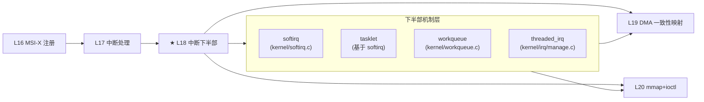

# L18：中断下半部

## 0. 框架定位



中断下半部是 Linux 中断处理的核心设计模式：**上半部在硬中断上下文执行最小操作（读状态、清中断），下半部在宽松的上下文中完成剩余工作**。Linux 提供四种下半部机制——softirq、tasklet、workqueue、threaded irq——各有不同的执行上下文、调度延迟、可睡眠性和锁要求。

---


---

## 1. 问题驱动

> 🔍 **你遇到了一个问题：**
>
> 你在中断 handler 里调用 `msleep(10)` 等待硬件状态就绪，
一触发中断——系统直接 `BUG: scheduling while atomic` 然后 panic。
为什么中断上下文里不能睡眠？
软中断、tasklet、workqueue、threaded IRQ 四种下半部机制应该怎么选？
>
> **带着这个问题学完本节，你就知道答案了。**

---

## 2. 前置认知


**前置篇章**：L16（MSI-X 注册）→ L17（中断处理：request_threaded_irq 与 irq_handler 流程）

**首次出现概念**：
- **BH（Bottom Half）**：泛指中断处理中推迟到后续执行的逻辑。历史上 Linux 有 `struct bh` 机制（2.x 废除），softirq 为其演进。
- **硬中断上下文（hardirq context）**：`in_irq()` 为真，禁止抢占，不能睡眠，不能持有 mutex。
- **软中断上下文（softirq context）**：`in_softirq()` 为真，可以抢占但不能睡眠。

**核心问题**：为什么不能全部在 hardirq 中完成？硬中断处理中中断线被 mask（或 level-triggered 下必须清中断才能 unmask），长时间停留在 hardirq 会丢失后续中断，且所有中断处理器的调度延迟和用户态响应时间都会被拖长。

---

## 3. 核心原理

### 2.1 四种下半部机制全景

| 机制 | 执行上下文 | 可睡眠 | 并发模型 | 典型延迟 | 适用场景 |
|------|-----------|--------|---------|---------|---------|
| **softirq** | softirq 上下文（`in_softirq()`） | ❌ 不可睡眠 | 同一 softirq 可在多个 CPU 并行执行 | 2ms 轮询 + ksoftirqd | 网络 RX/TX、timer、RCU（性能最敏感） |
| **tasklet** | softirq 上下文 | ❌ 不可睡眠 | 串行化：同一 tasklet 不会在多个 CPU 上并发 | 同 softirq | 驱动通用下半部（老接口，deprecated） |
| **workqueue** | 进程上下文（worker thread） | ✅ 可睡眠 | 默认多 worker 可并行，ordered flag 可串行 | ms 级（调度依赖 CFS） | 可睡眠操作：I/O、锁、复杂处理 |
| **threaded irq** | 进程上下文（irq/N-thread） | ✅ 可睡眠 | 每 irq 一个线程，与 IRQF_ONESHOT 搭配 | ms 级 | 设备中断，自动 thread 管理 |

> **设计意图**：四种机制不是历史遗物，而是按延迟-功能谱系排列。softirq 最快但限制最多，workqueue 最灵活但延迟最大。选择取决于：上半部完成了多少工作？剩余工作是否需要睡眠？

### 2.2 Softirq：最快的下半部（但不能睡眠）

Softirq 在 hardirq 退出时（`irq_exit()`）被调用，或在 `local_bh_enable()` 时检查执行。每个 softirq 在注册时绑定一个 action 函数，索引由 `enum` 定义：

```c
// include/linux/interrupt.h:550
enum {
    HI_SOFTIRQ = 0,
    TIMER_SOFTIRQ,
    NET_TX_SOFTIRQ,
    NET_RX_SOFTIRQ,
    BLOCK_SOFTIRQ,
    IRQ_POLL_SOFTIRQ,
    TASKLET_SOFTIRQ,
    SCHED_SOFTIRQ,
    HRTIMER_SOFTIRQ,
    RCU_SOFTIRQ,
    NR_SOFTIRQS
};
```

**关键设计**：
- Softirq 可以在多个 CPU 上**并行执行同一类型**——网络 RX softirq 在 8 核上可以 8 个 CPU 同时处理。这是 softirq 比 tasklet 快的原因：没有全局串行化。
- 每个 CPU 的 pending 位图独立（`__softirq_pending` per-CPU 变量），在 hardirq 退出时检查并处理。
- 有**时效性保护**：最多处理 2ms（`MAX_SOFTIRQ_TIME`）或 10 次循环（`MAX_SOFTIRQ_RESTART`），超过后唤醒 `ksoftirqd` 线程继续处理。

> 📌 **协议对照**：softirq 本身不触发任何 PCIe TLP，它只是 CPU 核心本地的事件分发机制。真正的中断信号传递由 PCIe MSI/MSI-X TLP（MemWr）完成。

### 2.3 Tasklet：串行化的 Softirq 

Tasklet 基于 `TASKLET_SOFTIRQ` 和 `HI_SOFTIRQ` 两个软中断实现。与 raw softirq 的关键区别：

```c
// include/linux/interrupt.h:691
struct tasklet_struct {
    struct tasklet_struct *next;
    unsigned long state;        // TASKLET_STATE_SCHED | TASKLET_STATE_RUN
    atomic_t count;             // 0=enable, >0=disable
    bool use_callback;
    union {
        void (*func)(unsigned long data);
        void (*callback)(struct tasklet_struct *t);
    };
    unsigned long data;
};
```

**串行化保证**：
- `TASKLET_STATE_RUN` flag 确保同一 tasklet 不会同时在两个 CPU 上执行。
- 如果 CPU0 正在执行 tasklet X，CPU1 调度了同一 tasklet X → 重新放回链表，后续再试。
- 不同 tasklet 之间可以并行。

**禁止与启用**：
```c
tasklet_disable(t);     // count++，后续 tasklet_schedule 不执行回调
tasklet_enable(t);      // count--，如果 count==0 且 SCHED 标志位存在则允许执行
```

### 2.4 Workqueue：进程上下文的下半部

Workqueue 将工作项交给内核 worker 线程执行。内核默认有 per-CPU 的 `events/X` worker 线程池。

```c
// kernel/workqueue.c:195
struct worker_pool {
    spinlock_t          lock;           // 保护 pool 的工作链表
    struct list_head    worklist;       // 待处理工作项链表
    int                 nr_workers;     // 当前 worker 数
    int                 nr_idle;        // 空闲 worker 数
    struct list_head    idle_list;      // 空闲 worker
    struct timer_list   idle_timer;     // idle 超时销毁
    struct work_struct  *current_work;  // 正在执行的工作
    // ...
};
```

**关键设计意图**：
- **动态线程池**：worker 不够时自动创建，idle 超过一段时间自动销毁。
- **并发管理**：`max_active` 限制每个 workqueue 的活跃工作数，控制资源使用。
- **NUMA 感知**：worker 尽量在同一个 NUMA 节点上调度。
- **ordered flag**：`alloc_ordered_workqueue()` 保证工作项按入队顺序串行执行。

### 2.5 Threaded IRQ：自动线程化的下半部

Threaded IRQ 是 **最推荐给设备驱动的方式**（Documentation 中 kernel 社区的建议）。`request_threaded_irq(irq, handler, thread_fn, ...)` 创建名为 `irq/N-name` 的内核线程。

```c
// kernel/irq/manage.c:1402
static int setup_irq_thread(struct irqaction *new, unsigned int irq, bool secondary)
{
    struct task_struct *t;
    if (!secondary)
        t = kthread_create(irq_thread, new, "irq/%d-%s", irq, new->name);
    else
        t = kthread_create(irq_thread, new, "irq/%d-s-%s", irq, new->name);
    // ...
}
```

**IRQF_ONESHOT 语义**：在 thread_fn 执行期间，中断线被硬件 mask 住。set affinity 操作会被推迟到线程完成。这避免了丢中断——设备在 unmask 前不会产生新中断。

**设计意图**：为什么需要 primary handler + thread_fn 的 split 设计？
1. **共享中断**：多个设备共享一条 IRQ 线，primary handler 负责判断中断属于谁。
2. **快速判识**：primary 在 hardirq 中快速检查设备状态寄存器，如果不是自己的中断返回 `IRQ_NONE`。
3. **硬件交互**：某些寄存器必须在 hardirq 中读（因为后续可能被设备覆盖），thread_fn 中读已经太晚。

### 2.6 上半部 vs 下半部的划分原则

| 原则 | 说明 | 反例 |
|------|------|------|
| **时间敏感**：必须在中断源 mask 前完成的操作留在上半部 | 读 pending 状态、ack IRQ | 在 hardirq 中做 10ms 循环等待 |
| **可睡眠**：需要 `wait_event`/`mutex_lock`/`kmalloc(GFP_KERNEL)` 的去下半部 | 内存分配、文件 I/O、信号量 | 在 softirq 中调 `kmalloc(GFP_KERNEL)` |
| **确定性**：需要低延迟的用 softirq/tasklet，延迟不敏感用 workqueue | 网络数据包处理 | 网络 RX 用 workqueue（增加的调度延迟不可接受）|
| **互斥复杂度**：需要 per-device 互斥但不需要 per-CPU 的用 threaded irq | 设备寄存器操作 | 用自旋锁在 softirq 里做长时间轮询 |

> **内核社区建议**（Documentation/kernel-hacking/hackery.rst）：新驱动优先使用 `request_threaded_irq()` + thread_fn。只在 latency 极度敏感（网络、块设备）时用 softirq。Tasklet 已被标记为 deprecated，新代码应该使用 workqueue 或 threaded irq。

---

## 4. 内核源码带读

### 3.1 `__do_softirq` —— Softirq 调度主循环

源码：`kernel/softirq.c:654`

```c
asmlinkage __visible void __softirq_entry __do_softirq(void)
{
    handle_softirqs(false);      // false = 不在 ksoftirqd 中运行
}
```

核心实现在 `handle_softirqs()`（`kernel/softirq.c:579`）：

```c
static void handle_softirqs(bool ksirqd)
{
    unsigned long end = jiffies + MAX_SOFTIRQ_TIME;     // 2ms 时间预算
    unsigned long old_flags = current->flags;
    int max_restart = MAX_SOFTIRQ_RESTART;               // 最多 10 次循环
    struct softirq_action *h;
    __u32 pending;
    int softirq_bit;

    current->flags &= ~PF_MEMALLOC;  // == 步骤 1：借当前 task 上下文 ==

    pending = local_softirq_pending();  // == 步骤 2：读取本 CPU pending 位图 ==

    softirq_handle_begin();
    in_hardirq = lockdep_softirq_start();
    account_softirq_enter(current);

restart:
    set_softirq_pending(0);     // == 步骤 3：清空 pending（先清再执行，防丢失）==
    local_irq_enable();          // == 步骤 4：开中断——softirq 中可以被硬中断抢占 ==

    h = softirq_vec;
    while ((softirq_bit = ffs(pending))) {  // == 步骤 5：依次取出 pending bit ==
        h += softirq_bit - 1;
        vec_nr = h - softirq_vec;
        prev_count = preempt_count();

        kstat_incr_softirqs_this_cpu(vec_nr);
        trace_softirq_entry(vec_nr);
        h->action();             // == 步骤 6：调用注册的 action 函数 ==
        trace_softirq_exit(vec_nr);
        // ⚠ 校验 preempt_count 对称性
        if (unlikely(prev_count != preempt_count())) {
            pr_err("huh, entered softirq %u %s %p with preempt_count %08x, ...");
            preempt_count_set(prev_count);
        }
        h++;
        pending >>= softirq_bit;
    }

    local_irq_disable();
    pending = local_softirq_pending();  // == 步骤 7：检查是否有新到达的 softirq ==

    if (pending) {
        if (time_before(jiffies, end) && !need_resched() && --max_restart)
            goto restart;               // == 时间窗口内，继续处理 ==

        wakeup_softirqd();               // == 超过预算，ksoftirqd 接管 ==
    }
    // ...
}
```

> **⚠ 对验证的意义**：
> - 如果驱动的 softirq handler 执行超过 2ms，后续的 softirq 会被延迟到 ksoftirqd 中处理，延迟可能增大到数百 ms（ksoftirqd 优先级只略高于普通进程）。
> - `prev_count` 检查：如果 softirq action 函数中 preempt_count 不对称（多加了锁没释放），内核会打印 "huh, entered softirq..." 警告。排查时见到这条日志，检查对应的 softirq type 是否有 spinlock 失衡。

### 3.2 `raise_softirq_irqoff` —— 触发 Softirq

源码：`kernel/softirq.c:773`

```c
inline void raise_softirq_irqoff(unsigned int nr)
{
    __raise_softirq_irqoff(nr);  // == 设置 pending bit ==

    // == 判断时机：如果在中断上下文中，irq_exit 时会自动处理 ==
    // == 如果在进程上下文中，唤醒 ksoftirqd ==
    if (!in_interrupt() && should_wake_ksoftirqd())
        wakeup_softirqd();
}
```

```c
void __raise_softirq_irqoff(unsigned int nr)  // kernel/softirq.c:799
{
    lockdep_assert_irqs_disabled();  // 必须关中断调用
    trace_softirq_raise(nr);
    or_softirq_pending(1UL << nr);   // 设置本 CPU 的 pending 位图
}
```

**调用链**：驱动 → `tasklet_schedule()` → `__tasklet_schedule()` → `raise_softirq_irqoff(TASKLET_SOFTIRQ)` → pending 位图置位 → 在 `irq_exit()` 或 `local_bh_enable()` 时被处理。

### 3.3 Tasklet 实现：`tasklet_action_common`

源码：`kernel/softirq.c:916`

```c
static void tasklet_action_common(struct tasklet_head *tl_head,
                                  unsigned int softirq_nr)
{
    struct tasklet_struct *list;

    local_irq_disable();
    list = tl_head->head;          // == 步骤 1：摘下整个链表 ==
    tl_head->head = NULL;          //  清空链表头
    tl_head->tail = &tl_head->head;
    local_irq_enable();

    tasklet_lock_callback();
    while (list) {
        struct tasklet_struct *t = list;
        list = list->next;

        if (tasklet_trylock(t)) {         // == 步骤 2：尝试加锁（防并发）==
            if (!atomic_read(&t->count)) { // == count==0 表示 tasklet 已启用 ==
                if (tasklet_clear_sched(t)) { // == 清除 SCHED 标志 ==
                    if (t->use_callback)
                        t->callback(t);    // == 步骤 3：执行回调 ==
                    else
                        t->func(t->data);
                }
                tasklet_unlock(t);
                continue;
            }
            tasklet_unlock(t);  // == count>0 → tasklet 被 disable，不执行 ==
        }

        // == 步骤 4：锁竞争失败（另一个 CPU 正在执行同一 tasklet）==
        local_irq_disable();
        t->next = NULL;
        *tl_head->tail = t;      // 放回链表尾部
        tl_head->tail = &t->next;
        __raise_softirq_irqoff(softirq_nr);  // 重新触发 softirq
        local_irq_enable();
    }
    tasklet_unlock_callback();
}
```

> **⚠ 对调试的意义**：
> - `tasklet_trylock` 失败意味着同一个 tasklet 正在另一个 CPU 上执行——这是**串行化保证**，不是 bug。但如果频繁发生，说明 tasklet 执行时间太长，应该考虑改为 workqueue。
> - `count > 0` 而不执行：`tasklet_disable()` 被调用了。常见于热插拔卸载路径——`tasklet_kill()` 等待 tasklet 完成前先 disable。如果 tasklet 被反复重新调度且 count 永远不为 0，可能导致 `tasklet_kill()` 死锁。

### 3.4 `queue_work_on` —— 工作项入队

源码：`kernel/workqueue.c:2422`

```c
bool queue_work_on(int cpu, struct workqueue_struct *wq,
                   struct work_struct *work)
{
    bool ret = false;
    unsigned long irq_flags;

    local_irq_save(irq_flags);  // == 步骤 1：关中断 ==

    // == 步骤 2：设置 WORK_STRUCT_PENDING bit，防止重复入队 ==
    if (!test_and_set_bit(WORK_STRUCT_PENDING_BIT, work_data_bits(work)) &&
        !clear_pending_if_disabled(work)) {
        __queue_work(cpu, wq, work);  // == 步骤 3：实际入队 ==
        ret = true;
    }

    local_irq_restore(irq_flags);  // == 恢复中断 ==
    return ret;  // true = 本次入队成功，false = 已经在队列中
}
```

`__queue_work()`（`kernel/workqueue.c:2275`）的核心逻辑：

```c
static void __queue_work(int cpu, struct workqueue_struct *wq,
                         struct work_struct *work)
{
    // == 步骤 a：选择 pwq (pool_workqueue) ==
    //   - unbound wq → 选 CPU（NUMA 感知）
    //   - per-CPU wq → 当前 CPU
    pwq = rcu_dereference(*per_cpu_ptr(wq->cpu_pwq, cpu));
    pool = pwq->pool;

    // == 步骤 b：检查是否在另一个 pool 上运行（防 reentrancy）==
    last_pool = get_work_pool(work);
    if (last_pool && last_pool != pool && !(wq->flags & __WQ_ORDERED)) {
        worker = find_worker_executing_work(last_pool, work);
        if (worker && worker->current_pwq->wq == wq)
            pwq = worker->current_pwq;  // 定向到正在执行的 pool
    }

    // == 步骤 c：入队到 pool->worklist ==
    if (list_empty(&pwq->inactive_works) && pwq_tryinc_nr_active(pwq, false)) {
        insert_work(pwq, work, &pool->worklist, work_flags);
        kick_pool(pool);     // 唤醒 worker
    } else {
        // max_active 已满 → 放入 inactive_works，等待活跃工作完成
        insert_work(pwq, work, &pwq->inactive_works, work_flags);
    }
}
```

### 3.5 `worker_thread` —— Worker 处理循环

源码：`kernel/workqueue.c:3411`

```c
static int worker_thread(void *__worker)
{
    struct worker *worker = __worker;
    struct worker_pool *pool = worker->pool;

    set_pf_worker(true);  // == 步骤 1：标记为 WQ worker ==
woke_up:
    raw_spin_lock_irq(&pool->lock);

    // == 异常路径：标记为 DIE（销毁 worker）==
    if (unlikely(worker->flags & WORKER_DIE)) {
        raw_spin_unlock_irq(&pool->lock);
        set_pf_worker(false);
        worker->pool = NULL;
        ida_free(&pool->worker_ida, worker->id);
        return 0;  // worker 线程退出
    }

    worker_leave_idle(worker);
recheck:
    if (!need_more_worker(pool))  // == pool->worklist 为空 ==
        goto sleep;

    if (unlikely(!may_start_working(pool)) && manage_workers(worker))
        goto recheck;  // == 需要创建更多 worker ==

    do {
        struct work_struct *work =
            list_first_entry(&pool->worklist, struct work_struct, entry);

        if (assign_work(work, worker, NULL))
            process_scheduled_works(worker);  // == 执行 work 回调 ==
    } while (keep_working(pool));  // == 还有更多 work + 并发限制允许 ==

    worker_set_flags(worker, WORKER_PREP);
sleep:
    worker_enter_idle(worker);
    __set_current_state(TASK_IDLE);
    raw_spin_unlock_irq(&pool->lock);
    schedule();            // == 睡眠，等待新 work ==
    goto woke_up;
}
```

> **⚠ 对调试的意义**：
> - 如果 work 回调长时间运行（如睡眠等待 I/O），block 了整个 pool 的后续 work。需要创建新 worker 来并行处理——这由 `manage_workers()` 自动完成。
> - `WORKER_DIE`：worker 销毁时机。用于 workqueue 销毁或 CPU hotplug 场景。

### 3.6 Threaded IRQ：`irq_thread` 主循环

源码：`kernel/irq/manage.c:1244`

```c
static int irq_thread(void *data)
{
    struct irqaction *action = data;
    struct irq_desc *desc = irq_to_desc(action->irq);
    irqreturn_t (*handler_fn)(struct irq_desc *, struct irqaction *);

    irq_thread_set_ready(desc, action);

    // == 设置调度策略：FIFO 实时优先级 ==
    sched_set_fifo(current);

    if (force_irqthreads() && test_bit(IRQTF_FORCED_THREAD, &action->thread_flags))
        handler_fn = irq_forced_thread_fn;
    else
        handler_fn = irq_thread_fn;

    // == 主循环：等待中断 → 执行 thread_fn ==
    while (!irq_wait_for_interrupt(desc, action)) {
        irqreturn_t action_ret;

        action_ret = handler_fn(desc, action);
        if (action_ret == IRQ_WAKE_THREAD)
            irq_wake_secondary(desc, action);  // 唤醒 secondary thread

        wake_threads_waitq(desc);
    }
    return 0;
}
```

```c
// kernel/irq/manage.c:1141
static irqreturn_t irq_thread_fn(struct irq_desc *desc, struct irqaction *action)
{
    irqreturn_t ret = action->thread_fn(action->irq, action->dev_id);

    if (ret == IRQ_HANDLED)
        atomic_inc(&desc->threads_handled);

    irq_finalize_oneshot(desc, action);  // == IRQF_ONESHOT：unmask 中断线 ==
    return ret;
}
```

**异常路径**：
- `irq_wait_for_interrupt()` 返回非零 → `kthread_stop()` 被调用（`free_irq` 触发），线程退出。
- `force_irqthreads()`：内核参数 `threadirqs` 时生效，将普通 `request_irq` 也强制 thread 化。
- 强制 thread 化时，`irq_forced_thread_fn` 先 `local_bh_disable()` 再调用 thread_fn，保证和硬中断一样的 BH 禁止语义。

---

## 5. x86 关联

### 4.1 x86 Softirq 栈切换

x86_64 上，当 softirq 从进程上下文（非 hardirq）调用时，**不会自动切换到中断栈**——仍然使用当前进程的内核栈。但 `do_softirq_own_stack()` 提供了 IRQ 栈切换选项（`CONFIG_SOFTIRQ_ON_OWN_STACK`）：

```c
// arch/x86/include/asm/irq_stack.h:213
#define do_softirq_own_stack()                        \
{                                                     \
    __this_cpu_write(hardirq_stack_inuse, true);      \
    call_on_irqstack(__do_softirq, ASM_CALL_ARG0);    \
    __this_cpu_write(hardirq_stack_inuse, false);     \
}
```

**为什么重要**：进程内核栈默认 16KB。如果 softirq 调用链很深（网络协议栈可能几百纳秒级），加上 device driver 的回调，栈溢出风险在 4K STACK 配置下真实存在。IRQ 栈通常 8KB（per-CPU），独立于进程栈，安全性更好。

### 4.2 `local_irq_save`/`local_irq_restore` 对 RFLAGS.IF 的操作

x86 上 `local_irq_save()` 编译为 `pushfq; cli; popq reg`（保存 RFLAGS 并关中断）。Softirq 处理的核心假设是：`__do_softirq()` 全程依赖 `local_irq_disable/enable` 来保护 `pending` 位图的读写——这不需要 spinlock，因为 x86 上关中断就是最轻量的 CPU 本地互斥。

**这与 ARM 的差异**：ARM 上 GIC 中断控制器在硬中断退出时自动 unmask 中断，softirq 的 pending 位图需要显式的 spinlock（`local_irq_save` 在 ARM 上同样有效，但有些 SoC 的中断控制器行为不同）。本篇不讲 ARM，但提一句以明确 x86 的简化。

### 4.3 `do_softirq()` 的重入保护

```c
// kernel/softirq.c:510
asmlinkage __visible void do_softirq(void)
{
    if (in_interrupt())    // == x86 特有：in_interrupt() 检查 NT(INT) 标志 ==
        return;
    local_irq_save(flags);
    if (pending)
        do_softirq_own_stack();
    local_irq_restore(flags);
}
```

x86 上 `in_interrupt()` 通过 preempt_count 检查是否处于硬中断或 NMI 上下文。如果是，softirq 不会被立即执行——**等到硬中断退出时由 `irq_exit()` 统一触发**。这避免了递归中断导致的栈溢出。

---

## 6. GPU 关联

### 5.1 AMDGPU 的中断下半部：IH Ring + Workqueue

AMD GPU（如 Navi 系列）使用 MSI-X 中断上报 GPU 内部事件——DMA completion、page fault、VMID 切换等。硬中断数量极大（GPU 每秒可能触发数十万次中断），不能全部在 hardirq 中处理。

**架构路径**：

```
PCIe MSI-X (MemWr TLP) → IOMMU → Local APIC → hardirq handler
    → 最小操作：读取 IH ring head 指针
    → schedule_work(&adev->irq.ih_soft_work)   ← 下半部
    → return IRQ_HANDLED

worker thread：
    amdgpu_irq_handle_ih_soft()
    → 遍历 IH ring
    → 解析 IV (Interrupt Vector) entry
    → 分发到对应中断源的处理回调
    → 可能唤醒 fence（DMA completion 等待队列）
```

关键代码（`drivers/gpu/drm/amd/amdgpu/amdgpu_irq.c:545`）：

```c
void amdgpu_irq_delegate(struct amdgpu_device *adev,
                         struct amdgpu_iv_entry *entry,
                         unsigned int num_dw)
{
    // 将 IV 写入软件 IH ring（备选路径）
    amdgpu_ih_ring_write(adev, &adev->irq.ih_soft, entry->iv_entry, num_dw);
    schedule_work(&adev->irq.ih_soft_work);
}
```

**为什么用 workqueue 而不是 tasklet？**
- AMDGPU 的中断处理需要访问 GPU 寄存器（通过 MMIO），且可能需要等待 GPU 内部状态更新（如 fence signal）。这些操作中可能含有 `readl_poll_timeout` 等轮询等待——**不能在 softirq 上下文中做**。
- IH ring 处理可能需要分配内存（`kmalloc(GFP_KERNEL)`），softirq 中必须用 `GFP_ATOMIC`，成功率低且碎片化。

### 5.2 DMA Completion 队列处理

GPU 驱动对 DMA completion 的典型处理模式：

```
上半部（hardirq）:
    - 读 IH head 确定有中断
    - schedule_work()
    - 写 IH tail（ack 到硬件）
    - return IRQ_HANDLED

下半部（workqueue）:
    - while (head != tail):
        - 读 IV entry → 获取 DMA channel ID
        - 查找对应的 fence
        - fence_signal() → 唤醒等待进程
        - head++
    - 更新 head 到硬件
```

**为什么不直接在上半部做 fence_signal？**
- `fence_signal()` 可能调用 `wake_up_process()`，涉及进程调度器锁（`rq->lock`）。在 hardirq 中获取这些锁可能逆序死锁（lockdep 会报）。
- 批量处理：一个 MSI-X 中断可能携带多个 IH entry（GPU 做中断 coalescing）。在下半部一次遍历，减少调度开销。

### 5.3 与 PCIe 热插拔的对比

PCIe 热插拔控制器（`pciehp`）使用 threaded irq:

```c
// drivers/pci/hotplug/pciehp_hpc.c:70
retval = request_threaded_irq(irq, pciehp_isr, pciehp_ist,
                              IRQF_SHARED, "pciehp", ctrl);
```

- `pciehp_isr`：上半部，仅读 Slot Status 寄存器，记录事件位，返回 `IRQ_WAKE_THREAD` 或 `IRQ_HANDLED`。
- `pciehp_ist`：下半部（thread），处理插拔事件（`pciehp_enable_slot()`、`pciehp_disable_slot()`），涉及 PCI config space 访问、资源分配——这些都是可睡眠操作。

**比较**：GPU 用 workqueue 而 pciehp 用 threaded irq，反映了不同的设计约束——GPU 需要业务处理的灵活调度（可能延迟到 idle 时处理），而 hotplug 需要确定性响应（插入卡后尽快枚举）。

---

## 7. 思考题

**Q1（排查题）**：你的 PCIe 驱动使用 tasklet 做 DMA completion 处理。`dmesg` 中观察到频繁的 "huh, entered softirq ... with preempt_count ..." 警告。系统在高负载下 DMA 完成中断的处理延迟从 10μs 增加到 200μs。分析可能的原因和修复方案。

**Q2（设计意图题）**：Softirq 和 tasklet 都在 softirq 上下文中执行（不可睡眠），为什么 softirq 比 tasklet 快？如果同一 tasklet 被调度 100 次，它会在多少个 CPU 上并行执行？

**Q3（代码实操题）**：你的驱动使用 `request_irq(irq, handler, 0, "mydev", dev)` 注册了中断。现在你需要把 `handler` 拆分为 hardirq 上半部 + 下半部线程。请写出 `request_threaded_irq` 的调用，并说明两种情况下 handler 返回值的差异：
1. 中断来自你的设备，需要唤醒下半部
2. 中断来自共享 IRQ 的其他设备

**Q4（排查题）**：你的驱动在 `handler`（threaded irq 的 primary handler）中调用 `tasklet_schedule()` 来触发 tasklet 处理 DMA completion。在 `force_irqthreads()` 模式下（`threadirqs` 内核参数），这种用法有什么问题？应该如何修改？

**Q5（设计意图题）**：Workqueue 支持 `ordered` 和 `unordered` 两种模式。你的 PCIe 驱动需要保证来自同一个设备的 DMA completion 按顺序处理，但来自不同设备的 completion 可以并行处理。应该使用哪种 workqueue 配置？请写出 `alloc_workqueue` 调用。

**Q6（代码实操题）**：在 L17 的 MSI-X 中断处理函数基础上，添加一个 workqueue 下半部来处理中断。要求：
- 上半部仅读取 interrupt status 寄存器 + `queue_work()`
- 下半部打印中断原因并调用具体处理函数
- 使用 `alloc_ordered_workqueue` 保证顺序性
- 在 `remove` 中正确销毁 workqueue

---

## 6b. 参考答案

**Q1 答案**：

"huh, entered softirq ..." 警告表明某个 softirq action 函数执行后 preempt_count 发生了变化但未复原——通常是**在 softirq 中获取了 spinlock 但忘记释放**（或 unbalanced `spin_lock`/`spin_unlock`）。

```
softirq handler获取锁 → 处理 → 异常路径返回（没释放锁）→ preempt_count 多了一个 LOCK 计数
```

**排查方法**：
1. `dmesg` 中看该警告指示的 softirq type（`vec_nr`）——如果是 `TASKLET_SOFTIRQ`，说明是你的 tasklet 的问题。
2. 检查 tasklet 回调中所有的 `spin_lock_irqsave` / `spin_unlock_irqrestore` 是否成对。
3. 检查是否存在 `goto out` 跳过 unlock 的路径。

**延迟从 10μs 增加到 200μs 的原因**：preempt_count 不平衡导致 softirq 状态机误判，`ksoftirqd` 被提前唤醒（本应在 hardirq 退出时立即执行的 softirq 现在排队等待 ksoftirqd 调度）。ksoftirqd 的调度优先级是 FIFO 99（RT），但如果同一 CPU 上有其他 RT 任务或大量硬中断，ksoftirqd 的唤醒和执行可能被延迟。

**修复**：修正 spinlock 的对称使用——每个 `spin_lock` 必须有对应的 `spin_unlock`，包括所有异常路径。

---

**Q2 答案**：

**为什么 softirq 比 tasklet 快？**

核心原因：**串行化开销**。

1. **Softirq 可以并行**：同一个 `NET_RX_SOFTIRQ` action 可以在 CPU0 和 CPU1 上同时执行。没有互斥开销（除非 handler 内部自行加锁）。

2. **Tasklet 有串行化锁**：`tasklet_action_common()` 对每个 tasklet 调用 `tasklet_trylock()`（检查 `TASKLET_STATE_RUN` flag）。如果另一个 CPU 正在执行同一 tasklet，当前 CPU 必须把 tasklet 放回链表尾部并退出——浪费了一次遍历机会，增加了调度延迟。

3. **Softirq 直接调用 action**：`h->action()` 是**直接函数调用**。Tasklet 需要先摘下链表、遍历、trylock、检查 count、解锁——多了一层数据结构操作。

**100 次调度，并行度是多少？**

同一 tasklet 在**最多 1 个 CPU** 上执行。`tasklet_trylock()` 失败（另一个 CPU 正在运行）时重新入队。这是 tasklet 的串行化设计保证——同一 tasklet 的回调不会在两个 CPU 上并发。

所以即使调度 100 次，同一时刻只有一个 CPU 在执行回调。其他 CPU 看到的都是 `tasklet_trylock` 失败，放回链表再触发 softirq。但不同的 tasklet 可以在不同 CPU 上并行。

---

**Q3 答案**：

```c
// 修改前：全部在 hardirq 中处理
request_irq(irq, my_handler, 0, "mydev", dev);

// 修改后：hardirq + thread 下半部
ret = request_threaded_irq(irq, my_hardirq_handler, my_thread_fn,
                           IRQF_SHARED, "mydev", dev);
```

**handler 返回值差异**：

1. **中断来自你的设备，需要唤醒下半部**：
   ```c
   static irqreturn_t my_hardirq_handler(int irq, void *dev_id)
   {
       struct mydev *dev = dev_id;
       u32 status = ioread32(dev->bar0 + INT_STATUS);
       if (!(status & MY_DEV_INT_PENDING))
           return IRQ_NONE;          // 不是这个设备
       iowrite32(status, dev->bar0 + INT_STATUS);  // 清中断
       return IRQ_WAKE_THREAD;       // 唤醒 irq/N-mydev 线程执行 thread_fn
   }
   ```

2. **中断来自共享 IRQ 的其他设备**：
   ```c
   static irqreturn_t my_hardirq_handler(int irq, void *dev_id)
   {
       struct mydev *dev = dev_id;
       u32 status = ioread32(dev->bar0 + INT_STATUS);
       if (!(status & MY_DEV_INT_PENDING))
           return IRQ_NONE;          // 告诉内核：不是我的中断
       // 其他处理...
       return IRQ_WAKE_THREAD;
   }
   ```

`IRQ_NONE` 告诉内核该中断未处理——内核递增 `/proc/interrupts` 中的 `none` 计数器并可能报告 "spurious interrupt"。`IRQ_WAKE_THREAD` 唤醒 irq 线程；如果 handler 自行完成了所有工作（不需要线程），返回 `IRQ_HANDLED`。

---

**Q4 答案**：

**问题**：
`force_irqthreads()` 模式下，`request_irq()` 实际上被转为 threaded irq。primary handler 在 irq 线程（进程上下文）中运行，**不是在 hardirq 上下文**。但 `tasklet_schedule()` 期望被在 hardirq 上下文中调用（`in_interrupt()` 为真时直接设置 pending bit，否则唤醒 ksoftirqd）。

当 primary handler 在进程上下文中调用 `tasklet_schedule()`：
- `__raise_softirq_irqoff()` 在函数内调用
- 但此时 `in_interrupt()` 为 false（因为这是线程上下文）
- 所以会走 `wakeup_softirqd()` 路径 → 唤醒 ksoftirqd → 调度延迟变大

更关键的是：**`tasklet_disable()` 在进程上下文中可能造成死锁**——如果 tasklet 正在另一个 CPU 上运行，`tasklet_disable()` 会 spin-wait，而同一个 CPU 上可能持有 tasklet 需要的锁。

**修复方案**：
用 workqueue 替代 tasklet。Workqueue 设计上就支持从任何上下文（包括 irq 线程或进程上下文）调度：

```c
// 不使用 tasklet_schedule()
schedule_work(&dev->dma_work);     // 兼容 threadirqs 模式

// 或使用 threaded irq 的 thread_fn 直接处理（最推荐）
request_threaded_irq(irq, my_handler, my_thread_fn, ...);
// my_thread_fn 在 irq/N-mydev 线程中运行，不需要额外 tasklet
```

---

**Q5 答案**：

应该使用 **per-device ordered workqueue**。每个设备有自己的 workqueue，设备内 ordered，设备间独立。

```c
// 每个 pci_dev 创建一个 ordered workqueue
dev->wq = alloc_ordered_workqueue("mydev_%s", WQ_MEM_RECLAIM,
                                  pci_name(pdev));
if (!dev->wq) {
    ret = -ENOMEM;
    goto err;
}

// 入队 DMA completion 处理
queue_work(dev->wq, &dev->dma_work);
```

**设计意图分析**：
- 同一个设备的 DMA completion 必须按序处理（否则 fence 信号逻辑可能错乱——一个较晚的 DMA 先完成 signal，等待的进程被唤醒但早期的 DMA 还没完成）。
- 不同设备的 workqueue 独立，可以在不同 worker 上并行。
- `WQ_MEM_RECLAIM` 保证内存回收路径中 workqueue 不会被阻塞（避免 deadlock）。

为什么不直接用系统 `system_wq`？
- 系统 workqueue 可能被其他驱动的工作项延迟。
- 系统 workqueue 不保证 ordered（默认 `unordered`）。
- 系统 workqueue 的资源隔离不好——一个设备的问题影响所有。

为什么不直接用 `IRQF_ONESHOT` + thread_fn？
- 可以，但对于每个中断多次触发（DMA completion 可能一秒钟数十万次），thread_fn 每次都新建唤醒，调度开销大。Workqueue 允许 batch 多个 completion 到一次处理循环。

---

**Q6 答案**：

```c
#include <linux/workqueue.h>
#include <linux/interrupt.h>

struct mydev {
    struct pci_dev *pdev;
    void __iomem *bar0;
    struct workqueue_struct *wq;
    struct work_struct dma_work;
};

// 下半部：workqueue handler
static void mydev_dma_work(struct work_struct *work)
{
    struct mydev *dev = container_of(work, struct mydev, dma_work);
    u32 reason;

    reason = ioread32(dev->bar0 + INT_REASON);
    dev_info(&dev->pdev->dev, "DMA completion: reason=0x%08x\n", reason);
    // 具体处理：signal fence、更新 ring buffer 等
    // ... 可以在进程中睡眠、分配内存
}

// 上半部：hardirq handler
static irqreturn_t mydev_isr(int irq, void *dev_id)
{
    struct mydev *dev = dev_id;
    u32 status;

    status = ioread32(dev->bar0 + INT_STATUS);
    if (!(status & DMA_DONE))
        return IRQ_NONE;              // 不是我们的中断

    iowrite32(DMA_DONE, dev->bar0 + INT_STATUS);  // 清中断
    queue_work(dev->wq, &dev->dma_work);          // 触发下半部
    return IRQ_HANDLED;
}

static int mydev_probe(struct pci_dev *pdev, const struct pci_device_id *id)
{
    struct mydev *dev;
    int ret;

    dev = devm_kzalloc(&pdev->dev, sizeof(*dev), GFP_KERNEL);
    if (!dev)
        return -ENOMEM;
    dev->pdev = pdev;
    pci_set_drvdata(pdev, dev);

    // ... BAR ioremap、MSI-X 设置 ...

    INIT_WORK(&dev->dma_work, mydev_dma_work);           // 初始化 work 回调
    dev->wq = alloc_ordered_workqueue("mydev_%s",        // 每个设备独立 ordered wq
                                       WQ_MEM_RECLAIM,
                                       pci_name(pdev));
    if (!dev->wq)
        return -ENOMEM;

    ret = request_irq(pdev->irq, mydev_isr, 0, "mydev", dev);
    if (ret) {
        destroy_workqueue(dev->wq);
        return ret;
    }
    return 0;
}

static void mydev_remove(struct pci_dev *pdev)
{
    struct mydev *dev = pci_get_drvdata(pdev);

    free_irq(pdev->irq, dev);
    destroy_workqueue(dev->wq);          // 等所有 pending work 完成 + 销毁 worker
}
```

---

## 8. 渐进式代码构建

本讲在 L17 的 MSI-X 中断注册代码基础上，添加 workqueue 下半部处理。

```c
// --- L18：中断下半部 ---
// 基于 L17 的 MSI-X 注册 + 上半部 + workqueue 下半部

#include <linux/pci.h>
#include <linux/interrupt.h>
#include <linux/workqueue.h>
#include <linux/io.h>

struct pci_demo_dev {
    struct pci_dev *pdev;
    void __iomem *bar0;
    
    // MSI-X
    struct msix_entry msix_entry;
    unsigned long msix_vec_count;
    
    // Workqueue 下半部
    struct workqueue_struct *wq;
    struct work_struct irq_work;
};

static void pci_demo_irq_work(struct work_struct *work)
{
    struct pci_demo_dev *demo;
    u32 reason;

    demo = container_of(work, struct pci_demo_dev, irq_work);
    reason = ioread32(demo->bar0 + 0x100);   // INT_REASON 寄存器
    pr_info("pci_demo: interrupt work - reason=0x%08x\n", reason);
    // 可在此处做睡眠操作：kmalloc(GFP_KERNEL)、wait_event 等
}

static irqreturn_t pci_demo_msix_handler(int irq, void *dev_id)
{
    struct pci_demo_dev *demo = dev_id;
    u32 status;

    status = ioread32(demo->bar0 + 0x00);    // 读状态寄存器
    if (!(status & 0x1))
        return IRQ_NONE;                      // 不是本设备中断

    iowrite32(0x1, demo->bar0 + 0x04);       // 写 ack 到设备
    queue_work(demo->wq, &demo->irq_work);    // 调度下半部
    return IRQ_HANDLED;
}

static int pci_demo_probe(struct pci_dev *pdev, const struct pci_device_id *id)
{
    struct pci_demo_dev *demo;
    int ret;

    demo = devm_kzalloc(&pdev->dev, sizeof(*demo), GFP_KERNEL);
    if (!demo)
        return -ENOMEM;
    demo->pdev = pdev;
    pci_set_drvdata(pdev, demo);

    ret = pci_enable_device(pdev);
    if (ret)
        return ret;

    ret = pci_request_region(pdev, 0, "pci_demo");
    if (ret)
        goto err_disable;

    demo->bar0 = pci_ioremap_bar(pdev, 0);
    if (!demo->bar0) {
        ret = -ENOMEM;
        goto err_release;
    }

    // 初始化 workqueue（ordered，每个设备一个）
    demo->wq = alloc_ordered_workqueue("pci_demo_%s",
                                        WQ_MEM_RECLAIM,
                                        pci_name(pdev));
    if (!demo->wq) {
        ret = -ENOMEM;
        goto err_unmap;
    }
    INIT_WORK(&demo->irq_work, pci_demo_irq_work);

    // MSI-X 注册 + request_irq（同 L17）
    demo->msix_entry.entry = 0;
    ret = pci_enable_msix_exact(pdev, &demo->msix_entry, 1);
    if (ret)
        goto err_wq;

    ret = request_irq(demo->msix_entry.vector, pci_demo_msix_handler,
                      0, "pci_demo", demo);
    if (ret)
        goto err_msix;

    pr_info("pci_demo: probed, irq=%d, wq=%ps\n",
            demo->msix_entry.vector, demo->wq);
    return 0;

err_msix:
    pci_disable_msix(pdev);
err_wq:
    destroy_workqueue(demo->wq);
err_unmap:
    iounmap(demo->bar0);
err_release:
    pci_release_region(pdev, 0);
err_disable:
    pci_disable_device(pdev);
    return ret;
}

static void pci_demo_remove(struct pci_dev *pdev)
{
    struct pci_demo_dev *demo = pci_get_drvdata(pdev);

    free_irq(demo->msix_entry.vector, demo);
    pci_disable_msix(pdev);
    destroy_workqueue(demo->wq);       // 等待所有 work 完成后销毁线程
    iounmap(demo->bar0);
    pci_release_region(pdev, 0);
    pci_disable_device(pdev);
}

static struct pci_device_id pci_demo_ids[] = {
    { PCI_DEVICE(0x10ee, 0x0001) },   // Xilinx 示例 VID/DID
    { }
};
MODULE_DEVICE_TABLE(pci, pci_demo_ids);

static struct pci_driver pci_demo_driver = {
    .name     = "pci_demo",
    .id_table = pci_demo_ids,
    .probe    = pci_demo_probe,
    .remove   = pci_demo_remove,
};
module_pci_driver(pci_demo_driver);

MODULE_LICENSE("GPL v2");
MODULE_AUTHOR("PCIe Demo");
MODULE_DESCRIPTION("L18: Interrupt bottom half with workqueue");
```

**新增代码行数统计**：约 +50 行（workqueue 初始化 + 下半部 handler + remove 中的清理）。相比 L17 的 MSI-X 骨架，本讲增加了下半部的调度和 worker 线程管理。
