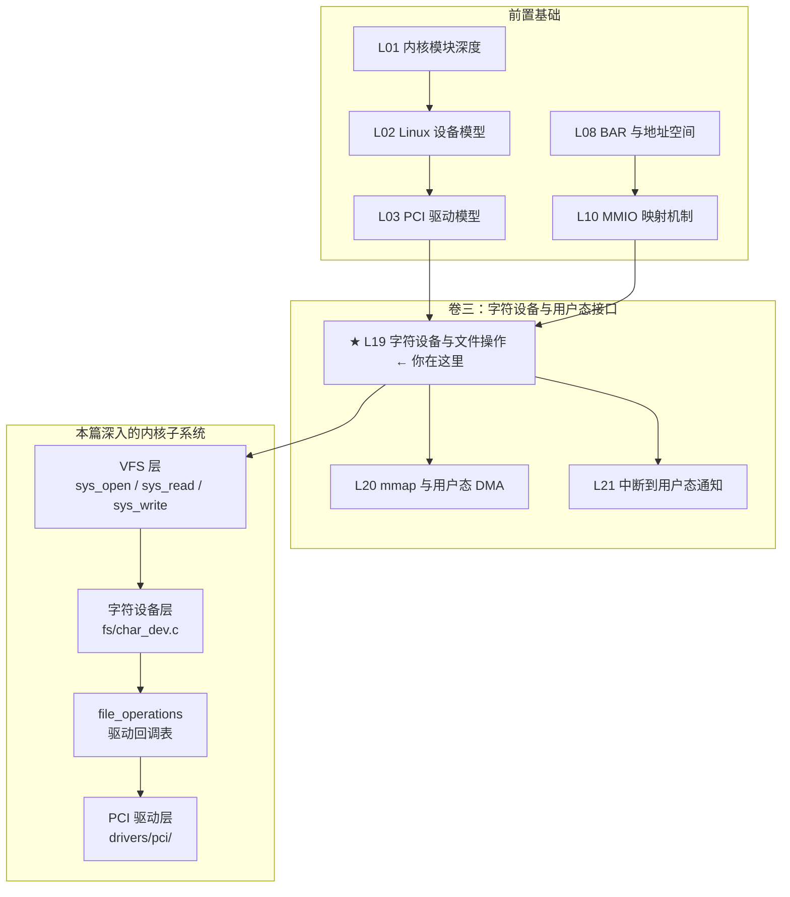
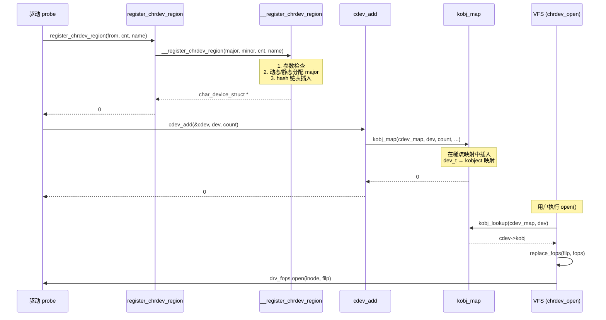

# L19：字符设备与文件操作

---

## 0. 框架定位



**核心问题**：PCI 设备被内核枚举、分配资源（BAR/IRQ）后，用户态程序如何与之通信？Linux 的回答是字符设备——通过 `/dev/my_pcie_dev` 这样的文件节点，用户程序可以 `open/read/write/ioctl` 操作 PCIe 设备。

---


---

## 1. 问题驱动

> 🔍 **你遇到了一个问题：**
>
> 你写了一个字符设备驱动，用户态执行 `open("/dev/gpu0", O_RDWR);`
返回 `-ENOENT`（No such device or address）。
从 `register_chrdev_region` 到用户态能 `open`——
中间到底经过了多少个环节？哪个环节断了？
>
> **带着这个问题学完本节，你就知道答案了。**

---

## 2. 前置认知


**前置依赖**：
- L01：理解内核模块生命周期——`module_init` / `module_exit`，模块引用计数
- L02：理解 `kobject` / `sysfs` / 设备模型三角关系
- L03：理解 `pci_driver` 的 `probe` / `remove` 何时被调用
- L08：理解 BAR 和 MMIO 地址空间的含义
- L10：理解 `ioremap` / MMIO 映射——字符设备的 `mmap` 最终要映射 BAR

**本文定位**：前八篇（L01–L10）解决的是"内核怎么看到 PCI 设备"。从本篇开始解决"用户态怎么用 PCI 设备"。字符设备是用户态与内核驱动交互的最基本通道。理解 cdev 的内部机制，是后续理解 `mmap`（L20）、中断通知（L21）、DMA 缓冲区共享（L22）的前提。

---

## 3. 核心原理

### 2.1 Linux 字符设备模型设计意图

为什么不是"直接通过 IO 端口 / MMIO 操作设备"？三个原因：

1. **安全隔离**：用户态不能直接操作物理地址（需要内核授权）。字符设备提供了一层访问控制——只有 `open` 成功的进程才能操作设备。
2. **多路复用**：一个 PCI 设备可能有多个功能（Function）、多个队列——字符设备通过主次设备号（major/minor）区分同一驱动管理的不同设备实例。
3. **统一接口**：PCI 设备类型千差万别（网卡、GPU、NVMe、FPGA），但 Linux 提供 "everything is a file" 的统一抽象——`open → read/write/ioctl → close` 范式覆盖所有设备。

### 2.2 主次设备号（dev_t）

内核用一个 `dev_t`（u32）表示一个设备号：

```c
// include/linux/kdev_t.h:7-12
#define MINORBITS    20
#define MINORMASK    ((1U << MINORBITS) - 1)

#define MAJOR(dev)   ((unsigned int) ((dev) >> MINORBITS))
#define MINOR(dev)   ((unsigned int) ((dev) & MINORMASK))
#define MKDEV(ma,mi) (((ma) << MINORBITS) | (mi))
```

布局：高 12 位 = major（0–4095），低 20 位 = minor（0–1048575）。

> `CHRDEV_MAJOR_MAX = 512`（`include/linux/fs.h:2593`）——字符设备 major 号上限 512，不是理论最大值 4096。这是内核主动施加的限制，保留高 3584 个 major 号给未来扩展和块设备。

**分配方式**：

| 分配函数 | 场景 | 返回值 |
|---------|------|--------|
| `register_chrdev_region(from, count, name)` | 静态分配——你知道要什么 major | 0 成功 / 负 errno |
| `alloc_chrdev_region(dev, baseminor, count, name)` | 动态分配——让内核分配 major | 0 成功，major 写入 `*dev` |

动态分配范围（`fs/char_dev.c:66-87`）：
1. **主区**：major 234–254（从 254 往下扫到 235）
2. **扩展区**：major 511–384（从 511 往下扫到 384）

为什么是这些空洞？历史原因——1–233 被传统设备号表占满（包括 1=mem, 4=tty, 8=sd, 9=md 等），255–383 留给 Linux 基金会注册的设备。

### 2.3 struct cdev

```c
// include/linux/cdev.h:14-21
struct cdev {
    struct kobject kobj;                 // 嵌入 kobject：sysfs 可见、引用计数
    struct module *owner;                // 所属模块（THIS_MODULE）
    const struct file_operations *ops;   // ★ 核心：文件操作函数表
    struct list_head list;               // 链接到所有已打开此 cdev 的 inode
    dev_t dev;                           // 设备号
    unsigned int count;                  // 管理的次设备号个数
} __randomize_layout;
```

**设计意图**：`cdev` 是 VFS（虚拟文件系统）与驱动之间的中介。当用户 `open("/dev/mydev")` 时：

```
VFS 通过设备号 → 找到 kobj_map → 找到 cdev → 找到 file_operations → 调用 open()
```

### 2.4 struct file_operations

这是字符设备驱动的能力声明表。每个驱动只需要实现自己关心的回调：

```c
// include/linux/fs.h:1926-1970
struct file_operations {
    struct module *owner;
    fop_flags_t fop_flags;
    loff_t (*llseek)   (struct file *, loff_t, int);
    ssize_t (*read)    (struct file *, char __user *, size_t, loff_t *);
    ssize_t (*write)   (struct file *, const char __user *, size_t, loff_t *);
    ssize_t (*read_iter)  (struct kiocb *, struct iov_iter *);
    ssize_t (*write_iter) (struct kiocb *, struct iov_iter *);

    __poll_t (*poll)   (struct file *, struct poll_table_struct *);
    long (*unlocked_ioctl) (struct file *, unsigned int, unsigned long);
    long (*compat_ioctl)   (struct file *, unsigned int, unsigned long);
    int (*mmap)        (struct file *, struct vm_area_struct *);

    int (*open)        (struct inode *, struct file *);
    int (*flush)       (struct file *, fl_owner_t id);
    int (*release)     (struct inode *, struct file *);
    // ...（oltre 20+ 个钩子）
};
```

**PCIe 驱动最核心的五个钩子**：

| 钩子 | PCIe 驱动中的含义 |
|------|------------------|
| `.open` | 获取设备引用，增加模块引用计数（或权限检查） |
| `.release` | 释放设备引用 |
| `.read` / `.write` | 通过 MMIO / PIO / DMA 传输数据 |
| `.unlocked_ioctl` | ★ PCIe 驱动的控制通道——配置寄存器、启动 DMA、复位等 |
| `.mmap` | 将 BAR 映射到用户态地址空间（L20 展开） |
| `.poll` | 等待硬件事件（中断到用户态通知，L21 展开） |

> **为什么是 `unlocked_ioctl` 而不是 `ioctl`？** v2.6.36 之后，ioctl 不再持有 BKL（大内核锁），新驱动全部使用 `unlocked_ioctl`。`compat_ioctl` 是 32-bit 用户态在 64-bit 内核上的兼容路径。

### 2.5 cdev 生命周期

```
cdev_init(&cdev, &fops)    // 或 cdev_alloc() —— 分配 + 初始化
    ↓
cdev_add(&cdev, dev, count) // 注册到系统——此后设备对用户态可见
    ↓
[用户 open/read/write/ioctl/close]
    ↓
cdev_del(&cdev)             // 从系统移除——断开 VFS 连接
    ↓
[module_exit]
```

⚠ **关键时序**：`cdev_add` 之后，用户态可能在任何时刻 `open` 设备——不依赖你的 probe 是否完成。所以 `cdev_add` 必须放在 probe 的最后一步，确保所有资源已就绪。

---

## 4. 内核源码带读

### 3.1 设备号注册：register_chrdev_region → __register_chrdev_region

入口函数 `register_chrdev_region`（`fs/char_dev.c:197-220`）的职责：注册一段连续的设备号区间。

```c
// fs/char_dev.c:197-220
int register_chrdev_region(dev_t from, unsigned count, const char *name)
{
    struct char_device_struct *cd;
    dev_t to = from + count;
    dev_t n, next;

    // == 步骤 1：按 major 分片 ==
    // 一次注册可能跨越多个 major（如 from=0x800001, count=0x200000）
    // 按 major 边界切分，每个 major 调用一次 __register_chrdev_region
    for (n = from; n < to; n = next) {
        next = MKDEV(MAJOR(n) + 1, 0);   // 下一个 major 的第一个 minor
        if (next > to)
            next = to;                    // 最后一段不跨越 major
        cd = __register_chrdev_region(MAJOR(n), MINOR(n),
                       next - n, name);
        if (IS_ERR(cd))
            goto fail;                    // ★ 异常：释放已注册的
    }
    return 0;

fail:
    to = n;                               // 已注册的上界
    for (n = from; n < to; n = next) {
        next = MKDEV(MAJOR(n) + 1, 0);
        kfree(__unregister_chrdev_region(MAJOR(n), MINOR(n), next - n));
    }
    return PTR_ERR(cd);
}
```

**设计意图**：`register_chrdev_region` 本质上是一个按 major 分割的循环器。一次请求的 count 可能覆盖多个 major 号（例如请求 minor 250–260，跨越了 major 边界），所以需要逐 major 处理。失败时逐段回滚。

真正做 hash 表插入的是 `__register_chrdev_region`（`fs/char_dev.c:97-166`）：

```c
// fs/char_dev.c:97-166
static struct char_device_struct *
__register_chrdev_region(unsigned int major, unsigned int baseminor,
                         int minorct, const char *name)
{
    struct char_device_struct *cd __free(kfree) = NULL;
    struct char_device_struct *curr, *prev = NULL;
    int ret;
    int i;

    // == 步骤 1：参数合法性检查 ==
    if (major >= CHRDEV_MAJOR_MAX) {                     // 512
        pr_err("CHRDEV \"%s\" major requested (%u) is greater "
               "than the maximum (%u)\n",
               name, major, CHRDEV_MAJOR_MAX - 1);
        return ERR_PTR(-EINVAL);
    }

    if (minorct > MINORMASK + 1 - baseminor) {           // 越界？
        pr_err("CHRDEV \"%s\" minor range requested (%u-%u) "
               "is out of range ...\n",
               name, baseminor, baseminor + minorct - 1, 0, MINORMASK);
        return ERR_PTR(-EINVAL);
    }

    // == 步骤 2：分配 char_device_struct ==
    cd = kzalloc_obj(struct char_device_struct);
    if (cd == NULL)
        return ERR_PTR(-ENOMEM);

    guard(mutex)(&chrdevs_lock);                         // 获取全局锁

    // == 步骤 3：动态分配 major ==
    if (major == 0) {
        ret = find_dynamic_major();                      // 从空闲区间找一个
        if (ret < 0) {                                   // 全部占满
            pr_err("CHRDEV \"%s\" dynamic allocation region is full\n", name);
            return ERR_PTR(ret);                         // -EBUSY
        }
        major = ret;
    }

    // == 步骤 4：在 hash 链表中检查冲突 ==
    ret = -EBUSY;
    i = major_to_index(major);                           // major % 255
    for (curr = chrdevs[i]; curr; prev = curr, curr = curr->next) {
        if (curr->major < major)
            continue;                                    // 还没到我，继续找
        if (curr->major > major)
            break;                                       // 已过了，无冲突

        // major 相同 → 检查 minor 区间是否重叠
        if (curr->baseminor + curr->minorct <= baseminor)
            continue;                                    // 当前节点完全在申请区"左边"
        if (curr->baseminor >= baseminor + minorct)
            break;                                       // 当前节点完全在申请区"右边"

        return ERR_PTR(ret);                             // ★ 重叠！-EBUSY
    }

    // == 步骤 5：填入数据，插入链表 ==
    cd->major = major;
    cd->baseminor = baseminor;
    cd->minorct = minorct;
    strscpy(cd->name, name, sizeof(cd->name));

    if (!prev) {
        cd->next = curr;
        chrdevs[i] = cd;                                 // 插在表头
    } else {
        cd->next = prev->next;
        prev->next = cd;                                 // 插在 prev 后面
    }

    return_ptr(cd);
}
```

**异常路径汇总**：

| 条件 | 返回值 | dmesg 特征 | 排查方法 |
|------|--------|-----------|---------|
| `major >= CHRDEV_MAJOR_MAX` | `-EINVAL` | `major requested (xxx) is greater than the maximum` | 检查 `.c` 中指定的 major 号 |
| minor 区间越界 | `-EINVAL` | `minor range ... out of range` | 检查 `MINORMASK`（v7.0 为 1048575） |
| kzalloc 失败 | `-ENOMEM` | 无（内存不足） | 检查 `dmesg \| grep -i "oom\|slab"` |
| 动态区间已满 | `-EBUSY` | `dynamic allocation region is full` | 罕见；`cat /proc/devices` 确认 |
| minor 区间重叠 | `-EBUSY` | 无显式 dmesg | `cat /proc/devices` 看同 major 已注册了哪些 |

### 3.2 cdev_add → kobj_map

```c
// fs/char_dev.c:476-501
int cdev_add(struct cdev *p, dev_t dev, unsigned count)
{
    int error;

    p->dev = dev;                              // 记录设备号
    p->count = count;                          // 管理的次设备号个数

    // == 步骤 1：防白洞设备 ==
    if (WARN_ON(dev == WHITEOUT_DEV)) {
        error = -EBUSY;
        goto err;
    }

    // == 步骤 2：注册到 kobj_map ==
    error = kobj_map(cdev_map, dev, count, NULL,
                     exact_match, exact_lock, p);
    if (error)
        goto err;

    kobject_get(p->kobj.parent);               // 对 parent 加引用

    return 0;

err:
    kfree_const(p->kobj.name);
    p->kobj.name = NULL;
    return error;
}
```

**kobj_map 的作用**：`cdev_map` 是一个全局的 `struct kobj_map`（`fs/char_dev.c:29`），它将 `dev_t` 区间映射到 `struct kobject`。当 `chrdev_open` 被调用时（见下文 3.3），`kobj_lookup(cdev_map, inode->i_rdev, &idx)` 返回设备号对应的 `cdev->kobj`。

```
cdev_map 的数据结构：
  是一个稀疏数组 + 链表的 hash table（类似 radix tree）
  每次 kobj_map(cdev_map, dev, count, ...) 插入一段映射
  每次 kobj_lookup(cdev_map, dev, &idx) 按 dev_t 查找对应的 kobject
```

### 3.3 chrdev_open：VFS 到驱动的桥梁

当用户态执行 `fd = open("/dev/mydev", O_RDWR)`，VFS 最终调用 `def_chr_fops.open`，即 `chrdev_open`（`fs/char_dev.c:370-421`）：

```c
// fs/char_dev.c:370-421
static int chrdev_open(struct inode *inode, struct file *filp)
{
    const struct file_operations *fops;
    struct cdev *p;
    struct cdev *new = NULL;
    int ret = 0;

    spin_lock(&cdev_lock);
    p = inode->i_cdev;                     // inode 中已缓存的 cdev

    if (!p) {
        // == 首次打开：通过设备号查找 cdev ==
        struct kobject *kobj;
        int idx;
        spin_unlock(&cdev_lock);

        // ★ 关键：这里就是 kobj_map 的查找入口
        kobj = kobj_lookup(cdev_map, inode->i_rdev, &idx);
        if (!kobj)
            return -ENXIO;                 // 设备不存在或已移除

        new = container_of(kobj, struct cdev, kobj);
        spin_lock(&cdev_lock);

        // 重查：开锁期间可能另一个进程已经设置了 i_cdev
        p = inode->i_cdev;
        if (!p) {
            inode->i_cdev = p = new;       // 缓存到 inode
            list_add(&inode->i_devices, &p->list); // 加入 cdev 的打开列表
            new = NULL;                    // 避免后面 cdev_put
        } else if (!cdev_get(p))
            ret = -ENXIO;
    } else if (!cdev_get(p))
        ret = -ENXIO;
    spin_unlock(&cdev_lock);
    cdev_put(new);                         // 如果 new 没被用，释放它

    if (ret)
        return ret;

    // == 设置 file_operations ==
    ret = -ENXIO;
    fops = fops_get(p->ops);               // 获取驱动的 fops
    if (!fops)
        goto out_cdev_put;

    replace_fops(filp, fops);              // ★ 把文件操作的 f_op 替换为驱动的
    if (filp->f_op->open) {
        ret = filp->f_op->open(inode, filp); // ★ 调用驱动的 .open
        if (ret)
            goto out_cdev_put;
    }

    return 0;

out_cdev_put:
    cdev_put(p);
    return ret;
}
```

⚠ **关键理解**：`chrdev_open` 做了两件事——
1. **按设备号查找**：通过 `kobj_lookup(cdev_map, dev)` 找到 `cdev`
2. **替换 f_op**：`replace_fops(filp, fops)` 将 `filp->f_op` 从 `def_chr_fops` 替换为驱动注册的 `file_operations`

这意味着同一个 cdev 下的所有打开都共享 `p->ops`，但每次打开是独立调用驱动的 `.open`。驱动的 `.open` 通常做权限检查 + 设置 `filp->private_data`。

### 3.4 __register_chrdev：一站式封装

`__register_chrdev`（`fs/char_dev.c:265-297`）将 `__register_chrdev_region` + `cdev_alloc` + `cdev_add` 合并为一步：

```c
// fs/char_dev.c:265-297
int __register_chrdev(unsigned int major, unsigned int baseminor,
                      unsigned int count, const char *name,
                      const struct file_operations *fops)
{
    struct char_device_struct *cd;
    struct cdev *cdev;
    int err = -ENOMEM;

    // 步骤 1：注册设备号区间
    cd = __register_chrdev_region(major, baseminor, count, name);
    if (IS_ERR(cd))
        return PTR_ERR(cd);

    // 步骤 2：分配 cdev
    cdev = cdev_alloc();
    if (!cdev)
        goto out2;

    // 步骤 3：设置 ops 和 owner
    cdev->owner = fops->owner;
    cdev->ops = fops;
    kobject_set_name(&cdev->kobj, "%s", name);

    // 步骤 4：添加 cdev 到系统
    err = cdev_add(cdev, MKDEV(cd->major, baseminor), count);
    if (err)
        goto out;

    cd->cdev = cdev;

    return major ? 0 : cd->major;          // 动态分配返回实际 major

out:
    kobject_put(&cdev->kobj);
out2:
    kfree(__unregister_chrdev_region(cd->major, baseminor, count));
    return err;
}
```

**完整的调用流程图**：



---

## 5. PCIe 驱动的字符设备接口（ioctl/cmd 通道）

### 4.1 PCIe 设备为什么需要字符设备

PCIe 设备驱动通常有两类操作：

| 操作类型 | 实现方式 | 使用场景 |
|---------|---------|---------|
| **数据面** | DMA + mmap | 高性能数据传输（GPU 帧缓冲、NVMe 数据） |
| **控制面** | ioctl + MMIO | 寄存器配置、复位、状态查询 |

控制面天然适合字符设备的 ioctl：

```c
// 典型 PCIe 驱动的 ioctl 设计
#define PCIE_DEV_IOC_MAGIC   'P'

#define PCIE_IOCTL_RESET       _IO(PCIE_DEV_IOC_MAGIC, 0x01)
#define PCIE_IOCTL_GET_BAR     _IOR(PCIE_DEV_IOC_MAGIC, 0x02, struct pcie_bar_info)
#define PCIE_IOCTL_SET_DMA     _IOW(PCIE_DEV_IOC_MAGIC, 0x03, struct pcie_dma_cfg)
#define PCIE_IOCTL_GET_STATUS  _IOR(PCIE_DEV_IOC_MAGIC, 0x04, uint32_t)
#define PCIE_IOCTL_MAX_NR      0x10
```

ioctl 在内核端的实现：

```c
static long my_pcie_ioctl(struct file *filp, unsigned int cmd, unsigned long arg)
{
    struct my_pcie_dev *dev = filp->private_data;   // ★ probe 中设置
    void __iomem *bar0 = dev->bar0;                 // ioremap 的 BAR0

    switch (cmd) {
    case PCIE_IOCTL_RESET:
        // 写设备的软复位寄存器
        iowrite32(0xDEADBEAF, bar0 + RESET_OFFSET);
        return 0;

    case PCIE_IOCTL_GET_BAR:
        struct pcie_bar_info info;
        info.phys_addr = pci_resource_start(dev->pdev, 0);
        info.size      = pci_resource_len(dev->pdev, 0);
        if (copy_to_user((void __user *)arg, &info, sizeof(info)))
            return -EFAULT;
        return 0;

    case PCIE_IOCTL_SET_DMA:
        struct pcie_dma_cfg cfg;
        if (copy_from_user(&cfg, (void __user *)arg, sizeof(cfg)))
            return -EFAULT;
        // 配置 DMA 引擎（L22 展开）
        configure_dma_engine(dev, &cfg);
        return 0;

    default:
        return -ENOTTY;   // 标准：未识别的 ioctl 命令
    }
}
```

### 4.2 ioctl 在 x86 上的硬件下穿路径

```
用户态 ioctl(fd, PCIE_IOCTL_RESET, 0)
  → sys_ioctl() → vfs_ioctl() → filp->f_op->unlocked_ioctl()
  → my_pcie_ioctl() → iowrite32(0xDEADBEAF, bar0 + RESET_OFFSET)
  → __raw_writel → movl %eax, (%rdx)      // x86 MOV 指令写 UC 空间
  → PCIe Memory Write TLP → RC → Switch → EP
```

⚠ **x86 特有**：`iowrite32` 在 x86 上写 `ioremap` 返回的地址时，因为该页被标记为 UC（Uncacheable，通过 MTRR 或 PAT），CPU 不缓存、不合并写、不重排——这个 `mov` 指令直接触发 PCIe TLP。与 ARM 不同，x86 不需要额外的 `dsb`/`wmb` 屏障——`mov` 到 UC 内存天然是强序的。

### 4.3 PCIe 驱动的典型 probe + cdev 注册模板

```c
// drivers/pci/my_pcie_dev/main.c  (示意)
static int my_pcie_probe(struct pci_dev *pdev, const struct pci_device_id *id)
{
    struct my_dev *dev;
    int ret;

    // 1. 分配私有数据结构
    dev = devm_kzalloc(&pdev->dev, sizeof(*dev), GFP_KERNEL);
    if (!dev)
        return -ENOMEM;

    // 2. 启用 PCI 设备
    ret = pcim_enable_device(pdev);
    if (ret < 0)
        return ret;

    // 3. 分配 BAR 资源
    ret = pcim_iomap_regions(pdev, BIT(0), "my_pcie");
    if (ret < 0)
        return ret;
    dev->bar0 = pcim_iomap_table(pdev)[0];

    dev->pdev = pdev;
    pci_set_drvdata(pdev, dev);

    // 4. ★ 注册字符设备 - 放在 probe 最后
    ret = alloc_chrdev_region(&dev->devt, 0, 1, "my_pcie");
    if (ret < 0)
        return ret;

    cdev_init(&dev->cdev, &my_pcie_fops);
    dev->cdev.owner = THIS_MODULE;
    ret = cdev_add(&dev->cdev, dev->devt, 1);
    if (ret < 0) {
        unregister_chrdev_region(dev->devt, 1);
        return ret;
    }

    // 5. 创建设备节点（自动 /dev/my_pcieX）
    dev->device = device_create(my_pcie_class, &pdev->dev,
                                dev->devt, dev, "my_pcie%d", dev->index);

    return 0;
}
```

⚠ **注意点**：
- `cdev_add` 必须在 probe 最后——在此之后用户态可能立即 `open`
- 使用 `device_create` + class 自动创建设备节点，而不是手动 `mknod`
- 使用 `devm_*` API 简化资源释放；但 `cdev_del` 仍需手动做

---

## 6. GPU 场景：GPU 设备节点（/dev/nvidia*）的字符设备模型

### 5.1 NVIDIA 驱动的设备节点布局

安装 NVIDIA 专有驱动后，`ls /dev/nvidia*` 看到：

```
/dev/nvidia0        # GPU 0 的主设备
/dev/nvidia1        # GPU 1 的主设备
/dev/nvidiactl      # 控制设备（驱动管理、模式设置、权限控制）
/dev/nvidia-uvm     # Unified Virtual Memory 设备
/dev/nvidia-modeset # 模式设置（显示输出）
```

它们都是 major 195（NVIDIA 分配的主设备号），minor 不同：

| 节点 | Minor | 用途 |
|------|-------|------|
| `/dev/nvidia0` | 0 | GPU 0——用户态通过 CUDA 驱动 API 操作 |
| `/dev/nvidia1` | 1 | GPU 1 |
| ... | ... | ... |
| `/dev/nvidiactl` | 255 | 控制设备——管理 GPU 分配和权限 |
| `/dev/nvidia-uvm` | 254 | UVM——统一虚拟内存管理 |
| `/dev/nvidia-modeset` | 253 | 模式设置 |

### 5.2 NVIDIA 驱动的 cdev 结构

NVIDIA 驱动的字符设备注册路径（来源：nvidia-open-gpu-kernel-modules）：

```c
// nvidia/nv.c (示意，非逐字源码)
static int __init nvidia_init_module(void)
{
    // 注册一个 major 管理所有 GPU 和辅助设备
    ret = __register_chrdev(NVIDIA_MAJOR, 0, NVIDIA_MINOR_COUNT,
                            "nvidia", &nvidia_fops);
    // major = 195, baseminor = 0, count = 256
}
```

`nvidia_fops` 结构体：

```c
static const struct file_operations nvidia_fops = {
    .owner          = THIS_MODULE,
    .open           = nvidia_open,       // 权限检查 + GPU 实例绑定
    .release        = nvidia_close,
    .unlocked_ioctl = nvidia_ioctl,      // ★ 核心：所有 CUDA 驱动 API 都通过这里
    .mmap           = nvidia_mmap,       // 映射 GPU 显存（VRAM）
    .compat_ioctl   = nvidia_ioctl,      // 32-bit 兼容
};
```

### 5.3 CUDA 驱动 API 通过 ioctl 实现

用户态 CUDA 库（`libcuda.so`）的所有 GPU 操作，最终都落到 `/dev/nvidia0` 的 ioctl：

```
cudaMemcpy(dst, src, size, cudaMemcpyDeviceToHost)
  → CUDA Runtime → CUDA Driver API (cuMemcpyDtoH)
  → libcuda.so → ioctl(fd, NV_ESC_MEMORY_OPERATION, &args)
  → nvidia_ioctl() → nv_ioctl_memory_operation()
  → GPU MMIO write → DMA engine 启动 → 完成 interrupt → 返回
```

> 📌 **协议对照**：GPU 通过 PCIe 的 Memory Read/Write TLP 完成数据搬运。ioctl 只是控制通道——数据不会经过 ioctl 的 copy_from_user 走 PIO，而是通过 DMA 引擎直接搬运。ioctl 的作用是向 DMA 引擎下发命令（源地址、目标地址、长度）。

### 5.4 AMDGPU 驱动

与 NVIDIA 类似，AMDGPU 驱动也有 `/dev/dri/renderD128`、`/dev/dri/card0` 等节点：

```c
// drivers/gpu/drm/amd/amdgpu/amdgpu_drv.c
// DRM（Direct Rendering Manager）框架本身就封装了字符设备
// 使用 drm_dev_alloc → drm_dev_register 自动创建 cdev
// drm 框架的 file_operations 统一实现，驱动只需要实现 drm_driver 回调
```

关键区别：NVIDIA 的专有驱动直接操作 cdev，而 AMDGPU（开源）使用 DRM 框架。DRM 框架在 cdev 之上又包装了一层——但底层机制完全相同：cdev → file_operations → ioctl。

---

## 7. 思考题

### 6.1（分析题）设备号冲突排查

你在 probe 中调用 `register_chrdev_region(MKDEV(200, 0), 16, "my_pcie")` 返回 `-EBUSY`。你如何排查是哪个模块占用了 major 200 的哪些 minor？

### 6.2（设计意图题）为什么 `cdev_add` 必须在 probe 的最后一步？

考虑以下场景：
- probe 步骤 A：`ioremap` 返回成功
- probe 步骤 B：`cdev_add`——设备对用户态可见
- probe 步骤 C：分配 DMA 缓冲区
- probe 步骤 D：注册中断处理函数

如果顺序是 A→B→C→D，而 C 失败（DMA 分配失败），probe 返回错误。此时用户态进程已经 `open` 了设备并开始 ioctl——会发生什么？正确的顺序应该是什么？为什么？

### 6.3（代码实操题）实现 open/release

根据 PCIe 驱动模板，写出 `open` 和 `release` 函数的完整实现。要求：
- `open` 中通过 `filp->private_data` 绑定 PCIe 设备结构体
- `release` 中清理
- 考虑 `O_EXCL` 独占打开的支持（可选）

### 6.4（排查题）为什么读操作返回 0 字节？

你写了一个 PCIe 字符设备驱动，在 `.read` 回调中实现了从 BAR0 的某个 FIFO 寄存器读取数据：

```c
static ssize_t my_read(struct file *filp, char __user *buf,
                       size_t count, loff_t *f_pos)
{
    struct my_dev *dev = filp->private_data;
    uint32_t val;
    int i;

    for (i = 0; i < count / 4; i++) {
        val = ioread32(dev->bar0 + FIFO_REG);
        if (copy_to_user(buf + i * 4, &val, 4))
            return -EFAULT;
    }
    return count;
}
```

用户态 `read(fd, buf, 4096)` 总是返回 4096，但 `buf` 中的内容全部为零——而通过 `devmem2` 读 FIFO_REG 地址看到的不是零。可能的原因是什么？

### 6.5（设计题）MMIO vs ioctl vs DMA 数据路径

你的 PCIe 设备支持三种数据读取方式：
- A：ioctl 中读 MMIO 寄存器，并通过 `copy_to_user` 返回
- B：read 回调中读 MMIO 寄存器，通过 `read` 系统调用返回
- C：先 ioctl 配置 DMA，然后 DMA 引擎自己把数据搬到用户态预分配的缓冲区

对于一个 4KB 的读取请求，三种方式各自的延迟和吞吐特征是什么？PCIe 驱动应该优先使用哪种？

---

## 6b. 参考答案

### 6.1 答案

```bash
# 查看 /proc/devices 找到 major 200 的注册者
cat /proc/devices | grep "^200"

# 查看内核日志中该 major 的注册信息
dmesg | grep "200"

# 更彻底：查看 char_device_struct hash 链表的全部内容
# （需要通过内核调试接口或 kgdb）

# 如果有 /sys/kernel/debug/，可以尝试
cat /sys/kernel/debug/devices
```

`/proc/devices` 的输出格式为 `major name`。如果 major 200 被其他驱动注册了，你会看到类似 `200 my_other_drv`。如果列表中不存在 major 200，但 register 仍然返回 `-EBUSY`，说明 minor 区间冲突——先注册的驱动使用了 major 200 的某一段 minor，你的 0–15 区间与之重叠。

使用 `alloc_chrdev_region` 动态分配可以完全避免这种冲突——内核会帮你选一个空闲的 major。

### 6.2 答案

如果顺序是 A→B→C→D 且 C 失败：

1. 用户态在步骤 B 之后、C 失败之前已经 `open` 了设备
2. 用户态调用 ioctl，驱动的 ioctl 试图访问 DMA 缓冲区——但缓冲区不存在
3. 要么访问到未初始化指针（内核 panic），要么返回错误
4. probe 返回后，内核会调用 `pci_device_remove`——但用户态的文件句柄仍然有效
5. 驱动移除后，用户态再访问设备——cdev_del 只是在 kobj_map 中移除映射，已打开的 fd 不会自动关闭

**正确顺序**：C→D→A→B

```
① DMA 缓冲区分配
② 中断注册
③ ioremap（获取 MMIO 基址）
④ cdev_add（最后一步！）
```

这样在 `cdev_add` 之前，所有资源都已就绪。如果①或②失败，probe 在④之前返回，用户态永远不会看到这个设备。

### 6.3 答案

```c
// open: 绑定 PCIe 设备结构体到文件
static int my_pcie_open(struct inode *inode, struct file *filp)
{
    // 从 inode 获取 cdev，再 container_of 得到私有结构
    // 或者更常见的：通过 inode->i_cdev 自定义映射
    struct my_dev *dev = container_of(inode->i_cdev, struct my_dev, cdev);

    // 检查独占打开
    if (filp->f_flags & O_EXCL) {
        if (atomic_xchg(&dev->excl_open, 1))
            return -EBUSY;   // 已有进程以 O_EXCL 打开
    }

    // 增加模块引用计数（cdev_get 已经在 chrdev_open 中做了）
    // 绑定 private_data
    filp->private_data = dev;

    // 递增打开计数
    atomic_inc(&dev->open_count);

    return 0;
}

// release: 清理
static int my_pcie_release(struct inode *inode, struct file *filp)
{
    struct my_dev *dev = filp->private_data;

    // 释放独占锁
    if (filp->f_flags & O_EXCL)
        atomic_set(&dev->excl_open, 0);

    // 递减打开计数
    if (atomic_dec_and_test(&dev->open_count)) {
        // 如果是最后一个关闭，可以触发设备复位
        // 或释放临时资源
    }

    return 0;
}
```

### 6.4 答案

最可能的原因：**FIFO 是消费性读取**——每次 `ioread32` 从 FIFO_REG 读取时，FIFO 弹出该数据。驱动中的 `read` 回调在不知道 FIFO 中有多少有效数据的情况下，盲目地读取了 `count/4` 次。

如果 FIFO 中只有 N 个有效 32-bit 值：
- 前 N 次 `ioread32` 返回真实数据
- 后 (count/4 - N) 次 `ioread32` 返回空（0）或硬件定义的"空指示"
- 驱动把全部数据（包括空值）`copy_to_user` 返回给用户

用户看到：buf 开头有 N 个有效值，后面全是 0。

**正确做法**：
1. 先读状态寄存器确认 FIFO 有效数据量
2. 只读有效数据
3. 返回值应该是实际读取的字节数，而不是请求的 count

```c
static ssize_t my_read(struct file *filp, char __user *buf,
                       size_t count, loff_t *f_pos)
{
    struct my_dev *dev = filp->private_data;
    unsigned int avail;
    int i, ret = 0;

    // 先读 FIFO 状态：当前可用数据量（单位：双字）
    avail = ioread32(dev->bar0 + FIFO_STATUS_REG);
    avail = min(avail, (unsigned int)(count / 4));

    for (i = 0; i < avail; i++) {
        uint32_t val = ioread32(dev->bar0 + FIFO_REG);
        if (copy_to_user(buf + i * 4, &val, 4))
            return -EFAULT;
        ret += 4;
    }
    return ret;   // 返回实际读取的字节数
}
```

### 6.5 答案

| 方式 | 延迟（每 4KB） | 吞吐 | 适用场景 |
|------|---------------|------|---------|
| A：ioctl + copy_to_user | 极高（两次上下文切换 + 每个寄存器一次 MMIO 读） | 极低 | 仅控制/状态读取（几个字节） |
| B：read + copy_to_user | 较高（一次上下文切换 + 多次 MMIO 读） | 低 | 小数据量（< 几百字节） |
| C：DMA | 一次 ioctl 配置延迟 + DMA 传输延迟 | 极高 | 大数据量（> 1KB 批量传输） |

**PCIe 驱动优先使用 C（DMA）**。
- MMIO 读（`ioread32`）每次访问都产生一个 PCIe Completion 延迟——对 4KB 数据需要 1024 次 32-bit 读，每次几百 ns 到几 μs
- DMA 只需要一次 ioctl 配置（设置源/目标/长度），DMA 引擎满 PCIe 带宽传输（PCIe Gen3 x8 ~8 GB/s）
- 实践中，GPU、NVMe、网卡全部使用 DMA 传输数据，ioctl/read/write 只传输命令和状态

ioctl + MMIO 阅读寄存器适合：读配置寄存器（8 字节）、获取设备状态（4 字节）、读取错误日志等小数据场景。

---

## 8. 渐进式代码构建

在 L03 的 `pci_driver` 骨架基础上，添加字符设备支持。

### 第 1 步：定义设备结构体和文件操作

```c
// pcie_char_dev.c — 基于 L03 骨架
#include <linux/module.h>
#include <linux/pci.h>
#include <linux/cdev.h>
#include <linux/fs.h>
#include <linux/device.h>
#include <linux/uaccess.h>

#define DRIVER_NAME "pcie_char_dev"

struct pcie_char_dev {
    struct pci_dev *pdev;
    void __iomem   *bar0;

    struct cdev    cdev;
    dev_t          devt;
    struct device  *device;
    atomic_t       open_count;
};

static struct class *pcie_char_class;
static int pcie_char_major;     // 动态分配，probe 中设置
```

### 第 2 步：file_operations 实现

```c
static int pcie_char_open(struct inode *inode, struct file *filp)
{
    struct pcie_char_dev *dev = container_of(inode->i_cdev,
                                    struct pcie_char_dev, cdev);
    filp->private_data = dev;
    atomic_inc(&dev->open_count);
    dev_info(&dev->pdev->dev, "opened (count=%d)\n",
             atomic_read(&dev->open_count));
    return 0;
}

static int pcie_char_release(struct inode *inode, struct file *filp)
{
    struct pcie_char_dev *dev = filp->private_data;
    atomic_dec(&dev->open_count);
    return 0;
}

static long pcie_char_ioctl(struct file *filp, unsigned int cmd,
                            unsigned long arg)
{
    struct pcie_char_dev *dev = filp->private_data;

    switch (cmd) {
    case _IO('P', 0x01): {   // 读取 BAR0 物理地址（演示用）
        u64 phys_addr = pci_resource_start(dev->pdev, 0);
        if (copy_to_user((void __user *)arg, &phys_addr, sizeof(phys_addr)))
            return -EFAULT;
        return 0;
    }
    default:
        return -ENOTTY;
    }
}

static const struct file_operations pcie_char_fops = {
    .owner          = THIS_MODULE,
    .open           = pcie_char_open,
    .release        = pcie_char_release,
    .unlocked_ioctl = pcie_char_ioctl,
};
```

### 第 3 步：probe 中添加 cdev 注册

```c
static int pcie_char_probe(struct pci_dev *pdev,
                           const struct pci_device_id *id)
{
    struct pcie_char_dev *dev;
    int ret;

    // A. 分配设备结构体
    dev = devm_kzalloc(&pdev->dev, sizeof(*dev), GFP_KERNEL);
    if (!dev)
        return -ENOMEM;

    // B. 启用 PCI 设备
    ret = pcim_enable_device(pdev);
    if (ret < 0)
        return ret;

    // C. 映射 BAR0
    ret = pcim_iomap_regions(pdev, BIT(0), DRIVER_NAME);
    if (ret < 0)
        return ret;
    dev->bar0 = pcim_iomap_table(pdev)[0];
    dev->pdev = pdev;
    pci_set_drvdata(pdev, dev);

    // D. ★ 注册字符设备号
    ret = alloc_chrdev_region(&dev->devt, 0, 1, DRIVER_NAME);
    if (ret < 0) {
        dev_err(&pdev->dev, "Failed to allocate chrdev region\n");
        return ret;
    }
    pcie_char_major = MAJOR(dev->devt);

    // E. ★ 初始化并添加 cdev
    cdev_init(&dev->cdev, &pcie_char_fops);
    dev->cdev.owner = THIS_MODULE;
    ret = cdev_add(&dev->cdev, dev->devt, 1);
    if (ret < 0) {
        dev_err(&pdev->dev, "Failed to add cdev\n");
        unregister_chrdev_region(dev->devt, 1);
        return ret;
    }

    // F. ★ 自动创建设备节点
    dev->device = device_create(pcie_char_class, &pdev->dev,
                                dev->devt, dev, "pcie_char%d",
                                pci_dev_id(pdev));
    if (IS_ERR(dev->device)) {
        cdev_del(&dev->cdev);
        unregister_chrdev_region(dev->devt, 1);
        return PTR_ERR(dev->device);
    }

    atomic_set(&dev->open_count, 0);
    dev_info(&pdev->dev, "probed: /dev/pcie_char%d (major=%d minor=%d)\n",
             pci_dev_id(pdev), MAJOR(dev->devt), MINOR(dev->devt));

    return 0;
}
```

### 第 4 步：remove 中清理

```c
static void pcie_char_remove(struct pci_dev *pdev)
{
    struct pcie_char_dev *dev = pci_get_drvdata(pdev);

    // 先移除设备节点（阻止新的 open）
    device_destroy(pcie_char_class, dev->devt);

    // 再移除 cdev（从 kobj_map 中删除）
    cdev_del(&dev->cdev);

    // 最后释放设备号
    unregister_chrdev_region(dev->devt, 1);

    dev_info(&pdev->dev, "removed\n");
}
```

### 第 5 步：模块 init/exit

```c
static struct pci_device_id pcie_char_ids[] = {
    { PCI_DEVICE(0x10EE, 0x1234) },  // 替换为实际 VID/DID
    { 0, }
};
MODULE_DEVICE_TABLE(pci, pcie_char_ids);

static struct pci_driver pcie_char_driver = {
    .name     = DRIVER_NAME,
    .id_table = pcie_char_ids,
    .probe    = pcie_char_probe,
    .remove   = pcie_char_remove,
};

static int __init pcie_char_init(void)
{
    // 创建设备类（用于 device_create 自动生成 /dev/）
    pcie_char_class = class_create(THIS_MODULE, DRIVER_NAME);
    if (IS_ERR(pcie_char_class))
        return PTR_ERR(pcie_char_class);

    return pci_register_driver(&pcie_char_driver);
}

static void __exit pcie_char_exit(void)
{
    pci_unregister_driver(&pcie_char_driver);
    class_destroy(pcie_char_class);
}

module_init(pcie_char_init);
module_exit(pcie_char_exit);

MODULE_LICENSE("GPL v2");
MODULE_AUTHOR("kly");
MODULE_DESCRIPTION("PCIe Char Device Demo - L19");
```

### 第 6 步：构建和测试

```makefile
# Makefile
obj-m += pcie_char_dev.o

all:
	make -C /lib/modules/$(shell uname -r)/build M=$(PWD) modules

clean:
	make -C /lib/modules/$(shell uname -r)/build M=$(PWD) clean
```

用户态测试：

```c
// test.c  — gcc -o test test.c
#include <stdio.h>
#include <stdlib.h>
#include <fcntl.h>
#include <unistd.h>
#include <sys/ioctl.h>

int main(int argc, char *argv[])
{
    char path[64];
    int fd;
    unsigned long long bar0_phys;

    if (argc < 2) {
        fprintf(stderr, "Usage: %s <minor>\n", argv[0]);
        return 1;
    }

    snprintf(path, sizeof(path), "/dev/pcie_char%s", argv[1]);
    fd = open(path, O_RDWR);
    if (fd < 0) {
        perror("open");
        return 1;
    }

    // 测试 ioctl：获取 BAR0 物理地址
    if (ioctl(fd, _IO('P', 0x01), &bar0_phys) < 0) {
        perror("ioctl");
        close(fd);
        return 1;
    }

    printf("BAR0 physical address: 0x%llx\n", bar0_phys);
    close(fd);
    return 0;
}
```

---

**本篇核心脉络**：

```
用户态程序         内核 VFS         字符设备层          PCI 驱动层
    fd=open()  →  chrdev_open()  →  kobj_lookup()  →  pcie_char_open()
    ioctl()    →  vfs_ioctl()    →  unlocked_ioctl →  pcie_char_ioctl()
    close()    →  filp_close()   →  release()      →  pcie_char_release()
```

字符设备是用户态与 PCIe 驱动之间的桥梁。下一篇 L20 将在这个基础上添加 `mmap`——让用户态直接把 BAR 映射到自己的地址空间，不再经过系统调用。
