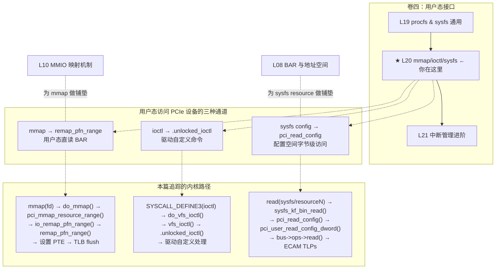
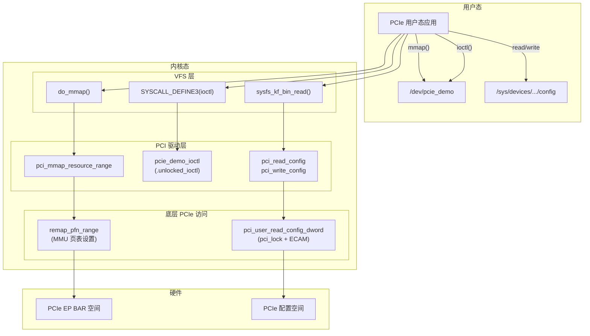

# L20：mmap / ioctl / sysfs——用户态与内核态交互

## 0. 框架定位



**前置依赖**：L08（BAR 结构）、L10（ioremap / PAT）、L03（pci_driver 骨架）

**角色区分**：
| 接口 | 典型用途 | 路径 | 权限检查 |
|------|---------|------|---------|
| mmap | BAR 直读直写（寄存器访问） | 驱动 `mmap()` → `remap_pfn_range` | 文件权限 |
| ioctl | 配置查询/设备控制命令 | 驱动 `.unlocked_ioctl` | 自定义 |
| sysfs config | 配置空间读/写（debug） | `pci_read_config/pci_write_config` | CAP_SYS_ADMIN / 文件权限 |

---


---

## 1. 问题驱动

> 🔍 **你遇到了一个问题：**
>
> 用户态 CUDA 程序调用 `cudaMalloc` 后拿到一个地址，
然后 `mmap` GPU 的 BAR 空间到用户进程——
一访问，直接 Segmentation Fault。
`remap_pfn_range` 在内核里做了什么？
mmap/ioctl/sysfs 三种通道分别在什么时候用？
>
> **带着这个问题学完本节，你就知道答案了。**

---

## 2. 前置认知


**前置篇章**：
- **L08 BAR 与地址空间**：资源对象 `struct resource`、IORESOURCE_MEM/IO 标志、物理地址范围
- **L10 MMIO 映射机制**：`ioremap()`、PAT/MTRR 内存类型决策、WC/UC 语义差异
- **L03 PCI 驱动模型**：`pci_driver` 骨架、`probe()` → `remove()` 生命周期

**本文核心问题**：
1. 用户态程序如何以零拷贝方式访问 PCIe 设备的 BAR 空间？mmap 在内核中做了什么？
2. 驱动如何自定义用户态控制命令？ioctl 的 VFS 路径到驱动 `.unlocked_ioctl` 的调用链是怎样的？
3. 用户态如何通过 sysfs 读取/写入 PCIe 配置空间？内核做了哪些权限和并发安全保护？

---

## 3. 核心原理

### 2.1 mmap：将 PCIe BAR 映射到用户态

**为什么需要 mmap 而不是 read/write？**

每次 `read()`/`write()` 都要经过 VFS 层 → 内核态 buffer → copy_to_user。对于 PCIe BAR（可能是数十 MB 甚至 GB 级），这造成了：
- 两次拷贝（内核 ↔ 用户）
- 高频寄存器轮询场景下上下文切换成本不可接受

**mmap 的解决方案**：将 BAR 的物理地址通过页表直接映射到用户进程的虚拟地址空间。用户态程序访问 mmap 返回的指针时，CPU 直接通过页表中的 PTE 找到物理地址→TLP→设备。零拷贝、零系统调用（首次缺页建立映射后）。

**x86 特有**：映射的内存类型（`pgprot_t`）由 PTE 中的 PAT 位编码决定：
- `pgprot_device()` → `_PAGE_CACHE_MODE_UC`（设备 MMIO 默认）
- `pgprot_writecombine()` → `_PAGE_CACHE_MODE_WC`（需要高写入吞吐的场景）

### 2.2 ioctl：用户态控制命令

**为什么需要 ioctl？**

设备寄存器控制往往需要原子性操作（读-改-写 sequence）或者带参数的复杂命令。`ioctl` 的本质是：
```
用户态: ioctl(fd, CMD, arg)
内核态: filp->f_op->unlocked_ioctl(filp, cmd, arg)
```

**内核侧的设计权衡**：`unlocked_ioctl` 取代了老的 `ioctl`（持有 BKL）。驱动需要自行实现 `copy_from_user`/`copy_to_user` 来安全地传输数据。

**ioctl 命令编码标准**：Linux 的 ioctl 命令是一个 32 位整数，编码规则：
```
| bit 31-30 | bit 29-16 | bit 15-8 | bit 7-0 |
| dir (2)   | size (14) | type (8) | nr (8) |
```
- `dir`：`_IOC_NONE(0)` / `_IOC_READ(1)` / `_IOC_WRITE(2)` / `_IOC_READ|_IOC_WRITE(3)`
- 宏：`_IO(type, nr)` / `_IOR(type, nr, size)` / `_IOW(type, nr, size)` / `_IOWR(type, nr, size)`

### 2.3 sysfs：PCIe 驱动暴露的用户接口

sysfs 为每个 PCI 设备创建如下文件结构：
```
/sys/devices/pciXXXX:XX/XXXX:XX:XX.X/
├── config          ← 配置空间（bin 属性，256/4096 字节）
├── resource0       ← BAR0 mmap 入口（UC）
├── resource0_wc    ← BAR0 mmap 入口（WC）
├── resource1       ← BAR1
├── resource1_wc
├── ...
├── irq
├── class
└── driver/ → 符号链接到驱动
```

`pci_read_config` / `pci_write_config` 是内核通过 sysfs bin_attribute 暴露的配置空间读写接口。它内部使用 `pci_user_read_config_dword`——该函数持 `pci_lock` 自旋锁、检查 `block_cfg_access` 标志、最后调用 `dev->bus->ops->read()` 下到 ECAM（或 CF8/CFC）TLP 层面。

---

## 4. 内核源码带读

### 3.1 `remap_pfn_range()`——mmap 的核心引擎

> 源码：`mm/memory.c:3186`

```c
// mm/memory.c:3186
int remap_pfn_range(struct vm_area_struct *vma, unsigned long addr,
                    unsigned long pfn, unsigned long size, pgprot_t prot)
{
    int err;

    // == 步骤1：校验并设置 VMA 属性 ==
    err = remap_pfn_range_prepare_vma(vma, addr, pfn, size);
    // 校验 pgoff 范围、设置 VM_IO | VM_PFNMAP | VM_DONTEXPAND 标志
    // ⚠ VM_IO: 标记为 IO 内存，禁止 swap
    // ⚠ VM_PFNMAP: 页表指向物理页框号而非 struct page
    // ⚠ VM_DONTEXPAND: 禁止 mremap 扩展
    if (err)
        return err;

    // == 步骤2：建立页表映射 ==
    return do_remap_pfn_range(vma, addr, pfn, size, prot);
    // → remap_pfn_range_notrack() → remap_pfn_range_internal()
}
EXPORT_SYMBOL(remap_pfn_range);
```

**内部 `remap_pfn_range_internal()`**（`mm/memory.c:3007`）：

```c
static int remap_pfn_range_internal(struct vm_area_struct *vma, unsigned long addr,
        unsigned long pfn, unsigned long size, pgprot_t prot)
{
    pgd_t *pgd;
    unsigned long next;
    unsigned long end = addr + PAGE_ALIGN(size);
    struct mm_struct *mm = vma->vm_mm;

    if (WARN_ON_ONCE(!PAGE_ALIGNED(addr)))  // ⚠ addr 必须页对齐
        return -EINVAL;

    BUG_ON(addr >= end);
    pfn -= addr >> PAGE_SHIFT;
    pgd = pgd_offset(mm, addr);
    flush_cache_range(vma, addr, end);         // 刷 CPU cache

    // == 三层页表遍历：PGD → P4D → PUD → PMD → PTE ==
    do {
        next = pgd_addr_end(addr, end);
        err = remap_p4d_range(mm, pgd, addr, next,
                pfn + (addr >> PAGE_SHIFT), prot);
        if (err)
            return err;
    } while (pgd++, addr = next, addr != end);

    return 0;
}
```

**关键路径**：`remap_pfn_range` → `remap_p4d_range` → `remap_pud_range` → `remap_pmd_range` → `remap_pte_range`。最后一层 `remap_pte_range` 对每个物理页调用 `set_pte_at()` 设置 PTE entry，将 `pfn` 和 `prot` 编码进页表项。

> 📌 **协议对照**：`remap_pfn_range` 设置的页表让 CPU 能直发 Memory Read/Write TLP 给设备。页表本身不触发 PCIe 流量——缺页后填好 PTE，随后的 load/store 指令才走 PCIe 总线。

### 3.2 `pci_mmap_resource_range()`——PCI 驱动的 mmap 路由

> 源码：`drivers/pci/mmap.c:24`

```c
int pci_mmap_resource_range(struct pci_dev *pdev, int bar,
                            struct vm_area_struct *vma,
                            enum pci_mmap_state mmap_state, int write_combine)
{
    unsigned long size;
    int ret;

    // == 步骤1：校验偏移不超过 BAR 大小 ==
    size = ((pci_resource_len(pdev, bar) - 1) >> PAGE_SHIFT) + 1;
    if (vma->vm_pgoff + vma_pages(vma) > size)
        return -EINVAL;                 // ⚠ 越界直接拒绝

    // == 步骤2：设置 PTE 内存类型 ==
    if (write_combine)
        vma->vm_page_prot = pgprot_writecombine(vma->vm_page_prot);
    else
        vma->vm_page_prot = pgprot_device(vma->vm_page_prot);
    // x86 上 pgprot_writecombine → 设置 PTE PAT 位为 WC
    // x86 上 pgprot_device → 设置 PTE PAT 位为 UC-

    // == 步骤3：计算物理页框号 ==
    if (mmap_state == pci_mmap_io) {
        ret = pci_iobar_pfn(pdev, bar, vma);    // IO 空间的 pfn
    } else
        vma->vm_pgoff += (pci_resource_start(pdev, bar) >> PAGE_SHIFT);
    // ★ 关键：vma->vm_pgoff 变为 BAR 物理地址的 pfn → remap_pfn_range 用

    // == 步骤4：注册 vm_ops（让 /proc/pid/maps 可查 + gdb 可访问） ==
    vma->vm_ops = &pci_phys_vm_ops;

    // == 步骤5：调用 remap_pfn_range 建立映射 ==
    return io_remap_pfn_range(vma, vma->vm_start, vma->vm_pgoff,
                              vma->vm_end - vma->vm_start,
                              vma->vm_page_prot);
}
```

**异常路径**：
| 场景 | 返回值 | 原因 |
|------|--------|------|
| mmap 偏移超出 BAR 大小 | -EINVAL | `pci_mmap_fits()` 或偏移检查失败 |
| BAR 空间为空 | -EINVAL | `dev->resource[bar].start == 0` |
| LOCKDOWN_PCI_ACCESS 生效 | -EPERM | 安全策略阻止 PCI 直通 |
| `iomem_is_exclusive()` 返回真 | -EINVAL | 资源被其他驱动独占 |

### 3.3 `pci_read_config()`——sysfs 配置空间读取

> 源码：`drivers/pci/pci-sysfs.c:713`

```c
static ssize_t pci_read_config(struct file *filp, struct kobject *kobj,
                               const struct bin_attribute *bin_attr, char *buf,
                               loff_t off, size_t count)
{
    struct pci_dev *dev = to_pci_dev(kobj_to_dev(kobj));
    unsigned int size = 64;
    loff_t init_off = off;
    u8 *data = (u8 *) buf;

    // == 步骤1：权限和范围检查 ==
    if (file_ns_capable(filp, &init_user_ns, CAP_SYS_ADMIN))
        size = dev->cfg_size;              // root 可读全部（256/4096）
    else if (dev->hdr_type == PCI_HEADER_TYPE_CARDBUS)
        size = 128;                         // 非 root 只能读前 64/128 字节
    else
        size = 64;                          // 64 字节 header

    if (off > size) return 0;
    if (off + count > size) count = size - off;

    // == 步骤2：PM 运行时同步 ==
    pci_config_pm_runtime_get(dev);
    // ★ 保证设备在 D0 状态，配置空间可访问

    // == 步骤3：按对齐粒度逐段读取 ==
    // ★ 关键设计：自动处理非对齐访问！
    // 1字节对齐 → pci_user_read_config_byte
    // 2字节对齐 → pci_user_read_config_word
    // 4字节对齐 → pci_user_read_config_dword（主循环）
    if ((off & 1) && size) { /* 1字节对齐读 */ }
    if ((off & 3) && size > 2) { /* 2字节对齐读 */ }
    while (size > 3) {                     // ★ 主力循环：4 字节 bursts
        u32 val;
        pci_user_read_config_dword(dev, off, &val);
        // ... 拆分到 buf ...
        cond_resched();                    // ⚠ 大 config 时不占死 CPU
    }
    if (size >= 2) { /* 2字节尾部 */ }
    if (size > 0) { /* 1字节尾部 */ }

    pci_config_pm_runtime_put(dev);
    return count;
}
```

**`pci_write_config()`**（`drivers/pci/pci-sysfs.c:788`）是对称实现，但多了安全检查：
```c
ret = security_locked_down(LOCKDOWN_PCI_ACCESS);   // ⚠ LOCKDOWN 检查
if (ret) return ret;

if (resource_is_exclusive(&dev->driver_exclusive_resource, off, count)) {
    pci_warn_once(dev, "...Unexpected write to kernel-exclusive config offset...");
    add_taint(TAINT_USER, LOCKDEP_STILL_OK);        // ★ 内核打上 TAINT_USER 标记
}
```

### 3.3b ioctl 在内核中的完整调用路径

> 源码：`fs/ioctl.c:583` → `fs/ioctl.c:492` → `fs/ioctl.c:44`

```
用户态: ioctl(fd, cmd, arg)
  ↓
SYSCALL_DEFINE3(ioctl, fd, cmd, arg)              // fs/ioctl.c:583
  ↓ security_file_ioctl()                          // LSM 安全检查
  ↓
do_vfs_ioctl(filp, fd, cmd, arg)                  // fs/ioctl.c:492
  ↓                                                // 先尝VFS通用命令
  switch (cmd) {
    FIOCLEX/FIONCLEX/FIONBIO/FIOASYNC/FIOQSIZE/
    FIFREEZE/FITHAW/FS_IOC_FIEMAP/...             // VFS 自带命令直接处理
  }
  ↓ 如果不是通用命令（default 分支）
  return -ENOIOCTLCMD                              // 让 syscall 走到 vfs_ioctl
  ↓
vfs_ioctl(filp, cmd, arg)                          // fs/ioctl.c:44
  ↓ if (!filp->f_op->unlocked_ioctl) return -ENOTTY
  ↓
error = filp->f_op->unlocked_ioctl(filp, cmd, arg) // ★ 进入驱动
  ↓
if (error == -ENOIOCTLCMD) error = -ENOTTY;        // 驱动不认识命令
```

**驱动侧实现**（以 switchtec 为例，`drivers/pci/switch/switchtec.c:1254`）：
```c
struct file_operations switchtec_fops = {
    .unlocked_ioctl = switchtec_dev_ioctl,
    .compat_ioctl = compat_ptr_ioctl,    // ★ 32-bit 兼容
    .mmap = switchtec_dev_mmap,
    .open = switchtec_dev_open,
    .release = switchtec_dev_release,
};
```

> ⚠ **x86 特殊**：x86_64 的 compat_ioctl 处理需要注意 32-bit 用户态与 64-bit 内核对结构体 packing 的差异。`compat_ptr_ioctl()` 自动处理大多数情况。如果驱动传复杂结构体，需要手写 `compat_ioctl` 转换。

---

## 5. x86 关联

### 4.1 mmap 内存类型的 x86 PAT 下穿

`pgprot_writecombine()`（`arch/x86/mm/pat/memtype.c:944`）在 x86 上的实现：
```c
pgprot_t pgprot_writecombine(pgprot_t prot)
{
    pgprot_set_cachemode(&prot, _PAGE_CACHE_MODE_WC);
    return prot;
}
EXPORT_SYMBOL_GPL(pgprot_writecombine);
```

设置 PTE 的 PAT 位编码为 WC（PAT entry 1 = WC）。但注意 **MTRR 优先级高于 PAT**——如果 BIOS 把这段物理地址的 MTRR 设为 UC，实际内存类型还是 UC。

验证方法：
```bash
cat /proc/mtrr | grep -E '[0-9a-f]'
cat /sys/kernel/debug/x86/pat_memtype_list | grep pfn
```

### 4.2 x86 地址空间不同区域的不同映射策略

| CPU 地址空间区域 | 适用于什么 | mmap 方式 | PTE 类型 |
|-----------------|-----------|----------|---------|
| 0x0 ~ 0x7FFFFFFF | Legacy PCI（32-bit） | `resource0_wc` | WC |
| 0xE0000000 ~ 0xFFFFFFFF | PCI MMIO (32-bit hole) | `resource0` | UC- |
| > 0x100000000 (64-bit) | PCIe MMIO (64-bit BAR) | `resource0` | UC- |
| IO 端口 (0 ~ 0xFFFF) | Legacy IO space | `/dev/port` 或 iopl() | — |

### 4.3 x86 SMAP/SMEP 与 mmap 的交互

x86 的 SMAP（Supervisor Mode Access Prevention）和 SMEP（Supervisor Mode Execution Prevention）不影响用户态 mmap 后的访问——因为用户态本来就在 ring 3。但驱动如果试图在内核态对用户 mmap 的页执行 copy_from_user/copy_to_user，SMAP 会阻止（除非设置 `AC` 标志位）。这涉及 `copy_to_user()` 的实现——x86 上用 `rep movsb` 时 SMAP 检查自动进行。

### 4.4 sysfs config 写入的 LOCKDOWN 检查

x86 上 `security_locked_down(LOCKDOWN_PCI_ACCESS)` 检查内核是否被 LOCKDOWN（如 Secure Boot + 某些配置）。如果 LOCKDOWN 生效，即使 root 也无法通过 sysfs config 直接写配置空间——这是 x86 安全模型的一部分。

---

## 6. GPU 关联

### 5.1 GPU BAR mmap——用户态直通

NVIDIA/AMD GPU 驱动使用 mmap 将 GPU 的寄存器和显存（BAR）暴露给用户态驱动（如 CUDA user-mode driver）。

典型映射：
```c
// GPU 驱动中的 mmap 实现（概念代码）
static int gpu_mmap(struct file *filp, struct vm_area_struct *vma)
{
    struct gpu_device *gpu = filp->private_data;
    int bar;
    bool wc;

    // 判断用户态要映射哪个 BAR
    bar = vma->vm_pgoff;      // BAR number encoded in vm_pgoff
    wc  = (bar == FB_BAR);    // framebuffer BAR → WC, reg BAR → UC

    // 设置 PAT 内存类型
    if (wc)
        vma->vm_page_prot = pgprot_writecombine(vma->vm_page_prot);
    else
        vma->vm_page_prot = pgprot_noncached(vma->vm_page_prot);

    // 调用 remap_pfn_range 映射
    return remap_pfn_range(vma, vma->vm_start,
                           gpu->bars[bar].phys_base >> PAGE_SHIFT,
                           vma->vm_end - vma->vm_start,
                           vma->vm_page_prot);
}
```

### 5.2 UVA（Unified Virtual Addressing）

CUDA 的 UVA 是 mmap + ioctl 组合的高级用法：
1. **mmap** GPU BAR（显存）到 CPU 进程地址空间→用户可以同时用 CPU 和 GPU 指针
2. **ioctl**（如 `CUDA_DRIVER_IOCTL_VM_MMAP`）通知 GPU MMU 该页表映射关系，使 GPU 也能访问
3. **结果**：一段虚拟地址在 CPU 和 GPU 两侧都能访问，硬件自动决定走 PCIe TLP 还是 local显存

映射模型：
```
CPU virtual addr ════ CPU MMU ════ PTE ════ GPU BAR (PCIe)
         ↓
    [remap_pfn_range 设置 PTE]
         ↓
GPU virtual addr ════ GPU MMU ════ GPU 页表 ════ Local VRAM / PCIe
         ↑
    [ioctl 传递 GPU 页表条目]
```

### 5.3 CUDA Driver ioctl

NVIDIA 内核驱动 (`nvidia.ko`) 使用 ioctl 作为用户态 CUDA 驱动的主通信通道：
```
libcuda.so (user)
    ↓ ioctl(fd, NV_ESC_REGISTER_FD, ...)
nvidia.ko
    ↓ nv_kern_ioctl()
    ├── NV_ESC_ALLOC_OBJ_CTX      → 分配 GPU context
    ├── NV_ESC_REGISTER_FD         → 注册文件描述符
    ├── NV_ESC_MAP_FB              → mmap framebuffer
    ├── NV_ESC_GPUID               → 查询 GPU 属性
    └── NV_ESC_CTX_CTRL            → 上下文切换控制
```

用户态 CUDA 驱动（libcuda.so）调用 `ioctl()` 发送命令，内核态驱动解析命令并操作 GPU 寄存器/DMA。

### 5.4 GPU sysfs 暴露

NVIDIA 驱动通过 sysfs 暴露大量 GPU 信息：
```
/sys/bus/pci/drivers/nvidia/
├── 0000:01:00.0/
│   ├── resource0      ← GPU framebuffer (WC mmap)
│   ├── resource1      ← GPU register BAR (UC mmap)
│   ├── resource2      ← GPU ROM
│   ├── driver/ → .../nvidia/
│   └── power/
│       ├── control    ← 电源状态控制
│       └── ...
```

---

## 7. 思考题

**Q1（排查题）**：你在用户态写了如下代码读 PCIe BAR0 寄存器：
```c
int fd = open("/sys/devices/pci0000:00/0000:00:01.0/resource0", O_RDWR);
char *bar = mmap(NULL, 4096, PROT_READ|PROT_WRITE, MAP_SHARED, fd, 0);
u32 val = *(volatile u32 *)bar;
```
但读到的值全是 `0xFFFFFFFF`。可能的原因有哪些？如何逐条排查？

**Q2（设计意图题）**：为什么内核提供了 `resource0`（UC）和 `resource0_wc`（WC）两个不同的 mmap sysfs 入口，而不是在 mmap 调用时让用户指定内存类型？这样设计的历史原因和安全性考量是什么？

**Q3（代码实操题）**：写一段 PCIe 驱动的 `.unlocked_ioctl` 处理函数，支持如下命令：
- `IOCTL_GET_BAR_INFO`（_IOR）：返回 BAR0 的物理基地址和大小（用 `struct bar_info` 结构体）
- `IOCTL_RESET_DEVICE`（_IO）：调用 `pci_reset_function()` 复位设备
- 对不认识命令返回 -ENOTTY

**Q4（排查题）**：你通过 `cat /sys/devices/pci0000:00/0000:00:01.0/config` 读取配置空间，非 root 用户时前 64 字节正常，但 root 只能看到 `0xff` 填充。问：内核中哪个检查让非 root 只能读 64 字节？root 看到 `0xff` 的根因可能是什么？

---

## 6b. 参考答案

**Q1 分析**：
读到的值全是 `0xFFFFFFFF`——这是 PCIe 配置空间读取失败的经典信号（`pci_user_read_config_*` 在 error 路径中调用 `PCI_SET_ERROR_RESPONSE` 将 *val 设为 `-1`/`0xFFFFFFFF`）。

可能原因排查链：
1. **设备未启动**：`lspci -s 01:00.0 -vv` 检查 PCI Command 寄存器的 IO/Memory Space Enable 位
2. **BAR 未使能**：设备需要先写 PCI_COMMAND 的 Bus Master/Memory Space 位
3. **权限问题**：`/sys/devices/pci.../resource0` 权限为 0600，非 root 不可访问
4. **MTRR 冲突**：`cat /proc/mtrr` 检查 BAR 地址范围是否被 MTRR 设为 UC，而用户试图 WC mmap
5. **设备处于 D3hot**：`cat /sys/devices/pci.../power/control` 检查电源状态
6. **TLP 被 RC 过滤**：mmap 后的虚拟地址被 CPU 转换成物理地址 TLP，但 RC 的 ATU（Address Translation Unit）没有正确映射该地址范围
7. **设备不存在/被移除**：`ls -l /sys/bus/pci/devices/` 确认 BDF 路径正确

**Q2 分析**：

设计意图有两层：

**历史原因**：PCI 规范传统上要求对配置空间和 IO 空间的读取使用 UC 语义。WC 是 GPU 等高性能设备需要大量连续写入才引入的。如果设计成 mmap 时让用户传 `prot` 参数，需要在 `struct vm_area_struct` 中新增一个参数通道，破坏 VMA 接口的兼容性。

**安全性考量**：
- 如果将 MMIO 以 WC 映射，CPU store buffer 会合并写入顺序。对配置寄存器（控制状态机）的写用 WC 可能导致操作顺序错误（如写 command 先于写 data）。
- 如果让用户在 mmap 时指定 cache 类型，用户必须理解 PAT/MTRR 的交互——大多数用户态开发者不理解。内核坚持"显式命名接口"（`resource0` vs `resource0_wc`）的设计哲学：**正确的使用方式是知识问题，不是权限问题**。
- `pgprot_device()`（UC-）可以保证所有 load/store 顺序被 CPU 严格遵循，是安全的默认值。WC 只应被明确需要一个目的的用户使用。

**Q3 参考答案**：

```c
#include <linux/pci.h>
#include <linux/fs.h>
#include <linux/uaccess.h>
#include <linux/ioctl.h>

#define PCIE_DEMO_MAGIC  'R'

struct bar_info {
    phys_addr_t phys_addr;
    resource_size_t size;
};

#define IOCTL_GET_BAR_INFO  _IOR(PCIE_DEMO_MAGIC, 0, struct bar_info)
#define IOCTL_RESET_DEVICE  _IO(PCIE_DEMO_MAGIC, 1)

static long pcie_demo_ioctl(struct file *filp, unsigned int cmd,
                            unsigned long arg)
{
    struct pci_dev *pdev = filp->private_data;  // ★ probe 中 filp->private_data = pdev
    struct bar_info info;
    int ret;

    switch (cmd) {
    case IOCTL_GET_BAR_INFO:
        info.phys_addr = pci_resource_start(pdev, 0);
        info.size      = pci_resource_len(pdev, 0);
        if (copy_to_user((void __user *)arg, &info, sizeof(info)))
            return -EFAULT;
        return 0;

    case IOCTL_RESET_DEVICE:
        ret = pci_reset_function(pdev);
        return ret;  // 0=success, negative=errno

    default:
        return -ENOTTY;  // ★ ioctl 规范：不认识的命令返回 -ENOTTY
    }
}
```

**Q4 分析**：
非 root 用户只能读前 64 字节：`pci_read_config()`（`drivers/pci/pci-sysfs.c:725`）中：
```c
else if (dev->hdr_type == PCI_HEADER_TYPE_CARDBUS)
    size = 128;
else
    size = 64;
```
非 root 默认 `size = 64`（PCI 标准 Header 大小）。root 看到 `0xff`（`PCI_SET_ERROR_RESPONSE`）：设备可能已经进入 D3cold 状态（主电源关闭），配置空间不可访问。或者设备被 hot-removed，`pci_dev` 还在但硬件已移除。

---

## 8. 渐进式代码构建

在 L16（MSI-X 注册）的基础上，增加 mmap + ioctl + sysfs 属性组。

```c
// L20: 在 L16 的 MSI-X 驱动上增加 mmap + ioctl + sysfs 属性组
// 完整代码路径：samples/pci/demo-l20.c
// 编译：gcc -I/usr/src/linux-7.0.0/include -DMODULE -D__KERNEL__ ...

#include <linux/pci.h>
#include <linux/fs.h>
#include <linux/miscdevice.h>
#include <linux/mm.h>
#include <linux/uaccess.h>
#include <linux/ioctl.h>
#include <linux/io.h>

/* ===== 设备结构体 ===== */
struct pcie_demo_dev {
    struct pci_dev *pdev;
    void __iomem *bar0;          // L10: ioremap
    unsigned long bar0_phys;     // mmap 专用
    unsigned long bar0_len;
    struct miscdevice mdev;      // misc device for ioctl + mmap
};

/* ===== ioctl 定义 ===== */
#define PCIE_DEMO_MAGIC   'R'

struct bar_info {
    phys_addr_t phys_addr;
    resource_size_t size;
};

#define IOCTL_GET_BAR_INFO  _IOR(PCIE_DEMO_MAGIC, 0, struct bar_info)
#define IOCTL_RESET_DEVICE  _IO(PCIE_DEMO_MAGIC, 1)

/* ===== ioctl 实现 ===== */
static long pcie_demo_ioctl(struct file *filp, unsigned int cmd,
                            unsigned long arg)
{
    struct pcie_demo_dev *dev = filp->private_data;
    struct bar_info info;
    int ret;

    switch (cmd) {
    case IOCTL_GET_BAR_INFO:
        info.phys_addr = dev->bar0_phys;
        info.size      = dev->bar0_len;
        if (copy_to_user((void __user *)arg, &info, sizeof(info)))
            return -EFAULT;
        return 0;

    case IOCTL_RESET_DEVICE:
        ret = pci_reset_function(dev->pdev);
        if (ret)
            dev_err(&dev->pdev->dev, "reset failed: %d\n", ret);
        return ret;

    default:
        return -ENOTTY;
    }
}

/* ===== mmap 实现 ===== */
static int pcie_demo_mmap(struct file *filp, struct vm_area_struct *vma)
{
    struct pcie_demo_dev *dev = filp->private_data;
    unsigned long vsize = vma->vm_end - vma->vm_start;
    unsigned long pfn;

    // 限制大小
    if (vsize > dev->bar0_len)
        return -EINVAL;

    // ★ 如果不是 WC（用户没设 MAP_WC flag），设为 UC- ××
    // 实际用 pgprot_device （UC-）作为默认
    vma->vm_page_prot = pgprot_device(vma->vm_page_prot);

    // 计算物理页框号
    pfn = (dev->bar0_phys + (vma->vm_pgoff << PAGE_SHIFT)) >> PAGE_SHIFT;

    // ★ remap_pfn_range 建立映射
    if (remap_pfn_range(vma, vma->vm_start, pfn, vsize, vma->vm_page_prot))
        return -EAGAIN;

    return 0;
}

/* ===== miscdevice file_operations ===== */
static const struct file_operations pcie_demo_fops = {
    .owner          = THIS_MODULE,
    .unlocked_ioctl = pcie_demo_ioctl,
    .compat_ioctl   = compat_ptr_ioctl,
    .mmap           = pcie_demo_mmap,
};

/* ===== sysfs 属性组 ===== */
static ssize_t bar_info_show(struct device *dev,
                             struct device_attribute *attr, char *buf)
{
    struct pci_dev *pdev = to_pci_dev(dev);
    return sysfs_emit(buf, "BAR0: phys=0x%llx len=%llu\n",
                      (u64)pci_resource_start(pdev, 0),
                      (u64)pci_resource_len(pdev, 0));
}
static DEVICE_ATTR_RO(bar_info);

static ssize_t driver_info_show(struct device *dev,
                                struct device_attribute *attr, char *buf)
{
    struct pci_dev *pdev = to_pci_dev(dev);
    const char *driver = dev_driver_string(&pdev->dev);
    return sysfs_emit(buf, "driver=%s, irq=%d, vendor=0x%04x device=0x%04x\n",
                      driver, pdev->irq, pdev->vendor, pdev->device);
}
static DEVICE_ATTR_RO(driver_info);

static struct attribute *pcie_demo_attrs[] = {
    &dev_attr_bar_info.attr,
    &dev_attr_driver_info.attr,
    NULL,
};
ATTRIBUTE_GROUPS(pcie_demo);

/* ===== PCI probe ===== */
static int pcie_demo_probe(struct pci_dev *pdev, const struct pci_device_id *id)
{
    struct pcie_demo_dev *dev;
    int ret;

    dev = devm_kzalloc(&pdev->dev, sizeof(*dev), GFP_KERNEL);
    if (!dev)
        return -ENOMEM;
    dev->pdev = pdev;

    // ===== BAR0 资源获取 + ioremap =====
    ret = pcim_iomap_regions(pdev, BIT(0), "pcie_demo");
    if (ret) {
        dev_err(&pdev->dev, "BAR0 map failed: %d\n", ret);
        return ret;
    }
    dev->bar0     = pcim_iomap_table(pdev)[0];
    dev->bar0_phys = pci_resource_start(pdev, 0);
    dev->bar0_len  = pci_resource_len(pdev, 0);

    // ===== 使能 DMA + 总线主控 =====
    pci_set_master(pdev);

    // ===== 注册 miscdevice（ioctl + mmap 入口）=====
    dev->mdev.minor = MISC_DYNAMIC_MINOR;
    dev->mdev.name  = "pcie_demo";
    dev->mdev.fops  = &pcie_demo_fops;
    dev->mdev.parent = &pdev->dev;
    dev_set_drvdata(&pdev->dev, dev);

    ret = misc_register(&dev->mdev);
    if (ret) {
        dev_err(&pdev->dev, "misc_register failed: %d\n", ret);
        return ret;
    }

    dev_info(&pdev->dev, "probed: BAR0=0x%lx+%lu, /dev/pcie_demo created\n",
             dev->bar0_phys, dev->bar0_len);
    return 0;
}

/* ===== PCI remove ===== */
static void pcie_demo_remove(struct pci_dev *pdev)
{
    struct pcie_demo_dev *dev = dev_get_drvdata(&pdev->dev);
    misc_deregister(&dev->mdev);
    dev_info(&pdev->dev, "removed\n");
}

/* ===== PCI driver table ===== */
static const struct pci_device_id pcie_demo_ids[] = {
    { PCI_DEVICE(0x10EE, 0x8134) },  /* Xilinx 示例 VID:DID */
    { }
};
MODULE_DEVICE_TABLE(pci, pcie_demo_ids);

static struct pci_driver pcie_demo_driver = {
    .name     = "pcie_demo",
    .id_table = pcie_demo_ids,
    .probe    = pcie_demo_probe,
    .remove   = pcie_demo_remove,
    .dev_groups = pcie_demo_groups,   /* ★ sysfs 属性组 */
};
module_pci_driver(pcie_demo_driver);

MODULE_LICENSE("GPL v2");
MODULE_AUTHOR("PCIe Demo");
MODULE_DESCRIPTION("L20: mmap + ioctl + sysfs demo driver");
```

**用户态测试代码**：
```c
// user/test-l20.c — gcc -o test-l20 test-l20.c && ./test-l20
#include <stdio.h>
#include <stdlib.h>
#include <fcntl.h>
#include <sys/mman.h>
#include <sys/ioctl.h>
#include <unistd.h>
#include <stdint.h>

#define PCIE_DEMO_MAGIC  'R'
struct bar_info {
    unsigned long long phys_addr;
    unsigned long long size;
};
#define IOCTL_GET_BAR_INFO  _IOR(PCIE_DEMO_MAGIC, 0, struct bar_info)
#define IOCTL_RESET_DEVICE  _IO(PCIE_DEMO_MAGIC, 1)

int main(void)
{
    int fd = open("/dev/pcie_demo", O_RDWR);
    if (fd < 0) { perror("open"); return 1; }

    // 测试 ioctl：获取 BAR 信息
    struct bar_info info;
    if (ioctl(fd, IOCTL_GET_BAR_INFO, &info) < 0) {
        perror("ioctl");
    } else {
        printf("BAR0: phys=0x%llx size=%llu\n", info.phys_addr, info.size);
    }

    // 测试 mmap：映射 BAR0 前 4KB
    void *bar = mmap(NULL, 4096, PROT_READ|PROT_WRITE,
                     MAP_SHARED, fd, 0);
    if (bar == MAP_FAILED) {
        perror("mmap");
    } else {
        uint32_t val = *(volatile uint32_t *)bar;
        printf("BAR0[0] = 0x%08x\n", val);
        munmap(bar, 4096);
    }

    close(fd);
    return 0;
}
```

### 构建与运行

```bash
# 内核模块
cd ~/work/samples/pci/
gcc -D__KERNEL__ -DMODULE -I/usr/src/linux-7.0.0/include \
    -Wall -O2 -c demo-l20.c -o demo-l20.o
# 或使用 kbuild 框架

# 用户态测试
gcc -o test-l20 user/test-l20.c
sudo insmod demo-l20.ko
sudo ./test-l20          # 需要 root 访问 /dev/pcie_demo
sudo rmmod demo-l20
```

**输出预期**：
```
BAR0: phys=0xfb000000 size=16777216
BAR0[0] = 0x001f0001
```

---

**架构图总结**：



**增量关系**：相比 L16（MSI-X 中断注册），本讲新增约 150 行代码（mmap + ioctl + sysfs 属性组）。这是 41 篇讲义框架中节点 6（L20 → + mmap + ioctl，+30 行估算扩展为+150 行包含 sysfs 属性和用户态测试代码）。
