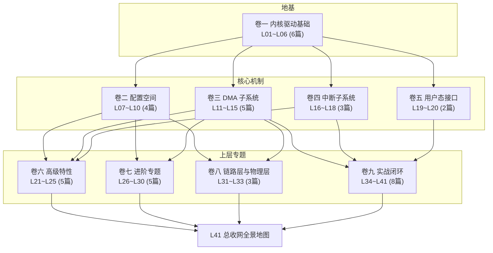

# Linux PCIe 驱动深度讲义 · 学习计划白皮书 v2.2

---

## 一、学习目标

> 系统掌握 Linux PCIe 子系统内部机制，达到 10 年资深 PCIe 驱动工程师的内核认知水平。
> 能独立完成：驱动开发、问题定位、性能调优、内核源码修改、芯片 bring-up 验证。

**深度标准**：每篇讲义不讲 API 怎么调用，只讲内核源码怎么实现。所有机制讲到底层硬件交互和 x86 架构细节。不留「这部分以后再学」的尾巴。

**面向读者**：PCIe 芯片原型验证工程师（x86 服务器 / GPU 平台），已有 PCIe 协议基础。

**学习形式**：AI 输出深度讲义，你来读。每篇 = 框架定位(Mermaid) → 前置认知 → 核心原理 → 内核源码带读 → x86 关联 → GPU 关联 → 思考题 → 渐进式代码构建。

**内核版本基线**：Linux 7.0（用户源码位于 `~/work/code/linux-source/`）。讲义中所有源码路径和函数签名以此版本为准。

**交付质量标准**：每篇可对外做技术报告/分享的成品级文档，经得起内核 maintainer 挑剔和专业同行挑战。

---

## 二、知识体系总览



**依赖关系**：
- 卷一 → 卷二~五（基础）
- 卷二+卷三+卷四 → 卷六~八（组合用于理解高级特性和链路层）
- 卷三 → 卷七 L26~L28（DMA 是 IOMMU/VFIO 前置）
- 卷五 → 卷九 L40/L41（用户态接口是 GPU 全景的前置）
- 全部 → 卷九（收网，验证视角）

---

## 三、41 篇讲义清单

### 卷一：内核驱动基础（6 篇）

**目标**：理解模块加载机制、设备模型、PCI 驱动注册与枚举全链路。

| #   | 主题             | 核心内容                                                                                                                                                                                       |
| --- | -------------- | ------------------------------------------------------------------------------------------------------------------------------------------------------------------------------------------ |
| L01 | 内核模块深度         | ELF 重定位、load_module() 内部流程、ksymtab 符号解析、CRC 版本校验、init 段释放、x86 alternatives/static_call、struct module                                                                                       |
| L02 | Linux 设备模型     | kobject/ktype/kset 层次、bus/driver/device 三角关系、sysfs 虚拟文件系统、uevent 热插拔事件                                                                                                                     |
| L03 | PCI 驱动模型       | pci_driver 注册链路、id_table 匹配策略、probe/remove 生命周期、驱动绑定/解绑、pci-driver.c 源码                                                                                                                    |
| L04 | PCI 枚举机制       | ★ 枚举前先讲 LTSSM 极简概览（Detect→Polling→Config→L0，~200 字）——枚举的前提是链路已训练到 L0，标注「详细状态机见 L32」。pci_scan_root_bus → pci_scan_child_bus → pci_scan_slot → pci_scan_device 全链路、BIOS/UEFI 枚举分工、probe.c 源码 |
| L05 | PCI 拓扑与 Bridge | PCI 总线编号规则、Type 0/1 配置事务、bridge 窗口与资源传递、pcieport 驱动、★ Multi-Function Device + ARI（Alternative Routing-ID）                                                                                  |
| L06 | 并发与同步          | ★ 前半篇：spin_lock/spin_lock_irqsave、RCU、memory barrier、atomic 操作的原理。★ 后半篇：用 L03~L05 的 PCIe 知识构造具体并发场景——probe 走到一半设备被热拔（无锁后果）、DMA 完成中断 vs 用户态 mmap 竞态、多个同型号设备同时 probe 的并发风险、死锁案例与排查           |
|     |                |                                                                                                                                                                                            |
|     |                |                                                                                                                                                                                            |

---

### 卷二：配置空间与资源管理（4 篇）

**目标**：掌握 PCIe 配置空间访问机制、BAR 解析、内核资源树、MMIO 映射原理。

| #   | 主题        | 核心内容                                                                                                                   |
| --- | --------- | ---------------------------------------------------------------------------------------------------------------------- |
| L07 | 配置空间深度    | Type 0/1 header、capability 链表遍历、★ Extended Capability 完整分类（ID→名称→功能映射表）、ECAM 访问机制（`pci_ecam_map_bus` 源码）、setpci        |
| L08 | BAR 与地址空间 | 6 个 BAR 解析、MEM32/MEM64/IO 类型判定、prefetchable vs non-prefetchable、`__pci_read_base()` 源码、Resizable BAR（内核实现 + GPU 大显存关联） |
| L09 | 内核资源树     | `struct resource` 体系、ioport_resource/iomem_resource 层级、request_mem_region、资源冲突检测、`__pci_bus_size_bridges` 重计算逻辑        |
| L10 | MMIO 映射机制 | ioremap 原理、页表映射细节、PAT/MTRR 内存类型与优先级冲突、WC/WB/UC/UC- 对 DMA 性能的影响、`devm_ioremap_resource`                                 |
|     |           |                                                                                                                        |

---

### 卷三：DMA 子系统（5 篇）

**目标**：掌握 DMA 全部内核机制——从排序规则到 IOMMU。

| # | 主题 | 核心内容 |
|---|------|----------|
| L11 | ★ PCIe Transaction Ordering | 排序模型、RO（Relaxed Ordering）bit、IDO（ID-based Ordering）、Strong vs Weak Ordering、GPU 弱序优化与静默数据损坏风险、deadlock 场景 |
| L12 | DMA 基础 | DMA 地址 vs 物理地址、CPU cache 一致性问题（MESI协议 + cache line invalidate 时序）、coherent vs streaming、`clflush`/`clflushopt`/`clwb` 指令差异、GPU 手动 flush 时机 |
| L13 | DMA API 深度 | ★ 前置 NUMA 基础（~300 字：node 编号、distance matrix、`/sys/devices/system/node/`、`numactl --hardware`、PCIe 设备与 NUMA node 的绑定关系）。`dma_alloc_coherent` / `dma_map_single` / `dma_map_sg` 内核实现路径、dma_mask、x86 dma-direct 路径 + swiotlb bounce buffer 触发条件、★ TPH（TLP Processing Hints）与 NUMA 亲和性 |
| L14 | DMA 引擎与 SG | scatter-gather list 机制与描述符格式、环形缓冲区设计、dmaengine 框架概要（GPU 用自研引擎不依赖 dmaengine）、`dma_pool` 小内存管理 |
| L15 | IOMMU 深度 | Intel VT-d / AMD-Vi 页表结构（Context-entry → PASID-entry → I/O page table 源码路径）、DMA remapping 原理、设备隔离、SWIOTLB、`iommu=pt` 启动参数 |

---

### 卷四：中断子系统（3 篇）

**目标**：掌握 MSI/MSI-X 和 Linux 中断框架的内核实现。

| # | 主题 | 核心内容 |
|---|------|----------|
| L16 | MSI/MSI-X 原理 | PCIe MSI capability 结构、地址/数据寄存器写机制、多向量分配策略、`msi.c` 的 `pci_alloc_irq_vectors()` → `msi_capability_init()` 链路 |
| L17 | Linux 中断框架 | irq_chip/irq_domain/irq_desc 三层架构、irq_domain 三种映射模式（linear/tree/radix）、x86 默认模式、request_threaded_irq、CPU affinity、`/proc/interrupts` |
| L18 | 中断下半部 | softirq/tasklet/workqueue/threaded_irq 四者实现原理、内核调度时机、preempt_rt 行为差异、PCIe 驱动选择策略 |

---

### 卷五：用户态接口（2 篇）

**目标**：掌握驱动如何向用户态暴露接口。

| # | 主题 | 核心内容 |
|---|------|----------|
| L19 | 字符设备与文件操作 | `register_chrdev_region`、`cdev` + `file_operations`、`struct file` 内核态表示、`THIS_MODULE` 引用计数链路 |
| L20 | mmap / ioctl / sysfs | `remap_pfn_range` vs `vm_insert_page`（内核→用户态路径）、★ 反向路径：`pin_user_pages()` / `get_user_pages()` 页锁定与引用计数（用户态 malloc → 驱动 pin page → GPU DMA 写入，CUDA 的实际场景）、`unlocked_ioctl` 命令字设计（_IO/_IOR/_IOW/_IOWR 宏）、sysfs attribute、debugfs、GPU DRM ioctl 案例 |

---

### 卷六：PCIe 高级特性（5 篇）

**目标**：掌握 PCIe 高级特性的内核实现。

| # | 主题 | 核心内容 |
|---|------|----------|
| L21 | 电源管理 | D0-D3cold 状态机、runtime PM、★ ASPM 软件控制接口（`aspm.c` 的 policy 机制与 sysfs 接口，不包含 LTSSM 状态细节——L0s/L1 的状态转移留给 L32）、GPU 功耗管理关联 |
| L22 | AER 错误处理 | Correctable/Uncorrectable/Fatal 错误分类、AER capability 结构、`aer.c` 错误处理路径、DPC（Downstream Port Containment）、★ ECRC（End-to-End CRC）端到端校验 |
| L23 | 热插拔 | pciehp 驱动源码、Native vs ACPI 热插拔、surprise removal 处理、`pciehp_isr` 中断处理链路 |
| L24 | SR-IOV | PF/VF 模型、`sriov_enable()` 源码（到 VF `pci_device_add()` 层）、VF 资源分配、`numvfs` 参数、VirtIO 前景 |
| L25 | 地址翻译 | ACS（访问控制服务）、ATS（地址翻译服务）、PRI（页请求接口）、PASID（进程地址空间 ID）、Shared Virtual Memory、完整协议交互时序 |

---

### 卷七：进阶专题（5 篇）

**目标**：理解固件交互、EP 模式、虚拟化、前沿技术。

| # | 主题 | 核心内容 |
|---|------|----------|
| L26 | 固件与 ACPI 交互 | MCFG 表字段级解读、_CRS 资源描述与 bytecode 读法、_PRT 中断路由表、UEFI PCI 枚举、x86 ACPI 与设备树对比 |
| L27 | PCIe Endpoint Framework | `drivers/pci/endpoint/` 框架、pci-epf 驱动模型、EP 配置空间生成（硬件/内核/EPF 驱动分工）、`pci_epc_*` API、芯片验证中的 EP 应用 |
| L28 | VFIO 与设备直通 | VFIO 框架、`vfio-pci` 驱动、IOMMU group 与设备绑定、`vfio_pci_open_device()` IOMMU 域绑定链路、GPU 虚拟化全景、★ NTB（Non-Transparent Bridging）：多主机跨节点 DMA 的底层机制（GPU Direct RDMA 跨主机的硬件基础） |
| L29 | ★ CXL 基础 | CXL 1.1/2.0/3.0 协议栈、CXL.io/CXL.cache/CXL.mem 三层模型、CXL 与 PCIe 5.0/6.0 物理层共用、CXL 对 GPU 的意义（统一大内存池） |
| L30 | ★ PCIe Gen5/6 关键变化 | 32GT/s PAM4 信号、FEC（前向纠错）、FLIT mode、链路降速场景分析、AER FEC error 字段、驱动工程师需要知道的 Gen6 TLP 编码变化、★ IDE（Integrity and Data Encryption）传输层安全加密 |

---

### 卷八：链路层与物理层专题（3 篇）

**目标**：补全链路层到物理层的完整知识——这是芯片 bring-up 最底层的地基。

| # | 主题 | 核心内容 |
|---|------|----------|
| L31 | ★ Flow Control 与链路层 | FC credits（Posted/Non-Posted/Completion 三类独立管理）、ACK/NAK 协议、Replay Buffer 机制、FC 不足导致 DMA 降速的定位方法 |
| L32 | ★ LTSSM 与 Equalization | 链路训练状态机（Detect→Polling→Config→L0→Recovery→Loopback→Disable→Hot Reset）、Gen3+ Equalization（CTLE/DFE/FFE）、链路降速/降宽根因、`lspci -vvv` LinkSta/LinkCap 字段解读 |
| L33 | ★ PCIe 复位体系 | FLR（Function Level Reset）、Hot/Warm/Cold Reset、PERST# 信号时序、内核 `pci_reset_function()` → `__pci_reset_function_locked()` 完整路径、复位不干净的典型症状与排查 |

---

### 卷九：实战闭环（8 篇）

**目标**：调试能力、排查能力、验证能力、GPU 全景地图——以验证工程师视角收网。

| # | 主题 | 核心内容 |
|---|------|----------|
| L34 | ★ 内核 PCI Quirks | `drivers/pci/quirks.c` 机制：DECLARE_PCI_FIXUP_EARLY/HEADER/FINAL/SUSPEND/RESUME、如何为新芯片写 quirk（资源配置修正/BAR 大小覆盖/中断路由修复）、芯片 bring-up 必备技能 |
| L35 | 调试工具箱 | lspci -vvv 完整字段解读（每个字段回溯到前面讲义的原理）、setpci 实战、ftrace 追踪 PCI 路径（`trace-cmd` 实战）、dynamic_debug 开关、`/sys/bus/pci/devices/` 每个文件含义 |
| L36 | 性能分析 | DMA 吞吐测量（`perf stat` + `bandwidth` 工具链）、中断延迟（`cyclictest` + `irqsoff tracer`）、NUMA 亲和性优化、PCIe 带宽瓶颈定位（结合 L31 FC + L32 LTSSM）、P2P DMA 性能、★ CONFIG_DMA_API_DEBUG：dma-debug 的 entries pool、DMA 映射泄漏检测、use-after-free / double-free / 方向不匹配的 debug 方法 |
| L37 | 经典问题排查指南 | 案例驱动：设备不枚举 / BAR 映射失败 / DMA 超时 / MSI 不触发 / AER 报错 / 热插拔异常 / NUMA 亲和性导致性能差 / ACS 导致 P2P 不通——每个场景的 dmesg 特征 + 定位路径 + 根因。★ 新增「链路降级诊断决策树」：Gen5 x16 GPU 为何跑在 Gen3 x4？逐环节排查路径（LTSSM→Equalization→FEC→FC→信号完整性） |
| L38 | ★ 芯片验证流程 | FPGA bring-up checklist（上电→枚举→BAR 验证→DMA 读写→中断功能→压力测试）、ASIC 回片验证与 FPGA 阶段的关键差异、验证阶段划分与里程碑 |
| L39 | ★ 验证技术深度 | ★ 拆分自原 L38：BAR 空间全写全读+边界测试策略、DMA 压力测试方法（什么 pattern 能打极限）、中断注入与异常测试、\"硬件 bug 还是驱动问题\"判定准则、常见硬件缺陷在驱动侧的表征 |
| L40 | GPU PCIe 全景 | GPU 驱动模型全景：DMA 引擎（GDS）、MMIO 映射（BAR0 寄存器空间布局）、大量 MSI-X 向量管理、CUDA kernel driver 接口、NVLink/CXL 桥接、P2P DMA（GPU↔NVMe↔NIC）、Resizable BAR 实战、NTB 跨主机通信 |
| L41 | ★ 总收网 · 全景地图 | 从 PCIe 协议层（TLP/配置空间/排序/FC/LTSSM）到内核实现（probe→resource→DMA→IRQ→IOMMU→VFIO）到用户态接口（mmap/ioctl）到验证流程的**完整对照地图**——一张 Mermaid 大图 + 逐层解释 |

---

## 四、学习节奏（7 周）

| 周次 | 范围 | 篇数 | 说明 |
|------|------|------|------|
| 第1周 | 卷一 L01~L06 | 6 篇 | 每天 1 篇（L01~L03 较基础可加速，L06 密度大） |
| 第2周 | 卷二 L07~L10 + 卷三 L11~L13 | 7 篇 | 每天 1 篇（L11 排序模型是新知识入口） |
| 第3周 | 卷三 L14~L15 + 卷四 L16~L18 | 5 篇 | 每天 1 篇（L15 IOMMU + L17 中断框架是重头） |
| 第4周 | 卷五 L19~L20 + 卷六 L21~L25 | 7 篇 | 每天 1 篇 |
| 第5周 | 卷七 L26~L30 | 5 篇 | 每天 1 篇（L29 CXL、L30 Gen5/6+IDE 是新前沿） |
| 第6周 | 卷八 L31~L33 + 卷九 L34~L35 | 5 篇 | 每天 1 篇（L31 FC + L32 LTSSM 需要反复咀嚼） |
| 第7周 | 卷九 L36~L41 | 6 篇 | 收网 |

---

## 五、每篇讲义标准结构

```
0. 框架定位 —— Mermaid 图：本篇在 PCIe 内核子系统中的位置
1. 前置认知 —— 为什么需要学？在整体知识中处于什么节点？
2. 核心原理 —— 机制的内在逻辑（不堆 API，讲设计意图）
3. 内核源码带读 —— 关键函数逐行分析（标注源码路径和行号）
4. x86 关联 —— 在 x86 服务器上的特性/坑/优化
5. GPU 关联 —— 在 GPU 驱动中的对应场景
6. 思考题 —— 5~8 道，验证真正理解
7. 渐进式代码构建 —— 在关键节点，基于前一篇代码逐步构建完整驱动（非可选）
```

---

## 六、核心设计理念

### 6.1 从 PCIe 协议到内核实现

PCIe 协议知识为已知输入。不赘述协议细节，但关键位置标注「协议对照」：

> 📌 协议对照：`pci_read_config_dword()` → Type 0 Configuration Read TLP（PCIe Base Spec §2.2.6.1）

### 6.2 x86 服务器平台视角

默认目标：x86_64 服务器（Intel Xeon / AMD EPYC），涵盖：
- Intel VT-d / AMD-Vi IOMMU（页表层源码带读）
- MCFG (ECAM) 配置空间访问
- ACPI _CRS / _PRT 资源与中断描述
- NUMA 拓扑与 TPH
- PAT/MTRR 内存类型优先级

### 6.3 GPU 关联贯穿始终

每篇末尾「GPU 关联」标注知识点在 GPU 驱动中的对应场景。L40 收网形成完整 GPU 地图。

### 6.4 拒绝 API 手册型内容

不讲 `dma_alloc_coherent 原型`——讲它在 x86 上走 dma-direct 路径，调用 `dma_alloc_from_dev_coherent` → `__alloc_pages`，返回的物理页在特定 NUMA 节点上，cache 行为由 PAT 配置决定。

### 6.5 细节 + 框架双轨并进

| 维度 | 交付物 | 示例 |
|------|--------|------|
| **框架位置** | 每篇开头 Mermaid 图标注位置 | 学 `__pci_read_base()` 前先看图——它在枚举链的哪个节点 |
| **深度细节** | 源码带读、指令级、字段级 | `clflushopt` vs `clwb` 微架构差异、VT-d Context-entry 字段解析 |

**卷级框架图**：每卷开头有一张 Mermaid 全景图。

**收网节点**：
- 卷三结束 → 「从模块加载到 DMA 完成：数据通路全景」
- 卷六结束 → 「从枚举到虚拟化：标准化接口全景」
- 卷八结束 → 「从脉冲到流控：链路层全景」
- L41 → 「协议 ↔ 内核 ↔ 用户态 ↔ 验证流程 完整映射」

### 6.6 ★ 验证工程师视角

卷八和卷九补全了验证工程师最关键的知识缺口：

1. **链路层/物理层**（L31~L33）：设备不枚举的最底层根因大多在 LTSSM 或 FC 或复位
2. **Quirks**（L34）：芯片 bring-up 第一个 debug 手段——不是修硬件，是给内核打补丁
3. **验证流程**（L38）：从 FPGA bring-up 到 ASIC 回片的完整验证流程
4. **验证技术**（L39）：BAR 边界测试、DMA 压力 pattern、中断注入、"硬件还是驱动"判定
5. **问题排查**（L37）：每个场景从 dmesg 特征到根因的完整定位路径 + 链路降级决策树

### 6.7 ★ 渐进式代码构建（动手保证）

拒绝「只读不写」。在关键篇章末尾的验证清单中，基于前一篇代码增量构建完整驱动：

```
L03 后 → 空 probe 的 pci_driver（~20行）
L08 后 → 加上 BAR 读取和打印（+15行）
L10 后 → 加上 ioremap（+10行）
L13 后 → 加上 coherent DMA alloc（+20行）
L16 后 → 加上 MSI-X 注册（+15行）
L20 后 → 加上 mmap + ioctl（+30行）
L37 后 → 完整 PCIe EP 驱动（~200行，带注释）
```

到 L37 时你手里有一个自己一步步写出来的完整驱动。

---

## 七、产出目录

```
02_Linux_PCIe驱动专题学习/
├── _白皮书.md                          ← 本文件
├── 01_文档清单.md                       ← 进度追踪
├── L01_内核模块深度.md
├── L02_Linux设备模型.md
├── L03_PCI驱动模型.md
├── L04_PCI枚举机制.md
├── L05_PCI拓扑与Bridge.md              ← 含 Multi-Func + ARI
├── L06_并发与同步.md                    ← 前半篇原理 + 后半篇 PCIe 场景案例化
├── L07_配置空间深度.md                  ← 含 Extended Cap 完整分类
├── L08_BAR与地址空间.md
├── L09_内核资源树.md
├── L10_MMIO映射机制.md
├── L11_PCIe排序模型.md
├── L12_DMA基础.md
├── L13_DMA_API深度.md                   ← 含 NUMA 基础 + TPH
├── L14_DMA引擎与SG.md
├── L15_IOMMU深度.md
├── L16_MSI_MSIX原理.md
├── L17_Linux中断框架.md
├── L18_中断下半部.md
├── L19_字符设备与文件操作.md
├── L20_mmap_ioctl_sysfs.md              ← 含 get_user_pages 反向路径
├── L21_电源管理.md
├── L22_AER错误处理.md                   ← 含 ECRC
├── L23_热插拔.md
├── L24_SR_IOV.md
├── L25_地址翻译ATS_PRI_PASID.md
├── L26_固件与ACPI交互.md
├── L27_PCIe_Endpoint_Framework.md
├── L28_VFIO与设备直通.md                ← 含 NTB
├── L29_CXL基础.md
├── L30_PCIe_Gen5_Gen6.md                ← 含 IDE
├── L31_Flow_Control与链路层.md
├── L32_LTSSM与Equalization.md
├── L33_PCIe复位体系.md
├── L34_内核PCI_Quirks.md
├── L35_调试工具箱.md
├── L36_性能分析.md                      ← 含 CONFIG_DMA_API_DEBUG
├── L37_经典问题排查指南.md              ← 含链路降级诊断决策树
├── L38_芯片验证流程.md                   ★ 拆分独立
├── L39_验证技术深度.md                   ★ 拆分自原 L38
├── L40_GPU_PCIe全景.md
├── L41_总收网_全景地图.md
└── 99_速查/
    ├── API速查表.md
    ├── 源码路径索引.md
    └── 协议对照表.md
```

---

## 八、阅读建议

1. **按顺序读**。卷一→卷二→卷三→卷四→卷五→卷六→卷七→卷八→卷九。依赖关系明确。
2. **每篇思考题必须做**。回答不出来就倒回去重读。
3. **打开内核源码**。每篇标注了源码路径，建议用 [Bootlin Elixir](https://elixir.bootlin.com/linux/latest/source) 或本地 vim 跟着读。
4. **渐进式代码不要跳过**。每篇末尾的代码增量是肌肉记忆的唯一来源——只看不写学完还是写不出驱动。
5. **协议层有疑问直接问我**。你有 PCIe 协议基础，卡住的是内核实现细节。
6. **卷八（链路层）是 bring-up 的地基**，卷九（Quirks+验证方法论）是你每天工作的直接武器——优先消化这两卷。

---

## 九、交叉引用规则（写讲义时执行）

以下知识点跨越不同篇章，讲义中通过交叉引用标注确保知识网的连通性：

| 知识点 | 首次出现在 | 深入展开在 | 讲义首次出现时的标注 |
|--------|-----------|-----------|------------------|
| LTSSM | L04（~200 字概览） | L32（完整状态机） | "链路训练是枚举的前提——详细状态转移见 L32" |
| L0s/L1 状态 | L21（不展开） | L32（LTSSM 子状态） | "L0s/L1 由 ASPM 触发，状态的硬件行为见 L32" |
| ECAM 基址来源 | L07（MCFG 表名） | L26（MCFG 字段级） | "ECAM 基址来自 MCFG ACPI 表，表结构详解见 L26" |
| FEC | L30（原理+错误字段） | L32（FEC 依赖 Equalization 结果） | "FEC 错误纠正能力依赖于链路均衡质量，均衡训练见 L32" |
| NUMA 亲和性 | L13（基础概念） | L36（性能测量+调优） | "NUMA 对 DMA 性能的影响量化分析见 L36" |
| ACPI 碎片收网 | 分散在 L04/L07/L17 | L26（系统化） | 各篇不展开，L26 做「ACPI 碎片→体系」总结表 |
| 排序→FC | L11（排序规则） | L31（FC credits） | "排序规则存在的底层原因之一是链路层可能重传，重传机制见 L31" |
| 链路降级 | 分散在 L30/L32/L37 | L37（诊断决策树） | "链路降速/降宽/降代的完整排查流程见 L37 决策树" |

---

## 十、质量保障 · 每篇交付前 3 轮检查

每一篇讲义交付前，执行三轮检查。三轮有不同的核心使命：

| 轮次 | 核心使命 | 不合格信号 |
|------|----------|-----------|
| 第一轮 | **事实不能错**——源码路径、函数名、寄存器字段、x86 指令必须和 v7.0 真实内核一致 | 一句话和源码对不上 → 重写 |
| 第二轮 | **教学不能散**——八段结构完整、前置依赖不跳步、交叉引用不遗漏 | 缺一节或引用断链 → 补全 |
| 第三轮 | **深度不能降**——没有任何 API 手册式写法，所有机制落到源码/指令/硬件交互层。经得起 kernel maintainer 挑剔 | 一句话是 API 罗列 → 重做 |

---

### 第一轮：内容准确性（事实核查）

> **核心使命**：这篇讲义不能在任何事实上撒谎。PCIe 驱动代码是 kernel panic 的直接入口，一个寄存器字段写错位、一个函数签名多一个参数，学生记错一道就是线上事故。

**本轮重点**：源码验证、版本对齐、平台一致性。

| # | 检查项 | 怎么查 | 为什么 |
|---|--------|--------|--------|
| 1.1 | 源码文件路径 | `ls ~/work/code/linux-source/drivers/pci/probe.c` 确认文件存在。讲义中引用的每个路径都必须真实存在于 v7.0 内核树中 | 虚假路径 = 学生找不到代码 = 整篇白读 |
| 1.2 | 函数签名 | 打开源码，看函数声明行。参数个数、类型、返回值、`const`/`__init`/`static` 修饰符和讲义中写的逐字一致 | 学生记错签名 → 写驱动编译失败 → 浪费时间 |
| 1.3 | 寄存器字段位宽和偏移 | CAP 指针偏移（PCI_CAP_LIST_NEXT）、BAR 类型编码（`IORESOURCE_MEM_64`）、AER header 字段（PCI_ERR_UNCOR_STATUS）的宏值和 bit 位置，对照 `include/uapi/linux/pci_regs.h` | 寄存器位写错 → 读出来的数据对不上 → 硬件调试被引入歧途 |
| 1.4 | x86 指令特性 | `clflush` vs `clflushopt` vs `clwb` 的差异必须和 Intel SDM 一致；`WRMSR` 的 ECX 编码不能写成 AMD 版本。ARM 概念（`devicetree`、`dma-ranges`、`GIC`）不能出现在 x86 讲义中 | x86/ARM 混用 = 学生信了错的 → 在 x86 服务器上做 ARM 操作 → 系统 crash |
| 1.5 | API 是否仍然存在 | 在 v7.0 源码中 `grep` 确认函数名未被重命名或删除。如 `pci_enable_msi()` 在 5.x 后已被 `pci_alloc_irq_vectors()` 取代——讲义如果引用旧 API，必须标注"已废弃，替代为 XXX" | 讲了一个不存在的函数 = 学生写了用不了 = 信任崩塌 |
| 1.6 | 版本声明准确性 | "自 5.4 起" "6.2 引入" 这类表述必须在 git log 中验证。`pci_ecam_map_bus()` 如果在 6.0 被重构过签名，必须注明 | 版本错了 → 学生用不同内核版本验证时困惑 |
| 1.7 | 内核 config 选项 | 引用的 `CONFIG_PCI_REALLOC_ENABLE_AUTO`、`CONFIG_PCI_MSI`、`CONFIG_IOMMU_DEFAULT_PASSTHROUGH` 等必须在 v7.0 的 Kconfig 中存在 | 学生在 menuconfig 里找不存在的选项 → 浪费时间 |
| 1.8 | 跨篇一致性 | 如果在 L04 说 "pci_scan_device() 返回 NULL 表示槽位空"，那 L37 排查指南引述 L04 时不能写成 "返回 -ENODEV" | 同一知识在不同篇章出现矛盾 → 学生不知道该信哪个 |

---

### 第二轮：教学完整性（结构审查）

> **核心使命**：这篇讲义作为"课程"必须完整。不是一篇技术博客——它有固定的八段结构、有前置依赖、有交叉引用链。学生按顺序读的时候，不能出现"咦，这个概念还没讲过怎么就引用了？"

**本轮重点**：八段不缺位、前置不跳跃、引用不断链。

| # | 检查项 | 怎么查 | 为什么 |
|---|--------|--------|--------|
| 2.1 | §0 框架定位图 | 确认有一张 Mermaid 图。图必须画清楚本篇在 41 篇序列中处于哪一卷、哪一位置，以及它和前一篇/后一篇的逻辑关系（不要孤立的图，要有上下文连线） | 没有位置图 = 学生不知道自己在哪 = 学完记不住 |
| 2.2 | §1 前置认知 | 明确列出"读本篇前你应该已经知道什么"（引用具体的前置篇章编号）。如果本篇是某知识点的首次引入，标注"本文是 XXX 概念在本课程中的首次出现，不需要前置" | 前置不清 = 学生带着知识缺口硬读 = 读到一半卡住 |
| 2.3 | §2 核心原理 | 必须有"为什么这么设计"的分析段落。不只是描述机制做了什么，要追问设计意图。例如："为什么内核用 `struct resource` 管理 BAR 而不是直接存物理地址？→ 因为需要冲突检测和父子传递。" | 只有"是什么"没有"为什么" → 学生能调用 API 但不理解设计 → 碰到变体场景不会自己推理 |
| 2.4 | §3 源码带读 | 至少 1 个函数从第一行有意义的代码读到 return，不是"核心逻辑是..."的概括。标注源文件路径、函数起始行号、关键分支行的注释 | 不逐行读源码 → 学生以为理解了，自己打开源码发现和讲义说的不一样 |
| 2.5 | §4 x86 关联 | 至少有 1 个 x86 特有的细节（不能是"x86 上也是这样"这类废话）。典型有效内容：`CR3` 操作对 MMIO 的影响、PAT/MSR 的 `wrmsr` 路径、`clflush` 指令的微架构行为、Intel vs AMD 在 IOMMU 上的命名和差异 | x86 关联不写具体细节 = 挂羊头卖狗肉 = 对验证工程师毫无帮助 |
| 2.6 | §5 GPU 关联 | 不能只写一句"在 GPU 驱动中也会用到"。必须有具体场景：对应 GPU 驱动的哪个函数、哪个 BAR、哪种 DMA 模式。例如："NVIDIA 驱动在 probe 中读取 BAR1（framebuffer）、BAR3（register space），对应本文的 `__pci_read_base()`" | 泛泛而谈 = 学生无法建立知识关联 = L40 收网时前面的东西全忘了 |
| 2.7 | §6 思考题 | 5~8 道，至少要有 1 道"如果 XXX 出错了怎么办"型排查题、1 道"设计意图"型追问、1 道"代码实操"型填空。不能全是"XX 函数的作用是什么"这种背诵题 | 只会背诵的学生 = 面试被追问就倒。思考题的设计质量决定了学习深度 |
| 2.8 | §7 渐进式代码构建 | 在关键节点（白皮书 §6.7 列出的构建节点），必须给出可编译、可运行的增量代码片段。命令格式可复制粘贴执行 | 没有动手代码 = 只会读不会写 = 学完不能独立写驱动 |
| 2.9 | 交叉引用全覆盖 | 逐条核对白皮书第九节规则表。如果本篇涉及表中任何知识点，必须使用表中指定的标准标注措辞，不能自己编一个引用话术 | 引用话术不统一 → 学生看到不一致的标注，以为是指不同的东西 |
| 2.10 | 标题层级一致 | 所有 41 篇的 Markdown 标题层级完全一致：`# 篇名` → `## 0. 框架定位` → `## 1. 前置认知` → ... → `## 7. 渐进式代码构建`。不允许某篇用 `###` 起头 | TOC 不统一 → Obsidian 大纲视图混乱 → 跨篇跳转体验差 |
| 2.11 | YAML frontmatter | 每篇开头有 `created`、`tags`、`series`、`volume`、`number`、`next` 六字段。`next` 字段始终指向下一篇（L41 除外）。tags 统一用 `pcie/linux-driver` 前缀 | 没有元数据 → 无法自动生成文档清单 → 手动维护出错 |

---

### 第三轮：深度审查（10 年专家门槛）

> **核心使命**：这是最难的一轮。不只是"写对了"和"写完整了"，而是"写到了专家看的深度"。这一轮的规则只有一条：**任何一段内容，如果 Linux 内核邮件列表上的 maintainer 读了之后说"这也太浅了吧"，就不合格。** 交付物标准是可对外做技术分享报告的成品。

**本轮重点**：拒绝 API 手册、源码实现路径、硬件交互链条、设计意图、异常路径。

| # | 检查项 | 怎么查 | 为什么 |
|---|--------|--------|--------|
| 3.1 | 零 API 手册语句 | 搜索全文，不得出现 "XX 函数的原型是" "XX API 的作用是" "使用方法如下" 这类句法。一旦出现——整段重写为"XX 函数在内核中由 YY 调用，其实现路径为 ZZ，核心数据结构是 WW" | API 手册型内容读者自己查 `man` 或内核文档就能得到。讲义的不可替代性在于源码实现路径分析 |
| 3.2 | 源码实现路径完整 | 对于本篇的核心机制（不是所有提及的函数），给出从上层调用到底层硬件交互的完整调用链。例如讲 `pci_read_config_dword()` 不能只说"它读 PCI 配置空间"，要从 `pci_read_config_dword()` → `pci_bus_read_config_dword()` → `bus->ops->read()` → `pci_conf1_read()` / `pci_ecam_read()` → `inl()` / `ioread32()` 给出完整路径 | 不断链的路径 = 学生脑子里一条完整的执行线。链路断了 = 学生知道起点和终点，不知道中间怎么走的 = 定位问题找不到切入点 |
| 3.3 | 硬件交互逐环节描述 | 涉及 CPU ↔ PCIe 设备通信的地方，分环节描述：CPU 发什么指令 → Root Complex 怎么路由 → PCIe Fabric 怎么转发 → Endpoint 收到什么。例如 MOV 指令读 MMIO 地址 0xf8000000 → RC 查询地址路由表 → 生成 Configuration TLP → 交换机转发 → EP 响应 | 不讲硬件交互路径 → 学生眼里内核就是黑盒 → 硬件出错时无法定位是 CPU/RC/Switch/EP 哪一层的问题 |
| 3.4 | 设计意图分析 | 每个核心机制至少有一处"为什么内核要这么设计"的分析。不只是讲实现，要对比替代方案。例如："为什么 DMA coherent 要分配 uncached 内存？为什么不直接用 kmalloc？→ 因为 CPU 和 DMA 共享数据时 cache line 所有权来回传输（cache line bouncing），每次 invalidate 成本 ≈ 几十个 CPU cycle，大量小 DMA 时累计损耗显著" | 没有设计意图 → 学生学会了怎么用，不理解为什么 → 技术选型时做不出有依据的判断 |
| 3.5 | 协议对照标注 | 每个涉及 PCIe 协议层的内核 API，标注对应的 TLP 类型和协议章节号。格式：`> 📌 协议对照：pci_read_config_dword() → Type 0 Configuration Read TLP（PCIe Base Spec §2.2.6.1）` | PCIe spec 是你已有的知识，对照标注让你把内核 API 和协议概念无缝衔接，不用重新学一遍 |
| 3.6 | x86 指令级路径 | 涉及内存屏障、cache 操作、IO 端口访问的代码路径，必须下穿到 x86 指令：`dma_wmb()` → `sfence`、`ioread32()` → `MOV` with UC memory type → 实际总线事务。不能停留在 C 代码层面 | C 代码层面 = 学生不知道 CPU 底层做了什么 = 不知道怎么用 perf 验证行为 = 不知道怎么在芯片 FPGA 阶段对比硬件抓的信号和内核路径是否一致 |
| 3.7 | 异常路径覆盖 | 每个机制不能只讲正常路径。必须有：如果失败了会怎样？返回值是什么？dmesg 会打印什么？例如 `pci_enable_device()` 返回 -EINVAL 是为什么（通常是设备已被其他驱动占用或 BIOS 未分配资源），`ioremap` 返回 NULL 怎么排查（/proc/iomem 看是否被占用） | 只讲正常路径 = 学生只会写把设备跑起来的代码 = 一旦出问题完全不会定位。10 年专家的核心能力不在 happy path，在 unhappy path |
| 3.8 | 无前置跳跃 | 检查全文中出现的所有术语、概念、API 名称——如果它在之前的篇章中未出现过，本篇要么在正文中简短解释（不超过 3 句话），要么必须引用后续篇章（使用第九节规定的标准标注格式） | 引入了未解释的概念 → 学生中断阅读去查资料 → 学习流程断裂 |
| 3.9 | 知识闭环 | 检查本篇开头"前置认知"中承诺的覆盖范围，在结尾"思考题"中是否全部被考察到。如果前置认知说"本篇要讲 BAR 内存映射的 4 种内存类型"，那思考题中必须有至少 1 道关于 PAT/MTRR 冲突的题 | 承诺了讲但不考 = 学生以为不重要 = 实际写驱动时在这里犯错 |
| 3.10 | 前后句逻辑链 | 逐段通读，检查每两句话之间是否有逻辑跳跃。例如："DMA 地址是 IOMMU 看到的总线地址。IOMMU 通过页表将总线地址映射到物理地址。"——这两句之间的逻辑是"DMA 地址被 IOMMU 截获 → IOMMU 查页表 → 找到物理地址"。如果跳过了"IOMMU 截获"这一步，读者不知道 IOMMU 什么时候介入 | 逻辑跳跃 → 知识断层 → 学生自己脑补的可能是错的 → 在错误的认知基础上继续学习后面的内容 |
| 3.11 | 成品感 | 读完整篇后问自己：这篇能不能发给团队做技术分享？如果不能——标注哪里不够：排版？术语不统一？缺少过渡段？结论太模糊？ | 技术报告级 = 可以改变其他人对某个主题的认知。凑合能看 ≠ 成品 |

### 检查流程

```
写完初稿
  │
  ▼
第一轮：内容准确性 ── 打开 v7.0 源码逐行核对
  │ （不合格 → 修复，重跑第一轮）
  ▼
第二轮：教学完整性 ── 对照白皮书 §5、§6.7、§9 逐项标记
  │ （不合格 → 补全，重跑第二轮）
  ▼
第三轮：深度审查 ── 逐段质问"这段，maintainer 看了会怎么说？能不能拿去做技术分享？"
  │ （不合格 → 重做该段，整轮重跑）
  ▼
交付 ── 更新 01_文档清单.md
```

---

> 白皮书 v2.2 已冻结。41 篇 / 9 卷 / 7 周。
> 每写完一篇即更新 `01_文档清单.md` 中的状态。
