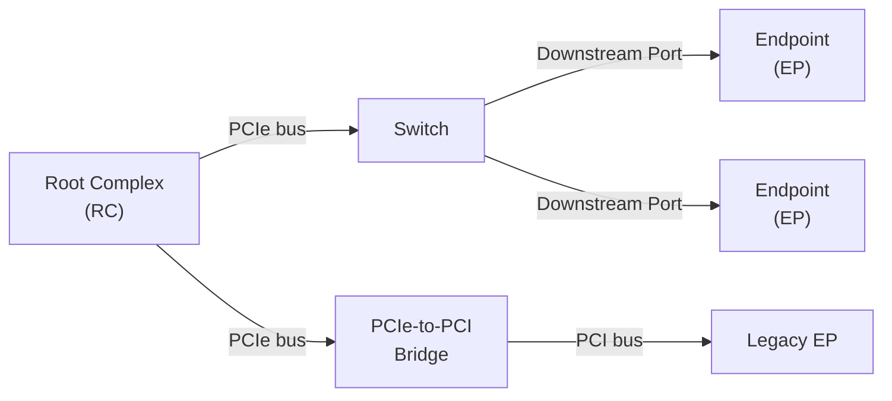
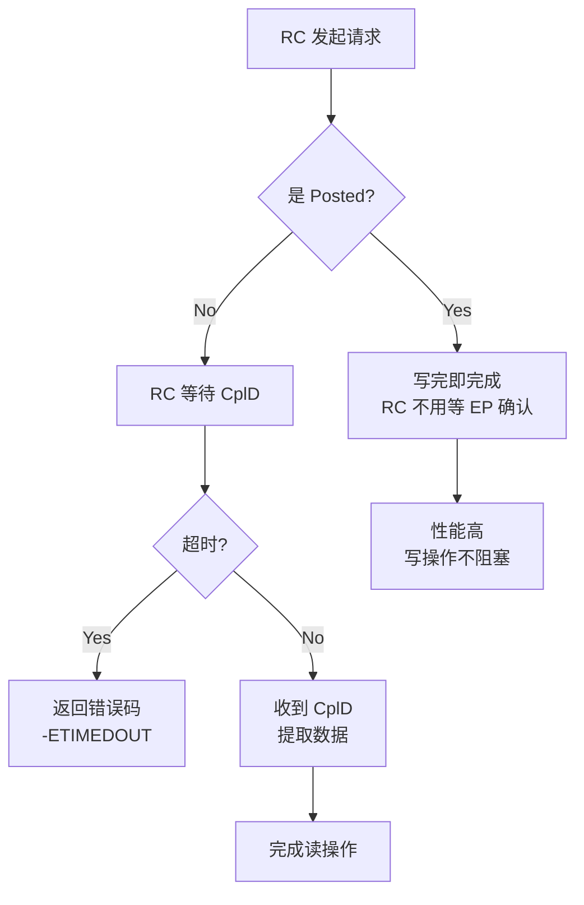

# S1_01 — PCIe 总线基础与 TLP

## 1. 本节目标

- 理解 PCIe 总线拓扑：RC / EP / Switch / bridge 的角色分工
- 掌握 TLP（Transaction Layer Packet）的类型与用途
- 理解三种 TLP 路由方式：地址路由、ID 路由、隐式路由
- 能够对着内核 `pci.c` 找到 TLP 生成相关的代码路径

## 2. 前置依赖

无。

## 3. 源码位置

```
内核源码：
  drivers/pci/pci.c          （TLP 发送路径，pci_map_* 函数）
  include/linux/pci.h         （struct pci_dev, TLP 相关字段）
  include/uapi/linux/pci_regs.h  （PCIe TLP 头部寄存器定义）

规范参考：
  PCIe Base Spec Rev 5.0 Chapter 2 - Transaction Layer
```

---

## 4. PCIe 总线拓扑

### 4.1 核心组件



| 组件 | 角色 | 内核对应 |
|------|------|---------|
| **Root Complex (RC)** | CPU 与 PCIe 总线的接口，发起所有事务 | `struct pci_host_bridge` + RC 驱动 |
| **Endpoint (EP)** | 事务的发起者或响应者，终端设备 | `struct pci_dev` (device_type = pci_dev) |
| **Switch** | 扩展端口，路由 TLP | `drivers/pci/switch/` + 多 `struct pci_dev` |
| **PCIe-to-PCI Bridge** | 兼容老 PCI 设备 | `drivers/pci/host/pci-*.c` |

### 4.2 RC 的本质

RC 不是 하나의设备，是一组功能的集合：
- **RCiEP**（RC Integrated Endpoint）：RC 内部集成的事务发起/结束点（如内存控制器）
- **RCeC**（Root Complex Event Collector）：错误收集器

在 Linux 内核里，RC 表现为一个 `struct pci_host_bridge`，通过 `.map_bus()` 回调访问下游设备配置空间。

### 4.3 为什么 PCIe 要用交换结构，而不像 PCI 那样用共享总线？

| 特性 | PCI（共享总线）| PCIe（点对点）|
|------|--------------|--------------|
| 带宽 | 所有设备共享带宽 | 每个链路独立带宽 |
| 扩展性 | 受总线频率限制 | 链路数可扩展（x1/x4/x8/x16）|
| 延迟 | 总线仲裁引入延迟 | 点对点直连，延迟更低 |
| 热插拔 | 需要总线信号 | 端口级独立热插拔 |

---

## 5. TLP 类型详解

### 5.1 TLP 分类

TLP 按事务类型分为四类：

```
┌─────────────────────────────────────────────────────────┐
│                    TLP 类型                               │
├───────────────┬───────────────┬───────────────┬─────────┤
│ Configuration │    Memory     │    I/O        │  Message │
│    (Cfg Rd/Wr)│  (Mem Rd/Wr)  │   (Io Rd/Wr)  │         │
├───────────────┼───────────────┼───────────────┼─────────┤
│ Non-Posted    │ Non-Posted    │ Non-Posted    │ Posted  │
│ (需要 CplD)   │ (MRd:Non-Post)│ (IoRd:Non-Pst)│ (MsgD)  │
│               │ MWr: Posted  │               │         │
└───────────────┴───────────────┴───────────────┴─────────┘
```

### 5.2 关键 TLP 类型

**MRd（Memory Read）— Non-Posted**

```
RC → EP：读取 EP 的 BAR 空间
EP → RC：返回 CplD（含数据）
典型场景：RC 驱动读取 EP 寄存器
```

**MRdLk（Memory Read Locked）— Non-Posted**

```
带锁定的读取，用于读-modify-write 原子操作
现代驱动几乎不用，被 spinlock 替代
```

**MWr（Memory Write）— Posted**

```
RC → EP：写 EP 的 BAR 空间
不需要 CplD，写完即完成
典型场景：DMA 描述符下发，寄存器配置
```

**CfgRd/CfgWr（Configuration Read/Write）— Non-Posted**

```
访问设备的配置空间（Bus/Dev/Func/Reg）
通过 ECAM 窗口访问（见 S1_03）
```

**CplD（Completion with Data）— 用于响应 Non-Posted 读**

```
EP → RC：携带数据返回
含 Requester ID + Tag，用于 RC 匹配原始请求
```

**Cpl（Completion without Data）— 用于响应 Non-Posted 写**

```
EP → RC：确认配置完成
```

**Msg/MsgD（Message/Message Data）— Posted**

```
带内中断、错误报告、电源管理等
MSI 就是 MsgD 的一种（Memory Write 形式的门铃）
```

### 5.3 Posted vs Non-Posted — 为什么要区分？



**Posted 的优势**：写操作不阻塞 RC，RC 可以继续发其他请求。
**Non-Posted 的必要性**：读操作必须返回数据，无法绕过。

---

## 6. TLP 路由方式

### 6.1 地址路由（Address Routing）

用于 Memory Read/Write 和 I/O Read/Write。

```
TLP Header 包含目标地址
Switch / RC 根据地址查路由表，决定从哪个端口转发
```

路由规则：
- 32-bit 地址：`Fmt[1:0]=00b, Type[2:0]=000b`
- 64-bit 地址：`Fmt[1:0]=01b, Type[2:0]=000b`（用于 >4GB 地址）

### 6.2 ID 路由（ID Routing）

用于 Configuration Read/Write 和 Cpl/CplD。

```
TLP Header 包含 Bus Number + Device Number + Function Number (BDF)
```

格式：`Cfg Rd BDF, offset`

### 6.3 隐式路由（Implicit Routing）

用于 Message 和部分 Cpl。

```
路由器根据端口状态决定路由方向，不看地址也不看 ID：
- RC 发起 → 上游
- EP 发起 → 上游
- 上游发来 → 下游（或处理）
```

---

## 7. TLP 头部格式（精简版）

详见 PCIe Spec，这里给出驱动开发最常用的字段：

```c
// include/uapi/linux/pci_regs.h
// TLP Header Format (32-bit 地址路由)
struct tlp_header_addr {
    u8  fmt_type;    // Fmt[2:0] + Type[4:0]
    u8  tlp_header;  // Attr[2:0] + TD( Digest) + EP(TLP Poisoned) + Attr[1:0]
    u16 length;      // DW 长度
    u32 addr[2];      // 地址（32-bit 或 64-bit 低32+高32）
    u8  pasid;        // 可选
    u8  pasid_end;    // 可选
    u32 be;           // Byte Enable
};
```

**驱动开发关注**：
- `fmt_type`：判断是 MRd/MWr/CfgRd/CfgWr
- `addr`：目标寄存器地址
- `length`：传输 DW 数

---

## 8. 内核源码对应

### 8.1 TLP 发送路径（RC 视角）

```c
// drivers/pci/pci.c
// RC 驱动通过这个函数发送 MRd，从 EP BAR 读取数据
static int pci_read_config_word(...) 
{
    // 底层调用 pci_bus_read_config_word()
    // 最终发 CfgRd TLP（ID路由）
}

// MRd TLP 的典型生成路径
int pci_map_bar(struct pci_dev *dev, int bar, int flags)
{
    // 拿到 BAR 地址后，RC 驱动用 ioread32/iowrite32 发起 MWr/MRd
    // 实际上是通过 ATU 窗口将 CPU 地址映射到 PCIe 地址
}
```

### 8.2 MSI 门铃（特殊的 MWr）

```c
// drivers/pci/msi/msi.c
// MSI 本质是一个 MWr TLP，写到 MSI 地址，携带向量号
void __pci_msi_desc_write_intx(struct pci_dev *dev, u16 msg_ctrl, u32 msg_addr, u32 msg_data)
{
    // msg_addr：MSI 中断控制器地址（由 RC 分配）
    // msg_data：向量号（在数据字段）
    // 当 EP 驱动写这个地址时，触发 MSI 中断
    writel(msg_data, (void __iomem *)msg_addr);
}
```

---

## 9. 实验

### 实验 1：观察 PCIe 链路上的 TLP（用 QEMU virt）

目标：启动 QEMU，用 GDB trace PCI 配置读取引发的 TLP。

```bash
# 启动 QEMU virt，等待 GDB
/opt/qemu/bin/qemu-system-x86_64 \
  -M virt \
  -m 512M \
  -nographic \
  -enable-kvm \
  -display none \
  -device virtio-net-pci,addr=01.0 \
  2>&1 | head -20
```

### 实验 2：lspci 读取设备配置空间

```bash
# 在宿主机查看 PCIe 设备
lspci -nn -vv -xxx
# -nn：显示 vendor:device ID
# -vv：详细 verbose
# -xxx：显示配置空间前 64 字节（header）

# 重点观察
# 00:00.0 Host bridge：RC 的 upstream 端口，Type 0 header
# 01:00.0 Ethernet controller：EP，Type 0 header
```

### 实验 3：解析 TLP 类型

```bash
# 查看当前系统的 PCIe 链路状态
lspci -nn -vv -xxx -s 00:00.0 | grep -A5 "Capabilities"
# 观察 Device Capabilities 寄存器，理解 Max_Payload_Size_Supported
```

---

## 10. bring-up 关联

| Bring-up 阶段 | 本节技能用途 |
|--------------|-------------|
| 芯片上电后 | 首先观察 RC 是否正确发出 MRd 来枚举 EP（通过 I2C/SPI 确认）|
| Link 训练后 | 抓 TLP 看是否按正确路由发送（地址路由配置错误 = EP 看不到 MRd）|
| 中断调试 | 确认 MSI MsgD（MWr）的地址路由是否正确（路由到 RC 的 MSI 地址）|

---

## 11. 常见错误

### 错误 1：MRd 没有收到 CplD（地址路由配置错误）

**现象**：RC 发 MRd，EP 没有响应，系统挂起或返回全 F。

**排查**：
```bash
# 在 EP 侧用逻辑分析仪抓 TLP，看有没有 MRd 进来
# 检查 ATU Outbound 窗口地址是否和 EP BAR 匹配
```

**原因**：ATU Outbound 窗口基址和目标 EP BAR 地址不一致。

### 错误 2：MSI 中断不触发（MsgD 路由错误）

**现象**：EP 驱动写 MSI 地址，RC 没有收到中断。

**排查**：
```bash
# 确认 RC 分配的 MSI 地址
cat /proc/interrupts | grep MSI
# 检查 EP MSI Capability 的地址/数据字段是否和 RC 分配的一致
```

---

## 12. 自测问题

1. 为什么 MRd 需要 CplD 返回数据，而 MWr 不需要？
2. 地址路由和 ID 路由分别用在哪些场景？
3. Switch 如何知道一个 TLP 应该从哪个下游端口转发？
4. MSI 本质是什么 TLP？它的地址路由到哪里？
5. 在 Linux 内核里，pci_read_config_word() 最终发出的是什么 TLP？

---

## 13. 下一步

进入 **S1_02 — 链路层与 Flow Control + DOE**。
