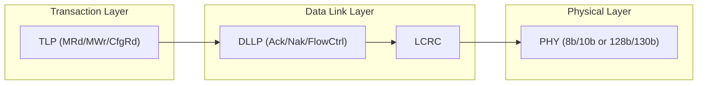
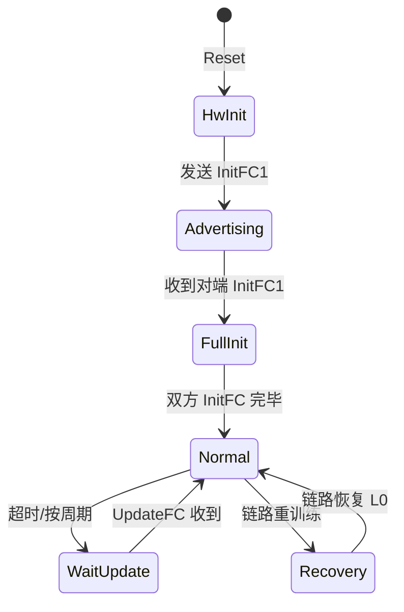

# S1_02 — 链路层与 Flow Control + DOE

## 1. 本节目标

- 理解 PCIe 链路层的作用：可靠传输 TLP
- 掌握 Flow Control 机制：Credit 分配与刷新
- 理解 DLLP（Data Link Layer Packet）类型与作用
- 理解 DOE（Data Object Exchange）协议：CVS/CFM/CMM/DOE 扩展

## 2. 前置依赖

S1_01（TLP 类型与路由）。

## 3. 源码位置

```
内核源码：
  drivers/pci/pcie/portdrv.c     （链路层服务驱动）
  drivers/pci/pcie/aer.c         （AER + DLLP 相关）
  drivers/pci/pci/Kconfig        （DOE 配置）
  include/linux/pci.h             （pci_doecap 函数）
  drivers/pci/pci/doe.c          （DOE 协议实现）

规范参考：
  PCIe Base Spec Rev 5.0 Chapter 3 - Data Link Layer
  PCIe Base Spec Rev 5.0 Chapter 6 - AER + DOE
```

---

## 4. 链路层的位置



**关键点**：链路层在 TLP 外面包了一层：
- 发送端：加 LCRC + Sequence Number
- 接收端：校验 LCRC + 序号，发 Ack/Nak DLLP

---

## 5. 为什么需要链路层？

### 5.1 TLP 的不可靠性

TLP 在链路上可能：
- 位翻转（噪声）
- 丢失（缓存溢出）
- 重复发送

链路层通过 **ACK/NACK 机制** 保证 TLP 可靠传输：

```c
// 发送方
struct tlp_ctx {
    u16 seq;           // 序列号（4-bit，循环使用）
    u8  tlp_data[256]; // 负载
    int retry;         // 重试计数
};

// 发送 TLP 时，记录到 replay buffer
tlp_send_with_seq(tlp, &ctx->seq);
```

### 5.2 ACK/NACK 流程

```mermaid
sequenceDiagram
    Sender ->> Receiver: TLP #N (with LCRC + Seq#N)
    alt TLP OK
        Receiver ->> Sender: DLLP Ack (Seq#N)
        Sender: Remove TLP #N from replay buffer
    else TLP Error
        Receiver ->> Sender: DLLP NAK (Seq#N-1)
        Sender: Replay from Seq#N-1
    end
```

---

## 6. Flow Control 机制

### 6.1 为什么需要 Flow Control？

接收方 buffer 有限，如果发送方速度 > 接收方处理速度，会丢 TLP。

FC 机制：接收方定期通过 DLLP 告知发送方 "我还有多少 credit"。

### 6.2 Credit 类型

| Credit 类型 | 对应资源 | 最小粒度 |
|------------|----------|---------|
| **PH** (Posted Header) | Posted 请求头 | 1 TLP |
| **PD** (Posted Data) | Posted 数据负载 | 4 DW |
| **NPH** (Non-Posted Header) | Non-Posted 请求头 | 1 TLP |
| **NPD** (Non-Posted Data) | Non-Posted 数据负载 | 4 DW |
| **CPLH** (Completion Header) | 响应头 | 1 TLP |
| **CPLD** (Completion Data) | 响应数据 | 4 DW |

### 6.3 FC DLLP 类型

```c
// drivers/pci/pcie/aer.c
// InitFC1 / InitFC2：初始化 Flow Control
// UpdateFC：运行时刷新 Credit
enum pcie_dllp_type {
    DLLP_TYPE_INIT_FC1  = 0x00,   // 初始化 Credit
    DLLP_TYPE_INIT_FC2  = 0x01,
    DLLP_TYPE_UPDATE_FC = 0x04,   // 运行时刷新
};
```

### 6.4 FC 状态机



---

## 7. DLLP 类型详解

### 7.1 DLLP 分类

| DLLP 类型 | 用途 |
|----------|------|
| **Ack** | 确认收到 TLP（Seq#N）|
| **Nak** | 否定确认，要求重传（Seq#N-1）|
| **PM** | 电源管理状态切换 |
| **InitFC1/2** | 初始化 Flow Control Credit |
| **UpdateFC** | 更新 Flow Control Credit |
| **VendorDefined** | 厂商自定义（包括 DOE）|

### 7.2 Ack/Nack 与重传

```c
// 内核没有直接处理 Ack/Nack（这是硬件逻辑）
// 但内核可以通过 aer.c 读取链路状态
pcie_capability_read_word(dev, PCI_EXP_LNKSTA, &link_status);
// link_status 包含当前速率和宽度
```

---

## 8. DOE（Data Object Exchange）

### 8.1 DOE 是什么？

DOE 是 PCIe Spec 6.x 引入的带内配置协议，用于访问 **VPD（Vital Product Data）**、**CIS（Configuration Information Structure）**、**CMM/DOE 扩展**。

### 8.2 DOE vs 传统配置访问

| 方式 | 优点 | 缺点 |
|------|------|------|
| **ECAM（配置空间）** | 任意位置直接读写 | 只能访问标准配置空间（0~4096 bytes/func）|
| **DOE** | 可扩展，可访问任意大数据块 | 多了 Mailbox 握手协议 |

### 8.3 DOE 协议结构

```c
// drivers/pci/pci/doe.c
struct pci_doe_mb {
    struct pci_dev *dev;          // 所属设备
    u16 vendor_id;                // DOE Vendor ID
    u8  index;                    // Mailbox 索引
    void __iomem *base;           // DOE Mailbox 基址（BAR映射）
    struct mutex lock;
};

struct pci_doe_protocol {
    u16 vendor_id;
    u16 data_object_type;
    size_t size;
};

// 标准 DOE 对象类型
#define PCI_DOE_VENDOR_VPD        3   // VPD 对象
#define PCI_DOE_VENDOR_CIS        4   // CIS 对象
```

### 8.4 DOE 访问流程

```c
// drivers/pci/pci/doe.c
// 发起 DOE 事务
int pci_doe_write(struct pci_doe_mb *doe_mb, u16 vendor_id,
                  u16 data_object_type, const void *request,
                  size_t request_sz, void *response, size_t response_sz)
{
    // 1. 写请求头（vendor_id + type + length）
    // 2. 写请求数据
    // 3. 轮询 Interrupt Status，等待完成
    // 4. 读响应数据
    // 5. 清 Interrupt Status
}
```

### 8.5 DOE 在内核中的用途

```bash
# 查看系统中有哪些 DOE Mailbox
cat /sys/bus/pci/devices/*/doe 2>/dev/null
# 或用 setpci
setpci -s 00:00.0 DOE_CAP_HDR
```

---

## 9. 内核源码对应

### 9.1 DOE 实现

```c
// drivers/pci/pci/doe.c
static int doe_dispatch(struct pci_doe_mb *doe_mb)
{
    // DOE Mailbox 中断处理
    // 读取 Interrupt Status，判断是哪个 DOE 对象完成
    // 调用对应协议的回调
}

// 对外接口
struct pci_doe_mb *pci_find_doe(struct pci_dev *dev, u16 vendor_id, u8 index);
int pci_doe_write(...);  // 同步写
int pci_doe_read(...);   // 同步读
```

### 9.2 VPD 通过 DOE 访问

```c
// drivers/pci/pci/vpd.c
// VPD（Vital Product Data）现在通过 DOE 访问
static int pci_vpd_doe_write(struct pci_dev *dev, loff_t pos, u32 val32)
{
    return pci_doe_write(pci_vpd_doe(dev), PCI_VPD_VENDOR_VENDOR,
                          &req, sizeof(req), NULL, 0);
}
```

---

## 10. bring-up 关联

| Bring-up 阶段 | 本节技能用途 |
|--------------|-------------|
| 链路训练后 | 首先观察 FC DLLP 是否正常交换（InitFC1/2），FC 异常 = 链路不稳定 |
| 读取 VPD | DOE 访问 VPD（产品序列号/型号），生产测试用 |
| 错误处理 | AER 错误通过 DLLP 通知对端（AER_ERR_*_N）|

---

## 11. 常见错误

### 错误 1：Flow Control Credit 超额

**现象**：链路偶尔丢 TLP，dmesg 有 `pcieport X: Device link may not be reliable` 警告。

**原因**：Max_Payload_Size 和接收方 buffer 不匹配。

**排查**：
```bash
# 查看当前链路速率和宽度
lspci -nn -vv -s 00:00.0 | grep "LnkSta"
# 对比 RC 和 EP 的 Max_Payload_Size
lspci -nn -vv -xxx | grep "DevCtl"
# 强制降到 Gen1 / x1
```

### 错误 2：DOE Mailbox 无响应

**现象**：`pci_doe_write()` 返回 -ETIMEDOUT。

**原因**：DOE 对象忙或不存在。

**排查**：
```bash
# 确认 DOE Mailbox 存在
setpci -s XX:XX.X DOE_CAP_HDR
# 读 Interrupt Status
setpci -s XX:XX.X DOE_INT_STATUS
```

---

## 12. 自测问题

1. 链路层如何保证 TLP 可靠传输？Ack/Nack 的重传窗口是多大？
2. Flow Control Credit 超额会导致什么问题？如何恢复？
3. DLLP 和 TLP 的根本区别是什么？DLLP 会被路由吗？
4. DOE Mailbox 和 ECAM 配置空间有什么本质区别？
5. 在 Linux 内核里，pci_doe_write() 是同步还是异步？超时机制是什么？

---

## 13. 下一步

进入 **S1_03 — PCI/PCIe 配置空间（ECAM）**。
